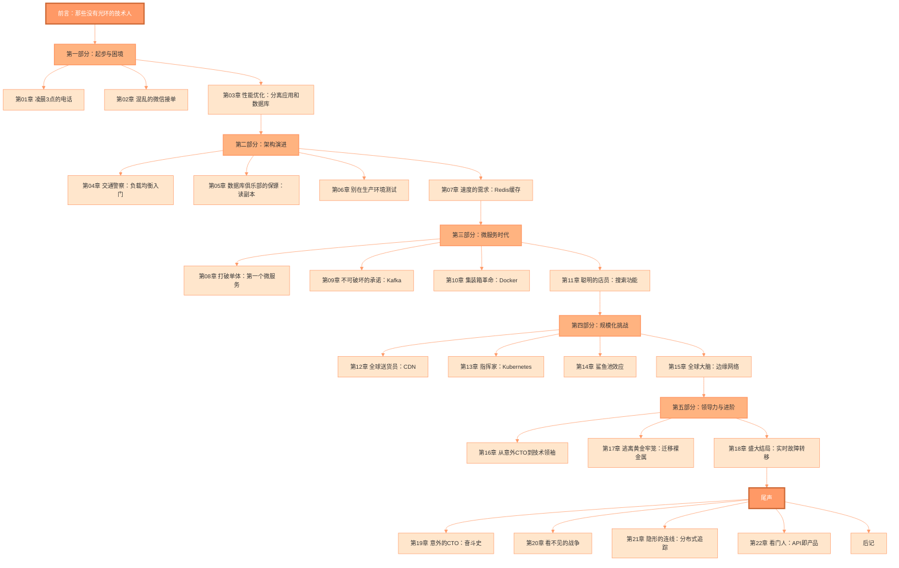
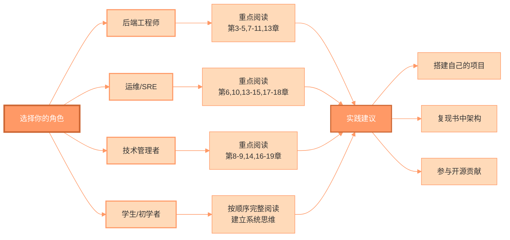
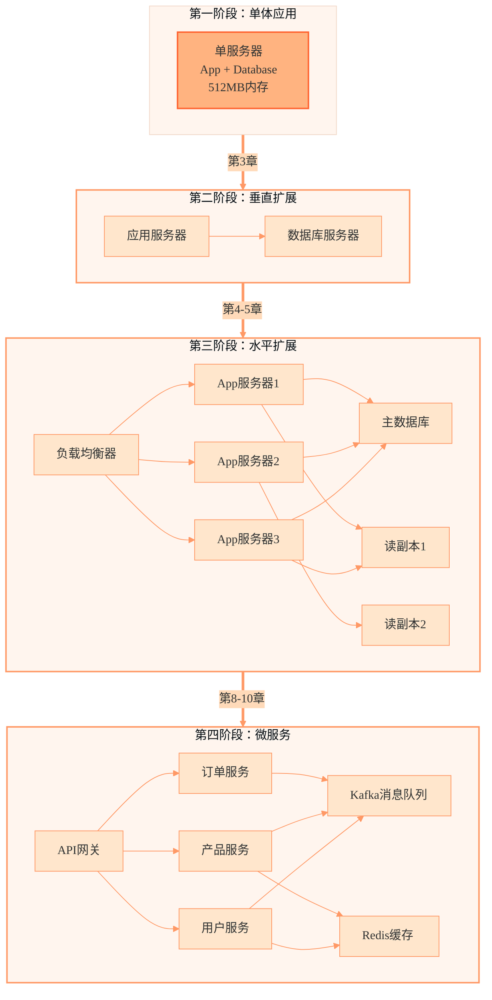
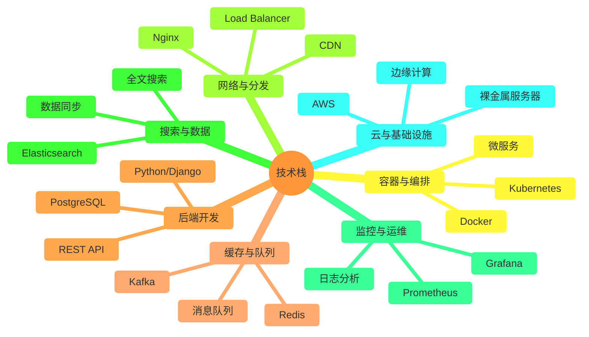
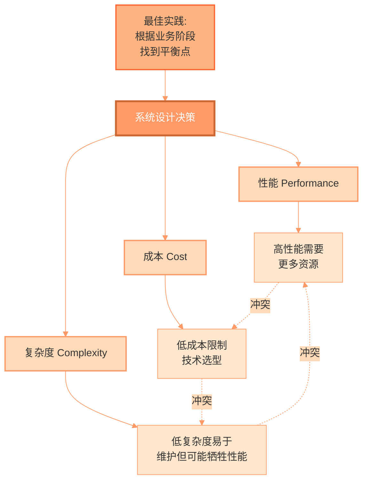

# 《意外的CTO》中文版

**从零到百万店铺：一个没有计算机学位的普通人的系统设计实战之旅**

---

## 📖 关于本书

> **"天行健，君子以自强不息。"** ——《周易》

这是一个真实的技术成长故事。作者 Subhash Choudhary 并非计算机科学专业出身，却凭借持续学习和实战历练，成为了 Dukaan 平台的 CTO，带领团队从零扩展到支撑超过 100 万家在线商店的分布式系统。

**这不是一本枯燥的理论书籍**，而是一部用真实经历【翻译时为了代入感做了适当的中国化改编】讲述系统设计的实战手册。从凌晨 3 点的紧急电话，到数据库主从复制的延迟噩梦，从单体架构到微服务的艰难重构，每一章都是真实战场上的血泪经验。

### 🌟 为什么要读这本书？

- **真实的战场经验**：不是纸上谈兵，而是真金白银的教训
- **通俗易懂的讲解**：用餐厅、厨师、快递员等生动比喻解释复杂技术
- **完整的成长路径**：从 512MB 服务器到全球分布式系统的完整演进
- **实用的技术选型**：在成本、性能、复杂度之间的真实权衡
- **普通人的逆袭**：证明没有名校学历也能成为技术领导者

---

## 🔗 原项目信息

本中文版翻译自 GitHub 开源项目：

- **原作者**：Subhash Choudhary ([@subhashchy](https://github.com/subhashchy))
- **原项目地址**：[The-Accidental-CTO](https://github.com/subhashchy/The-Accidental-CTO)
- **Star 数量**：⭐ 2.7k+ stars
- **项目语言**：TypeScript 94.1%, CSS 4.7%

### 原书简介

> **"How I Scaled from Zero to a Million Stores on Dukaan, Without a CS Degree"**
> 
> I never set out to be a CTO. In fact, I didn't even have a computer science degree. But somewhere between firefighting server crashes at 3 a.m. and obsessing over replication lag graphs, I found myself building systems that would eventually power over a million online stores at Dukaan.

---

## 🇨🇳 中文版特色

本中文版不仅是简单的翻译，更是一次**深度的中国化适配**：

### 1. 文化本地化
- 使用中国读者熟悉的场景和案例
- 引用中国传统文化经典（《周易》《道德经》《孟子》等）
- 结合中国技术人的真实处境和挑战

### 2. 技术术语规范化
- 建立完整的[术语对照表](术语对照表.md)
- 首次出现标注中英文对照
- 遵循中文技术社区的通用表达

### 3. 可视化增强
- 在关键章节添加 Mermaid 架构图
- 用流程图、序列图直观展示技术概念
- 帮助读者更好地理解系统演进

### 4. 深度前言和后记
- 增加[中文版前言](前言.md)，讲述中国技术人的共同处境
- 提供更贴近中国读者的阅读指引

---

## 📚 章节目录

### 📋 详细章节列表

#### 🌅 前置内容
- [前言：那些没有光环的技术人](前言.md)
- [术语对照表](术语对照表.md)

#### 📖 正文章节

| 章节 | 标题 | 核心技术 | 难度 |
|------|------|----------|------|
| [第01章](第01章_凌晨3点的电话.md) | 凌晨3点的电话 | 服务器基础、监控 | ⭐⭐ |
| [第02章](第02章_混乱的微信接单（起源）.md) | 混乱的微信接单（起源） | MVP开发、快速迭代 | ⭐⭐ |
| [第03章](第03章_性能优化：分离应用和数据库.md) | 性能优化：分离应用和数据库 | 应用与数据库分离 | ⭐⭐⭐ |
| [第04章](第04章_交通警察：负载均衡入门.md) | 交通警察：负载均衡入门 | Load Balancer、水平扩展 | ⭐⭐⭐ |
| [第05章](第05章_数据库俱乐部的保镖：读副本.md) | 数据库俱乐部的保镖：读副本 | 主从复制、读写分离 | ⭐⭐⭐ |
| [第06章](第06章_别在生产环境测试，兄弟！：预发布环境.md) | 别在生产环境测试，兄弟！ | Staging环境、部署流程 | ⭐⭐ |
| [第07章](第07章_速度的需求——使用Redis实现缓存.md) | 速度的需求：Redis缓存 | 缓存策略、Redis | ⭐⭐⭐ |
| [第08章](第08章_打破单体——我们的第一个微服务.md) | 打破单体：第一个微服务 | 微服务架构、服务拆分 | ⭐⭐⭐⭐ |
| [第09章](第09章_不可破坏的承诺——使用Kafka实现数据一致性.md) | 不可破坏的承诺：Kafka | 消息队列、最终一致性 | ⭐⭐⭐⭐ |
| [第10章](第10章_集装箱革命：Docker简介.md) | 集装箱革命：Docker | 容器化、Docker | ⭐⭐⭐ |
| [第11章](第11章_聪明的店员：打造世界级搜索功能.md) | 聪明的店员：搜索功能 | Elasticsearch、全文搜索 | ⭐⭐⭐ |
| [第12章](第12章_全球送货员：用CDN加速静态资源分发.md) | 全球送货员：CDN | CDN、边缘缓存 | ⭐⭐ |
| [第13章](第13章_指挥家：用Kubernetes编排容器交响乐.md) | 指挥家：Kubernetes | K8s、容器编排 | ⭐⭐⭐⭐ |
| [第14章](第14章_鲨鱼池效应：烈火试炼.md) | 鲨鱼池效应：烈火试炼 | 压力测试、应急响应 | ⭐⭐ |
| [第15章](第15章_我们的全球大脑——设计小店通边缘网络.md) | 全球大脑：边缘网络 | 边缘计算、全球分布 | ⭐⭐⭐⭐ |
| [第16章](第16章_聚光灯——从意外CTO到技术领袖.md) | 从意外CTO到技术领袖 | 技术领导力、团队管理 | ⭐⭐ |
| [第17章](第17章_逃离黄金牢笼——从阿里云到裸金属的惊险迁移.md) | 逃离黄金牢笼：迁移裸金属 | 云迁移、成本优化 | ⭐⭐⭐⭐ |
| [第18章](第18章_盛大结局：实时故障转移.md) | 盛大结局：实时故障转移 | Failover、高可用 | ⭐⭐ |
| [第19章](第19章_意外的CTO——一个北漂者的奋斗史.md) | 意外的CTO：奋斗史 | 职业发展、人生思考 | ⭐⭐ |
| [第20章](第20章_看不见的战争——当故障藏在9个集群中.md) | 看不见的战争 | 分布式调试、问题排查 | ⭐⭐⭐ |
| [第21章](第21章_隐形的连线——追踪请求的完整旅程.md) | 隐形的连线：分布式追踪 | Tracing、可观测性 | ⭐⭐⭐ |
| [第22章](第22章_看门人——当API成为产品.md) | 看门人：API即产品 | API设计、产品化 | ⭐⭐⭐ |

#### 🌆 后置内容
- [后记](后记.md)

**难度说明**：
- ⭐⭐ 基础：主要是叙事性内容，技术术语较少
- ⭐⭐⭐ 中等：技术概念较多，需要一定基础
- ⭐⭐⭐⭐ 较高：涉及复杂架构，需要深入理解

---

## 🎯 学习路径

本书适合不同背景的读者，您可以根据自己的情况选择阅读路径：

---

## 💡 你将学到什么

### 🏗️ 系统架构演进

### 📊 核心技术栈

### 🎓 关键技能树

| 技能领域 | 具体技能 | 相关章节 |
|---------|---------|---------|
| **基础架构** | 服务器管理、资源监控、SSH运维 | 第1-3章 |
| **扩展策略** | 垂直扩展、水平扩展、负载均衡 | 第3-4章 |
| **数据库优化** | 主从复制、读写分离、连接池 | 第5章 |
| **缓存设计** | Redis、缓存策略、失效处理 | 第7章 |
| **微服务架构** | 服务拆分、API设计、服务通信 | 第8章 |
| **消息队列** | Kafka、异步处理、最终一致性 | 第9章 |
| **容器技术** | Docker、镜像管理、容器编排 | 第10章 |
| **搜索引擎** | Elasticsearch、索引、分词 | 第11章 |
| **内容分发** | CDN、边缘缓存、全球加速 | 第12章 |
| **容器编排** | Kubernetes、Pod、Service | 第13章 |
| **边缘计算** | 边缘网络、全球部署、低延迟 | 第15章 |
| **成本优化** | 云迁移、裸金属、资源规划 | 第17章 |
| **高可用** | 故障转移、灾备、监控告警 | 第18章 |
| **可观测性** | 分布式追踪、日志、指标 | 第21章 |
| **技术领导力** | 团队管理、决策、沟通 | 第16,19章 |

---

## 🚀 快速开始

### 适合人群

✅ **后端工程师**：学习大规模系统的设计与演进  
✅ **运维/SRE**：掌握生产环境的最佳实践  
✅ **技术管理者**：理解技术决策的权衡与取舍  
✅ **计算机学生**：了解真实世界的技术应用  
✅ **创业者**：理解技术对业务的影响  
✅ **转行者**：看到非科班出身的成功案例

### 阅读建议

1. **完整阅读前言**：理解作者背景和写作动机
2. **按章节顺序阅读**：系统架构是逐步演进的
3. **动手实践**：尝试复现书中的架构模式
4. **记录笔记**：记录关键技术点和思考
5. **参考术语表**：遇到不熟悉的术语及时查阅

### 配套资源

- 📖 [术语对照表](术语对照表.md) - 中英文技术术语对照
- 📝 原英文版 - [The-Accidental-CTO](https://github.com/subhashchy/The-Accidental-CTO)
- 📚 原书PDF - [The Accidental CTO Book.pdf](../assets/The%20Accidental%20CTO%20Book.pdf)

---

## 🌟 核心理念

### 系统设计的三大权衡

### CAP 定理在实践中的应用

本书通过真实案例展示了 CAP 定理（一致性、可用性、分区容错性）在生产环境中的权衡：

- **一致性 vs 性能**：第5章讲述读副本延迟问题
- **可用性 vs 一致性**：第9章讲述Kafka的最终一致性
- **分区容错 vs 延迟**：第15章讲述全球边缘网络的挑战

---

