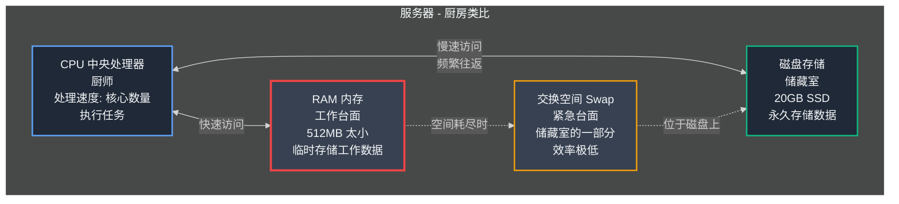
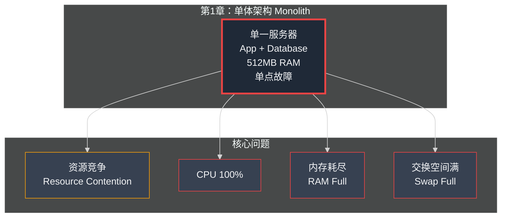

## 第01章：凌晨3点的电话

### Part 1：崩溃

电话不只是响起——简直是在尖叫。

那是一种特殊的震动模式，手机制造商精心设计用来制造最大恐慌感的那种。在廉价的木制床头柜上，它发出猛烈而愤怒的嗡嗡声。这种声音不仅仅是叫醒你，而是将你直接弹射到高度警觉状态。时钟上的数字以不祥的红色闪烁着：**凌晨3:14**。

还没睁开眼睛，我的心脏就开始狂跳。在这样不合时宜的时刻，电话响起只有两个原因：家庭紧急状况，或者公司灾难。来电显示证实了是后者。屏幕上闪烁着一个我再熟悉不过的名字：**"王峰"**。

王峰，我的联合创始人，我的战友，也是我这个技术建造者背后的商业智囊。他只会因为一个原因在凌晨3点打电话：公司出大事了。

我滑动接听，声音干涩嘶哑："喂？"

> "陈浩！醒醒！全都崩了！" 

王峰的声音透过手机扬声器传来，像散弹枪爆发一样充满肾上腺素和恐慌：_快醒醒！都TM都挂了！_

他不需要多说。我已经翻身起床，冰冷的地板让我的身体瞬间清醒。我跌跌撞撞地走向笔记本电脑，苹果标志熟悉的白色光芒在黑暗的房间里如同灯塔般闪耀。我的大脑像旋风般转动，疯狂地遍历着各种可能的数字灾难清单：

我们被黑客入侵了吗？DDoS 攻击（分布式拒绝服务攻击）？某个远在异国的脚本小子决定拿我们找乐子？

有开发人员推送了一段有问题的代码？一个错误的分号就让整个系统崩溃？

我们的云服务提供商宕机了？这完全超出了我们的控制范围？

"网站加载不了。应用全是错误提示。什么都不工作。完全死机了，"王峰继续说道，声音因焦虑而紧绷。我能听到他在电话那头焦急地来回踱步。

"好的，好的，我来处理。别慌，"我说，努力让自己的声音听起来比实际感受更加镇定。_保持冷静。_ 救火的第一条黄金法则：不要让自己也成为火焰的一部分。

我的手指还因睡意而略显笨拙，但已经开始在键盘上飞快敲击。我打开终端（Terminal），黑屏上跳动的绿色文字是我通往整个系统的窗口，这是我的战斗指挥中心。

> ssh root@xiaodiantong.com

我按下回车键。

光标闪烁。继续闪烁。还在闪烁……

通常，登录提示会瞬间出现。而这个延迟……这是个坏兆头，非常糟糕的兆头。这意味着服务器（Server）不只是生病了，它已经奄奄一息，连打开连接的大门都费尽力气。经过了如同永恒般漫长的等待，登录提示终于姗姗来迟。服务器还活着，但只是勉强维持生命。

我的大脑飞速运转着。如果服务器响应如此迟缓，这就不是简单的代码错误了，而是更深层次的问题，更根本性的故障。感觉就像整台机器正在窒息。

我输入了第一条诊断命令，一个检查服务器生命体征的简单工具。

> htop

填满屏幕的结果让我的血液凝固。那是一片触目惊心的红色海洋。

每一个进程（Process）都在疯狂地尖叫着寻求系统资源。CPU 使用率条全都飙到了 100%。显示服务器"思考空间"容量的内存条（Memory Bar）完全爆满。甚至连服务器的紧急溢出内存——交换空间（Swap）——的使用率也达到了极限。

服务器（Server）不只是在窒息，它已经濒临死亡，我们只是在目睹它神经系统最后的几次痉挛抽搐。

然后我看到了根本原因。这个导致我们灾难性故障的原因简单得几乎令人难堪。从系统监视器顶部盯着我的，是服务器的总内存容量：**512MB**。

五百一十二兆字节。

我的现代智能手机就有 8GB 的 RAM（内存），是支撑我们整个公司运转的这台机器的整整十六倍。依赖我们服务的数千家企业、他们目录中的数百万种商品、小店通 的全部希望和梦想，全都运行在一台比我口袋里的手机还要羸弱的机器上。

这不是什么复杂精密的黑客攻击，也不是晦涩难懂的软件缺陷。我们只是简单粗暴地耗尽了所有可用空间。这就像试图在电话亭里举办摇滚音乐会，而电话亭终于不堪重负地倒塌了。

盯着那个充满红色警报的屏幕，电话还贴在耳边，我突然有了一个清醒而可怕的认识。我这个既没有计算机科学高等学位、也没有接受过正规系统扩展培训的家伙，究竟是怎样最终负责这一切的？

要理解这一点，你首先需要理解我们正试图驯服的这头野兽。你需要理解此刻正在燃烧的这个东西的内部构造：我们的服务器。

### Part 2：服务器的解剖，或者说，单厨师厨房

让我们暂时从凌晨3点的恐慌中抽离出来。在修复问题之前，我们需要先理解它的本质。究竟什么_是_"服务器（Server）"？

忘掉那些晦涩的技术术语，忘掉冷冰冰的数据中心里闪烁的指示灯。在这本书的其余部分，我希望你把服务器想象成一个简单得多的东西：**一间只有一位非常忙碌厨师的餐厅厨房。**

这个类比是你将学到的关于基础设施最重要的概念，其他一切理解都将建立在它之上。

#### **CPU：厨师的速度**

**CPU（中央处理器，Central Processing Unit）**就是你的厨师，它是整个运作的大脑和双手。厨师拿到原材料（数据），按照菜谱（代码）进行烹饪，最终呈上一道成品菜（一个网页、一个搜索结果、一笔完成的订单）。

- **更快的 CPU**（以千兆赫 GHz 衡量）意味着你拥有一位手脚更快的厨师。他可以更迅速地切菜、搅拌、装盘。
- 拥有更多"核心（Cores）"的 CPU 就如同一位拥有多只手臂的厨师。一个 4 核 CPU 就像一位可以同时切菜、搅拌、煎炸和调味的多任务厨师，他能够真正并行处理多项工作。

我们那台小巧的 512MB 服务器只有一个单核 CPU。我们拥有一位只有单臂的厨师，却要求他为一万名宾客准备盛宴。

#### **RAM：台面空间**

**RAM（随机存取内存，Random Access Memory）**是厨房的工作台面，这是最关键的组成部分。RAM 是厨师的活动工作空间，是他摆放所有配料、锅碗瓢盆以及_当前_烹饪所需的全部工具的地方。

从台面上取东西速度极快。厨师无需思考，只需伸手就能拿到所需之物。更大的 RAM 意味着更宽敞的台面。拥有巨大台面的厨师可以同时处理众多不同的订单，因为他能将所有必需的配料和工具都摆放在触手可及的地方。

如果台面空间用尽，厨师就陷入了大麻烦。他必须暂停手头的工作，奔向后面那个反应迟缓的储藏室，费力地找到所需的配料，拿回来，再把其他东西推下台面腾出空间。这会极大地拖慢整个流程。

这正是我们服务器上正在发生的悲剧。我们的 512MB RAM 相当于一块小砧板大小的台面。我们的应用程序、数据库（Database）以及操作系统本身都在这块狭小的板子上激烈争夺空间。当台面爆满时，服务器被迫启用"交换空间（Swap）"——那是储藏室中一块被指定为紧急台面的特殊区域。这种方式效率极其低下。厨师花在往返储藏室的时间，比真正烹饪的时间还要多。

#### **磁盘/存储：储藏室**

**磁盘（Disk）或存储（Storage）**，无论是机械硬盘（HDD）还是固态硬盘（SSD），都是厨房的储藏室和冰箱。这是所有菜谱（你的代码）、配料（你的数据）和厨房用具（操作系统）长期存放的地方。

它的容量比台面（RAM）大得多，但访问速度也慢得多。你不会希望厨师每次需要一撮盐都要跑到储藏室去取。他应该已经提前把常用的配料放在台面上了。

#### **服务器组件关系图**



#### **资源竞争 (Resource Contention)：厨房里的混乱**

现在，想象一下我们的窘境。在这间只有一位单臂厨师和砧板大小工作台面的狭小厨房里，我们要求他包揽所有工作：

- **运行应用程序：**他必须阅读菜谱（我们的 Python 代码）并精心烹饪每一道菜肴。
- **管理数据库：**他还必须兼任储藏室管理员，不断地整理、获取和存储配料（我们的用户数据）。
- **处理网络流量：**更要命的是，他还必须充当前台服务员，冲到餐厅前厅接待源源不断涌入的成千上万顾客的新订单。

这就是**资源竞争（Resource Contention）**的残酷现实。每个任务都在同时向这位可怜的厨师疯狂呼喊，争夺他的注意力。应用程序需要 CPU 时间，数据库需要写入磁盘（Disk），而传入的用户请求需要消耗 RAM。它们全都在争夺同样有限的资源池，最终结果就是全面的死锁和瘫痪。

要看清这种混乱局面，你需要在厨房里安装一个监控摄像头。在服务器的世界里，我们的摄像头就是一个简单的命令：`htop`。它是名为 `top` 的经典工具的增强版本，能为你提供厨师正在做什么的实时动态视图。

它初看起来很复杂，但你只需要关注几个关键指标：

- **顶部的 CPU 条：**如果它们全都达到 100%（并显示为刺眼的红色），说明你的厨师已经严重超负荷工作。
- **Mem（内存/RAM）条：**如果这个条满了，意味着你的工作台面已经拥挤不堪、溢出了。
- **Swp（交换空间 Swap）条：**如果这个开始填满，这是系统陷入绝境的危险信号。你的厨师正被迫使用缓慢的储藏室空间作为临时工作区。
- **进程列表：**这里显示了厨师正在处理的每一项任务，以及哪些任务占用了最多的宝贵资源。

学会解读这个屏幕是成为 CTO（首席技术官）的第一步，无论你是意外入行还是有意为之。这是你从盲目猜测转向精准诊断的关键能力。对我来说，那天深夜，屏幕在尖叫着一个无可辩驳的真相：我们的厨房从根本上、致命性地对我们的雄心壮志来说太过狭小了。

> **📌 编者注：htop 实用操作指南**
>
> *htop 是系统管理员的瑞士军刀，掌握以下快捷键和技巧能大幅提升诊断效率：*
>
> ***常用快捷键：***
> - *`F2` - 进入设置界面，可自定义显示的指标*
> - *`F3` / `F4` - 按 CPU% 或内存使用量排序进程*
> - *`F5` - 切换树状视图，查看进程父子关系*
> - *`F6` - 按不同字段排序（响应时间、内存等）*
> - *`F9` - 向进程发送信号（如 SIGKILL 强制终止）*
> - *`Space` - 标记进程，可批量操作*
> - *`/` - 搜索特定进程名*
>
> ***关键监控阈值（经验值）：***
> - *CPU 持续 > 80%：需要扩容或优化代码*
> - *内存使用 > 85%：接近危险区，考虑增加 RAM*
> - *Swap 使用 > 0：性能已严重下降，紧急扩容信号*
> - *Load Average > CPU 核心数：系统过载*
>
> ***实战技巧：***
> ```bash
> # 启动 htop 并按内存排序
> htop -s PERCENT_MEM
> 
> # 仅显示特定用户的进程
> htop -u postgres
> 
> # 输出到文件用于历史分析
> top -b -n 1 > /var/log/top-snapshot-$(date +%Y%m%d-%H%M%S).txt
> ```
>
> *建议：将 htop 的快照定期记录到日志中，形成性能基线（Baseline），有助于对比分析异常情况。*

### Part 3：我们光荣而危险的单体架构

服务器是厨房，但我们的厨师使用的菜谱又是什么呢？在软件工程中，我们称之为**架构（Architecture）**。而我们的架构是最经典的那种，几乎每个创业公司都是从它起步的。

我们拥有一个**单体架构（Monolith）**。

这个名字听起来庞大而令人生畏，仿佛某种古老的巨石结构。实际上，它是一个非常简单直白的概念。单体应用（Monolithic Application）是指所有代码都紧密集中在一个统一的代码库中。我们的用户注册、产品目录、订单管理、卖家仪表板、支付处理——所有功能——全都共存于一个单一的 Django 项目中。

可以把它想象成一本单一的、巨大的、包罗万象的食谱全书。它囊括了开胃菜、主菜、甜点和饮料的所有食谱，全都装订在一本厚重的巨型册子里。

#### 我们为什么从单体架构开始（以及为什么这是正确的选择！）

我想非常明确地强调这一点：从单体架构起步绝不是错误。对于创业公司而言，这通常是**最佳的可行选择**。在创业早期，你唯一的目标就是尽可能快速地构建产品并推向市场。你需要验证是否真的有人想要你正在打造的东西。

单体架构天生就是为速度而设计的：

- **开发简单直接：**一切都集中在一个地方。你无需担心不同服务之间复杂的通信协议。你只需编写一个函数，然后直接调用它即可。
- **测试简单便捷：**你可以在自己的笔记本电脑上运行整个应用程序，轻松地对所有功能进行集成测试。
- **部署（Deployment）简单快速：**你只需将单个代码包部署到服务器上。搞定。

我们的单体架构让我和王峰仅用两人之力，在短短 48 小时内就构建并启动了一个功能完整的电子商务平台。如果我们一开始就尝试采用更复杂的"微服务（Microservices）"架构（我们将在后续章节讨论），恐怕我们现在还在为架构设计争论不休。

单体架构是我们的超级武器，它让我们能够以闪电般的速度向前冲刺。但就像所有超能力一样，它也隐藏着危险的副作用。

<br/> 

####  单体架构的隐藏危险

随着我们的食谱全书越来越厚重，问题开始逐渐显现。

- **它变得臃肿而笨拙。**查找特定食谱需要越来越长的时间。理解甜点部分的更改如何连锁影响开胃菜部分变得几乎不可能。在软件工程中，我们称之为**紧耦合（Tight Coupling）**。
- **一个错误可能毁掉整本书。**理论上，某个食谱中的一个小错字就可能导致整本书无法正常使用。一个看似微小功能中的 bug 可能会像多米诺骨牌一样导致整个网站崩溃。
- **你无法组建专业化的团队。**如果你想雇用一位专精糕点制作的厨师，他仍然需要理解和掌握整本庞大食谱书的内容。这让新开发人员难以快速上手并做出贡献。

最关键的是，这也是那天深夜压垮我们的致命原因：**你无法在不扩展整体的情况下单独扩展某个特定部分。**

我们的店面页面获得了数千名访客（"主菜"极其受欢迎）。但我们的卖家管理仪表板（"开胃菜"）使用频率要低得多。因为它们全都紧密共存于同一个单体架构中，我们必须为所有功能分配同等的服务器资源。对主菜的巨大需求正在榨干整个厨房的资源，让其他部分陷入饥饿状态，最终导致整个系统全面崩溃。

我们的单体架构，运行在那台小巧的单一服务器上，构成了一场完美风暴。软件层面是单点故障（Single Point of Failure），硬件层面同样是单点故障。这是一颗滴答作响的定时炸弹，在那个周二凌晨 3:14，它终于轰然爆炸了。

### 系统架构演进图

为了更清楚地理解我们面临的挑战，让我们用图表来展示系统架构的演进：



## 第01章：关键要点

- **你的第一台服务器必然会失败。** 这不是_是否会发生_的问题，而是_何时发生_的问题。真正的目标不是防止故障，而是快速恢复并从中汲取教训。
- **牢固掌握基础知识。** 在深入复杂架构之前，必须透彻理解服务器的本质。用**CPU（厨师的速度）**、**RAM（工作台面空间）**和 **磁盘（储藏室）** 来建立直观理解。
- **精通基本诊断工具。**你无法修复你看不见的问题。必须学会熟练使用 `ssh` 和 `htop`（或 `top`）。它们是系统管理员的听诊器和X光机。
- **从单体架构起步是优势而非缺陷。**在创业初期阶段，将开发速度置于一切之上。不要过度设计你的初始产品。
- **清醒认识到架构选择有生命周期。**能支撑你达到前 10,000 个用户的架构，无法将你带到 100,000 个用户。要时刻准备演进和重构。

