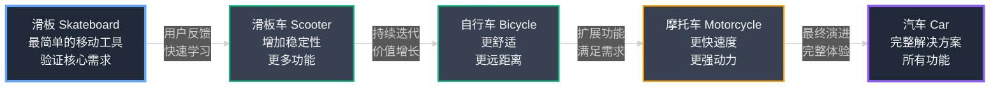
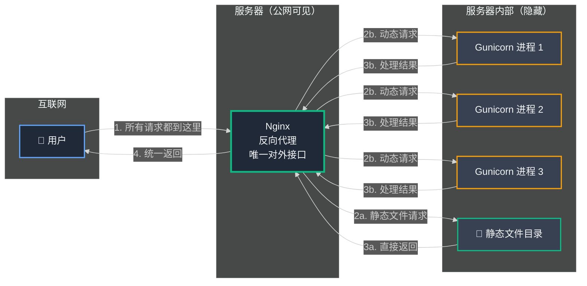
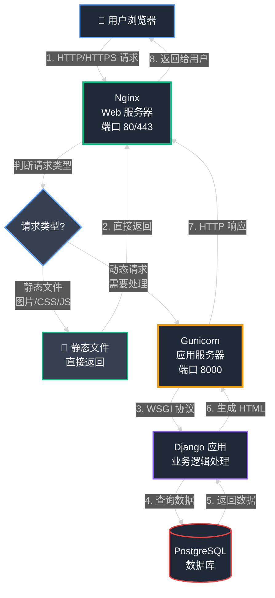

## 第02章：混乱的微信接单（起源）

### Part 1：想法和滑板

每个创业故事都始于一个亟待解决的问题。我们的故事始于一个混乱的微信接单流程和疫情带来的线下交易困境。

时间是 2020 年。突如其来的疫情改变了所有人的生活节奏。在中国，为了防控疫情，人们减少了外出，传统的线下消费方式受到了冲击。对于数百万小企业主——那些餐饮店老板、便利店店主、社区小店经营者——这无疑是一个巨大的挑战。虽然店铺可以营业，但客流量大幅下降，堂食受限，传统的面对面交易模式难以为继。

唯一的出路是转向线上，更准确地说，是微信。它成为了新的集市、新的店面、新的交易柜台。但这是一个混乱不堪、效率低下且令人极度沮丧的市场。

这就是我的联合创始人王峰登场的契机。他并非立志创办一家公司，他只是想帮助家附近一家便利店维持生计。他既着迷又震惊地看着他们通过一连串混乱的 微信 聊天记录来运营整个生意。

这个流程简直是低效运作的教科书级反面案例。

**步骤1：目录发送。** 店主会向每个潜在客户发送一份多页的 PDF 文档。这是一个格式混乱、分辨率极低的文件，很可能是在 Word 或 WPS 中简单制作后直接导出的。产品名称排列不齐，价格标注不清，完全无法搜索。要确认他们是否有你想要的商品，你必须手动翻阅好几页模糊不清的图片。

**步骤2：订单录入。** 经过反复放大查看后，顾客必须在微信聊天中手动输入整个订单清单。"一包方便面，两斤面粉，半斤白糖，那个蓝色包装的薯片……" 这样的文字消息既冗长又容易出错。

**步骤3：确认核对。** 需要同时应付几十个这样混乱聊天的店主，必须逐一手动确认每个订单项目。"不好意思，蓝色包装的薯片缺货了，我们有绿色包装的可以吗？"这又会引发新一轮繁琐的消息往返。

**步骤4：支付处理。** 最后，在订单全部确认无误后，店主会发送他的微信收款码。顾客使用微信支付或支付宝完成支付，然后——最关键也最原始的步骤——将支付成功的截图发送过来作为凭证。店主的手机相册逐渐堆满了成千上万张支付截图，完全没有有效方法来核对谁支付了什么订单。

这简直是一场噩梦，一个在困境中诞生的临时数字化解决方案。

一天晚上，我的电话突然响起。是王峰。我能听到他的声音里蕴含着一种电流般的能量。他不只是在说话，他整个人简直在因为一个念头而颤动。

"陈浩，这太疯狂了，"他开口就直奔主题，连招呼都省了。"我在看这位店主试图在微信上经营他的整个店铺，这完全是一场灾难。他在丢失订单，混淆支付……整个流程完全混乱了。我们必须做点什么。"

他向我描述了我刚才所讲的那幅混乱画面——通过微信发送商品目录 PDF、手动接单、支付截图的荒诞流程。

"我们需要为这些人打造一些真正简单的东西，"他说，声音愈发激动。"一个应用程序，让他们可以列出商品，顾客可以直接下单。就这么简单。不需要通过微信发 PDF 目录，不需要冗长的聊天记录。只需要一个链接。他们就能拥有自己的在线店铺。"

这个词悬浮在空气中：**小店通**。店铺。

他说得完全正确。问题的核心不是缺乏技术，而是缺乏简洁性。这些卖家根本不需要淘宝或有赞那样复杂强大的平台。他们既没有时间也没有技术能力去驾驭那些系统。他们需要的是像微信本身那样简单易用的工具，但要专门为商业交易而设计。

那通电话就是星星之火。但想法终究只是想法。要将它转化为现实，你必须动手建造。而在创业世界里，你必须_快速_建造。我们没有奢侈到花费六个月时间打磨一个完美产品。我们需要在几天之内就验证这是否是一个值得追求的想法。

这将我们带到了任何有抱负的创始人或技术人员最关键的概念之一：**MVP**。

#### 技术深度解析：最小可行产品（MVP，Minimum Viable Product）

术语 MVP，即最小可行产品，在技术圈中被频繁提及。大多数人误认为它意味着构建最终产品的一个缩小版、带有更多 bug 的版本。这种理解是错误的。

MVP 不是产品本身。**它是一个实验工具。**

它的首要目标不是盈利或吸引数百万用户，而是_学习验证_。它是一个科学工具，旨在用最小的投入测试你最核心的假设。我们的假设是：**"如果我们为小企业主提供一个极其简单的工具来创建在线商店，他们会真正使用它吗？"**

为了验证这个假设，我们不需要一个完美的产品，我们只需要能回答这个问题的最简化版本。这就是 MVP 的哲学精髓。

可以这样理解：如果你的目标是解决"交通出行"问题，你不应该从制造汽车开始。汽车极其复杂——它需要发动机、车轮、座椅、底盘、电子系统。制造一辆汽车需要漫长的时间。而当你终于完成时，你可能会发现客户其实想要的是摩托车。

MVP 方法论是首先构建一个**滑板**。它基础、简陋，但它解决了核心问题：它能让你从 A 点移动到 B 点。它允许你测试最核心的假设：人们真的需要借助轮子移动吗？

一旦验证了这一点，你就可以基于用户反馈构建下一个迭代版本：滑板车。接着是自行车、摩托车，最终是汽车。在每个阶段，你都在持续学习并交付价值。

#### **MVP 演进图：从滑板到汽车**



因此，对于 小店通，我们必须精确定义我们的"滑板"。我们需要构建什么样的绝对最小化版本来测试我们的核心想法？我们果断抛弃了所有能想到的花哨功能。没有支付网关（Payment Gateway）集成，没有物流追踪，没有用户账户系统，没有主题定制，没有数据分析。我们将其精简到绝对的核心本质。

我们将其定义为 **小店通 的核心循环**：

- **创建商店：** 一个单一页面，用户输入手机号码，接收一个 OTP（一次性密码，One-Time Password）进行验证，并为商店起个名字。就这样。商店即刻上线。不需要邮箱，不需要密码，不需要复杂的表单填写。
- **添加商品：** 最极简的商品录入表单。一个商品名称字段，一个价格字段，以及一个从手机相册上传单张图片的按钮。没有分类，没有规格变体（如尺寸或颜色），没有库存管理。仅仅是创建目录所需的最基础要素。
- **分享链接：** 当商家添加了几个商品后，应用会自动生成一个独特的、可分享的链接，例如 xiaodiantong.cn/mystore。他们可以直接复制这个链接并粘贴到 微信 聊天中。

就这么多。这就是我们的滑板。

它不是一个"平台"，也不是一个"电子商务套件"。它只是一个简单的工具，用一个干净、移动端友好的网页取代了那些丑陋的 PDF 文档。这是解决核心痛点所需的绝对最小方案。

计划敲定后，我们给自己设定了一个挑战。没有漫长的开发周期，没有冗长的规划会议。我们要在一个周末内完成 MVP 的构建和上线。

**48 小时黑客马拉松正式开始。** 时钟开始滴答作响。现在，我们必须做出第一个重大技术决策：我们将使用什么工具来构建我们的滑板？

### Part 2：选择我们的工具

48 小时的时钟在滴答作响。我们有了我们的"什么"——MVP，我们的数字滑板。现在我们需要"如何"。我们将使用什么工具来构建它？

在软件世界中，你的工具集被称为**"技术栈 (Tech Stack)"**。把它想象成建造房子。你必须决定你的主要材料。你会使用砖、木头还是钢？你会铺设什么样的地基？你将使用什么工具把它们组合在一起？这些选择决定了你可以建造多快，你的房子有多坚固，以及以后添加新房间有多容易。

对于周末黑客马拉松，选择受一个原则支配，那就是：**速度**。我们不需要最可扩展的、最前沿的或最"符合流行语"的技术栈。我们需要能在最短时间内让我们从零到可工作产品的技术栈。

这意味着选择熟悉的、可靠的，并且能为我们做大量繁重工作的工具。

#### 技术深度解析：语言和框架

我们的第一个也是最重要的选择是编程语言和框架。

为什么选择 Python？

编程语言是你用来给计算机下达指令的词汇。我们选择了 Python。为什么？因为 Python 以其简单、清晰的语法而闻名。它读起来几乎像普通英语。当你在与时间赛跑时，你最不想要的就是与你自己的工具搏斗，试图记住一个复杂的规则或一个缺失的分号。Python 不会妨碍你，让你专注于你试图解决的问题。它还有一个庞大的社区和一个你能想象到的几乎任何东西的库。

为什么选择 Django："自带电池"的框架

语言只是词汇。框架是整个说明手册。它提供结构、蓝图和一组预构建的组件，这样你就不必从头开始。

想象你在建造房子。你可以去砍下自己的树，磨自己的木材，锻造自己的钉子。或者，你可以购买一个预制的房屋套件，里面已经建好了所有的墙壁、窗户和门。你所要做的就是组装它们并添加你的个人风格。

这就是 Django。它是 Web 应用程序的预制房屋套件。它的哲学著名地是**"自带电池 (Batteries-Included)"**。这意味着它几乎自带你开箱即用所需的一切。对于我们的 48 小时 MVP，其中两个"电池"绝对是游戏规则改变者：

- **Django 管理面板 (Admin Panel)：** 这是 Django 的杀手级功能。只需几行代码，Django 就会自动生成一个完整的、安全的、外观专业的管理面板。这是一个私人网站，我们这些创始人可以登录并查看我们应用程序中的所有数据。当新用户创建商店时，我们可以看到它在管理面板中弹出。我们可以查看他们的产品，如有需要可以编辑它们，或排除任何问题。从头开始构建这样的自定义仪表板至少需要一天时间。Django 在大约 15 分钟内免费给了我们。这是我们发布的任务控制中心。
- **ORM（对象关系映射器，Object-Relational Mapper）：** 这听起来很复杂，但想法很简单。要从数据库获取数据，你通常必须编写一种名为 SQL（结构化查询语言，Structured Query Language）的特殊语言。它看起来像这样：`SELECT * FROM products WHERE store_id = 123;`。它很强大，但很容易出错，而且感觉与我们正在编写的 Python 代码不同。Django 的 ORM 充当翻译器。它让我们使用简单的 Python 代码与数据库交互。同样的命令在 Django 中看起来像这样：`Product.objects.filter(store_id=123)`。这不仅更容易编写和阅读，而且还能保护你免受一整类称为 SQL 注入的安全漏洞的侵害。它使我们的代码更清晰，开发速度更快。

#### **技术深度解析：我们考虑的替代方案**

当然，Django 不是唯一的选择。在技术领域，做任何事情总有十几种方法。关键是为手头的工作选择正确的工具。

- **Node.js 与 Express：** 这是一个流行的替代方案。Node.js 允许你用 JavaScript 编写服务器端代码，这是在 Web 浏览器中运行的同一种语言。对许多团队来说，这是一个巨大的优势。框架 Express 非常简约和灵活。但这对我们来说是它的缺点。Express 不像预制房屋套件，更像是一盒高质量的乐高积木。它给你基本的构建块，但你必须自己组装所有东西。对于 48 小时的构建，我们不想要那么多自由；我们想要 Django "自带电池"方法的结构和预构建组件。
- **Ruby on Rails：** 这是一个更接近的竞争对手。Rails 与 Django 有非常相似的哲学。它重视"约定优于配置"，这意味着它为你做出了很多聪明的决定以加快开发速度。老实说，Rails 也会是一个很好的选择。最终决定归结为个人偏好和熟悉度。我在 Python 和 Django 上花了更多时间，而在竞速中，你总是要押注你最了解的工具。

#### 技术深度解析：数据库 (Database)

选择了框架后，我们需要决定在哪里永久存储所有信息——商店名称、产品详情、价格等。我们需要一个**数据库 (Database)**。如果框架是房屋套件，数据库就是它建立的基础。它需要坚固、可靠和有组织。

为什么选择关系型数据库？

我们选择了关系型数据库。想法很简单：数据存储在表中，就像巨大的、强大的 Excel 电子表格。你有一个包含所有商店信息的 `stores` 表。你有一个包含所有产品信息的 `products` 表。而且，至关重要的是，你可以在它们之间创建关系。你可以告诉数据库每个产品都必须属于一个商店。

这种结构非常适合电子商务。你的数据有明确的关系和规则。你不希望产品在没有商店的情况下四处漂浮，或者没有顾客的订单。关系型数据库强制执行这种结构并确保你的数据保持干净和一致。

为什么选择 PostgreSQL？

在众多关系型数据库（如 MySQL、Microsoft SQL Server 等）中，我们选择了 PostgreSQL（通常简称为"Postgres"）。

为什么？对于 MVP，Postgres 和它的主要竞争对手 MySQL 都是很好的选择。但我们倾向于 Postgres 有几个原因。它在开发者社区中以极其健壮、可靠和符合标准而闻名。它是真正的主力军。更重要的是，我知道它有一些强大的高级功能，以后可能会有用。其中之一，一个叫做 LISTEN/NOTIFY 的功能，将成为第 8 章中我们实时缓存系统背后的秘密武器。我们不需要它用于 MVP，但从第一天就选择一个强大的基础，即使你不会立即使用它的所有功能，也可以在未来带来巨大回报。

所以，蓝图准备好了。我们的技术栈决定了：

- **语言：** Python
- **框架：** Django
- **数据库：** PostgreSQL

我们有了建筑材料。现在是时候浇筑基础并竖起第一堵墙了。是时候设置我们的服务器了。

### Part 3：浇筑基础

技术栈决定后，理论部分结束了。是时候制作真实的东西了。我们需要一个让我们的代码在互联网上生活的地方。我们需要一台服务器。

如果我们的代码是蓝图，我们的技术栈是建筑材料，那么服务器就是实际的土地。这是你浇筑基础并竖立建筑供世界观看的物理（或者，在我们的情况下，虚拟）空间。

在早期选择服务器提供商是关于在成本、简单性和功能之间找到正确的平衡。对于 MVP 阶段，我们不需要那些复杂的企业级功能。那就像购买整个工业园区来建造一栋房子。对我们的需求来说太复杂、太昂贵了。我们需要一块简单、负担得起的土地。

对于国内开发者，可以选择 **阿里云**、**腾讯云**、**华为云** 等主流云服务商，它们都提供了简单易用的入门级云服务器。如果预算有限，也可以考虑一些海外服务商如 DigitalOcean、Vultr 等，但需要注意网络访问速度可能不如国内服务商。

#### 技术深度解析：设置你的第一台服务器

国内主流云服务商（如阿里云、腾讯云）在开发者中很受欢迎，因为它们提供了简单直观的控制台界面，让获取服务器变得非常容易。无论是阿里云的 ECS（弹性计算服务）还是腾讯云的 CVM（云服务器），都提供了清晰的配置选项和友好的操作流程。

**云服务器创建实用指南**

获取我们的第一台服务器，那台后来引起这么多戏剧性的臭名昭著的 512MB 机器，只花了不到五分钟。流程非常简单：

- **创建账户：** 完成注册和实名认证（国内云服务商需要）。
- **创建云服务器实例：** 在控制台选择创建云服务器，你会看到一个清晰的操作界面。
- **选择操作系统镜像：** "镜像"是服务器操作系统和软件的预打包模板。我们选择了标准的 **Ubuntu** 镜像。Ubuntu 是 Linux 的一个发行版，Linux 是 Web 服务器的主流操作系统。它是免费的、安全的，并且拥有庞大的社区支持。我们选择了最新的 LTS（长期支持）版本，保证多年的安全更新。
- **选择配置规格：** 这是你决定服务器配置的地方。我们选择了最便宜的入门配置：**1 核 CPU、1GB 内存、20GB 系统盘**。如果使用阿里云或腾讯云，这样的配置大约每月 30-50 元人民币。对于一个零用户、零收入的项目，这是最务实的选择。配置虽小，但足够起步。
- **选择地域和可用区：** 这是你决定服务器物理位置的地方。如果使用国内云服务商（如阿里云、腾讯云、华为云），建议选择离目标用户最近的地域，比如：
  - 用户主要在华东地区 → 选择**华东（上海）**或**华东（杭州）**
  - 用户主要在华南地区 → 选择**华南（广州）**或**华南（深圳）**
  - 用户主要在华北地区 → 选择**华北（北京）**
  
  把服务器放在离用户近的地方可以减少网络延迟，让应用响应更快。如果使用海外服务商，可以选择香港或新加坡节点，但访问速度可能不如国内节点。
- **点击"立即购买"或"创建实例"。**

就是这样。我们等了大约 1-2 分钟，云服务商就完成了服务器的创建和初始化。我们现在拥有了一个公网 IP 地址——这是我们服务器的唯一标识，用户可以通过这个地址访问我们的应用。服务器已经准备就绪。

**SSH：你进入服务器机房的钥匙**

现在我们有了我们的土地，我们需要一种进入并开始建造的方式。你不只是使用网络浏览器来控制服务器；你使用一个名为 **SSH（安全外壳协议，Secure Shell）** 的特殊工具。

把你的服务器想象成一个远程位置的安全、无窗的建筑。SSH 是你的魔法、加密钥匙。你在终端中使用一个命令，比如 `ssh root@123.45.67.89`，来解锁门并走进去。一旦你进入，你就有了一个命令行界面，一种基于文本的方式来向服务器发出直接指令：安装软件、创建文件、运行你的应用程序。

这是我们的工作空间。一个黑屏，有一个闪烁的光标，安全地连接到我们在深圳的新服务器。是时候安装我们基础设施的最后几个部分了：实际上将我们的网站展示给世界的软件。

**Nginx + Gunicorn：服务员和厨房工作人员**

你不能只运行一个 Django 应用程序本身并期望它工作。Django 是一个用于_构建_应用程序逻辑的框架——它是一套菜谱和主厨。但它不是为处理来自互联网的成千上万的原始、未过滤的请求而设计的。这样做就像让成千上万的饥饿顾客直接冲进你的厨房并向厨师大喊他们的订单。那会是一片混乱。

你需要一个系统来管理流量。对于 Python Web 应用程序，这通常是一个两部分系统：一个 **Web 服务器 (Web Server)** 和一个 **应用服务器 (Application Server)**。

#### **技术深度解析：Web 服务器 vs 应用服务器**

理解这两者的区别是理解现代 Web 架构的关键。

**Web 服务器（Nginx）：第一道防线**

**Nginx**（发音为"Engine-X"）是一个高性能的 Web 服务器和反向代理服务器。它的核心特点是：

1. **事件驱动架构**：Nginx 使用异步、非阻塞的事件驱动模型，而不是传统的多线程模型。这意味着一个 Nginx 进程可以同时处理数万个连接，而不会因为线程切换而消耗大量资源。这是它能够高效处理高并发的核心原因。

2. **静态文件服务**：Nginx 在提供静态文件（图片、CSS、JavaScript、字体等）方面极其高效。它可以直接从文件系统读取并发送这些文件，无需经过 Python 解释器，速度比 Django 处理快 10-100 倍。这是为什么我们让 Nginx 直接处理静态文件的原因。

3. **反向代理功能**：这是 Nginx 最核心的功能之一。要理解反向代理，我们需要从基础概念开始。

#### **什么是反向代理？从零开始理解**

**第一步：理解"代理"的概念**

想象一下，你是一个公司的前台接待员。当有访客到来时：
- 访客不会直接冲进办公室找老板
- 而是先到前台，告诉你他们要找谁
- 你判断：如果是快递员送包裹（静态文件）→ 你直接处理
- 如果是重要客户要谈业务（动态请求）→ 你通知老板（应用服务器）

这就是代理的基本概念：**一个中间人，代表真正的服务提供者处理请求**。

**第二步：正向代理 vs 反向代理**

为了更好地理解反向代理，我们先看看它的"兄弟"——正向代理：

**正向代理（Forward Proxy）**：代表客户端
```
客户端 → 正向代理 → 互联网
```
- **生活例子**：你通过 VPN 访问被墙的网站
  - 你（客户端）→ VPN 服务器（正向代理）→ 目标网站（服务器）
  - 目标网站看到的是 VPN 服务器的 IP，而不是你的真实 IP
- **用途**：隐藏客户端身份、突破访问限制

**反向代理（Reverse Proxy）**：代表服务器
```
客户端 → 反向代理 → 后端服务器
```
- **生活例子**：你去餐厅吃饭
  - 你（客户端）→ 服务员（反向代理）→ 厨房（后端服务器）
  - 你只看到服务员，不知道厨房里有多少个厨师，也不知道具体是哪个厨师做的菜
- **用途**：隐藏服务器信息、负载均衡、提高安全性

**第三步：反向代理在 Web 架构中的具体作用**

在我们的架构中，Nginx 作为反向代理，它的工作流程是这样的：



**第四步：Nginx 反向代理的具体工作流程**

当用户访问 `https://xiaodiantong.cn/mystore` 时：

1. **请求到达 Nginx**：
   - 用户只知道 `xiaodiantong.cn` 这个域名
   - DNS 解析后，请求到达 Nginx（监听 80/443 端口）
   - **用户完全不知道后面还有 Gunicorn 和 Django**

2. **Nginx 判断请求类型**：
   ```
   请求 URL: /static/css/style.css
   → Nginx 识别：这是静态文件请求
   → 直接从 /home/xiaodiantong/static/ 目录读取文件
   → 直接返回，不经过 Gunicorn
   ```
   
   ```
   请求 URL: /mystore
   → Nginx 识别：这是动态请求，需要 Django 处理
   → 转发给 Gunicorn（127.0.0.1:8000）
   → Gunicorn 调用 Django 处理
   → 返回结果给 Nginx
   → Nginx 返回给用户
   ```

3. **智能路由决策**：
   - Nginx 根据 URL 路径模式（location 配置）决定如何处理
   - `/static/` 和 `/media/` → 静态文件，直接处理
   - 其他路径 → 动态请求，转发给 Gunicorn

**第五步：为什么需要反向代理？**

反向代理带来的核心价值：

| 优势 | 说明 | 实际效果 |
|------|------|---------|
| **隐藏后端架构** | 用户只看到 Nginx，不知道后面有多少个 Gunicorn 进程 | 提高安全性，防止直接攻击应用服务器 |
| **统一入口** | 所有请求都经过 Nginx，便于统一管理 | 可以统一添加日志、限流、安全策略 |
| **负载均衡** | 可以将请求分发到多个后端服务器 | 提高系统吞吐量和可用性 |
| **SSL 终止** | Nginx 处理 HTTPS 加密，后端可以用 HTTP | 减轻后端服务器负担，提高性能 |
| **静态文件优化** | Nginx 高效处理静态文件，不占用 Python 进程 | 大幅提升静态资源加载速度 |
| **缓存功能** | Nginx 可以缓存响应，减少后端压力 | 提高响应速度，降低服务器负载 |

**第六步：实际配置示例**

在 Nginx 配置文件中，反向代理是这样配置的：

```nginx
server {
    listen 80;
    server_name xiaodiantong.cn;
    
    # 静态文件：直接处理，不转发
    location /static/ {
        alias /home/xiaodiantong/static/;
        expires 30d;  # 缓存 30 天
    }
    
    # 动态请求：反向代理到 Gunicorn
    location / {
        proxy_pass http://127.0.0.1:8000;  # 转发给后端
        proxy_set_header Host $host;
        proxy_set_header X-Real-IP $remote_addr;
        proxy_set_header X-Forwarded-For $proxy_add_x_forwarded_for;
    }
}
```

**关键理解点：**

1. **用户视角**：用户只与 Nginx 通信，认为 Nginx 就是整个网站
2. **服务器视角**：Nginx 是"门面"，真正的业务逻辑在后面的 Gunicorn/Django
3. **性能视角**：Nginx 快速处理简单请求（静态文件），复杂请求交给专业处理（Django）
4. **安全视角**：后端服务器不直接暴露在互联网上，只有 Nginx 对外可见

这就是反向代理的核心：**它站在服务器前面，代表服务器与客户端通信，同时智能地决定哪些请求自己处理，哪些请求需要转发给后端**。

4. **负载均衡**：如果有多台应用服务器，Nginx 可以在它们之间分配请求，实现负载均衡。

5. **SSL/TLS 终止**：这是现代 Web 安全的基础。让我们从零开始理解它。

#### **什么是 SSL/TLS？从零开始理解 HTTPS**

**第一步：为什么需要加密？**

想象一下，你在咖啡厅用公共 Wi-Fi 登录你的银行账户。如果没有加密：
- 你输入的用户名和密码会以**明文**形式在网络上传输
- 任何能截获网络数据包的人都能看到你的密码
- 就像在明信片上写密码然后邮寄一样危险

这就是为什么我们需要 HTTPS（HTTP Secure）——在 HTTP 基础上添加加密层。

**第二步：理解 SSL/TLS 协议**

**SSL**（Secure Sockets Layer）和 **TLS**（Transport Layer Security）是加密协议，它们的关系是：
- SSL 是旧版本（已废弃）
- TLS 是 SSL 的升级版（现在使用的都是 TLS）
- 但人们习惯说"SSL 证书"，实际上指的是 TLS

**核心作用**：在客户端（浏览器）和服务器之间建立一条**加密通道**，确保：
1. **数据加密**：传输的数据只有双方能看懂
2. **身份验证**：确保你连接的是真正的服务器，而不是假冒网站
3. **数据完整性**：确保数据在传输过程中没有被篡改

**第三步：HTTPS 的工作原理（简化版）**

当你在浏览器输入 `https://xiaodiantong.cn` 时，发生了什么？

```mermaid
%%{init: {'theme':'dark'}}%%
sequenceDiagram
    participant Browser as 👤 浏览器
    participant Nginx as Nginx<br/>(SSL/TLS 终止)
    participant Gunicorn as Gunicorn<br/>(HTTP)
    participant Django as Django 应用
    
    Note over Browser,Django: HTTPS 请求流程
    
    Browser->>Nginx: 1. 发起 HTTPS 连接请求<br/>(ClientHello)
    Nginx->>Browser: 2. 返回 SSL 证书<br/>(ServerHello + Certificate)
    Browser->>Browser: 3. 验证证书有效性<br/>(检查 CA 签名)
    Browser->>Nginx: 4. 发送加密密钥<br/>(使用服务器公钥加密)
    Nginx->>Browser: 5. 确认加密通道建立<br/>(Finished)
    
    Note over Browser,Nginx: 🔒 加密通道已建立
    
    Browser->>Nginx: 6. 发送加密的 HTTP 请求<br/>(HTTPS)
    Nginx->>Nginx: 7. 解密 HTTPS 请求<br/>(SSL/TLS 终止)
    Nginx->>Gunicorn: 8. 转发为普通 HTTP 请求<br/>(未加密，内网安全)
    Gunicorn->>Django: 9. 处理业务逻辑
    Django->>Gunicorn: 10. 返回响应
    Gunicorn->>Nginx: 11. 返回 HTTP 响应<br/>(未加密)
    Nginx->>Nginx: 12. 加密响应<br/>(SSL/TLS 加密)
    Nginx->>Browser: 13. 返回加密的 HTTPS 响应
    
    style Browser fill:#1f2937,stroke:#60a5fa,color:#f3f4f6,stroke-width:2px
    style Nginx fill:#1f2937,stroke:#10b981,color:#f3f4f6,stroke-width:3px
    style Gunicorn fill:#1f2937,stroke:#f59e0b,color:#f3f4f6,stroke-width:2px
    style Django fill:#1f2937,stroke:#8b5cf6,color:#f3f4f6,stroke-width:2px
```

**详细步骤说明：**

1. **SSL/TLS 握手**（建立加密通道）：
   - 浏览器向服务器发送"你好，我想建立安全连接"
   - 服务器返回 SSL 证书（包含公钥和身份信息）
   - 浏览器验证证书是否可信（由受信任的 CA 签发）
   - 双方协商加密算法和密钥
   - 建立加密通道

2. **数据传输**（在加密通道中）：
   - 所有 HTTP 数据都被加密后传输
   - 即使被截获，攻击者看到的也是乱码

3. **SSL/TLS 终止**（关键步骤）：
   - Nginx 接收加密的 HTTPS 请求
   - **在 Nginx 层面解密**，得到原始的 HTTP 请求
   - 将解密后的 HTTP 请求转发给 Gunicorn（内网传输，无需加密）
   - Gunicorn 和 Django 处理的是普通的 HTTP 请求

**第四步：什么是 SSL/TLS 终止？**

**SSL/TLS 终止**（SSL/TLS Termination）是指：**在反向代理（Nginx）层面完成 SSL/TLS 的加密和解密工作，而不是让后端应用服务器处理**。

**架构对比：**

**方案 A：SSL/TLS 终止在 Nginx（推荐）**
```
用户 → [HTTPS] → Nginx（解密） → [HTTP] → Gunicorn → Django
```
- ✅ Nginx 处理加密/解密（高性能）
- ✅ 后端服务器只需处理 HTTP（简单）
- ✅ 可以统一管理证书
- ✅ 减轻后端服务器负担

**方案 B：SSL/TLS 终止在后端（不推荐）**
```
用户 → [HTTPS] → Nginx → [HTTPS] → Gunicorn（解密） → Django
```
- ❌ 每个后端服务器都需要处理加密（性能开销大）
- ❌ 证书管理复杂（每台服务器都需要证书）
- ❌ 后端服务器需要更多 CPU 资源

**第五步：为什么要在 Nginx 层面做 SSL/TLS 终止？**

| 优势 | 说明 | 实际效果 |
|------|------|---------|
| **性能优化** | Nginx 用 C 语言编写，SSL/TLS 处理速度极快 | 比 Python 处理快 10-100 倍 |
| **CPU 资源节省** | 加密解密是 CPU 密集型操作，在 Nginx 处理可以释放 Python 进程的 CPU | 后端服务器可以处理更多业务请求 |
| **统一证书管理** | 只需在 Nginx 配置证书，无需在后端服务器配置 | 证书更新只需改一处配置 |
| **简化后端架构** | 后端服务器只需处理 HTTP，无需关心加密细节 | 代码更简单，调试更容易 |
| **内网安全** | Nginx 和后端服务器在同一台机器或内网，HTTP 传输足够安全 | 无需在内网也使用 HTTPS |

**第六步：SSL 证书的类型**

| 证书类型 | 说明 | 适用场景 | 价格 |
|---------|------|---------|------|
| **自签名证书** | 自己签发的证书，浏览器会显示"不安全"警告 | 开发测试环境 | 免费 |
| **Let's Encrypt** | 免费、自动续期的证书，由非营利组织提供 | 个人项目、小型网站 | 免费 |
| **DV 证书** | 域名验证证书，只验证域名所有权 | 大多数网站 | 几十到几百元/年 |
| **OV 证书** | 组织验证证书，验证组织信息 | 企业网站 | 几百到几千元/年 |
| **EV 证书** | 扩展验证证书，显示绿色地址栏 | 银行、电商等 | 几千元/年 |

**第七步：实际配置示例**

在 Nginx 中配置 SSL/TLS 终止：

```nginx
server {
    # HTTP 请求：重定向到 HTTPS
    listen 80;
    server_name xiaodiantong.cn www.xiaodiantong.cn;
    return 301 https://$server_name$request_uri;
}

server {
    # HTTPS 配置：SSL/TLS 终止在这里
    listen 443 ssl http2;
    server_name xiaodiantong.cn www.xiaodiantong.cn;
    
    # SSL 证书配置（SSL/TLS 终止的关键）
    ssl_certificate /etc/nginx/ssl/xiaodiantong.cn.crt;      # 证书文件
    ssl_certificate_key /etc/nginx/ssl/xiaodiantong.cn.key;   # 私钥文件
    
    # SSL 安全配置
    ssl_protocols TLSv1.2 TLSv1.3;              # 支持的 TLS 版本
    ssl_ciphers HIGH:!aNULL:!MD5;               # 加密算法
    ssl_prefer_server_ciphers on;               # 优先使用服务器加密算法
    
    # 静态文件
    location /static/ {
        alias /home/xiaodiantong/static/;
    }
    
    # 动态请求：转发给 Gunicorn（已经是解密后的 HTTP）
    location / {
        proxy_pass http://127.0.0.1:8000;       # 注意：这里是 HTTP，不是 HTTPS
        proxy_set_header Host $host;
        proxy_set_header X-Real-IP $remote_addr;
        proxy_set_header X-Forwarded-For $proxy_add_x_forwarded_for;
        proxy_set_header X-Forwarded-Proto $scheme;  # 告诉后端这是 HTTPS 请求
    }
}
```

**关键理解点：**

1. **用户看到的是 HTTPS**：浏览器地址栏显示 🔒 锁图标，URL 以 `https://` 开头
2. **Nginx 处理加密**：所有 SSL/TLS 的加密解密都在 Nginx 完成
3. **后端是 HTTP**：Gunicorn 和 Django 处理的是普通的 HTTP 请求，无需关心加密
4. **内网安全**：Nginx 和 Gunicorn 在同一台服务器或内网，HTTP 传输足够安全
5. **性能优势**：加密解密是 CPU 密集型操作，在 Nginx（C 语言）处理比在 Python 处理快得多

**第八步：使用 Let's Encrypt 免费证书（国内云服务商也有免费证书）**

对于生产环境，推荐使用免费证书：

**方案 A：Let's Encrypt（适合海外服务器）**
```bash
# 安装 Certbot
sudo apt install certbot python3-certbot-nginx

# 自动获取并配置证书
sudo certbot --nginx -d xiaodiantong.cn -d www.xiaodiantong.cn

# 自动续期（证书有效期 90 天）
sudo certbot renew --dry-run
```

**方案 B：国内云服务商免费证书（推荐国内使用）**
- **阿里云**：SSL 证书 → 免费型 DV SSL
- **腾讯云**：SSL 证书管理 → 申请免费证书
- **华为云**：云证书管理服务 → 购买免费证书

这些证书通常：
- ✅ 完全免费
- ✅ 有效期 1 年
- ✅ 支持自动续期
- ✅ 在国内访问速度更快

**总结：SSL/TLS 终止的核心价值**

1. **安全**：保护用户数据在互联网传输过程中的安全
2. **性能**：在 Nginx 层面处理加密，性能最优
3. **简化**：后端服务器无需处理加密，架构更简单
4. **标准**：现代 Web 应用的标准配置，用户期望看到 🔒

这就是为什么 Nginx 可以"处理 HTTPS 加密和解密，减轻应用服务器的负担"——它承担了所有加密工作，让后端服务器专注于业务逻辑。

**应用服务器（Gunicorn）：Python 世界的桥梁**

**Gunicorn**（Green Unicorn）是一个 Python WSGI（Web Server Gateway Interface）HTTP 服务器。它的作用是：

1. **WSGI 协议实现**：WSGI 是 Python Web 应用和 Web 服务器之间的标准接口。Gunicorn 实现了这个协议，使得 Nginx 可以通过标准方式与 Django 应用通信。

2. **多进程模型**：Gunicorn 使用预分叉（pre-fork）模型，启动时会创建多个工作进程（worker processes）。每个工作进程都是独立的 Python 解释器实例，可以同时处理不同的请求。默认情况下，Gunicorn 会创建 `(2 × CPU核心数) + 1` 个工作进程。

3. **请求处理流程**：
   - 接收来自 Nginx 的 HTTP 请求
   - 将请求转换为 WSGI 格式
   - 调用 Django 应用处理请求
   - 将 Django 返回的响应转换为 HTTP 响应
   - 返回给 Nginx

4. **进程管理**：Gunicorn 的主进程（master process）负责管理工作进程：
   - 监控工作进程的健康状态
   - 在进程崩溃时自动重启
   - 优雅地重启应用（零停机更新）

**为什么需要两者配合？**

- **Nginx 擅长**：处理大量并发连接、快速提供静态文件、SSL 处理、请求路由
- **Gunicorn 擅长**：运行 Python 代码、处理业务逻辑、与 Django 框架交互
- **Django 擅长**：业务逻辑、数据库操作、模板渲染

这种分工让每个组件都专注于自己最擅长的任务，从而获得最佳性能。

#### **请求处理流程图**



#### **实际工作流程详解**

1. **用户发起请求**：用户在浏览器中输入 `https://xiaodiantong.cn/mystore` 或点击链接

2. **DNS 解析**：浏览器通过 DNS 将域名解析为服务器的 IP 地址

3. **Nginx 接收请求**：
   - Nginx 监听 80 端口（HTTP）和 443 端口（HTTPS）
   - 接收请求后，首先检查请求的 URL 路径
   - 如果路径以 `/static/` 或 `/media/` 开头 → 识别为静态文件请求
   - 否则 → 识别为动态请求

4. **静态文件处理**（如果请求静态文件）：
   - Nginx 直接从配置的目录（如 `/home/xiaodiantong/xiaodiantong-app/static/`）读取文件
   - 设置适当的 HTTP 头（Content-Type、Cache-Control 等）
   - 直接返回文件内容，**不经过 Python 应用**

5. **动态请求处理**（如果需要 Django 处理）：
   - Nginx 通过反向代理将请求转发给 Gunicorn（通常监听 127.0.0.1:8000）
   - 添加必要的 HTTP 头（X-Real-IP、X-Forwarded-For 等）以便 Django 获取真实客户端 IP

6. **Gunicorn 处理**：
   - Gunicorn 的主进程接收请求
   - 将请求分配给一个空闲的工作进程
   - 工作进程将 HTTP 请求转换为 WSGI 环境变量和可调用对象

7. **Django 应用处理**：
   - Django 根据 URL 路由找到对应的视图函数
   - 执行业务逻辑（查询数据库、处理表单等）
   - 渲染模板，生成 HTML

8. **响应返回**：
   - Django 返回响应对象给 Gunicorn
   - Gunicorn 将响应转换为 HTTP 响应
   - 返回给 Nginx
   - Nginx 最终将响应发送给用户浏览器

#### **性能优势分析**

这种架构设计的性能优势：

| 组件 | 处理能力 | 优势 |
|------|---------|------|
| **Nginx** | 可处理 10,000+ 并发连接 | 事件驱动，内存占用小 |
| **Gunicorn** | 每个工作进程处理 1 个请求 | 多进程并行，充分利用多核 CPU |
| **Django** | 专注于业务逻辑 | 无需处理网络 I/O，性能更优 |

**关键性能优化点：**

1. **静态文件缓存**：Nginx 可以设置长期缓存（如 30 天），减少重复请求
2. **连接复用**：Nginx 和 Gunicorn 之间使用持久连接，减少连接建立开销
3. **工作进程数调优**：根据服务器 CPU 核心数调整 Gunicorn 工作进程数
4. **请求超时设置**：防止慢请求阻塞整个系统

流程简单但强大：用户的请求从互联网而来，击中 Nginx。Nginx 要么直接提供静态文件，要么将请求传递给 Gunicorn。然后 Gunicorn 运行我们的 Django 代码来处理请求，生成 HTML 页面，并将响应交还给 Nginx，Nginx 最终将其交付给用户。

设置这个需要在我们的服务器上安装 Nginx 和 Gunicorn，并编写几个简单的配置文件来告诉它们如何相互通信。有了那最后一块，我们的基础浇筑好了，我们的结构也竖起来了。我们把一个域名 xiaodiantong.cn 指向我们服务器的 IP 地址。

我用颤抖的手指在浏览器中输入地址并按下回车。

它起作用了。一个简单的"Hello, World"页面从我们小小的 5 美元服务器提供。

我们的滑板建成了。48 小时快结束了。是时候看看是否有人想骑它了。

---

<div style="border: 2px solid #60a5fa; border-radius: 8px; padding: 20px; margin: 30px 0; background: linear-gradient(to right, #1e3a8a08, #1e40af08);">

### 📌 编者注：MVP 开发实战完整指南

*本指南整合了 Django/Python 技术栈的完整实战经验，帮助你在 48 小时内从零到上线。*

---

#### **一、技术选型决策清单**

在开始编码前，用这个清单快速做出正确的技术选型：

| 考量维度 | 问题 | 推荐答案（MVP阶段） |
|---------|------|-------------------|
| **开发速度** | 哪个框架能让我最快上线？ | Django (Python) / Rails (Ruby) |
| **团队熟悉度** | 团队最擅长什么语言？ | 选择最熟悉的，避免学习曲线 |
| **生态成熟度** | 常见功能是否有现成库？ | Python 生态极其丰富 ✅ |
| **数据库选型** | 数据关系复杂吗？ | 是 → PostgreSQL/MySQL <br> 否 → MongoDB/Redis |
| **云服务提供商** | 预算和技术要求？ | 国内: 阿里云/腾讯云/华为云（30-50元/月起）<br> 海外: DigitalOcean/Vultr（需考虑网络速度） |
| **部署复杂度** | 需要 CI/CD 吗？ | MVP 阶段手动部署即可<br>（CI/CD：持续集成/持续部署，自动化构建和部署流程，适合有稳定用户后使用） |

**小店通 的选择：** Python + Django + PostgreSQL + 云服务器（阿里云/腾讯云）+ Nginx/Gunicorn

**为什么这个组合是黄金搭配？**
- Django 自带管理后台，节省 70% 后台开发时间
- PostgreSQL 功能强大，未来扩展性好
- 国内云服务商简单直观，30-50元/月即可启动，网络访问速度快

---

#### **二、Django 48 小时快速入门**

##### **1. 环境搭建（10分钟）**

```bash
# 安装 Python 3.8+ 和 pip（包管理器）
sudo apt update
sudo apt install python3 python3-pip python3-venv

# 创建项目目录和虚拟环境
mkdir xiaodiantong-mvp && cd xiaodiantong-mvp
python3 -m venv venv
source venv/bin/activate  # Windows: venv\Scripts\activate

# 安装 Django 和必要依赖
pip install django psycopg2-binary gunicorn pillow
```

##### **2. 创建项目与应用（15分钟）**

```bash
# 创建 Django 项目
django-admin startproject xiaodiantong .

# 创建核心应用（商店管理）
python manage.py startapp stores

# 项目结构应该是这样的：
# xiaodiantong-mvp/
#   ├── xiaodiantong/    # 项目配置
#   │   ├── settings.py  # 核心配置文件
#   │   ├── urls.py      # 路由配置
#   │   └── wsgi.py      # WSGI 入口
#   ├── stores/          # 商店应用
#   │   ├── models.py    # 数据模型
#   │   ├── views.py     # 视图逻辑
#   │   └── urls.py      # 应用路由
#   └── manage.py        # 管理脚本
```

##### **3. 定义数据模型（30分钟）**

编辑 `stores/models.py`：

```python
from django.db import models

class Store(models.Model):
    """商店模型 - MVP 核心"""
    name = models.CharField(max_length=200, verbose_name="商店名称")
    phone = models.CharField(max_length=15, unique=True, verbose_name="手机号")
    slug = models.SlugField(unique=True, verbose_name="商店链接")
    created_at = models.DateTimeField(auto_now_add=True)
    
    def __str__(self):
        return self.name
    
    class Meta:
        verbose_name = "商店"
        verbose_name_plural = "商店"

class Product(models.Model):
    """商品模型 - 极简版本"""
    store = models.ForeignKey(Store, on_delete=models.CASCADE, related_name="products")
    name = models.CharField(max_length=200, verbose_name="商品名称")
    price = models.DecimalField(max_digits=10, decimal_places=2, verbose_name="价格")
    image = models.ImageField(upload_to='products/', verbose_name="商品图片")
    created_at = models.DateTimeField(auto_now_add=True)
    
    def __str__(self):
        return f"{self.name} - {self.store.name}"
    
    class Meta:
        verbose_name = "商品"
        verbose_name_plural = "商品"
        ordering = ['-created_at']  # 最新商品在前
```

**关键 ORM 操作速查：**

```python
# 创建商店
store = Store.objects.create(name="我的小店", phone="13800138000", slug="myshop")

# 查询商店
store = Store.objects.get(slug="myshop")
all_stores = Store.objects.all()

# 为商店添加商品
Product.objects.create(
    store=store, 
    name="可口可乐", 
    price=3.50,
    image="path/to/image.jpg"
)

# 查询某个商店的所有商品
products = store.products.all()

# 查询价格大于 10 元的商品
expensive_products = Product.objects.filter(price__gt=10)
```

##### **4. 注册到管理后台（5分钟）**

编辑 `stores/admin.py`：

```python
from django.contrib import admin
from .models import Store, Product

@admin.register(Store)
class StoreAdmin(admin.ModelAdmin):
    list_display = ['name', 'phone', 'slug', 'created_at']
    search_fields = ['name', 'phone']
    prepopulated_fields = {'slug': ('name',)}  # 自动生成 slug

@admin.register(Product)
class ProductAdmin(admin.ModelAdmin):
    list_display = ['name', 'store', 'price', 'created_at']
    list_filter = ['store', 'created_at']
    search_fields = ['name', 'store__name']
```

运行迁移并创建超级用户：

```bash
# 生成数据库迁移文件
python manage.py makemigrations

# 应用迁移到数据库
python manage.py migrate

# 创建管理员账号
python manage.py createsuperuser
# 输入用户名、邮箱、密码

# 启动开发服务器
python manage.py runserver

# 访问管理后台：http://127.0.0.1:8000/admin
```

##### **5. 创建前端视图（2小时）**

编辑 `stores/views.py`：

```python
from django.shortcuts import render, get_object_or_404
from .models import Store, Product

def store_detail(request, slug):
    """商店展示页面 - 这就是分享给客户的页面"""
    store = get_object_or_404(Store, slug=slug)
    products = store.products.all()
    
    context = {
        'store': store,
        'products': products,
    }
    return render(request, 'stores/store_detail.html', context)
```

创建模板 `stores/templates/stores/store_detail.html`：

```html
<!DOCTYPE html>
<html>
<head>
    <title>{{ store.name }}</title>
    <meta name="viewport" content="width=device-width, initial-scale=1">
    <style>
        body { font-family: Arial, sans-serif; margin: 0; padding: 20px; }
        .header { text-align: center; padding: 20px; background: #60a5fa; color: white; }
        .products { display: grid; grid-template-columns: repeat(auto-fill, minmax(150px, 1fr)); gap: 20px; margin-top: 20px; }
        .product-card { border: 1px solid #ddd; border-radius: 8px; padding: 10px; text-align: center; }
        .product-card img { width: 100%; height: 150px; object-fit: cover; border-radius: 4px; }
        .price { color: #16a34a; font-weight: bold; font-size: 18px; margin-top: 10px; }
    </style>
</head>
<body>
    <div class="header">
        <h1>{{ store.name }}</h1>
        <p>📱 联系我们: {{ store.phone }}</p>
    </div>
    
    <div class="products">
        
        <div class="product-card">
            
            <h3>{{ product.name }}</h3>
            <div class="price">¥{{ product.price }}</div>
            <a href="weixin://dl/business/?t={{ store.phone }}&text=我想购买：{{ product.name }}" 
               style="display: inline-block; margin-top: 10px; padding: 8px 16px; background: #07C160; color: white; text-decoration: none; border-radius: 4px;">
                微信下单
            </a>
        </div>
        
    </div>
</body>
</html>
```

配置 URL 路由（编辑 `xiaodiantong/urls.py`）：

```python
from django.contrib import admin
from django.urls import path
from django.conf import settings
from django.conf.urls.static import static
from stores import views

urlpatterns = [
    path('admin/', admin.site.urls),
    path('<slug:slug>/', views.store_detail, name='store_detail'),
] + static(settings.MEDIA_URL, document_root=settings.MEDIA_ROOT)
```

---

#### **三、部署到生产环境（完整 Checklist）**

##### **阶段一：服务器准备（30分钟）**

```bash
# 1. 在云服务商创建服务器实例（以阿里云为例）
#    - 操作系统: Ubuntu 22.04 LTS
#    - 配置: 1核 CPU / 1GB 内存 / 20GB 系统盘（约30-50元/月）
#    - 地域: 选择离目标用户最近的区域（如华东、华南、华北）

# 2. SSH 登录到服务器
ssh root@YOUR_SERVER_IP

# 3. 创建非 root 用户（安全最佳实践）
adduser xiaodiantong
usermod -aG sudo xiaodiantong
su - xiaodiantong

# 4. 安装必要软件
sudo apt update
sudo apt install -y python3 python3-pip python3-venv postgresql nginx supervisor
```

##### **阶段二：配置 PostgreSQL（15分钟）**

```bash
# 切换到 postgres 用户
sudo -u postgres psql

# 在 PostgreSQL 命令行中执行：
CREATE DATABASE xiaodiantong_db;
CREATE USER xiaodiantong_user WITH PASSWORD 'your_strong_password_here';
ALTER ROLE xiaodiantong_user SET client_encoding TO 'utf8';
ALTER ROLE xiaodiantong_user SET default_transaction_isolation TO 'read committed';
ALTER ROLE xiaodiantong_user SET timezone TO 'Asia/Shanghai';
GRANT ALL PRIVILEGES ON DATABASE xiaodiantong_db TO xiaodiantong_user;
\q

# 测试连接
psql -U xiaodiantong_user -d xiaodiantong_db -h localhost
```

##### **阶段三：部署应用代码（30分钟）**

```bash
# 1. 在服务器上克隆代码（或通过 git pull）
cd /home/xiaodiantong
git clone your_repository_url xiaodiantong-app
cd xiaodiantong-app

# 2. 创建虚拟环境并安装依赖
python3 -m venv venv
source venv/bin/activate
pip install -r requirements.txt

# 3. 创建生产环境配置文件
nano xiaodiantong/settings_prod.py
```

`settings_prod.py` 内容：

```python
from .settings import *

DEBUG = False  # ⚠️ 生产环境必须关闭调试模式
ALLOWED_HOSTS = ['xiaodiantong.cn', 'www.xiaodiantong.cn', 'YOUR_SERVER_IP']

# 数据库配置
DATABASES = {
    'default': {
        'ENGINE': 'django.db.backends.postgresql',
        'NAME': 'xiaodiantong_db',
        'USER': 'xiaodiantong_user',
        'PASSWORD': 'your_strong_password_here',
        'HOST': 'localhost',
        'PORT': '5432',
    }
}

# 静态文件和媒体文件
STATIC_ROOT = '/home/xiaodiantong/xiaodiantong-app/static/'
MEDIA_ROOT = '/home/xiaodiantong/xiaodiantong-app/media/'

# 安全设置
SECRET_KEY = 'your-secret-key-here-change-this'  # 生成新的密钥
CSRF_COOKIE_SECURE = True
SESSION_COOKIE_SECURE = True
```

```bash
# 4. 应用数据库迁移
export DJANGO_SETTINGS_MODULE=xiaodiantong.settings_prod
python manage.py migrate

# 5. 收集静态文件
python manage.py collectstatic --noinput

# 6. 创建超级用户
python manage.py createsuperuser
```

##### **阶段四：配置 Gunicorn（15分钟）**

创建 Gunicorn 配置文件：

```bash
nano /home/xiaodiantong/xiaodiantong-app/gunicorn_config.py
```

内容：

```python
# Gunicorn 配置
bind = "127.0.0.1:8000"
workers = 3  # 建议：(2 * CPU核心数) + 1
worker_class = 'sync'
max_requests = 1000  # 防止内存泄漏
max_requests_jitter = 50
timeout = 30
accesslog = '/home/xiaodiantong/logs/gunicorn_access.log'
errorlog = '/home/xiaodiantong/logs/gunicorn_error.log'
loglevel = 'info'
```

创建日志目录：

```bash
mkdir -p /home/xiaodiantong/logs
```

创建 Supervisor 配置（用于守护进程）：

```bash
sudo nano /etc/supervisor/conf.d/xiaodiantong.conf
```

内容：

```ini
[program:xiaodiantong]
command=/home/xiaodiantong/xiaodiantong-app/venv/bin/gunicorn xiaodiantong.wsgi:application -c /home/xiaodiantong/xiaodiantong-app/gunicorn_config.py
directory=/home/xiaodiantong/xiaodiantong-app
user=xiaodiantong
autostart=true
autorestart=true
redirect_stderr=true
stdout_logfile=/home/xiaodiantong/logs/supervisor.log
environment=DJANGO_SETTINGS_MODULE="xiaodiantong.settings_prod"
```

启动 Supervisor：

```bash
sudo supervisorctl reread
sudo supervisorctl update
sudo supervisorctl start xiaodiantong
sudo supervisorctl status  # 应该显示 RUNNING
```

##### **阶段五：配置 Nginx（20分钟）**

```bash
sudo nano /etc/nginx/sites-available/xiaodiantong
```

内容：

```nginx
upstream xiaodiantong_app {
    server 127.0.0.1:8000 fail_timeout=0;
}

server {
    listen 80;
    server_name xiaodiantong.cn www.xiaodiantong.cn;
    
    client_max_body_size 10M;  # 允许上传最大 10MB 的图片
    
    # 静态文件
    location /static/ {
        alias /home/xiaodiantong/xiaodiantong-app/static/;
        expires 30d;
        add_header Cache-Control "public, immutable";
    }
    
    # 媒体文件（用户上传的图片）
    location /media/ {
        alias /home/xiaodiantong/xiaodiantong-app/media/;
        expires 7d;
    }
    
    # 动态请求转发给 Gunicorn
    location / {
        proxy_pass http://xiaodiantong_app;
        proxy_set_header Host $host;
        proxy_set_header X-Real-IP $remote_addr;
        proxy_set_header X-Forwarded-For $proxy_add_x_forwarded_for;
        proxy_set_header X-Forwarded-Proto $scheme;
        
        # 超时设置
        proxy_connect_timeout 30s;
        proxy_send_timeout 30s;
        proxy_read_timeout 30s;
    }
}
```

激活配置并重启 Nginx：

```bash
sudo ln -s /etc/nginx/sites-available/xiaodiantong /etc/nginx/sites-enabled/
sudo nginx -t  # 测试配置文件语法
sudo systemctl restart nginx
```

##### **阶段六：配置 HTTPS（可选但推荐，10分钟）**

```bash
# 使用 Let's Encrypt 免费证书（或使用国内云服务商提供的免费 SSL 证书）
sudo apt install certbot python3-certbot-nginx
sudo certbot --nginx -d xiaodiantong.cn -d www.xiaodiantong.cn

# 如果使用阿里云、腾讯云等，可以在控制台申请免费 SSL 证书，然后在 Nginx 中配置

# Certbot 会自动修改 Nginx 配置并设置自动续期
# 测试自动续期
sudo certbot renew --dry-run
```

---

#### **四、MVP 上线前最终检查清单**

| 检查项 | 状态 | 说明 |
|-------|------|------|
| ☐ **数据库备份策略** | ⚠️ 必须 | 设置每日自动备份：`crontab -e` |
| ☐ **DEBUG = False** | ⚠️ 必须 | 生产环境绝对不能开启调试模式 |
| ☐ **SECRET_KEY 已更换** | ⚠️ 必须 | 不要使用开发环境的密钥 |
| ☐ **ALLOWED_HOSTS 已配置** | ⚠️ 必须 | 否则会返回 400 Bad Request |
| ☐ **静态文件能正常访问** | ⚠️ 必须 | 访问 `/static/admin/css/base.css` 测试 |
| ☐ **媒体文件上传功能** | ⚠️ 必须 | 在管理后台测试图片上传 |
| ☐ **管理后台能登录** | ⚠️ 必须 | 访问 `/admin` |
| ☐ **HTTPS 已启用** | 推荐 | 增强安全性和用户信任 |
| ☐ **监控告警已设置** | 推荐 | 使用 UptimeRobot 或类似服务 |
| ☐ **错误日志路径正确** | 推荐 | 确保能写入日志文件 |

##### **快速健康检查命令：**

```bash
# 检查 Gunicorn 是否运行
sudo supervisorctl status xiaodiantong

# 检查 Nginx 状态
sudo systemctl status nginx

# 检查 PostgreSQL 状态
sudo systemctl status postgresql

# 实时查看应用日志
tail -f /home/xiaodiantong/logs/gunicorn_error.log

# 检查磁盘空间
df -h

# 检查内存使用
free -h
```

---

#### **五、常见问题快速排查**

| 问题 | 可能原因 | 解决方案 |
|------|---------|---------|
| **502 Bad Gateway** | Gunicorn 没有运行 | `sudo supervisorctl restart xiaodiantong` |
| **404 Not Found** | Nginx 配置错误 | 检查 `sites-enabled` 软链接 |
| **静态文件 404** | 路径配置错误 | 确认 `STATIC_ROOT` 和 Nginx `alias` 一致 |
| **数据库连接失败** | 密码或权限错误 | 用 `psql` 测试数据库连接 |
| **图片上传失败** | 权限不足 | `sudo chown -R xiaodiantong:xiaodiantong /home/xiaodiantong/xiaodiantong-app/media` |
| **CSRF 验证失败** | `ALLOWED_HOSTS` 未配置 | 添加你的域名到 settings |

---

#### **六、性能优化建议（MVP 之后）**

等你有了第一批用户后，考虑这些优化：

1. **数据库查询优化**
   ```python
   # 使用 select_related 避免 N+1 查询
   products = Product.objects.select_related('store').all()
   ```

2. **添加缓存层**
   ```bash
   pip install django-redis
   # 在 settings.py 中配置 Redis 缓存
   ```

3. **图片压缩和 CDN**
   ```bash
   pip install pillow-simd
   # 考虑使用阿里云 OSS 或七牛云存储图片
   ```

4. **监控和日志**
   ```bash
   pip install sentry-sdk  # 异常监控
   # 集成 Sentry 接收实时错误通知
   ```

---

#### **七、MVP 成功的非技术要素**

技术只是一半，别忘了：

- ✅ **用户访谈**：在写代码前，先和 10 个目标用户深度聊聊
- ✅ **核心功能聚焦**：第一版只做 3 个核心功能，其他全部砍掉
- ✅ **快速迭代**：上线后每周发布一个小更新，而不是憋大招
- ✅ **数据驱动**：从第一天就加上基础的用户行为分析（推荐使用诸葛IO、Growing IO、神策数据等国内分析平台）
- ✅ **客户支持**：留下你的 微信/微信，亲自回复前 100 个用户的每一个问题

---

**📊 小店通 的 MVP 数据：**
- ⏱️ 开发时间：48 小时
- 💰 初始成本：30-50元/月（服务器，使用阿里云/腾讯云等国内云服务商）
- 👥 首周用户：5,000+
- 🚀 两周后：50,000+ 用户
- 💡 **关键洞察：完美的产品不存在，但快速上线的产品能快速进化。**

</div>

---

## 第02章：关键要点

- **MVP 是测试你核心假设的实验，而不是最终产品的小版本。** 它的目标是最大化学习，而不是功能。在你写一行代码之前定义你的"滑板"。
- **选择初始技术栈以追求速度和熟悉度。** 在开始阶段，"上市时间"是最重要的指标。选择像 Django 或 Rails 这样的"自带电池"框架，为你做繁重的工作。
- **坚实的数据库是一个好的长期投资。** 从第一天就选择一个健壮的、功能丰富的数据库，如 PostgreSQL，可以为你节省重大的麻烦，并在未来启用强大的功能，即使你不会立即使用它们。
- **从小而简单的基础设施开始。** 一个每月 5 美元的服务器足以处理你的前几千个用户。在你有经过验证的需求之前，不要过度复杂化或过度花费在云服务上。
- **理解 Web 服务器（Nginx）和应用服务器（Gunicorn）的角色。** 这种"服务员"和"厨房经理"的基本模式是现代 Web 应用程序服务方式的支柱。

