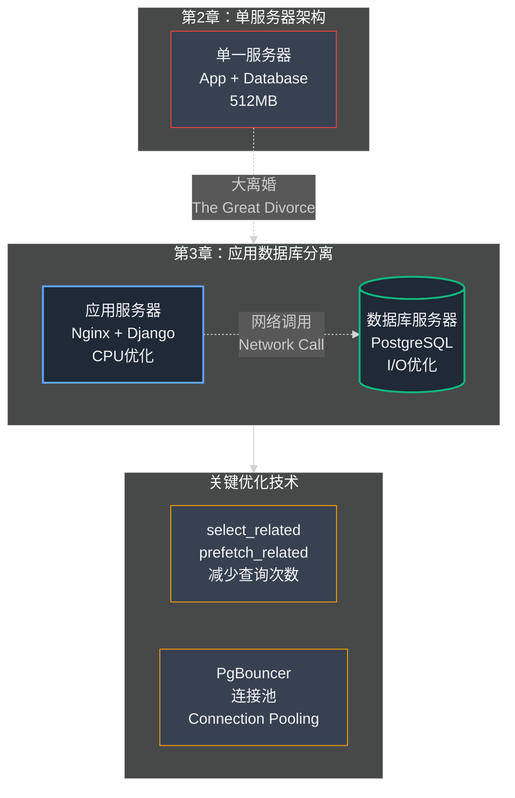

## 第03章：性能优化：分离应用和数据库

### Part 1：第二天早晨

产品发布后的记忆一片模糊。在 48 小时黑客马拉松结束后，我们在几个小企业主的 微信 群里分享了刚刚建成的 MVP 链接。我们完全不知道会发生什么。也许会有零星的注册，一些客气的反馈，然后逐渐归于沉寂。

然而，实际发生的是一场爆发。

事实证明我们的核心假设完全正确。混乱的微信接单流程带来的痛苦如此尖锐刺骨，卖家们迫切渴望寻找解决方案。我们简单、朴素的工具恰恰击中了他们的要害需求。链接在一个群又一个群之间疯狂转发。我们从十几个用户暴涨到几百个，然后飙升到几千个，这一切都在短短几天内发生。每个新店主都会添加他们的商品，然后与客户分享他们专属的 xiaodiantong.cn 链接，而这些客户中许多本身也是小企业主。增长呈现病毒式传播态势。

这是世界上最令人振奋的感觉。我们 Django 管理面板的每次刷新都能看到新店铺像雨后春笋般从全国各地涌现。我们正在实时见证自己的创意——我们的"滑板"——变得鲜活起来。但在兴奋的表象之下，一种隐隐的恐惧感开始悄然滋长。

应用开始变慢了。

曾经瞬间加载的页面现在需要好几秒钟。管理面板时不时会卡死。我们开始收到用户发来的第一批警示消息："网站打不开了"、"服务器是不是挂了？"我们像惊慌失措的消防员一样四处灭火，每隔几小时就重启一次服务器——这是一个越来越无效的权宜之计。我们那间狭小的厨房正在被自己的成功所淹没。

然后，那一刻终于到来了。凌晨 3 点的那通电话。全面崩溃。本书开篇的那个故事。

那天晚上是我们最初的、天真的增长阶段的高潮。我们单一的、过度工作的服务器，那台曾经是我们整个宇宙的 5 美元 DigitalOcean Droplet，终于放弃了。这是我们第一个架构不可避免的、痛苦的死亡。

第二天早上，在几个小时的不安睡眠之后，王峰和我通了电话。眼前的火被扑灭了——我们设法再次重启了服务器——但我们俩都知道我们是在借来的时间上。它会再次崩溃，可能在几小时内。

"我们不能一直重启它，陈浩，"王峰说，声音紧张。"我们需要一个真正的修复。实际问题是什么？"

我花了最后几个小时深入研究服务器日志，盯着 `htop` 输出直到我的眼睛灼痛。答案正在变得清晰。

"数据库，"我说。"数据库正在把其他一切都窒息而死。"

#### **识别瓶颈：厨房里的战争**

让我们回到"单厨师厨房"的类比。我们的服务器就是一间狭小的房间，厨师（CPU）、工作台面（RAM）和储藏室（磁盘 Disk）全都挤在一起。

在崩溃事故之后，我们深入分析发现了一个关键细节。厨师并没有把大部分时间花在真正的烹饪上（执行我们的 Python 代码）。他把绝大部分时间都浪费在来回奔跑到储藏室，疯狂地寻找配料并将它们归位（读取和写入数据库）。

数据库操作的巨大需求正在让应用程序的其余部分处于资源饥饿状态。服务员（Nginx）拿着新订单站在门口焦急等待，但厨师忙于应付混乱的储藏室，根本顾不上他们。这就是网站为何感觉如此缓慢并最终完全停止响应的根本原因。

要解决这个问题，我们需要理解系统设计中的一个根本性概念：应用程序的不同组成部分执行着截然不同类型的工作。

#### **技术深度解析：应用工作 vs. 数据库工作负载**

并非所有工作负载都生而平等。Web 应用程序主要执行两种性质迥异的任务：

- **应用工作负载（厨房）：** 这是"思考"类工作。它由我们的 Django 代码处理，由 CPU 执行。这类工作是**CPU 密集型（CPU-bound）**。它的职责是执行业务逻辑：决定展示哪些商品，计算订单总价，验证用户登录状态。这就像厨师积极地遵循菜谱，进行切菜、混合和品尝。这类工作需要一位快速的厨师（高性能的 CPU）和充足的工作台面空间（RAM）才能高效完成。

- **数据库工作负载（储藏室和图书馆）：** 这是"存取"类工作。数据库的核心职责是从磁盘读取和写入数据。这类工作是**I/O 密集型（I/O-bound，Input/Output bound）**。它更少关乎逻辑思考，更多关乎信息检索的物理操作。可以想象成图书管理员奔向书架寻找特定书籍，或储藏室经理为货架补充存货。这类工作取决于快速的存储设备（高速 SSD）和良好的数据组织系统。

我们的问题是，我们强迫我们出色的厨师也成为全职图书管理员。他试图在一个繁忙、嘈杂的图书馆中间做美食。不断地跑来跑去到书架（磁盘 I/O）阻止他做他真正的工作：烹饪（执行代码）。两项工作都做得不好。

解决方案在概念上很简单，但在实践中很可怕。

"我们需要把它们分开，"我告诉王峰。"我们需要给数据库它自己的、专用的房间。一个合适的图书馆，有一个专门的图书管理员。我们需要一个单独的厨房给厨师。"

这意味着从一台服务器转到两台。这是我们的第一次重大架构变更。

- **服务器 1：应用服务器 (Application Server)。** 这台服务器将针对 CPU 密集型任务进行优化。它将运行 Nginx、Gunicorn 和我们的 Django 代码。它唯一的工作就是"思考"。
- **服务器 2：数据库服务器 (Database Server)。** 这台服务器将针对 I/O 密集型任务进行优化。它只运行一样东西：我们的 PostgreSQL 数据库。它唯一的工作就是"记住"。

这就是计划。大离婚。它听起来合乎逻辑。它听起来是对的。但这也意味着我们必须对我们的实时、运行的应用程序进行开心脏手术。我们必须小心地将整个数据库——每个用户、每个产品、我们公司的每一个数据——从一台机器移动到另一台。

如果我们搞砸了，我们可能会损坏数据。我们可能会丢失订单。我们可能会破坏刚刚开始依赖我们的数千名卖家的信任。风险再高不过了。

### Part 2：迁移手册

决定做出了。我们要进行大离婚。感觉就像站在悬崖边上，知道你必须跳下去。唯一的问题是如何在下降途中建造一个降落伞。

我们花了几个小时规划每一个步骤。我们像飞行前检查清单一样把它写下来。在像这样高风险的操作中，你不会即兴发挥。你遵循计划。一个错误可能是致命的。

#### **蓝图：之前和之后**

我们的目标是将我们的基础设施从一台单一的、负担过重的机器转变为两台专门的机器。

- **之前：** 一台服务器（例如，IP：104.248.62.77）运行一切：Nginx、Gunicorn、Django 和 PostgreSQL。
- **之后：**
  - **应用服务器** (IP: 104.248.62.77)：运行 Nginx、Gunicorn 和 Django。
  - **数据库服务器** (IP: 142.93.218.155)：仅运行 PostgreSQL。

应用服务器将不再与 localhost（意思是"在同一台机器上"）上的数据库通信。它必须跨网络到达新的、专用的数据库服务器。

这是我们遵循的确切手册。如果你发现自己处于这种情况，这些是可怕但必要的步骤来移动实时数据库。

#### **步骤 1：准备新家**

你不能在房子建好之前搬进新房子。我们的第一步是为我们的数据库创建新的、专用的服务器。

我们回到 DigitalOcean 仪表板并启动了一个新的 Droplet。这一次，我们选择了一个稍微不同的计划。我们没有选择通用服务器，而是选择了一个"存储优化 (Storage-Optimized)"的服务器。它有一种更快的 SSD 存储类型（称为 NVMe）和相对于其 CPU 功率更多的 RAM。它是为数据库的 I/O 密集型工作量身定制的。这是我们新的、最先进的图书馆。

一旦服务器上线，我就 SSH 进入它。我安装的唯一软件是 PostgreSQL。没有别的。没有 Nginx，没有 Python，没有应用程序代码。它的目的是单一的：成为我们数据的最佳可能家园。我还配置了防火墙，只允许来自我们应用服务器特定 IP 地址的连接。互联网上没有其他人应该能够甚至尝试与我们的数据库通信。这就像给我们的应用服务器一把特殊的、私人的图书馆钥匙。

#### **步骤 2：备份 (pg_dump)**

这是最关键的步骤。你如何复制一个活着的、呼吸的数据库？你不能只是复制文件，因为它们可能正在被更改，导致损坏的副本。

你需要创建一个完美的快照。对于 PostgreSQL，神奇的工具是 `pg_dump`。

`pg_dump` 是一个命令行实用程序，它读取你的整个数据库——每个表、所有数据、每个关系——并输出一个带有 `.sql` 扩展名的单一、巨大的文本文件。这个文件包含从绝对零开始完美重建数据库所需的所有 SQL 命令。

这样想：`pg_dump` 就像一个魔法抄写员，他走进你的图书馆，读每一本书，并写一本新的、单一的主书，标题为"重建整个图书馆的说明"。

在我们原始的、多合一的服务器上，我运行了命令：

> pg_dump -U postgres xiaodiantong_prod > xiaodiantong_backup.sql

我看着服务器的 CPU 飙升。它正在努力创建这个快照。几分钟后，它完成了。我们现在有了一个文件 `xiaodiantong_backup.sql`，它包含了我们公司的整个灵魂。

> **📌 编者注：pg_dump 完整参数与最佳实践**
>
> *pg_dump 是 PostgreSQL 数据库备份的核心工具，掌握其参数和最佳实践至关重要：*
>
> ***常用参数详解：***
> ```bash
> # 基础备份命令
> pg_dump -U postgres -d xiaodiantong_prod > backup.sql
> 
> # 生产环境推荐的完整备份命令
> pg_dump \
>   -U postgres \                    # 用户名
>   -h localhost \                   # 数据库主机
>   -p 5432 \                        # 端口
>   -d xiaodiantong_prod \                 # 数据库名
>   -F c \                           # 格式：c=自定义压缩格式，更高效
>   -b \                             # 包含大对象（blobs）
>   -v \                             # 详细模式，显示进度
>   -f /backup/xiaodiantong_$(date +%Y%m%d_%H%M%S).dump
> 
> # 仅备份数据，不包含结构
> pg_dump -U postgres -d xiaodiantong_prod --data-only > data_only.sql
> 
> # 仅备份结构，不包含数据
> pg_dump -U postgres -d xiaodiantong_prod --schema-only > schema_only.sql
> 
> # 备份特定表
> pg_dump -U postgres -d xiaodiantong_prod -t products -t orders > tables.sql
> ```
>
> ***格式选择（-F 参数）：***
> - *`-F p` (plain)：纯文本 SQL，可读但体积大*
> - *`-F c` (custom)：二进制压缩格式，推荐用于生产环境*
> - *`-F d` (directory)：目录格式，支持并行备份和恢复*
> - *`-F t` (tar)：tar 归档格式*
>
> ***生产环境备份检查清单：***
> 1. **备份前检查**
>    ```bash
>    # 检查数据库大小
>    psql -U postgres -d xiaodiantong_prod -c "\l+"
>    
>    # 检查磁盘空间（至少预留 2 倍数据库大小）
>    df -h
>    ```
>
> 2. **执行备份**
>    ```bash
>    # 使用 nice 降低优先级，避免影响生产
>    nice -n 19 pg_dump -U postgres -d xiaodiantong_prod -F c -f backup.dump
>    ```
>
> 3. **验证备份完整性**
>    ```bash
>    # 列出备份内容
>    pg_restore --list backup.dump | head -20
>    
>    # 测试恢复到临时数据库
>    createdb test_restore
>    pg_restore -U postgres -d test_restore backup.dump
>    ```
>
> 4. **加密和传输（可选）**
>    ```bash
>    # 加密备份文件
>    gpg --encrypt --recipient backup@company.com backup.dump
>    
>    # 安全传输到远程存储
>    rsync -avz --progress backup.dump.gpg user@backup-server:/backups/
>    ```
>
> ***故障恢复步骤：***
> ```bash
> # 从自定义格式恢复
> pg_restore -U postgres -d xiaodiantong_prod -v -c backup.dump
> # -c：清理（删除）现有对象
> # -v：详细输出
> 
> # 从 SQL 文件恢复
> psql -U postgres -d xiaodiantong_prod < backup.sql
> 
> # 并行恢复（加速）
> pg_restore -U postgres -d xiaodiantong_prod -j 4 backup.dump
> # -j 4：使用 4 个并行工作进程
> ```
>
> ***自动化备份脚本示例：***
> ```bash
> #!/bin/bash
> # /opt/scripts/pg_backup.sh
> 
> BACKUP_DIR="/var/backups/postgresql"
> DB_NAME="xiaodiantong_prod"
> TIMESTAMP=$(date +%Y%m%d_%H%M%S)
> BACKUP_FILE="$BACKUP_DIR/${DB_NAME}_${TIMESTAMP}.dump"
> 
> # 创建备份
> pg_dump -U postgres -d $DB_NAME -F c -f $BACKUP_FILE
> 
> # 验证备份
> if [ $? -eq 0 ]; then
>   echo "[SUCCESS] Backup created: $BACKUP_FILE"
>   # 仅保留最近 7 天的备份
>   find $BACKUP_DIR -name "${DB_NAME}_*.dump" -mtime +7 -delete
> else
>   echo "[ERROR] Backup failed!" >&2
>   exit 1
> fi
> 
> # 添加到 crontab：每天凌晨 2 点执行
> # 0 2 * * * /opt/scripts/pg_backup.sh >> /var/log/pg_backup.log 2>&1
> ```
>
> ***关键注意事项：***
> - ⚠️ *备份期间会对表加 ACCESS SHARE 锁，通常不影响读写，但大表备份可能耗时较长*
> - ⚠️ *务必定期测试备份的恢复过程，不可用的备份等于没有备份*
> - ⚠️ *考虑使用 WAL 归档 + 基础备份实现 PITR（时间点恢复）*

#### **步骤 3：传输和恢复**

现在我们有了蓝图，但它在错误的服务器上。我们需要将这个备份文件从我们的旧服务器安全地传输到我们新的、空的数据库服务器。为此，我们使用了另一个命令行工具，叫做 `scp`（安全复制，Secure Copy）。

> scp xiaodiantong_backup.sql root@142.93.218.155:/root/

这个命令通过网络安全地复制我们的备份文件。现在，新图书馆有了"说明"书。

有了新服务器上的备份文件，是时候重建了。我 SSH 进入新的数据库服务器，创建了一个名为 `xiaodiantong_prod` 的空数据库外壳，然后运行命令从备份恢复：

> psql -U postgres -d xiaodiantong_prod < xiaodiantong_backup.sql

这个命令与 `pg_dump` 相反。它读取巨大的指令文件并逐行执行每个命令。它创建表，插入数据，并重建关系。我看着屏幕，祈祷不会出现错误。几分钟后，它完成了。

我们现在有了数据库的完美克隆，运行在一个全新的、强大的、隔离的服务器上。旧数据库仍然在线并为用户提供服务，但它的克隆已经准备好并等待着。

#### **步骤 4：切换**

这是真相时刻。操作中最危险的部分。我们必须将实时应用程序从使用旧数据库切换到使用新数据库。这需要几分钟的停机时间。

- **激活维护模式：** 我们的第一步是防止任何新数据被写入。我们快速在我们的网站上放了一个维护页面。任何访问 xiaodiantong.cn 的人现在都会看到一个简单的消息："小店通 正在进行快速升级。我们将在 5 分钟后回来！"
- **最终同步：** 我们知道在我们第一次备份和现在之间，一些新数据已经进来了。几个新商店，几个产品更新。所以，我们再次重复步骤 2 和 3，但这一次，由于网站处于维护模式，速度快得多。这确保了我们的克隆是 100% 最新的。
- **更新连接字符串 (Connection String)：** 这是实际的心脏手术。在我们 Django 应用程序的设置文件深处，有一行告诉它在哪里找到数据库。它看起来像这样：`HOST: 'localhost'`。我们把它改为指向新服务器的 IP 地址：`HOST: '142.93.218.155'`。
- **重启并祈祷：** 保存新设置后，我运行命令重启应用服务器：`sudo systemctl restart gunicorn`。几秒钟，我的心都悬在嗓子眼。应用程序现在正在启动，并将首次尝试通过网络与数据库通信。
- **疯狂测试：** 服务器重新上线的那一刻，王峰和我就在网站上，点击一切。我们能登录吗？可以。商店能加载吗？可以。我们能添加新产品吗？可以！它起作用了。连接成功了。
- **禁用维护模式：** 深吸一口气，我们让网站退出维护模式。

整个停机时间大约三分钟。

大离婚完成了。我们的应用在自己的厨房里运行，我们的数据在自己的图书馆里安全。用户立即开始告诉我们网站感觉"更快"。我们幸存了我们的第一次重大架构升级。厨房干净了，图书馆整理好了，两者现在都可以不妨碍彼此地做最好的工作了。

### Part 3：新瓶颈

几周来我们第一次可以呼吸了。

大离婚是成功的。网站稳定、快速，可以处理稳定的新用户流而不会每隔几小时就崩溃。厨房和图书馆在各自的专用空间里，整个操作比以往任何时候都运行得更顺畅。王峰和我庆祝了。我们面对了我们的第一次真正的扩展危机并走到了另一边更强大。我们为自己赢得了时间。

然而，在创业世界里，时间是你唯一能买到的东西。你实施的每个解决方案，你清除的每个瓶颈，只是揭示了等待你的_下一个_瓶颈。扩展一家科技公司有点像打地鼠游戏；一旦你解决了一个问题，另一个问题就会冒出来。

我们的新问题很微妙。它不是灾难性的崩溃或服务器着火。它是一个安静的、爬行的缓慢。即使有了我们两台强大的、专门的服务器，一些页面仍然感觉有点……迟钝。我们已经解决了资源竞争问题，但在这样做的过程中，我们为自己创造了一个全新的、更复杂的问题：**网络延迟 (Network Latency)**。

#### **技术深度解析：网络调用的成本**

当我们的应用和数据库住在同一台机器上（localhost）时，它们之间的通信几乎是瞬时的。就像厨房里的厨师转身从他身后的架子上拿配料。"旅行时间"实际上是零。

现在，我们的厨房（应用服务器）和我们的图书馆（数据库服务器）在两栋不同的建筑里。它们在深圳的同一个数据中心，所以它们就像彼此相邻的两栋建筑，通过一根超快的、私人的光纤电缆连接。但无论这条连接有多快，厨师仍然必须：

- 停止他正在做的事情。
- 走出厨房门。
- 穿过小"街道"到图书馆。
- 找到图书管理员并请求书籍（数据）。
- 等待图书管理员找到它。
- 走回街道到厨房。

整个旅程是一次**网络调用 (Network Call)**。所花费的时间称为**延迟 (Latency)**。

对于单个请求，这个延迟可能很小——也许只有 1 或 2 毫秒（ms）。你甚至不会注意到它。但问题是：一个典型的网页不只向数据库发出一个请求。要构建单个商店的页面，我们的代码可能需要：

- 获取商店的详细信息。（图书馆之旅 1 次）
- 获取该商店的所有类别。（图书馆之旅 1 次）
- 获取第一个类别的所有产品。（图书馆之旅 1 次）
- 获取第二个类别的所有产品。（图书馆之旅 1 次）
- ……依此类推。

单个页面加载可以轻松导致 10、20 甚至 50 次单独的数据库之旅。在离婚之前，这 50 次之旅实际上是免费的。现在，它们有真实世界的成本。

> 50 次旅行 * 每次旅行 2 毫秒延迟 = 100 毫秒

突然，我们仅从网络延迟就增加了十分之一秒的加载时间，即使两台服务器都在即时执行它们的各自任务。这是我们的新瓶颈。我们不能只是向它投入更多硬件。我们必须更聪明。我们必须优化我们的代码，减少与数据库的"唠叨"。

#### **对抗延迟：更少、更智能的旅行**

如果每次去图书馆的旅行都很昂贵，合乎逻辑的解决方案就是减少旅行次数。厨师不应该为每一项都来回奔跑，而应该带着详细的购物清单一次性去。在 Django 的世界里，这意味着我们必须积极优化我们的数据库查询 (Database Queries)。

- **N+1 查询问题：** 我们发现我们犯了 Web 开发中最常见的性能杀手："`N+1` 查询"问题。想象你想获得 10 家商店的列表以及每家商店的第一个产品。一种天真的编码方式是：
  - 进行 **1** 次查询以获取 10 家商店。
  - 然后，循环遍历每家商店并进行 N（在这种情况下是 10）次单独的查询，以获取每家商店的第一个产品。  
        这导致总共 11 次图书馆之旅。低效！
- **解决方案（select_related 和 prefetch_related）：** Django 有内置工具来解决这个问题。使用一个叫做 `prefetch_related` 的功能，我们可以告诉 Django："嘿，当你去获取那 10 家商店时，我知道我也需要它们的产品，所以在你在那里的时候也抓取它们。"然后 Django 会巧妙地只执行 **2** 次查询而不是 11 次。它会在一次旅行中获取所有 10 家商店，然后在第二次旅行中获取它们的所有产品，并在我们的应用程序代码中将数据拼接在一起。这就是我们的"购物清单"。在我们的代码库中实施这些优化产生了巨大的影响，显著减少了网络调用的数量，让应用感觉快得多。
- **连接池 (Connection Pooling)（PgBouncer）：** 我们还意识到，为每个请求创建一个新的数据库连接很慢。这就像厨师必须找到他的钥匙，走到图书馆，打开门，拿到书，锁上门，然后走回来。这是很多开销。为了解决这个问题，我们引入了一个叫做 **PgBouncer** 的工具。它是一个连接池。把它想象成一个坐在厨房和图书馆之间并持有一组预解锁钥匙的保安。当我们的应用需要与数据库通信时，它只是向 PgBouncer 请求一个可用的连接，立即被授予。这为我们节省了为每个小请求建立新连接的开销，进一步降低了我们的有效延迟。

### Part 4：一个岔路口——为什么我们坚持使用 SQL

我们已经成功地进行了大离婚。我们的 PostgreSQL 数据库现在生活在自己强大的服务器上，摆脱了应用程序逻辑的混乱。这是关系型数据库的经典扩展举措。

但这里自然会出现一个问题，尤其是在现代技术世界中：**为什么完全坚持传统的 SQL 数据库？** 为什么不使用我们听说很多的快速、水平可扩展的 NoSQL 数据库之一，如 MongoDB 或 Cassandra？

这是我们做出的有意识的选择。要理解为什么，你需要理解数据库世界的两种基本哲学。

#### **技术深度解析：两个数据库星系**

把数据库世界想象成两个平行的星系：SQL 和 NoSQL。它们都广阔而强大，但它们在不同的物理定律上运作。

**1. SQL 星系（关系型数据库）**

这个星系是著名星球如 **PostgreSQL、MySQL 和 Microsoft SQL Server** 的家园。

- **类比：** SQL 数据库就像一个完美组织的 **Excel 工作簿**，有多个相互关联的电子表格（表）。
- **核心思想：结构和一致性。** 数据存储在具有预定义列和严格数据类型的表中（价格列必须是数字，created_at 列必须是时间戳）。表之间的关系被严格执行。你不能有一个属于不存在的商店的产品。
- **超能力：ACID 合规性。** 这是一组保证（原子性 Atomicity、一致性 Consistency、隔离性 Isolation、持久性 Durability），确保你的事务 (Transactions) 非常可靠。在电子商务术语中，这意味着如果客户订购五件商品，事务将保存所有五件商品并更新所有五件的库存，或者它将完全失败并不保存任何东西。你的数据**永远不会**处于半完成、损坏的状态。
- **最适合：** 任何数据完整性和一致性不可妥协的应用程序。这包括电子商务、银行、金融系统和任何类型的预订平台。

**2. NoSQL 星系（非关系型数据库）**

这是一个更多样化的星系，有像 **MongoDB**（文档）、**Cassandra**（宽列）、**Redis**（键值）和 **DynamoDB** 这样的星球。

- **类比：** NoSQL 数据库就像一个**装满灵活的 Word 文档或 JSON 文件的文件夹**。每个文档都可以有自己独特的结构。
- **核心思想：灵活性和规模。** 没有预定义的模式 (Schema)。一个产品文档可能有一个"颜色"字段，而另一个可能没有。这使得在不必迁移数据库结构的情况下更改你的应用程序变得容易。它们也通常从一开始就设计为水平扩展 (Horizontal Scaling)（跨许多更便宜的服务器）。
- **超能力：BASE 和水平可扩展性。** 许多 NoSQL 数据库提供 BASE（基本可用 Basically Available、软状态 Soft state、**最终一致性 Eventual consistency**），而不是严格的 ACID。这意味着系统优先考虑可用性 (Availability) 而不是即时一致性 (Consistency)——我们已经在读副本 (Read Replicas) 中探讨过的概念。它们的真正力量在于处理大量数据和极高的写入吞吐量 (Write Throughput)。
- **最适合：** 大数据应用程序、社交媒体信息流、物联网传感器数据、实时分析以及数据结构不断演变的应用程序。

<br/>

#### **快速比较**

| 特性 | SQL (PostgreSQL) | NoSQL (例如 MongoDB) |
| --- | --- | --- |
| **数据模型** | 结构化（表和行） | 灵活（文档、键值） |
| **模式 (Schema)** | 预定义且严格 | 动态且灵活 |
| **扩展** | 主要是垂直扩展（更大的服务器）和读副本 | 主要是水平扩展（更多服务器） |
| **一致性** | 强（ACID 保证） | 可调整，通常是最终一致性（BASE） |
| **最适合** | 电子商务、金融、记录系统 | 社交媒体、大数据、物联网、分析 |

<br/>

#### **我们为什么选择 SQL 之路**

看这张表，我们对 小店通 的选择变得非常清楚。

- **我们的数据高度结构化：** 订单有客户、一组产品和总金额。产品有名称、价格和库存数量。我们的业务逻辑建立在这些严格的关系之上。NoSQL 的灵活性是我们不需要的功能；事实上，SQL 的严格性是我们_想要的_功能。
- **数据完整性就是一切：** 对于电子商务平台，订单将被正确处理、库存将被准确更新以及付款将被无误反映的保证是用户信任的基础。PostgreSQL 的 ACID 合规性对我们来说是不可妥协的要求。
- **我们的瓶颈是读取，而不是写入：** 正如我们将在第 5 章中发现的，我们最大的扩展挑战不是处理每秒添加的数百万新产品（NoSQL 闪耀的写密集型问题）。它是处理数百万客户_查看_现有产品（读密集型问题）。PostgreSQL 有一个出色的、成熟的、充分理解的解决方案：读副本。

我们没有"大数据"问题。我们有一个经典的电子商务交易问题。选择一个时髦的 NoSQL 数据库就像用大锤砸坚果。PostgreSQL 是完全适合这项工作的精确、可靠和强大的工具。这是一个我们知道可以在其上建立一家十亿美元公司的基础。

### 数据库架构演进图

为了更好地理解我们的架构演进，让我们用图表来展示：



<br/>

## 第03章：关键要点

- **分离应用服务器和数据库服务器是扩展的第一个关键步骤。** 它允许每个组件在不争夺资源的情况下做它最擅长的事情。
- **每个解决方案都会创造一个新问题。** 转向分布式系统 (Distributed System) 引入了网络延迟作为你现在必须考虑的主要性能瓶颈。
- **网络调用是昂贵的；最小化它们。** 对抗延迟的最有效方法是编写更智能的代码，对数据库进行更少、更高效的查询。学会使用像 `select_related` 和 `prefetch_related` 这样的工具。
- **优化你的连接。** 使用像 PgBouncer 这样的连接池来减少建立新数据库连接的开销，使你的应用程序在负载下更具弹性和性能。
- **选择正确的数据库类型很重要。** 对于电子商务这样的交易系统，具有 ACID 保证的 SQL 数据库通常是正确的选择，而不是 NoSQL 替代方案。

.

