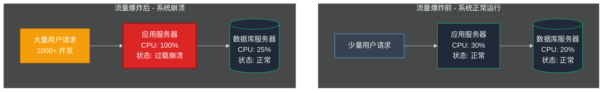
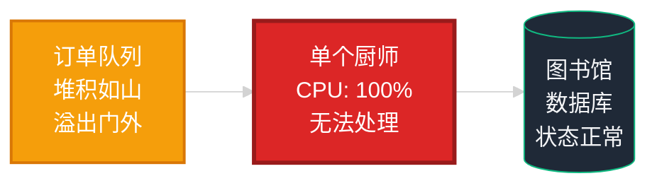
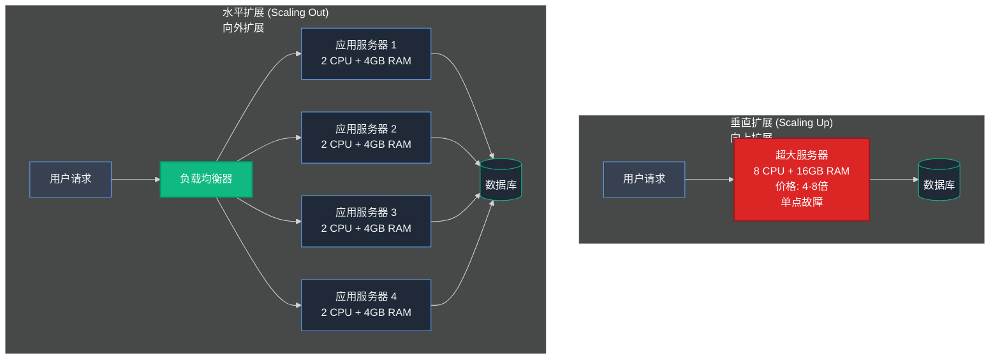
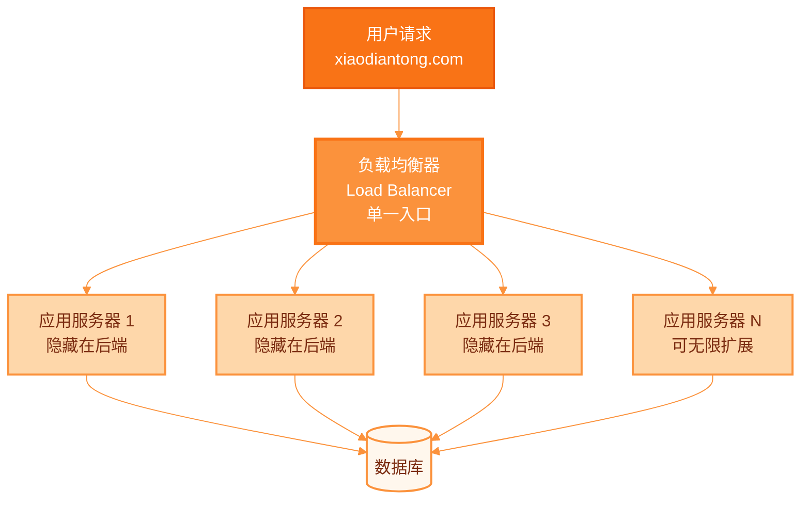
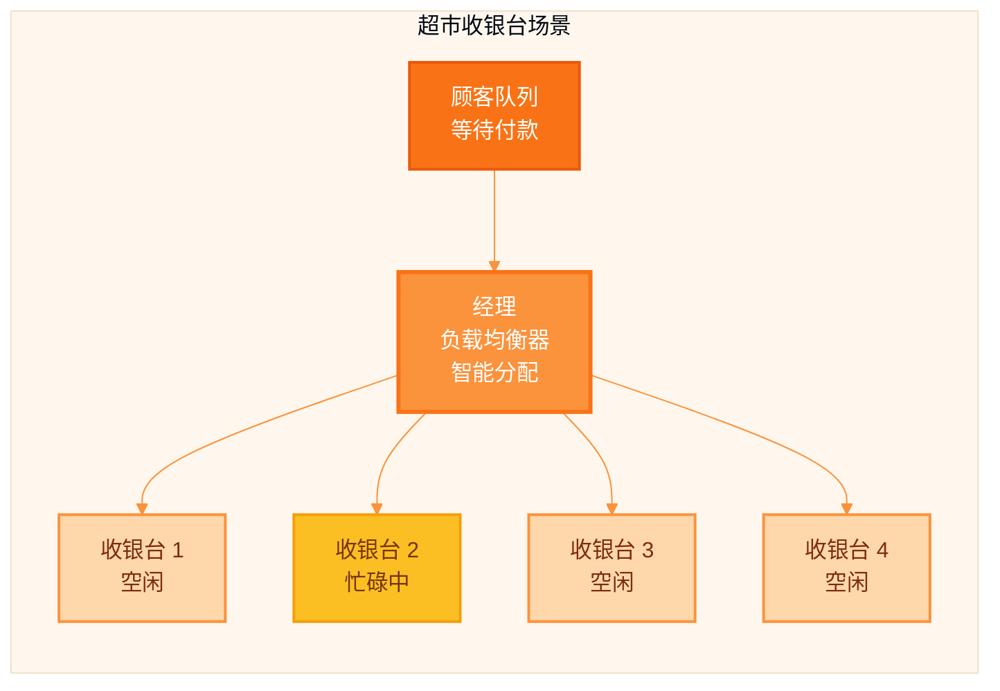
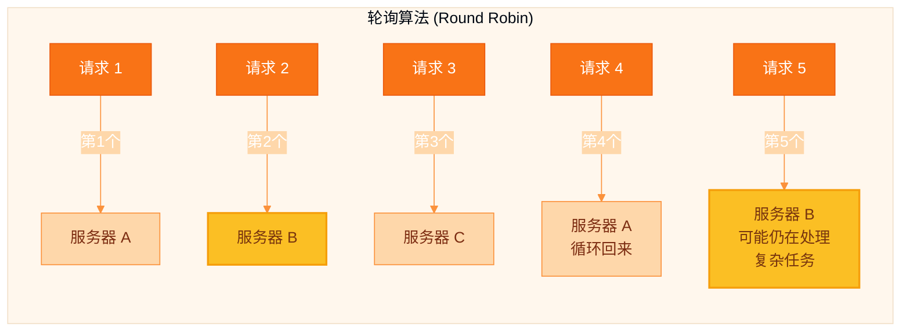
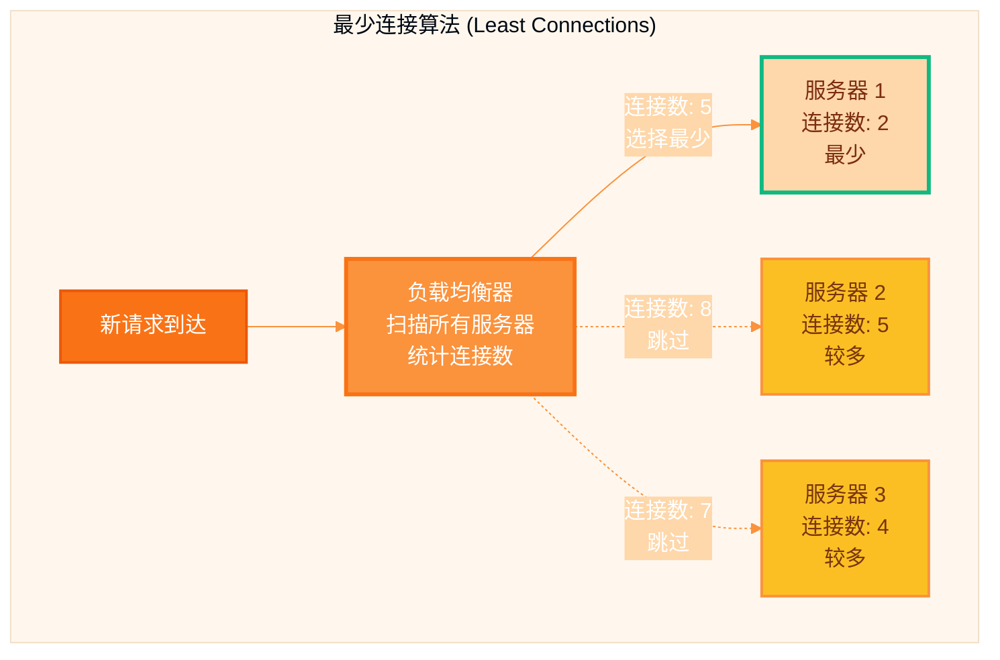
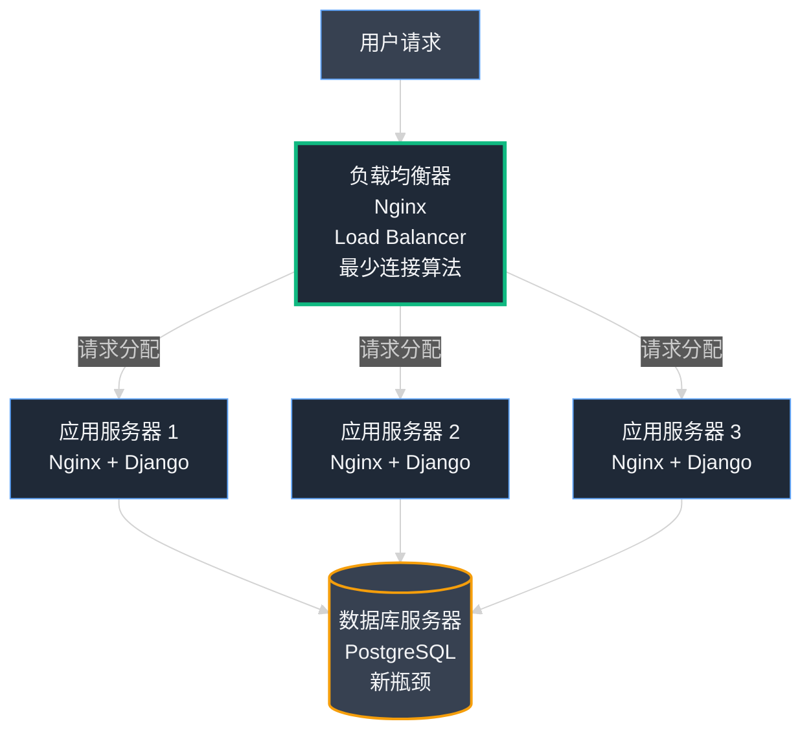

## 第04章：交通警察：负载均衡入门

### Part 1：着火的厨房

在创业公司的生命周期中，有一个危险的时期——那就是刚刚解决了第一次重大危机之后。那是一段平静而脆弱的时期。

在完成数据库"大分离"之后，我们的系统运转良好。应用响应迅速，服务器稳定可靠，我们第一次感觉自己领先于问题的步伐。我们成功地对基础设施进行了开心脏手术，而病人不仅存活了下来，还在茁壮成长。

我们的日常工作从不断的救火转变为乐观的监控。我们会目睹实时用户数不断攀升，查看服务器负载图（现在保持在低位且异常稳定），然后自豪地拍拍彼此的肩膀。我们打造出了真正有效的东西，正在不断扩展的东西。在那短暂而辉煌的时刻，我们感觉自己有些无坚不摧。

然而，下一场大火已经悄然点燃。

这次不是缓慢的退化。这是一次爆炸。来自东莞的一位受欢迎的卖家，销售漂亮的手工纺织品，在一个庞大的 微信朋友圈 群组中分享了她的 小店通 商店链接。与此同时，一个科技博客写了一篇关于我们的小专题报道。这两个事件结合创造了一场完美风暴——一波前所未有的流量浪潮。

我的手机开始因为警报而嗡嗡作响。不是来自王峰的，而是来自我们的监控系统的。"应用服务器 CPU 使用率高，"一个警报说。一分钟后，另一个："紧急：CPU 100% 持续 5 分钟。"

我几乎没来得及打开笔记本电脑，王峰的短信就来了。它很简短，很熟悉，并且带着疲惫的挫败感。

**"现在又怎么了？"**

我 SSH 进入我们的服务器。我的手指直接去了我信任的诊断工具 `htop`。我首先检查了数据库服务器。它完全没问题。CPU 很低，内存使用稳定。新图书馆安静、有组织，并且轻松处理所有的书籍请求。

然后我检查了应用服务器。这是一场血战。CPU 固定在 100%。进程列表是 Gunicorn 工作进程疯狂滚动，试图并失败处理涌入的请求洪流。服务器完全不堪重负。它还活着，但没有响应。对外界来说，小店通 崩溃了。再次。

#### **识别瓶颈：一个厨师，一千个顾客**

让我们用图表来直观地看看发生了什么：



我们的厨房着火了。

为了继续我们的类比，我们已经成功地在我们的厨房旁边建造了一个最先进的图书馆。我们的厨师不再需要担心管理储藏室。但现在，一千个饥饿的顾客一下子冲进了餐厅，他们都在大喊他们的订单。

我们的单个厨师（我们的一个应用服务器），即使他现在更高效了，也根本无法足够快地烹饪。一个人一次能准备多少道菜是有物理限制的。我们已经达到了这个极限。订单票据的队列变得如此之长，以至于溢出了门外，整个餐厅都陷入了停顿。



很明显我们需要更多的烹饪能力。但怎么做？这把我们带到了每个扩展公司必须面对的一个基本选择。在两条非常不同的路径之间的选择：垂直扩展或水平扩展。

#### **技术深度解析：垂直扩展 vs. 水平扩展**

当服务器无法应对负载时，你面临两种截然不同的选择。



**1. 垂直扩展（Vertical Scaling）—— 向上扩展（Scaling Up）**

这是最直观的解决方案。如果厨房运转太慢，你就用一位烹饪速度快两倍的世界级大厨来替换现有的厨师。

在服务器领域，这叫做**向上扩展**。你在阿里云上点击几下，关闭当前服务器，然后选择一个更大更强的配置——比如从 2 个 CPU 和 4GB RAM 升级到 8 个 CPU 和 16GB RAM。重新启动后，你的应用就运行在一台性能野兽般的机器上了。这就像把家用轿车换成巨型怪物卡车。

- **优点：** 实施极其简单。无需修改代码或架构，只需用钱砸问题，问题就会缩小。
- **缺点：** 这个策略存在三个致命缺陷：
  - **成本呈指数增长。** 两倍性能的服务器绝不只是两倍价格，可能是四倍甚至八倍。价格曲线陡峭上升。
  - **存在物理上限。** 你无法无限向上扩展。最终会触及供应商提供的最大、最昂贵的机器配置。然后怎么办？没有更大的怪物卡车可供购买了。
  - **构成单点故障（Single Point of Failure）。** 这是最致命的缺陷。你现在拥有一台非常强大但也非常昂贵的单一服务器。如果它遭遇硬件故障，或需要重启进行安全更新，你的整个业务就会离线。整个餐厅完全依赖那位超级厨师，如果他病倒了，餐厅就得停业。

**2. 水平扩展（Horizontal Scaling）—— 向外扩展（Scaling Out）**

这是不太直观但更具威力的策略。你不是雇佣一位超级大厨，而是保留现有的才华厨师，然后再招募三位同样水平的厨师。你扩建厨房空间，让他们全部并行协作。

在服务器术语中，这叫做**向外扩展**。你不是升级为一台巨型服务器，而是创建一支由多台较小但相同的服务器组成的集群。不是一辆怪物卡车，而是四辆普通轿车组成的车队。

- **优点：**
  - **成本效益高。** 使用的是廉价的商用硬件。向集群添加另一台小型服务器只是适度的增量成本。
  - **几乎无限扩展。** 如果需要更多算力，只需向集群添加更多节点。可以从四台扩展到四十台，再到四百台。系统天生就为此而设计。
  - **容错性强（Fault-Tolerant）。** 这是水平扩展的超能力。如果四位厨师中有一位病倒回家（一台服务器宕机），其他三位依然在岗位烹饪。餐厅运转可能会稍慢，但**绝不会停业**。你彻底消除了单点故障。

- **缺点：** 它引入了新的复杂性层级。如果一个大厨房里有四位相同的厨师，当服务员拿着新订单进来时，应该交给谁？如何做出这个决定？

对我们来说，选择是显而易见的。垂直扩展是一个临时修复，一个创可贴。它不是一个真正的长期策略。我们正在建立一家我们希望能为数百万人服务的公司，这意味着我们需要一个可以与我们一起成长的架构。我们必须学会向外扩展。

我们做出了决定。我们要建造一队应用服务器。但这意味着我们现在必须解决这个新架构创造的问题。我们需要一个系统来智能地在我们的新厨师团队中分配所有传入的订单。

我们需要一个交通警察。我们需要一个负载均衡器 (Load Balancer)。

### Part 2：交通警察

我们横向扩展的决定是一个重大转折点。我们从单服务器心态转向车队心态。但没有指挥官，车队是无用的，一个系统来指挥部队。我们一队相同的厨师准备烹饪，但我们需要一个领班服务员来智能地分配传入的订单。

这个领班服务员，这个交通警察，这个拼图的关键部分，被称为**负载均衡器 (Load Balancer)**。

#### **技术深度解析：什么是负载均衡器？**

负载均衡器正如其名称所暗示的。它是一个专用服务器或服务，位于你的应用服务器前面，其唯一的工作就是在它们之间平衡传入流量的负载。

对互联网上的每个用户来说，负载均衡器_就是_你的网站。他们都去负载均衡器的单一地址（例如，xiaodiantong.com）。用户不知道在那个单一地址后面有两台、十台或一百台相同的服务器准备做工作。负载均衡器充当单一前门，隐藏了它背后的厨房的复杂性。



负载均衡器的最佳类比是**繁忙超市收银台的经理**。

想象一长队顾客（网络流量）等待付款。如果只有一个收银员（一个应用服务器），队伍会很快变得很长很长。顾客会感到沮丧，收银员会不堪重负。

现在，想象商店经理打开了四个新收银台（我们的应用服务器车队）。但不是让顾客随机选择一条线，经理站在前面，积极地将队伍中的下一个人引导到下一个可用的收银员那里。

- "先生，请去 3 号柜台。"
- "女士，1 号柜台为您准备好了。"



这位经理就是负载均衡器。他们的工作是确保没有一个收银员在其他人闲坐时不堪重负。他们平滑了顾客流量的峰值和谷值，确保整个系统高效运行。负载均衡器还执行健康检查。如果其中一个收银员突然晕倒（服务器崩溃），经理立即停止向那个柜台发送顾客，并将他们引导到其他工作中的收银员那里。系统继续运行。

#### **技术深度解析：负载均衡算法**

超市经理需要一套规则——一个策略——来决定将下一个顾客发送到哪里。在负载均衡的世界里，这些规则被称为**算法 (Algorithms)**。有许多复杂的算法，但对我们的需求，我们只需要理解两个最常见的。

**1. 轮询 (Round Robin)：简单但愚蠢的方法**

这是最基本的负载均衡算法。它的工作方式正如其名称所暗示的：它以简单的循环轮转方式将请求分配给服务器。

- 第 1 个请求去服务器 A。
- 第 2 个请求去服务器 B。
- 第 3 个请求去服务器 C。
- 第 4 个请求回到服务器 A。
- ……依此类推。

这就像向一群玩家发牌。每个玩家依次得到一张牌。



- **优点：** 它设置起来非常简单，几乎不需要负载均衡器的思考。
- **缺点（"愚蠢"部分）：** 它假设每个请求都是相同的，每个服务器都同样强大。但如果发送到服务器 B 的第 2 个请求是一个需要 10 秒处理的庞大、复杂的任务，而其他请求只需要 1 秒呢？轮询不关心。它会盲目地将第 4 个请求发送到服务器 A，第 5 个请求发送到服务器 B，即使服务器 B 仍在与其先前的复杂任务斗争，而服务器 A 完全空闲。这可能导致实际_工作负载_的不均匀分配。

**2. 最少连接 (Least Connections)：更智能的方法**

这是一个更智能和动态的算法。负载均衡器主动跟踪当前对其车队中每个应用服务器打开的连接数。当新请求进来时，负载均衡器将其发送到具有**最少活动连接**的服务器。

这就像聪明的超市经理，他不只是按顺序将你发送到下一个柜台，而是主动扫描所有队伍并将你发送到**当前最短**的那个。



- **优点：** 这种方法自然地考虑了一些请求比其他请求慢的事实。一个忙于慢任务的服务器将有更多打开的连接，因此将被负载均衡器给予"休息"，直到它赶上。这导致工作负载分配更公平、更高效。
- **缺点：** 它需要负载均衡器稍微多一点的开销，因为它必须主动计数连接，而不是只是遵循一个愚蠢的列表。

对 小店通 来说，选择很明确。"最少连接"算法是更智能、更健壮的选项，可以更好地处理我们用户流量的不可预测性。

我们现在理解了理论。我们有一个交通警察的策略。是时候付诸实践了。我们需要为这项工作选择一个工具并配置它来管理我们新的、不断增长的服务器车队。

### Part 3：我们的第一个交通警察

理论是可靠的。我们有一个建造服务器车队的计划和一个管理它们的策略。现在，是时候动手并真正建造它了。

我们的第一个问题是为我们的负载均衡器使用哪个软件。有许多选择，从花费一大笔钱的专用硬件设备到像 阿里云 的弹性负载均衡器 (Elastic Load Balancer) 这样的基于云的服务。但我们仍然是一家预算紧张的小创业公司。我们需要强大、可靠，最好是免费的东西。

答案已经坐在我们的服务器上了。

#### **技术深度解析：Nginx 作为负载均衡器**

我们已经在使用 **Nginx** 作为我们的 Web 服务器——那个高效的"服务员"，它提供我们的静态文件并将请求传递给我们的应用程序。事实证明，Nginx 也是一个世界级的负载均衡器。只需在其配置文件中添加几行额外的内容，我们就可以教我们现有的服务员也成为聪明的超市经理。

这是一个巨大的胜利。我们不需要学习或安装一个新的、复杂的技术。我们可以使用我们已经知道并信任的工具。

实施出奇地简单。我在阿里云上启动了第二台相同的应用服务器。现在我们有两个"厨师"准备烹饪。然后，我 SSH 进入我们的第一台服务器，那台我们的域名 xiaodiantong.com 指向的 IP 地址的服务器。这台服务器现在将承担负载均衡器的额外角色。

我打开了 Nginx 配置文件（`/etc/nginx/nginx.conf`）并添加了两小块文本。

**我们的 Nginx 负载均衡器配置**

```nginx
# 定义将处理应用程序工作的服务器组。
# 我们将这个组称为"app_servers"。

upstream app_servers {
  # 这是魔法规则。它告诉 Nginx 使用我们讨论过的"最少连接"
  # 算法。将流量发送到连接最少的服务器。
  least_conn;

  # 列出我们车队中所有服务器的 IP 地址。
  # 这些是用于速度和安全的私有网络 IP。
  server 10.132.2.31; # 我们的第一个应用服务器
  server 10.132.4.55; # 我们的第二个应用服务器

  # 要扩展，我们只需在这里添加更多行！
}

server {
  listen 80;
  server_name xiaodiantong.com;

  location / {
    # 这是完成所有工作的行。
    # 它告诉 Nginx 将每个传入的请求传递给
    # 我们上面定义的"app_servers"组。
    proxy_pass http://app_servers;
    proxy_set_header Host $host;
    proxy_set_header X-Real-IP $remote_addr;
  }
}
```

> **📌 编者注：Nginx 负载均衡进阶配置**
>
> *以下是生产环境的完整配置示例和最佳实践：*
>
> ***健康检查配置（需要 nginx_upstream_check_module）***
>
> ```nginx
> upstream app_servers {
>   least_conn;
>   
>   server 10.132.2.31 max_fails=3 fail_timeout=30s;
>   server 10.132.4.55 max_fails=3 fail_timeout=30s;
>   server 10.132.6.88 backup;  # 备用服务器，仅在其他都失败时使用
>   
>   # 健康检查配置
>   check interval=3000 rise=2 fall=3 timeout=1000 type=http;
>   check_http_send "GET /health HTTP/1.0\r\n\r\n";
>   check_http_expect_alive http_2xx http_3xx;
> }
> ```
>
> ***会话保持（Sticky Session）配置***
>
> ```nginx
> # 方案1：基于 IP 的会话保持
> upstream app_servers {
>   ip_hash;  # 同一 IP 始终路由到同一服务器
>   server 10.132.2.31;
>   server 10.132.4.55;
> }
> 
> # 方案2：基于 Cookie 的会话保持（需要商业版或第三方模块）
> upstream app_servers {
>   server 10.132.2.31;
>   server 10.132.4.55;
>   sticky cookie srv_id expires=1h domain=.xiaodiantong.com path=/;
> }
> ```
>
> ***完整的生产环境配置***
>
> ```nginx
> # /etc/nginx/nginx.conf
> 
> upstream app_servers {
>   least_conn;
>   
>   # 服务器配置参数详解
>   server 10.132.2.31:8000 
>     weight=3              # 权重（相对处理能力）
>     max_fails=3           # 最大失败次数
>     fail_timeout=30s      # 失败超时时间
>     max_conns=1000;       # 最大并发连接数
>   
>   server 10.132.4.55:8000 weight=2;
>   server 10.132.6.88:8000 backup;  # 备用服务器
>   
>   # 保持连接（提升性能）
>   keepalive 32;
> }
> 
> server {
>   listen 80;
>   server_name xiaodiantong.com;
>   
>   # 访问日志
>   access_log /var/log/nginx/xiaodiantong_access.log combined;
>   error_log /var/log/nginx/xiaodiantong_error.log;
>   
>   # 限流配置（防止 DDoS）
>   limit_req_zone $binary_remote_addr zone=one:10m rate=10r/s;
>   limit_req zone=one burst=20 nodelay;
>   
>   # 超时配置
>   proxy_connect_timeout 5s;
>   proxy_send_timeout 60s;
>   proxy_read_timeout 60s;
>   
>   location / {
>     proxy_pass http://app_servers;
>     
>     # 必要的请求头
>     proxy_set_header Host $host;
>     proxy_set_header X-Real-IP $remote_addr;
>     proxy_set_header X-Forwarded-For $proxy_add_x_forwarded_for;
>     proxy_set_header X-Forwarded-Proto $scheme;
>     
>     # WebSocket 支持
>     proxy_http_version 1.1;
>     proxy_set_header Upgrade $http_upgrade;
>     proxy_set_header Connection "upgrade";
>     
>     # 缓冲区配置
>     proxy_buffering on;
>     proxy_buffer_size 4k;
>     proxy_buffers 8 4k;
>     proxy_busy_buffers_size 8k;
>   }
>   
>   # 健康检查端点（不计入日志）
>   location /nginx_status {
>     stub_status;
>     access_log off;
>     allow 127.0.0.1;
>     deny all;
>   }
> }
> ```
>
> ***动态添加/移除服务器***
>
> ```bash
> # 编辑配置文件
> sudo vim /etc/nginx/nginx.conf
> 
> # 测试配置语法
> sudo nginx -t
> 
> # 平滑重载配置（不中断服务）
> sudo nginx -s reload
> ```
>
> ***监控负载均衡状态***
>
> ```bash
> # 查看 Nginx 状态
> curl http://localhost/nginx_status
> # 输出：Active connections、server accepts、handled、requests
> 
> # 实时监控访问日志
> tail -f /var/log/nginx/xiaodiantong_access.log | grep "HTTP/1.1\" 200"
> 
> # 统计每台后端服务器的请求分布
> awk '{print $NF}' /var/log/nginx/xiaodiantong_access.log | sort | uniq -c | sort -rn
> ```
>
> ***故障排查技巧：***
> - *`502 Bad Gateway`：后端服务器无响应，检查应用服务器状态*
> - *`504 Gateway Timeout`：后端响应超时，增加 proxy_read_timeout*
> - *连接不均衡：检查 least_conn 是否生效，或使用 weight 调整*
> - *会话丢失：考虑启用 ip_hash 或基于 cookie 的会话保持*

就是这样。`upstream` 块定义了我们的车队。`least_conn;` 行设置了我们的智能路由策略。`proxy_pass` 指令告诉 Nginx 开始引导流量。保存文件并重启 Nginx 后，我们的负载均衡器就上线了。

<br/>

#### **新蓝图**

我们的架构再次进化了。流量流现在更加复杂和弹性。

- 用户访问 xiaodiantong.com。他们的请求击中我们的 Nginx 负载均衡器。
- 负载均衡器查看我们的两台应用服务器并检查哪一台活动连接较少。
- 它将请求转发到不太忙的服务器（例如，应用服务器 2）。
- 应用服务器 2 通过运行我们的 Django 代码来处理请求。为此，它需要数据。
- 应用服务器 2 连接到我们的单一共享数据库服务器以获取必要的信息。
- 响应沿着相同的路径返回给用户。

如果应用服务器 1 崩溃，Nginx 负载均衡器的健康检查会检测到它并自动停止向那里发送任何流量。所有请求都将被路由到应用服务器 2。网站将保持在线。我们终于建立了一个容错系统。我们可以处理流量高峰，我们可以在服务器崩溃中幸存。我们又感到无敌了。

#### **新问题：图书馆变得拥挤**

有一段时间，这个新设置工作得很好。当流量增长时，我们不会恐慌。我们只需启动第三台应用服务器，将其 IP 地址添加到 Nginx 的 `upstream` 块，并重新加载配置。我们可以在几分钟内向我们的厨房添加更多"厨师"。

但是当你有十个厨师同时疯狂烹饪时会发生什么？

他们都需要配料。他们都在跑到同一个图书馆，都在向同一个单一的图书管理员大喊请求。

我们的瓶颈只是移动了。它不再是单个应用服务器的 CPU 功率。我们通过横向扩展解决了这个问题。新瓶颈正在成为上一章中拯救我们的东西：我们的单一、庞大的数据库。

随着整个强大应用服务器车队都在用请求敲打它，我们的数据库服务器开始冒汗。数据库服务器上的 CPU 使用率正在攀升。查询开始变慢。

我们已经成功扩展了我们的"厨房"，但我们的"图书馆"仍然是一个单一房间，只有一个单一的图书管理员。它即将被淹没。

### 负载均衡架构图

让我们用图表来展示负载均衡架构的工作方式：



## 第04章：关键要点

- **水平扩展 (Horizontal Scaling) 是实现高可用性 (High Availability) 和大规模扩展的唯一长期路径。** 它比垂直扩展 (Vertical Scaling) 更复杂，但具有成本效益、灵活，并消除了单点故障。
- **负载均衡器 (Load Balancer) 是使水平扩展成为可能的必要交通警察。** 它在服务器车队之间分配请求并绕过故障进行路由。
- **你可以简单地开始。** 像 Nginx 这样的强大工具既可以充当你的 Web 服务器，也可以充当你的负载均衡器，降低了初始设置的复杂性。
- **"最少连接"是一个智能的默认算法。** 与更简单的"轮询 (Round Robin)"方法相比，它提供了更均匀的工作负载分配。
- **瓶颈总是会移动。** 当你解决一个性能问题时，负载只是转移到链中的下一个最弱环节。我们的应用服务器不再是问题；我们的数据库即将成为新的火焰。

