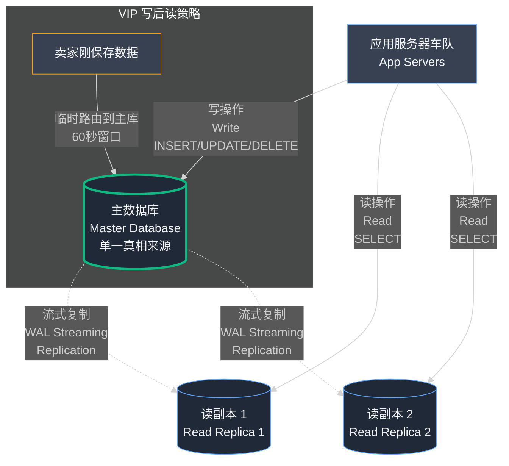

## 第05章：数据库俱乐部的保镖：读副本

当创业公司从几千用户增长到十万用户时，会发生一个根本性的质变。早期阶段的核心是生存，是扑灭一场又一场的大火。问题响亮而显眼：服务器崩溃、应用宕机。解决方案往往是简单粗暴的蛮力：重启系统，增加内存，升级到更大的机器。

但当你跨越 10 万用户的里程碑时，一类全新的问题开始显现。熊熊火焰被一种缓慢、持续的灼热所取代。系统不会彻底崩溃，它只是变得……沉重、迟钝。问题的焦点从生存转向性能（Performance）。解决方案需要更少的蛮力投入，更多的外科手术般的精准操作。你必须停止只关注如何保持灯火通明，而要开始思考建筑本身的架构设计。

我们经过负载均衡、横向扩展的应用服务器集群已经彻底解决了"厨房起火"的问题。但现在，图书馆变得如此拥挤，以至于你几乎寸步难行。

### Part 1：图书馆内的交通堵塞

拥有负载均衡器的日子真是美好。我们的应用层架构堪称完美杰作。我们可以实时目睹流量洪峰来袭，观察应用服务器的 CPU 使用率攀升，然后，仅需几次点击操作，就能向集群添加一台新服务器，眼看着负载神奇地重新分配并趋于稳定。我们拥有了控制权，拥有了可扩展性（Scalability）。

我们的用户群飙升过了 50,000 名卖家，然后是 80,000，并且正在迅速接近令人难以置信的 100,000 里程碑。这些卖家中的每一个都有客户，这意味着浏览 小店通 商店的人数达到了数百万。我们服务的流量比我们想象的要多。

但熟悉的恐惧感开始爬回来。我们开始收到投诉，不是关于网站崩溃，而是关于它慢。

- "我的商店需要 5-6 秒才能为顾客加载。"
- "有时当我添加新产品时，它只是旋转很长时间才保存。"

在中国的商业高峰时段，从上午 11 点到下午 5 点，迟缓最严重。王峰和我会看着我们的监控图表。应用服务器很好，它们的 CPU 使用率均匀分布，很少超过 50%。负载均衡器完美地完成了它的工作。

但我们单一的、强大的数据库服务器的图表讲述了一个不同的故事。CPU 持续达到 80-90%。测量存储驱动器有多忙的磁盘 I/O 指标达到了最大值。我们的数据库，那台曾经是我们救星的强大、隔离的服务器，现在正在喘气。图书馆挤满了人,我们的单一、英勇的图书管理员正在被淹没。

#### **识别瓶颈：太多人只是"看看"**

说"数据库很慢"就像医生说"病人生病了"。这不是诊断；这是一个观察。要找到治疗方法，我们必须了解它正在挣扎的_工作类型_。我们需要查看数据库内部并理解它正在执行的工作_类型_。

这导致我们分析我们的数据库查询 (Database Queries)，我们的应用程序发送到数据库的基本命令。

#### **技术深度解析：分析查询类型（读 vs. 写）**

从本质上讲，数据库做两种非常不同的工作，理解这种区别至关重要。

- **写入查询 (Write Queries)：** 这些是**更改**数据的操作。主要命令是 INSERT（添加新数据）、UPDATE（修改现有数据）和 DELETE（删除数据）。
  - **类比：** 把这想象成作者或图书管理员实际更改图书馆藏书的工作。INSERT 是一本新书到达。UPDATE 是图书管理员在目录卡上更正拼写错误。DELETE 是从书架上移除一本旧的、损坏的书。
  - 这些行为至关重要。它们必须谨慎处理以维护藏书的完整性。它们通常需要"锁 (Locks)"以确保两个人不会同时尝试更改同一件事。它们通常更慢且资源更密集。对 小店通 来说，这是卖家添加产品、更新价格或客户下订单。
- **读取查询 (Read Queries)：** 这是任何只**获取**数据的操作。命令是 SELECT。
  - **类比：** 这是公众成员进入图书馆阅读一本书。他们不改变任何东西。他们找到一本书，阅读它，然后把它放回去。他们只是在消费信息。
  - 这些行为通常比写入快得多，密集程度也低得多。对 小店通 来说，这是来自客户浏览商店和查看产品目录的大量流量洪流。

我们安装了一个工具来分析我们的数据库流量，我们发现的是我们整个问题的关键。这是一个在 Web 应用程序中如此常见的模式，它有一个名字。

**95/5 规则（或读/写拆分 Read/Write Split）**

我们的分析揭示了一个惊人的不平衡。每 100 个击中我们数据库的查询：

- **95 个是 SELECT 查询。**（读取）
- **5 个是 INSERT、UPDATE 或 DELETE 查询。**（写入）

这完全说得通。单个卖家可能每天更新他们的产品几次（少量写入），但他们的商店可能被数千名客户查看（数千次读取）。我们的系统被读取流量压倒性地主导。

**读取如何拖慢写入**

这是我们问题的核心：我们的单一数据库服务器以相同的优先级处理两种类型的工作。它有一个队列。

再想象一下我们的图书馆。有一个入口和一条线与图书管理员交谈。在那条线上有 95 个人只想问，"我在哪里可以找到这本书？"（快速读取查询）。但在那条线上也有 5 位作者需要注册一本新书，这是一个涉及填写表格和更新主目录的过程（较慢的写入查询）。

作者被迫在一大群普通读者后面排同一条长队等待。大量简单读取请求正在造成交通堵塞，延迟关键的、时间敏感的写入请求。这就是为什么卖家在尝试保存新产品时会经历长时间延迟——他们重要的"写入"请求卡在数百个来自匿名购物者的"读取"请求后面的队列中。

解决方案变得清楚了。我们不能继续强迫每个人通过同一扇门。我们需要为作者创建一个单独的、专属的入口，同时让阅读公众使用一个不同的、更大的入口。我们需要将我们的读取与写入分开。

### Part 2：保镖和 VIP 入口

问题很清楚。我们有一个单一的、拥挤的图书馆入口，大量的普通读者阻塞了重要的作者完成他们的工作。因此，解决方案是建造一个新入口。我们需要一个私人的、VIP 的门只给作者，以及一个单独的、敞开的大门给阅读公众。

在数据库架构中，这个策略被称为**复制 (Replication)**。

#### **技术深度解析：解决方案——数据库复制**

复制是创建和维护同一数据库的多个副本的过程。我们现在将拥有一个数据库团队，每个都有专门的角色，而不是一个单一的数据库服务器试图做所有事情。最常见的复制形式，也是我们实施的，被称为**主从复制 (Master-Slave Replication)**。

让我们暂时放弃图书馆类比，想象一个受欢迎的夜总会。

**主数据库 (Master Database)：VIP 俱乐部**

**主数据库 (Master)** 是俱乐部的专属 VIP 区。它是单一的真相来源。

- **它处理所有写入操作（INSERT、UPDATE、DELETE）。** 对俱乐部状态的任何更改——新 VIP 客人到达、现有客人点饮料或客人离开——都必须在这里注册。一个强硬的、不废话的保镖站在门口，确保每次更改都是合法的并被正确记录。
- **这是我们卖家的入口。** 当卖家更新产品价格、添加新项目或删除旧项目时，他们的请求直接进入主数据库。这些操作至关重要，并在这个不太拥挤的、专属的环境中以高优先级处理。

**读副本 (Slave)（Read Replica）：主舞池**

**读副本 (Read Replica)** 是俱乐部的主舞池。它是 VIP 区正在发生的一切的完美的、最新的副本，但它对公众开放供查看。

- **它只处理读取操作（SELECT）。** 成千上万的人（我们的客户）可以同时在舞池上，四处看看，看看谁在那里，享受音乐。他们可以看进 VIP 区并看到一切，但他们自己不能做任何更改。
- **它的工作是吸收大量的读取流量。** 通过将所有"只是看看"的请求卸载到读副本，我们释放了主数据库，让它专注于处理更改的重要工作。如果人群足够大，我们甚至可以有多个读副本——几个舞池。

这种关注点的分离是我们需要的架构飞跃。它将允许我们独立扩展我们的读取和写入。

#### **技术深度解析：实施**

理论很棒，但它在实践中如何工作？主舞池如何神奇地实时知道 VIP 区正在发生什么？

PostgreSQL 中流式复制 (Streaming Replication) 的工作原理

PostgreSQL 为此有一个出色的内置功能，称为流式复制。

- **WAL（预写日志，Write-Ahead Log）：** 主数据库，我们的 VIP 俱乐部，有一个勤奋的保安，他在一个特殊的日志本中写下发生的每一件事。新客人到达？他写下来。价格改变？他写下来。这个日志本被称为**预写日志 (WAL)**。它是对数据库所做的每一个更改的有序、实时记录。
- **流 (Stream)：** 我们设置了一台新服务器，我们的读副本，并将其配置为连接到主数据库。副本的第一个指令是："订阅 WAL。"然后主数据库开始通过安全的私有网络连接实时"流式传输"其日志本中的每个新条目到副本。
- **应用 (Application)：** 读副本接收这个更改流，并以完全相同的顺序将它们应用到自己的数据副本。

结果是副本始终是主数据库的近乎完美的实时镜像。这就像从 VIP 区实时视频流被广播到主舞池上方的巨大屏幕上供所有人观看。

> **📌 编者注：PostgreSQL 流式复制完整配置指南**
>
> *PostgreSQL 流式复制是生产环境的标准配置，以下是详细的实施步骤：*
>
> ***第一步：主数据库配置***
> ```bash
> # 编辑 postgresql.conf（主服务器）
> sudo vim /etc/postgresql/14/main/postgresql.conf
> 
> # 关键配置参数
> listen_addresses = '*'                    # 监听所有网络接口
> wal_level = replica                       # 启用 WAL 复制级别
> max_wal_senders = 10                      # 最大 WAL 发送进程数
> wal_keep_size = 1024                      # 保留 1GB WAL 日志（防止副本断连后无法追上）
> max_replication_slots = 10                # 最大复制槽数
> hot_standby = on                          # 允许副本在恢复模式下提供只读查询
> ```
>
> ***第二步：创建复制用户***
> ```bash
> # 在主数据库上创建专用复制用户
> sudo -u postgres psql
> 
> CREATE USER replicator WITH REPLICATION ENCRYPTED PASSWORD 'secure_password_here';
> 
> # 授予必要权限
> GRANT CONNECT ON DATABASE xiaodiantong_prod TO replicator;
> ```
>
> ***第三步：配置访问控制***
> ```bash
> # 编辑 pg_hba.conf（主服务器）
> sudo vim /etc/postgresql/14/main/pg_hba.conf
> 
> # 添加副本服务器的访问规则（替换为实际副本服务器 IP）
> host    replication     replicator      142.93.218.155/32       md5
> 
> # 重启主数据库
> sudo systemctl restart postgresql
> ```
>
> ***第四步：初始化副本服务器***
> ```bash
> # 在副本服务器上执行
> # 停止 PostgreSQL（如果正在运行）
> sudo systemctl stop postgresql
> 
> # 清空数据目录
> sudo -u postgres rm -rf /var/lib/postgresql/14/main/*
> 
> # 使用 pg_basebackup 创建初始副本
> sudo -u postgres pg_basebackup \
>   -h 104.248.62.77 \              # 主数据库 IP
>   -D /var/lib/postgresql/14/main \
>   -U replicator \
>   -P \                            # 显示进度
>   -v \                            # 详细输出
>   -R \                            # 自动创建 standby.signal 和配置文件
>   -X stream \                     # 流式传输 WAL
>   -C -S replica_slot_1            # 创建复制槽
> 
> # 输入复制用户密码
> ```
>
> ***第五步：配置副本参数***
> ```bash
> # 编辑 postgresql.conf（副本服务器）
> sudo vim /var/lib/postgresql/14/main/postgresql.conf
> 
> # 关键参数
> hot_standby = on                          # 启用只读查询
> max_standby_streaming_delay = 30s         # 最大复制延迟容忍度
> wal_receiver_status_interval = 10s        # 状态更新间隔
> hot_standby_feedback = on                 # 向主库反馈副本查询状态
> 
> # 启动副本数据库
> sudo systemctl start postgresql
> ```
>
> ***第六步：验证复制状态***
> ```bash
> # 在主数据库上检查复制状态
> sudo -u postgres psql -c "SELECT * FROM pg_stat_replication;"
> 
> # 关键字段说明：
> # - client_addr: 副本服务器 IP
> # - state: streaming（正常）
> # - sent_lsn / write_lsn / flush_lsn: WAL 位置
> # - sync_state: async（异步）或 sync（同步）
> 
> # 在副本服务器上检查接收状态
> sudo -u postgres psql -c "SELECT * FROM pg_stat_wal_receiver;"
> 
> # 检查复制延迟（字节数）
> sudo -u postgres psql -c "
> SELECT 
>   client_addr AS replica,
>   pg_wal_lsn_diff(pg_current_wal_lsn(), sent_lsn) AS lag_bytes,
>   pg_wal_lsn_diff(pg_current_wal_lsn(), sent_lsn) / 1024 / 1024 AS lag_mb
> FROM pg_stat_replication;
> "
> ```
>
> ***监控复制健康状态***
> ```bash
> # 创建监控脚本 /opt/scripts/check_replication.sh
> #!/bin/bash
> 
> # 检查复制延迟（秒）
> LAG=$(sudo -u postgres psql -t -c "
> SELECT EXTRACT(EPOCH FROM (now() - pg_last_xact_replay_timestamp()))::INT;
> ")
> 
> echo "Replication lag: ${LAG}s"
> 
> # 如果延迟超过 30 秒则告警
> if [ $LAG -gt 30 ]; then
>   echo "WARNING: Replication lag is too high!" >&2
>   # 发送告警（示例）
>   # curl -X POST https://alert-service/webhook -d "lag=${LAG}"
> fi
> 
> # 添加到 crontab：每 5 分钟检查一次
> # */5 * * * * /opt/scripts/check_replication.sh >> /var/log/repl_check.log 2>&1
> ```
>
> ***故障转移步骤（副本提升为主库）***
> ```bash
> # 在副本服务器上执行提升
> sudo -u postgres pg_ctl promote -D /var/lib/postgresql/14/main
> 
> # 或使用 SQL 命令
> sudo -u postgres psql -c "SELECT pg_promote();"
> 
> # 验证副本已成为主库
> sudo -u postgres psql -c "SELECT pg_is_in_recovery();"
> # 返回 'f' (false) 表示已是主库
> 
> # 更新应用配置，将写请求指向新主库
> # 更新 DNS 或修改连接字符串
> ```
>
> ***常见问题排查：***
> 1. **连接失败** - 检查防火墙和 pg_hba.conf 配置
> 2. **复制延迟过大** - 检查网络带宽和磁盘 I/O
> 3. **副本无法启动** - 检查 postgresql.log 错误日志
> 4. **WAL 日志不足** - 增加 wal_keep_size 参数
>
> ***关键性能优化：***
> - *使用专用网络连接主副本服务器（降低延迟）*
> - *调整 checkpoint_timeout 和 max_wal_size 参数*
> - *考虑使用同步复制（sync）确保零数据丢失*
> - *配置 WAL 归档到 S3 实现长期备份*

更新我们的应用程序以"感知复制"

设置服务器只是战斗的一半。我们的 Django 应用程序仍然是"愚蠢的"。它只知道如何与一个数据库通信。我们必须教它变得聪明，成为决定谁去 VIP 入口、谁去主楼层的保镖。

这是对我们代码库的重大更改。

- **多数据库配置：** 首先，在我们的 Django 设置中，我们配置了两个数据库连接而不是一个：一个指向主数据库 IP 的 `default` 连接，和一个指向新副本 IP 的 `read_replica` 连接。
- **创建数据库路由器 (Database Router)：** 接下来，我们实现了一个自定义的"数据库路由器"。这是 Django 中的一段特殊代码，它在每个数据库查询发生之前拦截它，并决定应该将其发送到哪个数据库。逻辑很简单，但至关重要：

```python
# 我们路由器逻辑的简化版本
class PrimaryReplicaRouter:

  def db_for_read(self, model, **hints):
    # 所有读取操作都去副本。
    return 'read_replica'

  def db_for_write(self, model, **hints):
    # 所有写入操作都去主数据库。
    return 'default'
```

有了这个路由器，我们的应用程序现在很智能了。每次客户加载商店页面（触发数十个 SELECT 查询）时，路由器都会将所有流量发送到强大的读副本。但当卖家点击新产品上的"保存"（触发 INSERT 或 UPDATE 查询）时，路由器会将那个单一的、关键的请求发送到受保护的、不太忙的主数据库。

我们部署了更改。差异是立即而戏剧性的。商店页面立即加载。卖家报告说保存更改又变得敏捷了。我们主数据库上的高 CPU 和 I/O 负载几乎降至零。我们做到了。我们已经成功扩展了我们的数据库。

<br/>
### **你无法逃脱的三角形：CAP 定理**

当我们首次推出复制时，结果感觉很神奇。主数据库处理写入，副本处理读取，突然整个俱乐部流畅地运行。卖家可以更新他们的目录而不会被一波普通购物者压垮。客户可以浏览而无需排队等待。看起来我们找到了完美的系统。

但分布式系统 (Distributed Systems) 从不免费给你完美。计算机科学中有一个古老的原则，我过去略读过，但现在每天都在盯着我：CAP 定理 (CAP Theorem)。

CAP 代表**一致性 (Consistency)、可用性 (Availability) 和分区容错性 (Partition tolerance)**。它说在任何分布式数据系统中，你最多可以同时保证这些属性中的两个。你不能拥有全部三个。

- **一致性 (Consistency)** 意味着俱乐部的每个房间同时看到同样的东西。如果 VIP 区更改了播放列表，舞池应该立即听到新歌。
- **可用性 (Availability)** 意味着门总是开着的。无论如何，俱乐部永远不会拒绝客人——每个请求都会得到一些答案。
- **分区容错性 (Partition tolerance)** 意味着即使房间之间的走廊被阻塞，俱乐部也继续运行。也许 VIP 休息室和舞池之间的音响系统链接出现故障——派对不能因为这个就停止。  

这里有个诀窍：在现实世界中，分区是有保证的。网络故障，数据包丢失，电缆切断。所以每个真实的系统都必须在分区发生时在一致性和可用性之间做出选择。

当我们引入副本时，我们正在做出那个选择——无论我们是否意识到。我们选择了**可用性优于严格一致性**。舞池（副本）始终开放并准备为客户服务，即使它还没有赶上 VIP 区（主数据库）。结果是有时舞池显示的信息稍微旧一些。

### **一个具体的例子**

假设卖家在 VIP 区将一件连衣裙的价格从 ¥1000 更新到 ¥800。主数据库立即记录它。

- 如果下一个请求直接去主数据库，客人看到 ¥800。  

- 如果它在更新流式传输过来之前击中副本，客人仍然看到 ¥1000。  

两个答案都是"有效的"，取决于你站在哪个房间。然而，从卖家的角度来看，它看起来坏了。他们刚刚改变了价格——为什么店面仍然显示旧价格？

<br/>
### **为什么 CAP 很重要**

CAP 不是一个锁在教科书里的理论；当你添加副本、分布数据或跨区域同步时，你就在与之搏斗的无形三角形。我们拥抱复制的那一刻，我们就进入了一个某些读取可能落后于写入的世界。这不是一个错误。这是 CAP，提醒我们分布式系统总是让你选择你的毒药。

### **一致性的阴影面**

一旦你接受了 CAP 定理的现实，下一个问题随之而来：如果我们无法鱼与熊掌兼得，那么我们实际需要什么级别的一致性？在实践中，并没有万能答案。分布式系统存在于一致性模型的连续谱系上，你使用过的每个产品都根据其最关键的需求做出了不同的权衡选择。

以下是你会遇到的三大主要类别：

- **强一致性（Strong Consistency）**
    这是人们直觉上期望的理想世界。如果卖家将商品价格更新为 ¥800，那么_之后的每一次读取操作_——无论它命中哪台服务器——都必须返回 ¥800。  
    用夜总会类比：VIP 区的 DJ 切换曲目的瞬间，舞池立即播放新歌，毫无例外。  
    强一致性感觉清爽利落，但通常以牺牲可用性为代价。如果 VIP 区和舞池之间的通道哪怕短暂受阻，俱乐部宁愿暂停服务，也不愿冒任何人听到"过时"歌曲的风险。

- **最终一致性（Eventual Consistency）** 
    这是读副本真正运行的模式。VIP 区的更新会尽可能快地流式传输到舞池，但绝非瞬时同步。如果你运气不佳，可能会在更新传递之前多听几拍旧曲。  
    从用户视角看，这可能令人困惑：他们刚保存了新数据，但店铺前台仍显示旧值。给定足够时间，一切终将同步，所有节点最终会达成一致——但"足够时间"可能是一秒或五秒，你无法精确预测具体时刻。

- **因果一致性（Causal Consistency）** 
    这是试图保留因果关系顺序的中间地带。如果 李芳 降低了项链价格，然后立即查看自己的店铺，因果一致性保证_她本人_会看到自己的更新，即使世界其他地方尚未同步。  
    在夜总会场景中：如果 DJ 切换曲目，任何在 VIP 区亲眼见证这一变化的人将始终听到新曲目，即使舞池里的人群仍在赶上节奏。  
    它不保证完美的全局同步，但它保护了"我做出了改变，因此我应该看到改变"的逻辑因果关系。  

### **选择适合的**

不同的系统选择不同的模型。银行软件要求强一致性——你不希望一个分行显示余额为 ¥10,000，而另一个显示 ¥5,000。社交网络倾向于最终一致性——如果你的点赞数落后几秒钟，没人会恐慌。因果一致性在面向用户的应用程序中越来越受欢迎，因为它平衡了规模与用户对即时性的个人期望。

在 小店通，当我们采用副本时，我们本质上建立了一个最终一致的系统。这就是为什么 李芳 有时会看到"旧数据的幽灵"。她的经历不是一个错误，而是最终一致性的教科书案例。

但与每个解决方案一样，这个新架构引入了一个新的、微妙的、潜在危险的副作用。

<br/>

#### **新问题：复制延迟 (Replication Lag)**

从主数据库到副本的实时数据流非常快，但它不是_瞬时的_。总是有一个微小的延迟，以毫秒为单位。在重负载下，这个延迟有时会飙升到整整一两秒。这个延迟被称为**复制延迟 (Replication Lag)**。

这意味着主舞池对 VIP 区的视图落后现实一小部分秒。

这会创造一组非常令人困惑的潜在问题。当卖家将产品价格从 ¥100 更新到 ¥90（写入主数据库）、立即在他们的商店页面上点击刷新（从副本读取）并仍然看到价格为 ¥100 时会发生什么，因为更改还没有流式传输过来？

这是**最终一致性 (Eventual Consistency)** 的令人困惑和危险的世界。

### Part 3：旧数据的幽灵

我们的新架构，从所有技术标准来看，都是巨大的成功。系统快速、稳定，并处理 100,000 个用户。从系统工程的角度来看，我们赢了。但从用户的角度来看，我们刚刚引入了一个非常奇怪的、几乎神奇的、深深令人困惑的新问题。

想象一个卖家，我们叫她 李芳。她经营一家销售定制珠宝的小精品店。她登录她的 小店通 仪表板，看到她最受欢迎的项链之一标价为 ¥1000。她决定进行闪购并将价格改为 ¥800。她点击"保存"。系统立即响应："产品更新成功！"

为了仔细检查她的工作，李芳 立即点击"查看商店"按钮，以客户的方式查看它。她看着那条项链。价格仍然是 ¥1000。

她的心一沉。它没有保存吗？她回到管理面板。它显示价格为 ¥800。她回到她的商店页面。它显示 ¥1000。她现在感到困惑并开始恐慌。她的商店坏了吗？她的客户被多收费了吗？她一次又一次地刷新页面。¥1000。¥1000。然后，突然，在五秒钟的疯狂刷新之后，它变成了 ¥800。

李芳 刚刚经历的是旧数据的幽灵。她是复制延迟的受害者。她的"保存"操作是立即进入主数据库的写入。她的"查看商店"操作是一个读取，被发送到我们的读副本，在那一刻，它落后主数据库一小部分秒。

这不是代码中的错误。这是我们刚刚建立的新的、高性能系统的基本属性。我们用即时一致性换取了大规模可扩展性。我们进入了**最终一致性**的世界。

#### **技术深度解析：最终一致性**

要理解这个概念，你需要将其与每个人自然期望的进行比较。

- **强一致性 (Strong Consistency)：** 这是我们都习惯的世界。当你在银行转账时，你期望余额在任何地方都立即更新。在写入操作之后，随后的每一个读取操作都**保证**看到那个新数据。具有单一数据库的单个服务器默认提供强一致性。只有一个真相来源。
- **最终一致性 (Eventual Consistency)：** 这是分布式系统的世界，我们现在生活的世界。系统**保证**如果你停止进行更改，所有数据副本_最终_都会看起来一样。它不承诺需要多长时间。它承诺一致性会发生，但不一定马上。

这就是权衡。我们牺牲了即时一致性的保证，换取了处理数百万次读取的能力。对于我们 99.9% 的用户（浏览网站的客户）来说，价格更新的一秒延迟是完全可以接受的；他们甚至永远不会注意到。但对于那 0.1% 是更改_原因_的用户（像 李芳 这样的卖家）来说，那一秒的延迟是一个刺耳的、不可接受的用户体验。

我们无法摆脱复制延迟——这是一个物理限制。但我们必须找到一种方法来保护我们的卖家免受其影响。

#### **技术深度解析：处理数据陈旧性的策略**

你如何解决这样的问题？你不能让系统更快，所以你必须让应用程序更智能。

策略 1：什么都不做（以及何时可以）

对于许多功能，少量的延迟完全没问题。例如，如果我们有一个显示"商店总数"的管理仪表板，这个数字过时 30 秒也无所谓。你必须有意识地确定应用程序的哪些部分需要强一致性，哪些可以容忍最终一致性。

策略 2："写后读 (Read After Write)"解决方案（VIP 通行证）

这是我们实施的策略来解决 李芳 的问题。逻辑很简单：对于特定用户，在他们执行写入操作后立即，我们应该暂时打破我们自己的规则，也将他们的读取查询发送到主数据库。

这是 李芳 的 VIP 通行证。

- 李芳 为她的项链保存了一个新价格。这是一个进入**主数据库**的写入。
- 我们的应用程序看到这个成功的写入，并在 李芳 的会话中设置一个临时标志（就像她浏览器中的 cookie），说"这个用户在接下来的 60 秒内处于 VIP 窗口。"
- 李芳 立即刷新她的商店页面。这是一个读取查询。
- 我们的数据库路由器看到来自 李芳 的请求。它检查她的会话并看到"VIP 窗口"标志。
- 路由器不是像对任何其他用户那样将她的读取请求发送到读副本，而是将其直接发送到**主数据库**。
- 由于主数据库始终拥有绝对最新的数据，它返回正确的新价格 ¥800。李芳 立即看到她的更改，她对平台的信心得以维持。
- 一分钟后，她会话中的 VIP 标志到期。她的下一个读取请求将像往常一样去副本，那时数据早就被复制了。

这种方法给了我们两全其美：对普通大众的大规模可扩展性，以及对实际进行更改的用户的强一致性感觉。

### 主从数据库架构图

让我们用图表来展示主从复制架构：



## 第05章：关键要点

- **使用读副本 (Read Replicas) 扩展你的数据库是一个巨大的性能胜利，但它是有代价的。** 你用强一致性的简单性换取最终一致性的复杂性。
- **复制延迟 (Replication Lag) 是一个物理现实，而不是错误。** 你的主数据库和副本之间总是会有一个小延迟。你无法消除它，所以你必须设计你的应用程序来处理它。
- **最终一致性 (Eventual Consistency) 可能会创造一个刺耳且令人困惑的用户体验。** 用户在他们刚刚进行更改后立即看到旧数据可能会严重损害他们对你产品的信任。
- **实施"读取你自己的写入 (Read Your Own Writes)"策略。** 对于刚刚修改数据的用户，暂时将他们的读取查询路由到主数据库。这在最重要的地方提供了即时一致性的错觉，而不会牺牲读副本的可扩展性。
- **理解 CAP 定理 (CAP Theorem)。** 在分布式系统中，你必须在一致性、可用性和分区容错性之间做出权衡。没有完美的解决方案，只有根据你的应用需求的明智选择。

