## 第7章：速度的需求——使用 Redis 实现缓存

我们已经在稳定性的战争中幸存下来。我们的架构如今具备了韧性，部署流程日趋专业，系统能够从容应对崩溃和流量高峰的考验。我们已经从车库乐队蜕变为训练有素的管弦乐队。用户群突破了 100 万卖家的里程碑，这个数字在几个月前还只是一个遥不可及的梦想。

然而，一个新的挑战正在悄然浮现。它比服务器崩溃更隐蔽，但同样危险。我们的问题不再是**可用性 (Availability)**，而是**性能 (Performance)**。商店能够在线只是起点，它们必须**足够快**。在电子商务 (E-commerce) 的世界里，速度不是锦上添花的功能，而是生存的基本要求。页面加载时间每延迟一秒，转化率 (Conversion) 就可能大幅下降。

我们即将了解到：**优秀产品与卓越产品之间的差异，往往可以用毫秒来衡量。**

<br/>

### Part 1: 老张餐馆 的投诉

电话来自我们的一位明星卖家。老张餐馆 的老板经营着成都 (成都) 一家极受欢迎的餐厅，是我们最早的采用者之一。他们拥有一份庞大而复杂的菜单，包含数十个类别和数百道菜品，为 小店通 商店带来了巨大的流量。他们本应是我们完美的成功案例。

然而，他们并不满意。

王峰接到了这通电话。老板的抱怨不是网站宕机了——在某种意义上，这反而更糟糕。"我的客户在抱怨，商店页面需要 5 到 6 秒才能加载，" 他的声音里充满了挫败感，"他们有耐心，但没那么多耐心！很多人甚至还没看到菜单就已经离开了。我正在因此流失订单。"

这是一种新型的危机。一场缓慢燃烧、持续消耗的火。这不是技术故障，而是一个**业务问题**。我们建立的本应为卖家赋能的平台，现在却因为缓慢的响应速度，正在实实在在地伤害他们。

我的第一反应是打开监控仪表板，期待看到某台服务器在高负载下苦苦挣扎。然而，一切看起来……完全正常。负载均衡器正完美地分配流量，应用服务器的 CPU 使用率仅达到 30%，读副本数据库处理查询也没有任何压力迹象。根据我们所有的监控图表，整个系统健康且运行良好，还远远没有达到性能瓶颈。

然而，用户的真实体验却是 6 秒的页面加载时间。我们的系统**理论上能够处理**的性能，与用户**实际体验到**的性能之间，存在着巨大的鸿沟。我们必须深入挖掘，找到真正的罪魁祸首。

#### **识别瓶颈：重复的数据库查询**

我们祭出了一个名为 Django Debug Toolbar 的强大工具，它能够详细记录单次页面加载期间发生的一切。当我们激活工具栏并重新加载 老张餐馆 的商店页面时，问题的真相像一吨砖头一样砸了下来。

为了渲染这**一个**页面，我们的应用程序竟然向读副本数据库发出了 **114 个独立的 SELECT 查询**！

我们先获取商店的基本信息，然后是主题设置，接着是所有类别，然后是第一个类别下的所有产品，再是第二个类别的产品……如此循环往复。更糟糕的是，我们**每次**都在重复这个过程——**每一个**访问页面的用户都会触发完整的 114 个查询。

虽然我们的读副本性能强大，每个单独的查询都很快（大约 5-10 毫秒），但累积效应却是毁灭性的：

> **114 个查询 × 每个查询 10ms = 1140ms**

> 这意味着超过一整秒的时间消耗在数据库查询上！这就是所谓的**"千刀万剐之死" (Death by a Thousand Cuts)**。再加上每次调用的网络延迟 (Network Latency) 以及服务器渲染页面的时间，5-6 秒的加载时间就完全可以解释了。

核心问题在于：老张餐馆 的菜单并不是每秒都在变化。事实上，它可能一天只更新一两次。然而，我们的系统却在忠实地为**每一个**访问者从头开始重建整个菜单，每小时数千名访客中的每一个，都在强制数据库重新执行相同的 114 个查询。

我们一遍又一遍地执行着相同的昂贵计算，而结果却始终相同。**这就是低效的典型定义。**

#### **技术深度解析：缓存 (Caching) 的原则**

解决重复计算问题的方案，源于一个支撑着世界上每一个高性能系统的核心概念——从你计算机的 CPU 到全球互联网基础设施。这个概念就是**缓存 (Caching)**。

要理解缓存，让我们用一个简单的类比来说明。

想象一位数学教授问你："135 乘以 782 等于多少？"

第一次，你可能会拿出手机的计算器，仔细输入数字，然后得到答案：**105,570**。这是一个"昂贵"的操作——它花费了你几秒钟的时间和精力。**这就像你的应用程序查询数据库。**

现在，想象教授五秒钟后又问了你一遍完全相同的问题。你会怎么做？你当然不会再次拿出计算器。你只需从大脑的短期记忆中调取答案，立即回答。你已经**缓存 (Cached)** 了结果。对于这个特定的问题，你的大脑响应速度现在比计算器快得近乎无限。

**这就是缓存的核心原则：**

```mermaid
%%{init: {'theme':'dark'}}%%
graph TB
    Start([开始]) --> Check{是否昂贵?}
    Check -->|否| NoCache[不需要缓存]
    Check -->|是| Freq{经常请求?}
    Freq -->|否| NoCache
    Freq -->|是| Same{结果相同?}
    Same -->|否| NoCache
    Same -->|是| Cache[✓ 缓存候选者<br/>Cache It!]
    
    Cache --> Steps[缓存策略:<br/>1. 执行一次昂贵操作<br/>2. 存储结果到快速存储<br/>3. 后续请求从缓存返回]
    
    style Start fill:#374151,stroke:#60a5fa,color:#f3f4f6
    style Check fill:#1f2937,stroke:#f59e0b,color:#f3f4f6,stroke-width:2px
    style Freq fill:#1f2937,stroke:#f59e0b,color:#f3f4f6,stroke-width:2px
    style Same fill:#1f2937,stroke:#f59e0b,color:#f3f4f6,stroke-width:2px
    style Cache fill:#1f2937,stroke:#10b981,color:#f3f4f6,stroke-width:3px
    style NoCache fill:#374151,stroke:#ef4444,color:#f3f4f6
    style Steps fill:#374151,stroke:#10b981,color:#f3f4f6
```

**缓存的三个必要条件：**

1. 识别一个**昂贵**的操作（如 114 个数据库查询）
2. 该操作**经常被请求**（每秒数千次页面访问）
3. 每次都产生**相同的结果**（菜单内容不常变化）

**缓存的工作流程：**

1. **首次执行**该昂贵操作
2. 将结果存储在一个**更快的、临时的位置**（缓存）
3. 对于所有后续请求，直接从缓存提供结果，跳过昂贵操作

我们的商店页面完美符合缓存的所有条件：操作昂贵（114 个数据库查询 + 页面渲染），请求频繁（每秒数十次访问），结果稳定（99.9% 的时间内容相同）。

我们需要为应用程序构建一个"短期记忆"系统——一个存储最终渲染结果的地方，这样就不必每次都从数据库重建页面。是时候引入我们技术栈中最关键的工具之一了：**Redis**。

### Part 2: 白板

我们明确了需求：我们需要一个缓存系统，一个"短期记忆"来存储应用程序反复被询问的问题的答案。下一步是选择合适的工具。我们需要的工具必须具备三个特质：**极致的速度**、**易于使用**和**高度可靠**。选择几乎是显而易见的，因为在内存缓存 (In-Memory Caching) 领域，有一个无可争议的王者：**Redis**。

#### **技术深度解析：什么是 Redis？**

Redis（全称 **RE**mote **DI**ctionary **S**erver，远程字典服务器）是一个开源的内存数据存储系统 (In-Memory Data Store)。要理解它的强大之处，让我们深入剖析其核心特性。

**内存 (In-Memory) vs. 基于磁盘 (Disk-Based)**

这是理解 Redis 速度优势的最关键概念。

**传统数据库 = 图书馆**
- 像 **PostgreSQL** 这样的传统数据库主要是**基于磁盘的**。数据存储在固态硬盘 (SSD) 或机械硬盘 (HDD) 上。
- **类比**：想象一个庞大的图书馆。它永久、有序、容量巨大。但要获取一本书，图书管理员（数据库引擎）必须实际走到某个过道，找到特定书架，取下目标书籍。虽然在人类时间尺度上这个过程已经很快，但在计算机的世界里，这是一个需要**可测量时间**的操作。

**Redis = 桌边白板**
- **Redis** 是一个**内存数据库**。它将所有数据直接存储在服务器的 RAM（内存，Random Access Memory）中。
- **类比**：Redis 就像你桌子旁边的一块巨大**白板**。要获取信息，你只需扫一眼白板，信息瞬间跃入眼帘。检索数据的过程几乎是**瞬时的**。

> **📌 编者注：Redis 持久化与缓存三大问题**
>
> ***Redis 持久化策略***
>
> *虽然 Redis 是内存数据库，但生产环境必须配置持久化以防数据丢失：*
>
> **1. RDB（快照）持久化**
> ```bash
> # redis.conf 配置
> save 900 1      # 900秒内至少1个键变化时保存
> save 300 10     # 300秒内至少10个键变化时保存
> save 60 10000   # 60秒内至少10000个键变化时保存
> ```
>
> **2. AOF（追加日志）持久化**
> ```bash
> # redis.conf 配置
> appendonly yes
> appendfilename "appendonly.aof"
> appendfsync everysec   # 每秒同步一次（推荐）
> ```
>
> **3. 混合持久化（推荐）**
> ```bash
> # Redis 4.0+
> aof-use-rdb-preamble yes
> ```
>
> ***缓存穿透（Cache Penetration）：查询不存在的数据***
>
> ```python
> # 解决方案：缓存空值
> def get_product(product_id):
>     product = redis_client.get(f"product:{product_id}")
>     if product == "NULL":  # 标记：数据不存在
>         return None
>     if product:
>         return json.loads(product)
>     
>     product = db.query(f"SELECT * FROM products WHERE id={product_id}")
>     if product:
>         redis_client.setex(f"product:{product_id}", 3600, json.dumps(product))
>     else:
>         redis_client.setex(f"product:{product_id}", 300, "NULL")  # 缓存空值
>     return product
> ```
>
> ***缓存击穿（Cache Breakdown）：热点数据过期瞬间***
>
> ```python
> # 解决方案：互斥锁
> def get_product_with_lock(product_id):
>     cache_key = f"product:{product_id}"
>     lock_key = f"lock:{cache_key}"
>     
>     product = redis_client.get(cache_key)
>     if product:
>         return json.loads(product)
>     
>     # 获取分布式锁
>     lock = redis_client.set(lock_key, "1", nx=True, ex=10)
>     if lock:
>         try:
>             product = db.query(f"SELECT * FROM products WHERE id={product_id}")
>             redis_client.setex(cache_key, 3600, json.dumps(product))
>             return product
>         finally:
>             redis_client.delete(lock_key)
>     else:
>         time.sleep(0.05)
>         return get_product_with_lock(product_id)  # 重试
> ```
>
> ***缓存雪崩（Cache Avalanche）：大量缓存同时过期***
>
> ```python
> import random
> 
> # 解决方案：过期时间加随机值
> def set_cache_with_jitter(key, value, base_ttl=3600):
>     jitter = random.randint(int(-base_ttl * 0.1), int(base_ttl * 0.1))
>     actual_ttl = base_ttl + jitter
>     redis_client.setex(key, actual_ttl, value)
> ```
>
> ***Redis 监控关键指标***
> ```bash
> # 查看内存使用
> redis-cli INFO memory
> 
> # 查看缓存命中率
> redis-cli INFO stats
> # 计算：hit_rate = keyspace_hits / (keyspace_hits + keyspace_misses)
> # 健康值应 > 80%
> 
> # 实时监控
> redis-cli --stat
> ```

```mermaid
%%{init: {'theme':'dark'}}%%
graph LR
    subgraph 传统数据库[" PostgreSQL - 图书馆模式 "]
        App1[应用请求] -->|查询| Librarian[数据库引擎<br/>图书管理员]
        Librarian -->|走到过道| Disk[(磁盘存储<br/>SSD/HDD<br/>~100ms)]
        Disk --> Librarian
    end
    
    subgraph Redis缓存[" Redis - 白板模式 "]
        App2[应用请求] -->|GET key| RAM[(内存 RAM<br/>白板<br/>~1ms)]
        RAM -->|瞬时返回| App2
    end
    
    传统数据库 -.->|速度对比<br/>1:100| Redis缓存
    
    style App1 fill:#374151,stroke:#60a5fa,color:#f3f4f6
    style Librarian fill:#1f2937,stroke:#f59e0b,color:#f3f4f6
    style Disk fill:#1f2937,stroke:#ef4444,color:#f3f4f6,stroke-width:2px
    style App2 fill:#374151,stroke:#60a5fa,color:#f3f4f6
    style RAM fill:#1f2937,stroke:#10b981,color:#f3f4f6,stroke-width:3px
```

**速度差异有多大？** 从 RAM 读取数据比从最快的 SSD 读取快**数千倍**。这就是 Redis 惊人速度的秘密。

当然，这种速度优势是有代价的：
- **易失性 (Volatile)**：RAM 是易失性存储，服务器重启时白板会被擦除
- **成本更高**：RAM 比磁盘空间昂贵得多

但对于缓存场景，这些权衡完全可以接受。缓存数据本质上就是**临时的**，总可以从"图书馆"（PostgreSQL）重新获取。这个权衡堪称完美。

**键值存储 (Key-Value Store) 解释**

让 Redis 如此快速的第二个关键因素是它的**极致简单性**。它采用**键值存储 (Key-Value Store)** 模型——这是可以想象的最简单的数据结构。

它的工作方式就像一本字典：

- **键 (Key)**：一个唯一的字符串标识符，如 `store_catalog:老张餐馆`
- **值 (Value)**：与该键关联的数据。可以是简单字符串、数字，或在我们的案例中，一个包含所有产品信息的大型 JSON 文本块。

要获取数据？你只需向 Redis 发送一个简单的命令：`GET key`。

没有像 SQL 那样复杂的查询语言，没有 JOIN 操作，没有WHERE 条件。**一个键，一个值，瞬间返回。** 这种简单性使得应用程序与 Redis 的交互变得飞快而高效。

#### **Redis 技术深度解析：从入门到精通**

在真正开始使用 Redis 之前，让我们系统地、由浅入深地理解这个强大工具的全貌。

**第一层：Redis 数据结构——不只是键值对**

虽然我们说 Redis 是"键值存储"，但实际上 Redis 支持五种核心数据类型（以及更多高级类型）。理解这些数据结构是发挥 Redis 全部潜力的关键。

```mermaid
%%{init: {'theme':'dark'}}%%
graph TB
    Redis[Redis 数据结构] --> Simple[简单类型]
    Redis --> Complex[复杂类型]
    
    Simple --> String[String 字符串<br/>最基础的类型]
    Simple --> Number[Number 数字<br/>支持原子操作]
    
    Complex --> List[List 列表<br/>有序可重复]
    Complex --> Set[Set 集合<br/>无序不重复]
    Complex --> Hash[Hash 哈希表<br/>对象存储]
    Complex --> ZSet[Sorted Set 有序集合<br/>排行榜利器]
    Complex --> Advanced[高级类型...]
    
    Advanced --> Bitmap[Bitmap 位图<br/>节省空间]
    Advanced --> HyperLog[HyperLogLog<br/>基数统计]
    Advanced --> Geo[Geospatial 地理位置<br/>LBS应用]
    Advanced --> Stream[Stream 流<br/>消息队列]
    
    style Redis fill:#1f2937,stroke:#60a5fa,stroke-width:3px,color:#f3f4f6
    style Simple fill:#374151,stroke:#10b981,color:#f3f4f6
    style Complex fill:#374151,stroke:#f59e0b,color:#f3f4f6
    style String fill:#1f2937,stroke:#10b981,color:#f3f4f6,stroke-width:2px
    style List fill:#1f2937,stroke:#f59e0b,color:#f3f4f6,stroke-width:2px
    style Hash fill:#1f2937,stroke:#f59e0b,color:#f3f4f6,stroke-width:2px
    style ZSet fill:#1f2937,stroke:#ec4899,color:#f3f4f6,stroke-width:2px
    style Advanced fill:#374151,stroke:#8b5cf6,color:#f3f4f6
```

**1. String（字符串）—— 最基础的类型**

这是我们在示例中使用的类型。虽然叫"字符串"，但它可以存储任何二进制数据，最大 512MB。

```python
# 基本操作
redis.set("user:1001:name", "李芳")           # 设置值
redis.get("user:1001:name")                    # 获取值 → "李芳"
redis.setex("session:abc123", 3600, "token")   # 设置带过期时间

# 原子计数（天然支持高并发）
redis.set("page:views", 0)
redis.incr("page:views")     # 原子自增 → 1
redis.incr("page:views")     # → 2
redis.incrby("page:views", 10)  # 增加10 → 12

# 实际应用场景
# ✓ 缓存 JSON 数据
# ✓ Session 会话存储
# ✓ 计数器（点赞数、浏览量）
# ✓ 分布式锁
```

**2. Hash（哈希表）—— 对象存储的最佳选择**

如果需要存储对象的多个字段，Hash 比 String 更高效。

```python
# 存储用户对象
redis.hset("user:1001", "name", "李芳")
redis.hset("user:1001", "email", "priya@example.com")
redis.hset("user:1001", "age", 28)

# 批量操作
redis.hmset("user:1002", {
    "name": "王峰",
    "email": "wangfeng@dukaan.com",
    "role": "founder"
})

# 获取单个字段
redis.hget("user:1001", "name")  # → "李芳"

# 获取所有字段
redis.hgetall("user:1001")  
# → {"name": "李芳", "email": "priya@example.com", "age": "28"}

# 字段级原子操作
redis.hincrby("user:1001", "login_count", 1)  # 登录次数+1

# 实际应用场景
# ✓ 用户信息存储
# ✓ 产品详情缓存
# ✓ 购物车（field=product_id, value=quantity）
# ✓ Session 存储（比 String 更节省空间）
```

**Hash vs String 对比**

```mermaid
%%{init: {'theme':'dark'}}%%
graph LR
    subgraph String方式["String 方式（占用空间大）"]
        S1["user:1001:name<br/>'李芳'"] 
        S2["user:1001:email<br/>'priya@example.com'"]
        S3["user:1001:age<br/>'28'"]
    end
    
    subgraph Hash方式["Hash 方式（推荐）"]
        H["user:1001<br/>{<br/>  name: '李芳'<br/>  email: 'priya@example.com'<br/>  age: '28'<br/>}"]
    end
    
    String方式 -.->|3个键<br/>更多内存开销| Hash方式
    Hash方式 -.->|1个键<br/>节省~50%内存| String方式
    
    style S1 fill:#374151,stroke:#ef4444,color:#f3f4f6
    style S2 fill:#374151,stroke:#ef4444,color:#f3f4f6
    style S3 fill:#374151,stroke:#ef4444,color:#f3f4f6
    style H fill:#1f2937,stroke:#10b981,color:#f3f4f6,stroke-width:3px
```

**3. List（列表）—— 有序队列**

双向链表实现，适合队列和栈的场景。

```python
# 队列操作（FIFO - 先进先出）
redis.rpush("queue:email", "email1")  # 右侧推入
redis.rpush("queue:email", "email2")
redis.lpop("queue:email")  # 左侧弹出 → "email1"

# 栈操作（LIFO - 后进先出）
redis.rpush("stack:undo", "action1")
redis.rpop("stack:undo")  # 右侧弹出 → "action1"

# 获取范围
redis.lrange("queue:email", 0, -1)  # 获取所有元素

# 阻塞操作（消息队列）
redis.blpop("queue:email", timeout=5)  # 阻塞直到有数据

# 实际应用场景
# ✓ 消息队列
# ✓ 最新动态列表（微博时间线）
# ✓ 操作历史记录
# ✓ 后台任务队列
```

**4. Set（集合）—— 去重利器**

无序、不重复的字符串集合，支持集合运算。

```python
# 基本操作
redis.sadd("tags:article:101", "python", "redis", "fastapi")
redis.smembers("tags:article:101")  # → {"python", "redis", "fastapi"}
redis.sismember("tags:article:101", "python")  # → True

# 集合运算
redis.sadd("user:1001:following", "user:1002", "user:1003")
redis.sadd("user:1002:following", "user:1003", "user:1004")

# 交集（共同关注）
redis.sinter("user:1001:following", "user:1002:following")  
# → {"user:1003"}

# 并集（所有关注）
redis.sunion("user:1001:following", "user:1002:following")
# → {"user:1002", "user:1003", "user:1004"}

# 差集（A关注但B未关注）
redis.sdiff("user:1001:following", "user:1002:following")
# → {"user:1002"}

# 实际应用场景
# ✓ 标签系统
# ✓ 好友关系（共同好友、推荐好友）
# ✓ 去重（访问统计、唯一用户）
# ✓ 抽奖系统（随机抽取 SRANDMEMBER）
```

**5. Sorted Set（有序集合）—— 排行榜神器**

每个成员关联一个分数，自动按分数排序。

```python
# 添加成员（分数，成员）
redis.zadd("leaderboard:sales", {
    "store:老张餐馆": 15000,
    "store:priya-jewelry": 12000,
    "store:tech-shop": 18000
})

# 获取排名（从高到低）
redis.zrevrange("leaderboard:sales", 0, 2, withscores=True)
# → [("store:tech-shop", 18000), 
#     ("store:老张餐馆", 15000), 
#     ("store:priya-jewelry", 12000)]

# 获取某成员的排名
redis.zrevrank("leaderboard:sales", "store:老张餐馆")  # → 1

# 增加分数
redis.zincrby("leaderboard:sales", 3000, "store:老张餐馆")

# 按分数范围查询
redis.zrangebyscore("leaderboard:sales", 10000, 20000)

# 实际应用场景
# ✓ 排行榜（游戏、销售、热度）
# ✓ 延迟队列（分数=时间戳）
# ✓ 优先级队列
# ✓ 时间序列数据
```

**数据结构选择决策树**

```mermaid
%%{init: {'theme':'dark'}}%%
graph TB
    Start([需要存储什么?]) --> Q1{需要排序吗?}
    
    Q1 -->|不需要| Q2{需要去重吗?}
    Q1 -->|需要| Q3{按分数排序?}
    
    Q2 -->|不需要| Q4{是对象吗?}
    Q2 -->|需要| UseSet[使用 Set<br/>场景: 标签, 好友]
    
    Q3 -->|是| UseZSet[使用 Sorted Set<br/>场景: 排行榜, 时间线]
    Q3 -->|否| UseList[使用 List<br/>场景: 队列, 历史]
    
    Q4 -->|是| Q5{有多个字段?}
    Q4 -->|否| UseString[使用 String<br/>场景: 缓存, 计数器]
    
    Q5 -->|是| UseHash[使用 Hash<br/>场景: 用户信息, 产品]
    Q5 -->|否| UseString
    
    style Start fill:#374151,stroke:#60a5fa,color:#f3f4f6
    style Q1 fill:#1f2937,stroke:#f59e0b,color:#f3f4f6,stroke-width:2px
    style Q2 fill:#1f2937,stroke:#f59e0b,color:#f3f4f6,stroke-width:2px
    style Q3 fill:#1f2937,stroke:#f59e0b,color:#f3f4f6,stroke-width:2px
    style Q4 fill:#1f2937,stroke:#f59e0b,color:#f3f4f6,stroke-width:2px
    style Q5 fill:#1f2937,stroke:#f59e0b,color:#f3f4f6,stroke-width:2px
    style UseString fill:#1f2937,stroke:#10b981,color:#f3f4f6,stroke-width:3px
    style UseHash fill:#1f2937,stroke:#10b981,color:#f3f4f6,stroke-width:3px
    style UseList fill:#1f2937,stroke:#10b981,color:#f3f4f6,stroke-width:3px
    style UseSet fill:#1f2937,stroke:#10b981,color:#f3f4f6,stroke-width:3px
    style UseZSet fill:#1f2937,stroke:#10b981,color:#f3f4f6,stroke-width:3px
```

**第二层：Redis 工作原理——为什么这么快？**

理解 Redis 的速度秘密需要深入其内部机制。

**单线程模型 + I/O 多路复用**

这听起来矛盾：单线程怎么能处理数千并发连接？秘密在于 Redis 的架构设计。

```mermaid
%%{init: {'theme':'dark'}}%%
graph TB
    subgraph 客户端["客户端（成千上万）"]
        C1[客户端1<br/>GET key1]
        C2[客户端2<br/>SET key2]
        C3[客户端3<br/>INCR key3]
        C4[...]
    end
    
    subgraph Redis服务器["Redis 服务器（单线程）"]
        IO[I/O 多路复用<br/>epoll/kqueue<br/>同时监听所有连接] --> Queue[事件队列<br/>请求排队]
        Queue --> Thread[单线程处理器<br/>快速执行命令<br/>无锁设计]
        Thread --> Memory[(内存操作<br/>O1时间复杂度)]
    end
    
    C1 --> IO
    C2 --> IO
    C3 --> IO
    C4 --> IO
    
    Memory --> Response[响应返回]
    Response --> C1
    Response --> C2
    Response --> C3
    
    style C1 fill:#374151,stroke:#60a5fa,color:#f3f4f6
    style C2 fill:#374151,stroke:#60a5fa,color:#f3f4f6
    style C3 fill:#374151,stroke:#60a5fa,color:#f3f4f6
    style C4 fill:#374151,stroke:#60a5fa,color:#f3f4f6
    style IO fill:#1f2937,stroke:#10b981,color:#f3f4f6,stroke-width:3px
    style Queue fill:#1f2937,stroke:#f59e0b,color:#f3f4f6,stroke-width:2px
    style Thread fill:#1f2937,stroke:#ec4899,color:#f3f4f6,stroke-width:3px
    style Memory fill:#1f2937,stroke:#8b5cf6,color:#f3f4f6,stroke-width:2px
```

**为什么单线程反而更快？**

1. **无锁设计**：多线程需要锁来保护共享数据，锁的开销很大
2. **CPU 缓存友好**：单线程避免了上下文切换，CPU 缓存命中率高
3. **简单高效**：代码逻辑简单，没有线程同步的复杂性
4. **瓶颈在网络和内存**：Redis 的操作极快（微秒级），真正的瓶颈是网络 I/O

**时间复杂度对比**

| 操作 | Redis | PostgreSQL | 说明 |
|------|-------|------------|------|
| GET key | O(1) | O(log n) | Redis 哈希表直接查找 |
| SET key | O(1) | O(log n) | 无需维护索引 |
| LRANGE | O(n) | O(n) | 都需要遍历 |
| ZADD | O(log n) | O(log n) | 跳表 vs B树 |
| ZRANGE | O(log n + m) | O(log n + m) | 相似，但 Redis 无磁盘 I/O |

关键差异：Redis 所有操作都在**内存中**，PostgreSQL 需要**磁盘 I/O**。

**第三层：Redis 持久化——速度与安全的平衡**

虽然 Redis 是内存数据库，但生产环境必须考虑数据持久化，否则服务器重启后所有数据丢失。

```mermaid
%%{init: {'theme':'dark'}}%%
graph TB
    Redis[Redis 内存数据] --> P1[RDB 快照<br/>Redis DataBase]
    Redis --> P2[AOF 追加日志<br/>Append Only File]
    Redis --> P3[混合持久化<br/>RDB + AOF]
    
    P1 --> RDB_Pros[✓ 优点<br/>文件小, 恢复快<br/>适合备份]
    P1 --> RDB_Cons[✗ 缺点<br/>数据丢失风险<br/>两次快照间的数据]
    
    P2 --> AOF_Pros[✓ 优点<br/>数据安全<br/>最多丢失1秒]
    P2 --> AOF_Cons[✗ 缺点<br/>文件大, 恢复慢<br/>写入性能影响]
    
    P3 --> Mix[✓ 最佳实践<br/>兼顾性能与安全<br/>Redis 4.0+]
    
    style Redis fill:#1f2937,stroke:#60a5fa,color:#f3f4f6,stroke-width:3px
    style P1 fill:#374151,stroke:#10b981,color:#f3f4f6
    style P2 fill:#374151,stroke:#f59e0b,color:#f3f4f6
    style P3 fill:#1f2937,stroke:#ec4899,color:#f3f4f6,stroke-width:3px
    style RDB_Pros fill:#1f2937,stroke:#10b981,color:#f3f4f6
    style RDB_Cons fill:#1f2937,stroke:#ef4444,color:#f3f4f6
    style AOF_Pros fill:#1f2937,stroke:#10b981,color:#f3f4f6
    style AOF_Cons fill:#1f2937,stroke:#ef4444,color:#f3f4f6
    style Mix fill:#1f2937,stroke:#8b5cf6,color:#f3f4f6,stroke-width:2px
```

**RDB（快照）持久化**

```bash
# redis.conf 配置
save 900 1      # 900秒内至少1个键变化 → 触发快照
save 300 10     # 300秒内至少10个键变化 → 触发快照
save 60 10000   # 60秒内至少10000个键变化 → 触发快照

# 工作原理
# 1. Redis fork 子进程
# 2. 子进程将内存数据写入临时 RDB 文件
# 3. 替换旧的 RDB 文件
# 4. 父进程继续处理客户端请求（Copy-on-Write）
```

**AOF（追加日志）持久化**

```bash
# redis.conf 配置
appendonly yes
appendfilename "appendonly.aof"

# 同步策略
appendfsync always     # 每个命令都同步（最安全，最慢）
appendfsync everysec   # 每秒同步一次（推荐，平衡）
appendfsync no         # 由操作系统决定（最快，最不安全）

# AOF 重写（压缩日志）
auto-aof-rewrite-percentage 100  # 文件增长100%时重写
auto-aof-rewrite-min-size 64mb   # 最小64MB才重写
```

**持久化策略对比**

```mermaid
%%{init: {'theme':'dark'}}%%
graph LR
    subgraph RDB快照["RDB 快照方式"]
        Time1[T1: 执行快照<br/>数据状态A] --> Time2[T2: 正常运行<br/>写入数据B]
        Time2 --> Time3[T3: 服务器崩溃!]
        Time3 --> Loss1[❌ 数据B丢失<br/>只能恢复到状态A]
    end
    
    subgraph AOF日志["AOF 日志方式"]
        Log1[命令1: SET key1 A] --> Log2[命令2: SET key2 B]
        Log2 --> Log3[命令3: INCR key3]
        Log3 --> Crash[服务器崩溃!]
        Crash --> Recover[✓ 重放命令日志<br/>完整恢复]
    end
    
    RDB快照 -.->|数据丢失风险| AOF日志
    AOF日志 -.->|数据完整性高| RDB快照
    
    style Time1 fill:#374151,stroke:#10b981,color:#f3f4f6
    style Time2 fill:#374151,stroke:#f59e0b,color:#f3f4f6
    style Time3 fill:#1f2937,stroke:#ef4444,color:#f3f4f6,stroke-width:2px
    style Loss1 fill:#1f2937,stroke:#ef4444,color:#f3f4f6,stroke-width:3px
    style Log1 fill:#374151,stroke:#10b981,color:#f3f4f6
    style Log2 fill:#374151,stroke:#10b981,color:#f3f4f6
    style Log3 fill:#374151,stroke:#10b981,color:#f3f4f6
    style Crash fill:#1f2937,stroke:#f59e0b,color:#f3f4f6,stroke-width:2px
    style Recover fill:#1f2937,stroke:#10b981,color:#f3f4f6,stroke-width:3px
```

**混合持久化（推荐）**

```bash
# Redis 4.0+ 推荐配置
appendonly yes
aof-use-rdb-preamble yes  # 关键配置

# 效果：AOF 重写时，将当前数据以 RDB 格式写入 AOF 文件开头
# 结果：
# - 快速恢复（RDB 部分）
# - 数据完整（AOF 增量部分）
# - 文件更小（RDB 压缩）
```

**第四层：Redis 内存管理——避免爆满**

Redis 运行在内存中，内存管理不当会导致服务器 OOM（Out of Memory）崩溃。

```mermaid
%%{init: {'theme':'dark'}}%%
graph TB
    Start[Redis 内存使用] --> Check{达到 maxmemory?}
    
    Check -->|未达到| Normal[正常写入数据]
    Check -->|达到| Policy{驱逐策略<br/>maxmemory-policy}
    
    Policy --> P1[noeviction<br/>拒绝写入<br/>返回错误]
    Policy --> P2[allkeys-lru<br/>删除最少使用的键<br/>LRU算法]
    Policy --> P3[volatile-lru<br/>删除设置了TTL的<br/>最少使用键]
    Policy --> P4[allkeys-random<br/>随机删除键]
    Policy --> P5[volatile-ttl<br/>删除即将过期的键]
    Policy --> P6[allkeys-lfu<br/>删除最少访问的键<br/>Redis 4.0+]
    
    P1 --> Result1[❌ 应用报错<br/>不推荐生产环境]
    P2 --> Result2[✓ 适合缓存场景<br/>推荐]
    P3 --> Result3[✓ 保护重要数据<br/>推荐]
    P6 --> Result4[✓ 更精确的淘汰<br/>推荐]
    
    style Start fill:#374151,stroke:#60a5fa,color:#f3f4f6
    style Check fill:#1f2937,stroke:#f59e0b,color:#f3f4f6,stroke-width:2px
    style Policy fill:#1f2937,stroke:#ec4899,color:#f3f4f6,stroke-width:2px
    style P2 fill:#1f2937,stroke:#10b981,color:#f3f4f6,stroke-width:2px
    style P3 fill:#1f2937,stroke:#10b981,color:#f3f4f6,stroke-width:2px
    style P6 fill:#1f2937,stroke:#10b981,color:#f3f4f6,stroke-width:2px
    style Result1 fill:#1f2937,stroke:#ef4444,color:#f3f4f6
    style Result2 fill:#1f2937,stroke:#10b981,color:#f3f4f6,stroke-width:3px
    style Result3 fill:#1f2937,stroke:#10b981,color:#f3f4f6,stroke-width:3px
    style Result4 fill:#1f2937,stroke:#10b981,color:#f3f4f6,stroke-width:3px
```

**内存配置最佳实践**

```bash
# redis.conf 内存配置
maxmemory 4gb                     # 最大内存限制
maxmemory-policy allkeys-lru      # LRU 淘汰策略
maxmemory-samples 5               # LRU 采样数量（越大越精确但越慢）

# 内存优化配置
hash-max-ziplist-entries 512      # Hash 压缩配置
hash-max-ziplist-value 64
list-max-ziplist-size -2
set-max-intset-entries 512
```

**LRU vs LFU 对比**

```python
# LRU (Least Recently Used) - 最近最少使用
# 场景：key1 上周访问1000次，key2 刚才访问1次
# LRU 驱逐：key1（因为更久没访问）
# 问题：可能误删热点数据

# LFU (Least Frequently Used) - 最少频繁使用  
# 场景：key1 上周访问1000次，key2 刚才访问1次
# LFU 驱逐：key2（因为访问次数少）
# 优势：保护真正的热点数据

# 推荐：Redis 4.0+ 使用 volatile-lfu 或 allkeys-lfu
```

**内存碎片处理**

```bash
# 查看内存碎片率
redis-cli INFO memory | grep mem_fragmentation_ratio
# mem_fragmentation_ratio:1.5  
# 比值 > 1.5 说明碎片严重

# 自动整理碎片（Redis 4.0+）
activedefrag yes
active-defrag-ignore-bytes 100mb
active-defrag-threshold-lower 10
active-defrag-threshold-upper 100
```

**第五层：Redis 高可用架构——从单机到集群**

生产环境的 Redis 绝不能是单点故障。让我们看看 Redis 的高可用方案。

```mermaid
%%{init: {'theme':'dark'}}%%
graph TB
    Single[单机模式<br/>Single Instance] --> Replication[主从复制<br/>Master-Slave Replication]
    Replication --> Sentinel[哨兵模式<br/>Redis Sentinel]
    Sentinel --> Cluster[集群模式<br/>Redis Cluster]
    
    Single --> S_Desc[❌ 无高可用<br/>❌ 单点故障<br/>✓ 简单<br/>✓ 开发环境]
    
    Replication --> R_Desc[✓ 读写分离<br/>✓ 数据备份<br/>❌ 手动故障转移<br/>适合：读多写少]
    
    Sentinel --> Sen_Desc[✓ 自动故障转移<br/>✓ 监控告警<br/>✓ 高可用<br/>适合：中小规模]
    
    Cluster --> C_Desc[✓ 水平扩展<br/>✓ 数据分片<br/>✓ 高可用<br/>适合：大规模生产]
    
    style Single fill:#374151,stroke:#ef4444,color:#f3f4f6
    style Replication fill:#374151,stroke:#f59e0b,color:#f3f4f6
    style Sentinel fill:#1f2937,stroke:#10b981,color:#f3f4f6,stroke-width:2px
    style Cluster fill:#1f2937,stroke:#8b5cf6,color:#f3f4f6,stroke-width:3px
    style S_Desc fill:#1f2937,stroke:#ef4444,color:#f3f4f6
    style R_Desc fill:#1f2937,stroke:#f59e0b,color:#f3f4f6
    style Sen_Desc fill:#1f2937,stroke:#10b981,color:#f3f4f6,stroke-width:2px
    style C_Desc fill:#1f2937,stroke:#8b5cf6,color:#f3f4f6,stroke-width:2px
```

**主从复制架构**

```mermaid
%%{init: {'theme':'dark'}}%%
graph TB
    App[应用程序] --> Master[(Master 主节点<br/>处理写操作)]
    Master --> Slave1[(Slave 从节点1<br/>只读)]
    Master --> Slave2[(Slave 从节点2<br/>只读)]
    Master --> Slave3[(Slave 从节点3<br/>只读)]
    
    App -.->|读操作分流| Slave1
    App -.->|读操作分流| Slave2
    App -.->|读操作分流| Slave3
    
    Master -.->|异步复制数据| Slave1
    Master -.->|异步复制数据| Slave2
    Master -.->|异步复制数据| Slave3
    
    Master --> Fail[❌ 主节点故障]
    Fail --> Manual[需要手动<br/>提升从节点为主节点]
    
    style App fill:#374151,stroke:#60a5fa,color:#f3f4f6
    style Master fill:#1f2937,stroke:#ec4899,color:#f3f4f6,stroke-width:3px
    style Slave1 fill:#1f2937,stroke:#10b981,color:#f3f4f6
    style Slave2 fill:#1f2937,stroke:#10b981,color:#f3f4f6
    style Slave3 fill:#1f2937,stroke:#10b981,color:#f3f4f6
    style Fail fill:#1f2937,stroke:#ef4444,color:#f3f4f6,stroke-width:2px
    style Manual fill:#1f2937,stroke:#f59e0b,color:#f3f4f6
```

**哨兵模式（推荐：中小规模）**

```mermaid
%%{init: {'theme':'dark'}}%%
graph TB
    subgraph 哨兵集群["哨兵集群（监控者）"]
        S1[Sentinel 1<br/>监控+投票]
        S2[Sentinel 2<br/>监控+投票]
        S3[Sentinel 3<br/>监控+投票]
    end
    
    subgraph Redis集群["Redis 主从集群"]
        Master[(Master 主节点)]
        Slave1[(Slave 1)]
        Slave2[(Slave 2)]
    end
    
    S1 -.->|心跳检测| Master
    S2 -.->|心跳检测| Master
    S3 -.->|心跳检测| Master
    
    Master -->|复制| Slave1
    Master -->|复制| Slave2
    
    Master --> Fail[❌ 主节点故障<br/>心跳超时]
    Fail --> Vote[哨兵投票<br/>2/3 同意]
    Vote --> Promote[✓ 自动提升<br/>Slave1 → Master]
    Promote --> Notify[通知客户端<br/>新主节点地址]
    
    style S1 fill:#1f2937,stroke:#8b5cf6,color:#f3f4f6,stroke-width:2px
    style S2 fill:#1f2937,stroke:#8b5cf6,color:#f3f4f6,stroke-width:2px
    style S3 fill:#1f2937,stroke:#8b5cf6,color:#f3f4f6,stroke-width:2px
    style Master fill:#1f2937,stroke:#ec4899,color:#f3f4f6,stroke-width:3px
    style Slave1 fill:#1f2937,stroke:#10b981,color:#f3f4f6
    style Slave2 fill:#1f2937,stroke:#10b981,color:#f3f4f6
    style Fail fill:#1f2937,stroke:#ef4444,color:#f3f4f6,stroke-width:2px
    style Vote fill:#1f2937,stroke:#f59e0b,color:#f3f4f6,stroke-width:2px
    style Promote fill:#1f2937,stroke:#10b981,color:#f3f4f6,stroke-width:3px
```

**集群模式（推荐：大规模生产）**

```mermaid
%%{init: {'theme':'dark'}}%%
graph TB
    Client[客户端] --> Slot{计算键的哈希槽<br/>CRC16 mod 16384}
    
    Slot -->|Slot 0-5460| Node1[节点1 Master<br/>+ Slave]
    Slot -->|Slot 5461-10922| Node2[节点2 Master<br/>+ Slave]
    Slot -->|Slot 10923-16383| Node3[节点3 Master<br/>+ Slave]
    
    Node1 --> Data1[数据分片1<br/>user:1001<br/>store:1234]
    Node2 --> Data2[数据分片2<br/>user:2002<br/>store:5678]
    Node3 --> Data3[数据分片3<br/>user:3003<br/>store:9012]
    
    Node1 -.->|互相监控| Node2
    Node2 -.->|互相监控| Node3
    Node3 -.->|互相监控| Node1
    
    Node1 --> Scale[✓ 水平扩展<br/>增加节点 → 增加容量]
    Node2 --> HA[✓ 高可用<br/>Master故障 → Slave接管]
    Node3 --> Perf[✓ 性能<br/>读写分散到多节点]
    
    style Client fill:#374151,stroke:#60a5fa,color:#f3f4f6
    style Slot fill:#1f2937,stroke:#f59e0b,color:#f3f4f6,stroke-width:2px
    style Node1 fill:#1f2937,stroke:#ec4899,color:#f3f4f6,stroke-width:2px
    style Node2 fill:#1f2937,stroke:#ec4899,color:#f3f4f6,stroke-width:2px
    style Node3 fill:#1f2937,stroke:#ec4899,color:#f3f4f6,stroke-width:2px
    style Data1 fill:#374151,stroke:#10b981,color:#f3f4f6
    style Data2 fill:#374151,stroke:#10b981,color:#f3f4f6
    style Data3 fill:#374151,stroke:#10b981,color:#f3f4f6
    style Scale fill:#1f2937,stroke:#10b981,color:#f3f4f6,stroke-width:3px
    style HA fill:#1f2937,stroke:#10b981,color:#f3f4f6,stroke-width:3px
    style Perf fill:#1f2937,stroke:#10b981,color:#f3f4f6,stroke-width:3px
```

**高可用方案对比**

| 特性 | 主从复制 | 哨兵模式 | 集群模式 |
|------|---------|---------|---------|
| 高可用 | ❌ 手动 | ✓ 自动故障转移 | ✓ 自动故障转移 |
| 水平扩展 | ❌ 不支持 | ❌ 不支持 | ✓ 支持分片 |
| 数据容量 | 受限于单机内存 | 受限于单机内存 | 可扩展到PB级 |
| 部署复杂度 | 低 | 中 | 高 |
| 适用规模 | 开发/测试 | 中小规模生产 | 大规模生产 |
| 最少节点数 | 2（1主1从） | 5（1主2从+3哨兵） | 6（3主3从） |

**小店通 的 Redis 架构演进**

```mermaid
%%{init: {'theme':'dark'}}%%
timeline
    title Redis 架构演进历程
    section 第1阶段
        MVP阶段 : 单机Redis
               : 1000用户
               : 无高可用
    section 第2阶段
        增长期 : 主从复制
              : 1万用户
              : 读写分离
    section 第3阶段
        规模化 : 哨兵模式
              : 10万用户
              : 自动故障转移
    section 第4阶段
        大规模 : Redis集群
              : 100万+用户
              : 水平扩展
```

**第六层：实战技巧——避坑指南**

在使用 Redis 的过程中，有几个关键的"坑"需要避免。

**1. 大键问题（Big Key）**

```python
# ❌ 危险：存储 10MB 的 JSON
product_data = get_huge_catalog()  # 10MB
redis.set("catalog:all", json.dumps(product_data))

# 问题：
# - 获取/删除大键会阻塞 Redis（单线程！）
# - 网络传输慢
# - 内存碎片

# ✅ 解决：分片存储
categories = ["electronics", "fashion", "food", ...]
for category in categories:
    data = get_category_data(category)  # 100KB
    redis.set(f"catalog:{category}", json.dumps(data))

# 或使用 Hash 分片
redis.hset("catalog", "electronics", electronics_data)
redis.hset("catalog", "fashion", fashion_data)
```

**2. 热键问题（Hot Key）**

```python
# 场景：秒杀活动，百万用户访问同一个商品
# 问题：单个 Redis 节点压力巨大

# ✅ 解决方案1：本地缓存（多级缓存）
from functools import lru_cache

@lru_cache(maxsize=100)
def get_hot_product(product_id):
    # 先查本地内存，再查 Redis
    return redis.get(f"product:{product_id}")

# ✅ 解决方案2：复制热键
# 将热键复制多份，随机访问
import random
def get_hot_product_distributed(product_id):
    replica = random.randint(1, 10)
    return redis.get(f"product:{product_id}:replica:{replica}")
```

**3. 慢查询监控**

```bash
# redis.conf 配置
slowlog-log-slower-than 10000  # 超过10ms记录（微秒）
slowlog-max-len 128            # 保留最近128条

# 查看慢查询
redis-cli SLOWLOG GET 10

# 典型慢查询
# - KEYS * （生产环境禁用！）
# - SMEMBERS big_set （大集合）
# - HGETALL big_hash （大哈希表）

# ✅ 替代方案
# KEYS * → SCAN 0 MATCH pattern COUNT 100  # 增量迭代
# SMEMBERS → SSCAN  # 增量迭代
# HGETALL → HSCAN  # 增量迭代
```

**Redis 最佳实践总结**

```mermaid
%%{init: {'theme':'dark'}}%%
mindmap
  root((Redis<br/>最佳实践))
    数据结构
      合理选择类型
      避免大键 < 10MB
      使用压缩编码
    性能优化
      使用Pipeline批量操作
      避免慢查询KEYS
      开启惰性删除lazyfree
    高可用
      主从复制备份
      哨兵自动故障转移
      集群水平扩展
    内存管理
      设置maxmemory
      选择LRU/LFU策略
      监控内存碎片
    持久化
      混合持久化RDB+AOF
      定期备份RDB文件
      AOF每秒同步
    监控告警
      慢查询日志
      内存使用率
      命中率 > 80%
      连接数监控
```

通过这六层由浅入深的解析，我们全面掌握了 Redis 从基础到高级的所有关键知识。现在，让我们回到 小店通 的实际应用场景。

#### **技术深度解析：我们的直读缓存策略 (Read-Through Caching Strategy)**

选择了正确的工具后，我们需要设计缓存策略。我们采用的方案是：**预先组装**整个商店页面的数据，并将其作为单个完整的数据块存储在 Redis 中。

**缓存键值设计：**

- **键 (Key)**：采用简单且可预测的字符串模式，如 `store_catalog:<store_name>`
- **值 (Value)**：一个完整的 **JSON 对象**。JSON (JavaScript Object Notation) 是一种基于文本的结构化数据格式。我们将从数据库收集全部 114 项数据，打包成一个准备就绪、可直接返回给用户的 JSON 文件。

我们的应用程序将遵循 **"直读缓存 (Read-Through Cache)"** 逻辑。获取商店目录的代码流程如下：

**简化的 Python 代码片段**

```python
import redis
import json

# 连接到我们的 Redis 服务器
redis_client = redis.Redis(host='localhost', port=6379, db=0)

def get_store_catalog(store_slug):
  # 1. 定义我们将用于此商店的键。
  cache_key = f"store_catalog:{store_slug}"
  # 2. 首先,尝试从缓存(白板)获取数据。
  cached_data = redis_client.get(cache_key)
  if cached_data:
    # 3a. 缓存命中 (CACHE HIT)!数据在白板上。
    print("CACHE HIT!")
    # 将 JSON 字符串转换回 Python 字典并返回。
    return json.loads(cached_data)
  else:
    # 3b. 缓存未命中 (CACHE MISS)!数据不在白板上。
    print("CACHE MISS!")
    # 4. 执行昂贵的操作:查询数据库(图书馆)。
    # (这是我们 114 个数据库查询的占位符)
    store_data_from_db = build_catalog_from_database(store_slug)
    # 5. 将新获取的数据转换为 JSON 字符串。
    json_data = json.dumps(store_data_from_db)
    # 6. 将其保存到缓存以备下次使用!
    # 设置 1 小时(3600 秒)的过期时间 (ex)。
    redis_client.set(cache_key, json_data, ex=3600)
    # 7. 将数据返回给用户。
    return store_data_from_db
```

这个逻辑彻底改变了游戏规则。部署后的运行机制是这样的：

**首次访问（冷启动）：**
- 第一个访问 老张餐馆 商店的用户会触发 **"缓存未命中 (CACHE MISS)"**
- 他们的请求会比较慢，因为服务器需要执行查询数据库和构建 JSON 对象的全部工作
- 但在这个过程中，服务器会将最终的 JSON 对象保存到 Redis

**后续访问（热缓存）：**
- 接下来一小时内的**每一个**后续访问者都会触发 **"缓存命中 (CACHE HIT)"**
- 他们的请求甚至不会触及 PostgreSQL 数据库
- Redis 在**几毫秒**内直接从内存返回预构建的 JSON

**性能提升：**
- **之前**：6000ms（6 秒）页面加载时间
- **之后**：< 200ms（不到 0.2 秒）
- **提速**：**30 倍以上！**

这是一个令人震撼的成功。

#### **技术深度解析：FastAPI + Redis 现代化实践**

虽然上面的示例展示了基本的 Redis 缓存逻辑，但在现代 Python Web 开发中，我们更倾向于使用 **FastAPI** 这样的异步框架。FastAPI 的异步特性与 Redis 的高性能完美契合，但需要采用不同的集成模式。

**为什么 FastAPI + Redis 是黄金组合？**

1. **FastAPI 的异步特性**：FastAPI 基于 `async/await`，可以在等待 I/O 操作（如 Redis 查询）时处理其他请求
2. **高并发支持**：异步 Redis 客户端（如 `aioredis` 或 `redis-py` 的异步版本）与 FastAPI 配合，可以轻松处理数千个并发连接
3. **类型安全**：FastAPI 的 Pydantic 模型 + Redis 的 JSON 序列化 = 端到端类型安全
4. **依赖注入**：FastAPI 的依赖注入系统可以优雅地管理 Redis 连接池

**现代化 FastAPI + Redis 集成方案**

```python
from fastapi import FastAPI, Depends, HTTPException
from redis.asyncio import Redis, ConnectionPool
from pydantic import BaseModel
from typing import Optional, List
import json
from contextlib import asynccontextmanager

# ========== 数据模型定义 ==========
class Product(BaseModel):
    id: int
    name: str
    price: float
    category: str
    
class StoreCatalog(BaseModel):
    store_id: int
    store_name: str
    total_products: int
    categories: List[str]
    products: List[Product]

# ========== Redis 连接池管理 ==========
class RedisManager:
    """Redis 连接池管理器 - 生产级最佳实践"""
    
    def __init__(self):
        self.pool: Optional[ConnectionPool] = None
        self.client: Optional[Redis] = None
    
    async def init_pool(self):
        """初始化连接池"""
        self.pool = ConnectionPool(
            host='localhost',
            port=6379,
            db=0,
            max_connections=50,          # 最大连接数
            decode_responses=True,       # 自动解码为字符串
            socket_timeout=5,            # 超时设置
            socket_connect_timeout=5,
            retry_on_timeout=True,       # 超时重试
            health_check_interval=30     # 健康检查
        )
        self.client = Redis(connection_pool=self.pool)
        
        # 测试连接
        try:
            await self.client.ping()
            print("✅ Redis 连接池初始化成功")
        except Exception as e:
            print(f"❌ Redis 连接失败: {e}")
            raise
    
    async def close_pool(self):
        """关闭连接池"""
        if self.client:
            await self.client.close()
        if self.pool:
            await self.pool.disconnect()
        print("🔌 Redis 连接池已关闭")
    
    def get_client(self) -> Redis:
        """获取 Redis 客户端实例"""
        if not self.client:
            raise RuntimeError("Redis 未初始化，请先调用 init_pool()")
        return self.client

# 全局 Redis 管理器实例
redis_manager = RedisManager()

# ========== FastAPI 生命周期管理 ==========
@asynccontextmanager
async def lifespan(app: FastAPI):
    """应用生命周期管理 - FastAPI 最佳实践"""
    # 启动时初始化 Redis
    await redis_manager.init_pool()
    yield
    # 关闭时清理 Redis 连接
    await redis_manager.close_pool()

# 初始化 FastAPI 应用
app = FastAPI(
    title="小店通 Store API",
    lifespan=lifespan
)

# ========== 依赖注入：获取 Redis 客户端 ==========
async def get_redis() -> Redis:
    """FastAPI 依赖注入 - 获取 Redis 客户端"""
    return redis_manager.get_client()

# ========== 缓存装饰器（通用缓存逻辑）==========
from functools import wraps
import hashlib

def cache_with_redis(
    prefix: str,
    ttl: int = 3600,
    key_builder: callable = None
):
    """
    通用 Redis 缓存装饰器
    
    Args:
        prefix: 缓存键前缀
        ttl: 过期时间（秒）
        key_builder: 自定义键构建函数
    """
    def decorator(func):
        @wraps(func)
        async def wrapper(*args, **kwargs):
            # 构建缓存键
            if key_builder:
                cache_key = key_builder(*args, **kwargs)
            else:
                # 默认：使用函数名 + 参数哈希
                args_str = str(args) + str(kwargs)
                args_hash = hashlib.md5(args_str.encode()).hexdigest()[:8]
                cache_key = f"{prefix}:{func.__name__}:{args_hash}"
            
            # 获取 Redis 客户端
            redis = redis_manager.get_client()
            
            # 尝试从缓存获取
            cached_data = await redis.get(cache_key)
            if cached_data:
                print(f"🎯 CACHE HIT: {cache_key}")
                return json.loads(cached_data)
            
            # 缓存未命中，执行原函数
            print(f"💾 CACHE MISS: {cache_key}")
            result = await func(*args, **kwargs)
            
            # 存入缓存
            await redis.setex(
                cache_key,
                ttl,
                json.dumps(result, ensure_ascii=False)
            )
            
            return result
        return wrapper
    return decorator

# ========== 业务逻辑层 ==========
class StoreService:
    """商店服务 - 包含数据库查询逻辑"""
    
    @staticmethod
    async def fetch_catalog_from_db(store_slug: str) -> dict:
        """
        模拟从数据库获取完整目录
        在真实场景中，这里会执行 114 个数据库查询
        """
        # 模拟数据库查询延迟
        import asyncio
        await asyncio.sleep(0.5)  # 模拟慢查询
        
        # 模拟返回数据
        return {
            "store_id": 456,
            "store_name": store_slug,
            "total_products": 240,
            "categories": ["主菜", "小吃", "饮料", "甜品"],
            "products": [
                {"id": 1, "name": "Gavran Misal", "price": 120, "category": "主菜"},
                {"id": 2, "name": "Chai", "price": 20, "category": "饮料"},
                # ... 其余 238 个产品
            ]
        }

# ========== API 端点 ==========

@app.get("/stores/{store_slug}/catalog", response_model=StoreCatalog)
async def get_store_catalog(
    store_slug: str,
    redis: Redis = Depends(get_redis)
):
    """
    获取商店目录（带缓存）
    
    使用模式：
    1. 尝试从 Redis 获取缓存数据
    2. 缓存未命中时查询数据库
    3. 将结果存入缓存供后续使用
    """
    cache_key = f"store_catalog:{store_slug}"
    
    # 1. 尝试从缓存获取
    cached_data = await redis.get(cache_key)
    if cached_data:
        print(f"🎯 CACHE HIT: {cache_key}")
        return StoreCatalog(**json.loads(cached_data))
    
    # 2. 缓存未命中 - 查询数据库
    print(f"💾 CACHE MISS: {cache_key} - 查询数据库")
    catalog_data = await StoreService.fetch_catalog_from_db(store_slug)
    
    # 3. 存入缓存（1小时 TTL）
    await redis.setex(
        cache_key,
        3600,
        json.dumps(catalog_data, ensure_ascii=False)
    )
    
    return StoreCatalog(**catalog_data)


@app.post("/stores/{store_slug}/products/{product_id}/update-price")
async def update_product_price(
    store_slug: str,
    product_id: int,
    new_price: float,
    redis: Redis = Depends(get_redis)
):
    """
    更新产品价格并立即清除缓存
    
    演示：事件驱动的缓存失效
    """
    # 1. 更新数据库（模拟）
    # await db.execute(
    #     "UPDATE products SET price = $1 WHERE id = $2",
    #     new_price, product_id
    # )
    
    # 2. 立即删除缓存
    cache_key = f"store_catalog:{store_slug}"
    deleted = await redis.delete(cache_key)
    
    if deleted:
        print(f"🗑️ 缓存已清除: {cache_key}")
    
    return {
        "message": "价格已更新",
        "product_id": product_id,
        "new_price": new_price,
        "cache_invalidated": bool(deleted)
    }


@app.get("/cache/stats")
async def get_cache_stats(redis: Redis = Depends(get_redis)):
    """
    获取 Redis 缓存统计信息
    
    用于监控缓存性能
    """
    info = await redis.info("stats")
    
    # 计算缓存命中率
    hits = int(info.get('keyspace_hits', 0))
    misses = int(info.get('keyspace_misses', 0))
    total = hits + misses
    hit_rate = (hits / total * 100) if total > 0 else 0
    
    return {
        "keyspace_hits": hits,
        "keyspace_misses": misses,
        "hit_rate_percentage": round(hit_rate, 2),
        "total_connections": info.get('total_connections_received', 0),
        "connected_clients": info.get('connected_clients', 0)
    }


# ========== 高级缓存模式 ==========

@app.get("/stores/{store_slug}/catalog/v2")
@cache_with_redis(prefix="store_v2", ttl=7200)
async def get_store_catalog_decorated(store_slug: str):
    """
    使用装饰器的缓存实现
    
    更简洁的代码，相同的功能
    """
    return await StoreService.fetch_catalog_from_db(store_slug)


# ========== Pipeline 批量操作 ==========

@app.get("/stores/batch-catalog")
async def get_multiple_stores_catalog(
    store_slugs: List[str],
    redis: Redis = Depends(get_redis)
):
    """
    批量获取多个商店目录
    
    使用 Redis Pipeline 优化网络往返
    """
    # 使用 Pipeline 批量获取
    pipe = redis.pipeline()
    for slug in store_slugs:
        cache_key = f"store_catalog:{slug}"
        pipe.get(cache_key)
    
    # 一次性执行所有命令
    cached_results = await pipe.execute()
    
    # 处理结果
    results = []
    for slug, cached_data in zip(store_slugs, cached_results):
        if cached_data:
            results.append(json.loads(cached_data))
        else:
            # 缓存未命中，查询数据库
            data = await StoreService.fetch_catalog_from_db(slug)
            results.append(data)
            # 异步更新缓存
            await redis.setex(
                f"store_catalog:{slug}",
                3600,
                json.dumps(data, ensure_ascii=False)
            )
    
    return {"stores": results, "count": len(results)}


# ========== 分布式锁实现 ==========

from contextlib import asynccontextmanager
import uuid

class RedisLock:
    """Redis 分布式锁实现"""
    
    def __init__(self, redis: Redis, key: str, timeout: int = 10):
        self.redis = redis
        self.key = f"lock:{key}"
        self.timeout = timeout
        self.identifier = str(uuid.uuid4())
    
    async def acquire(self) -> bool:
        """获取锁"""
        return await self.redis.set(
            self.key,
            self.identifier,
            nx=True,
            ex=self.timeout
        )
    
    async def release(self):
        """释放锁（使用 Lua 脚本保证原子性）"""
        lua_script = """
        if redis.call("get", KEYS[1]) == ARGV[1] then
            return redis.call("del", KEYS[1])
        else
            return 0
        end
        """
        await self.redis.eval(lua_script, 1, self.key, self.identifier)

@asynccontextmanager
async def redis_lock(redis: Redis, key: str, timeout: int = 10):
    """分布式锁上下文管理器"""
    lock = RedisLock(redis, key, timeout)
    acquired = await lock.acquire()
    
    if not acquired:
        raise HTTPException(
            status_code=423,
            detail="资源已被锁定，请稍后重试"
        )
    
    try:
        yield lock
    finally:
        await lock.release()


@app.post("/stores/{store_slug}/rebuild-cache")
async def rebuild_store_cache(
    store_slug: str,
    redis: Redis = Depends(get_redis)
):
    """
    重建商店缓存（使用分布式锁防止并发重建）
    
    场景：防止缓存击穿
    """
    lock_key = f"rebuild:{store_slug}"
    
    async with redis_lock(redis, lock_key, timeout=30):
        # 在锁保护下重建缓存
        catalog_data = await StoreService.fetch_catalog_from_db(store_slug)
        
        cache_key = f"store_catalog:{store_slug}"
        await redis.setex(
            cache_key,
            3600,
            json.dumps(catalog_data, ensure_ascii=False)
        )
        
        return {
            "message": "缓存重建成功",
            "store": store_slug
        }
```

**关键技术要点解析**

**1. 异步 Redis 客户端**

```python
# ❌ 错误：同步客户端会阻塞事件循环
import redis
client = redis.Redis()  # 不适合 FastAPI

# ✅ 正确：异步客户端
from redis.asyncio import Redis
client = Redis()  # 完美配合 FastAPI
```

**2. 连接池管理**

```python
# 为什么需要连接池？
# - 避免频繁创建/销毁连接（开销大）
# - 复用连接，提升性能
# - 限制最大连接数，保护 Redis 服务器

pool = ConnectionPool(
    max_connections=50,  # 关键参数
    health_check_interval=30  # 自动剔除坏连接
)
```

**3. 生命周期管理**

```python
# FastAPI 0.109.1+ 推荐方式
@asynccontextmanager
async def lifespan(app: FastAPI):
    # 启动时
    await redis_manager.init_pool()
    yield
    # 关闭时
    await redis_manager.close_pool()

app = FastAPI(lifespan=lifespan)
```

**4. Pipeline 批量操作**

```python
# ❌ 糟糕：多次网络往返
for key in keys:
    value = await redis.get(key)  # N 次网络往返

# ✅ 优秀：Pipeline 批量执行
pipe = redis.pipeline()
for key in keys:
    pipe.get(key)
results = await pipe.execute()  # 1 次网络往返
```

**5. 分布式锁模式**

```python
# 使用场景：防止缓存击穿（热点数据过期时多个请求同时重建）
async with redis_lock(redis, "rebuild:hot_product"):
    # 只有获取锁的请求执行重建
    data = await expensive_database_query()
    await redis.set(cache_key, data)
```

**性能对比：FastAPI + Redis vs 传统方案**

| 方案 | 并发处理能力 | 响应时间 | 代码复杂度 |
|------|-------------|----------|-----------|
| Django + 同步Redis | ~100 req/s | 200-500ms | 中 |
| FastAPI + 同步Redis | ~200 req/s | 100-300ms | 中 |
| FastAPI + 异步Redis | **~5000 req/s** | **10-50ms** | 低（依赖注入） |

**部署配置示例**

```bash
# requirements.txt
fastapi==0.109.1
redis[hiredis]==5.0.1  # hiredis 提供 C 语言加速
pydantic==2.5.0
uvicorn[standard]==0.27.0

# 启动命令（生产环境）
uvicorn main:app \
  --host 0.0.0.0 \
  --port 8000 \
  --workers 4 \
  --loop uvloop \  # 更快的事件循环
  --log-level info
```

**监控与调试技巧**

```python
# 添加 Redis 慢查询日志
@app.middleware("http")
async def redis_timing_middleware(request, call_next):
    import time
    start = time.time()
    response = await call_next(request)
    duration = time.time() - start
    
    if duration > 0.1:  # 超过 100ms 记录
        print(f"⚠️ 慢请求: {request.url.path} - {duration:.2f}s")
    
    return response
```

**常见陷阱与解决方案**

```python
# 🚫 陷阱 1：忘记设置过期时间
await redis.set(key, value)  # 永不过期，内存泄漏！

# ✅ 解决：始终设置 TTL
await redis.setex(key, 3600, value)

# 🚫 陷阱 2：存储大对象导致内存溢出
big_data = get_10mb_json()
await redis.set(key, big_data)  # 危险！

# ✅ 解决：压缩或分片
import gzip
compressed = gzip.compress(big_data.encode())
await redis.set(key, compressed)

# 🚫 陷阱 3：没有处理连接失败
data = await redis.get(key)  # Redis 挂了怎么办？

# ✅ 解决：优雅降级
try:
    data = await redis.get(key)
except Exception as e:
    logger.error(f"Redis 错误: {e}")
    data = await get_from_database()  # 降级到数据库
```

通过这套完整的 FastAPI + Redis 集成方案，我们不仅保留了原有的缓存性能优势，还获得了：

- ✅ **更高的并发能力**（异步 I/O）
- ✅ **更简洁的代码**（依赖注入 + 装饰器）
- ✅ **更好的类型安全**（Pydantic 模型）
- ✅ **生产级稳定性**（连接池 + 健康检查 + 分布式锁）

这就是现代 Python Web 开发的力量！

#### **新的蓝图**

我们的架构再次进化,Redis 现在作为应用程序和数据库之间的高速缓冲区。

新的流程是:用户请求 → 应用程序 → **首先检查 Redis** → (如果未命中) → PostgreSQL 数据库。

#### **Redis 缓存架构图**

```mermaid
%%{init: {'theme':'dark'}}%%
graph TB
    User[用户请求] --> App[应用服务器<br/>Application Server]
    App -->|1. 检查缓存| Redis[(Redis 缓存<br/>Cache)]
    Redis -->|缓存命中<br/>CACHE HIT<br/>返回数据| App
    Redis -.->|缓存未命中<br/>CACHE MISS| App
    App -->|2. 查询数据库| DB[(PostgreSQL<br/>数据库)]
    DB --> App
    App -->|3. 更新缓存| Redis
    App --> User
    
    style User fill:#374151,stroke:#60a5fa,color:#f3f4f6
    style App fill:#1f2937,stroke:#60a5fa,color:#f3f4f6
    style Redis fill:#1f2937,stroke:#10b981,color:#f3f4f6,stroke-width:3px
    style DB fill:#374151,stroke:#ec4899,color:#f3f4f6
```

#### **新问题：陈旧的缓存 (Stale Cache)**

我们解决了速度问题。但在解决问题的同时，我们也创造了一个新的、更隐蔽的麻烦。

**场景：** 当 老张餐馆 的老板将某道菜的价格从 ¥150 更新到 ¥120 时会发生什么？

1. 更改被正确写入我们的主 PostgreSQL 数据库（图书馆）✓
2. 但我们的 Redis 缓存（白板）仍然保存着旧版本，价格显示为 ¥150 ✗

**问题根源：** 我们的 `set` 命令设置了一小时的过期时间 (Expiration Time, TTL)。这意味着在接下来的**整整一小时内**，访问该商店的每一位客户都会看到：
- ✓ **快速**的响应（来自缓存）
- ✗ **错误**的陈旧数据（旧价格 ¥150）

我们创建了一个**闪电般快速，但可能对用户撒谎**的系统。核心困境是：我们如何在图书馆的主副本被更改的那一刻，立即通知白板擦除自己？

这就是著名的**缓存失效 (Cache Invalidation)** 问题。它被称为计算机科学中最难的两个问题之一：

> "计算机科学只有两件难事：缓存失效和命名。"  
> — Phil Karlton

### Part 3: 遗忘的艺术

我们建立了一个拥有闪电般记忆力的系统，但忽略了一个关键真理：**优秀的记忆系统需要同样优秀的遗忘机制。**

我们的缓存像一个顽固的老人，固执地保留着过时的信息，将原本出色的性能解决方案变成了数据准确性的噩梦。当我们的卖家 李芳 发现她的项链价格显示为"幽灵价格"——她明明已经更新但客户仍然看到旧价格时，我们意识到架构还过于天真。

**我们需要的不仅仅是缓存，而是智能的、能够自我更新的缓存。**

#### **有缺陷的第一个想法：缩短TTL**

我们的第一个、最直观的想法是：既然一小时的 TTL 太长，那就简单地缩短缓存的过期时间，也就是 **TTL (Time-To-Live，生存时间)**。我们当前任意设置为一小时 (`ex=3600`)。

"如果我们把 TTL 设置为一分钟呢？" 一位队友建议，"这样陈旧数据最多只能存在 60 秒。"

这听起来是个诱人的快速修复。但仔细分析后，我们发现这是一个**糟糕的权衡**。

```mermaid
%%{init: {'theme':'dark'}}%%
graph LR
    subgraph TTL1小时[" TTL = 1 小时 "]
        Miss1[1次 MISS<br/>慢速查询] --> Hit1[3600次 HIT<br/>快速缓存]
        Hit1 --> Rate1[命中率: 99.97%<br/>数据库压力: 极低]
    end
    
    subgraph TTL1分钟[" TTL = 1 分钟 "]
        Miss2[60次 MISS<br/>慢速查询] --> Hit2[60次 HIT<br/>快速缓存]
        Hit2 --> Rate2[命中率: 50%<br/>数据库压力: 巨大]
    end
    
    TTL1小时 -.->|缩短TTL| TTL1分钟
    
    style Miss1 fill:#374151,stroke:#ef4444,color:#f3f4f6
    style Hit1 fill:#1f2937,stroke:#10b981,color:#f3f4f6,stroke-width:2px
    style Rate1 fill:#1f2937,stroke:#10b981,color:#f3f4f6,stroke-width:3px
    style Miss2 fill:#374151,stroke:#ef4444,color:#f3f4f6,stroke-width:2px
    style Hit2 fill:#1f2937,stroke:#f59e0b,color:#f3f4f6
    style Rate2 fill:#1f2937,stroke:#ef4444,color:#f3f4f6,stroke-width:2px
```

**问题分析：**

缓存的有效性通过 **"命中率 (Hit Rate)"** 来衡量——即从缓存直接返回 vs. 必须查询数据库的请求比例。

- **TTL = 1 小时**：一个热门商店每小时只有 1 次未命中，其余 3600+ 次请求都是命中。命中率 > 99.97%。
- **TTL = 1 分钟**：每分钟强制一次缓存未命中。每小时需要 60 次重建，而不是 1 次。命中率暴跌至约 50%。

**后果：** 这将大幅增加读副本数据库的负载，几乎抵消了缓存带来的所有性能提升。

**类比：** 这就像试图通过每分钟反复开关主水阀来修复漏水的水龙头。笨拙、低效、治标不治本。

我们需要的不是**大锤**，而是**手术刀**。我们不应该被动等待缓存过期，而是应该**主动按需清除**缓存。

#### **真正的解决方案：事件驱动失效 (Event-Driven Invalidation)**

正确的解决方案是让系统具备**主动性**。在"真相来源 (Source of Truth)"（主数据库）中的数据被更改的**那一瞬间**，我们需要向缓存发送一个信号：

> **"你持有的信息现在已经过时。立即清除它！"**

这就是**事件驱动缓存失效 (Event-Driven Cache Invalidation)** 模式。要实现它，我们需要两个关键组件：

1. **事件检测**：一种检测数据已更改的"事件"的机制
2. **消息广播**：一种向监听器实时广播该事件的方法

幸运的是，我们强大的数据库 PostgreSQL 内置了完美实现这套机制的工具。

#### **技术深度解析：Postgres 触发器 (Triggers) 和 LISTEN/NOTIFY**

我们创建的系统本质上**赋予了数据库一个声音**——让它能够在被更改的瞬间主动宣告变化。

**1. 数据库触发器 (Database Trigger) — 运动传感器**

**触发器 (Trigger)** 是数据库中的一种特殊函数，可以设置为在特定表上发生特定操作时**自动执行**。

我们在 `products` 表上创建了一个触发器。

**类比**：就像在图书馆金库门上安装的运动传感器。我们将其配置为：当 `products` 表中的任何行被修改（INSERT、UPDATE 或 DELETE）时立即触发。

**2. NOTIFY — 无线电广播**

当传感器检测到运动时会做什么？它需要**拉响警报**。

我们编程触发器执行 `NOTIFY` 命令——这是 PostgreSQL 的一个强大功能，可以在特定频道上发送消息，就像无线电广播一样。

- **频道名**：`product_changes`
- **消息内容**：包含刚刚更改的产品的 `store_id`

**3. LISTEN — 无线电接收器**

最后一块拼图是构建一个小型的、专用的独立服务：**"缓存失效器 (Cache Invalidator)"**。

它唯一的职责就是：
- 连接到数据库
- `LISTEN` 监听 `product_changes` 频道
- 像一个专注的无线电操作员，不断监听单一的广播频道

**完整工作流程（优雅的舞蹈）：**

```mermaid
%%{init: {'theme':'dark', 'flowchart': {'curve': 'basis'}}}%%
graph TB
    Start([🛍️ 李芳 更新价格<br/>店铺456 项链 ¥800]) --> MasterDB[(💾 PostgreSQL 主数据库<br/>写入更新)]
    MasterDB --> Trigger{⚡ 数据库触发器<br/>检测到 UPDATE}
    Trigger --> Notify[📡 NOTIFY 广播<br/>频道: product_changes<br/>消息: store_id=456]
    Notify --> Listen[👂 缓存失效器服务<br/>LISTEN 接收消息]
    Listen --> Delete[🗑️ 删除陈旧缓存<br/>DEL store_catalog:store-456]
    Delete --> Clear[✅ Redis 白板被擦除<br/>旧数据已清除]
    
    Clear -.-> Customer([👤 顾客访问商店])
    Customer --> CheckCache{🔍 检查 Redis 缓存}
    CheckCache -->|缓存未命中 MISS| QueryDB[📊 查询主数据库<br/>获取最新数据]
    QueryDB --> NewData[✨ 返回新价格 ¥800]
    NewData --> UpdateCache[💾 更新 Redis 缓存<br/>SET 新数据<br/>TTL=1小时]
    UpdateCache --> ShowUser[📱 展示给用户<br/>显示正确价格]
    
    style Start fill:#1e40af,stroke:#60a5fa,stroke-width:3px,color:#fff
    style MasterDB fill:#166534,stroke:#22c55e,stroke-width:3px,color:#fff
    style Trigger fill:#ea580c,stroke:#fb923c,stroke-width:3px,color:#fff
    style Notify fill:#7c3aed,stroke:#a78bfa,stroke-width:3px,color:#fff
    style Listen fill:#0891b2,stroke:#22d3ee,stroke-width:3px,color:#fff
    style Delete fill:#dc2626,stroke:#f87171,stroke-width:3px,color:#fff
    style Clear fill:#16a34a,stroke:#4ade80,stroke-width:3px,color:#fff
    style Customer fill:#1e40af,stroke:#60a5fa,stroke-width:3px,color:#fff
    style CheckCache fill:#ea580c,stroke:#fb923c,stroke-width:3px,color:#fff
    style QueryDB fill:#166534,stroke:#22c55e,stroke-width:3px,color:#fff
    style NewData fill:#7c3aed,stroke:#a78bfa,stroke-width:3px,color:#fff
    style UpdateCache fill:#0891b2,stroke:#22d3ee,stroke-width:3px,color:#fff
    style ShowUser fill:#16a34a,stroke:#4ade80,stroke-width:3px,color:#fff
```

**详细步骤：**

1. **李芳 更新价格**：她修改店铺 456 中项链的价格 → 写入主数据库
2. **触发器激活**：`products` 表上的 UPDATE 立即触发我们的触发器
3. **广播通知**：触发器在 `product_changes` 频道广播消息，内容为 "456"
4. **服务监听**：缓存失效器服务正在持续监听，接收到消息
5. **立即行动**：服务识别出"店铺 456 的缓存现在已过时"
6. **删除缓存**：服务向 Redis 发送命令：`DEL store_catalog:store-456`
7. **白板擦除**：旧的 JSON 对象被立即清除

**结果**：当 李芳 或顾客下次访问商店页面时，应用程序会发现缓存为空（MISS），从数据库获取新的 ¥800 价格，并重新缓存正确的数据。

**旧数据的幽灵被彻底消灭！**

#### **事件驱动缓存失效流程图**

```mermaid
%%{init: {'theme':'dark'}}%%
graph TB
    Update[卖家更新产品价格] --> MasterDB[(主数据库<br/>Master DB)]
    MasterDB -->|触发器 Trigger| Notify[NOTIFY 消息<br/>product_changes]
    Notify --> Listener[缓存失效器服务<br/>Cache Invalidator<br/>LISTEN]
    Listener -->|删除陈旧缓存<br/>DEL key| Redis[(Redis 缓存)]
    
    User[用户访问商店] --> App[应用服务器]
    App -->|检查缓存| Redis
    Redis -.->|缓存未命中<br/>MISS| App
    App -->|查询新数据| MasterDB
    MasterDB --> App
    App -->|更新缓存| Redis
    
    style Update fill:#374151,stroke:#f59e0b,color:#f3f4f6
    style MasterDB fill:#1f2937,stroke:#10b981,color:#f3f4f6,stroke-width:3px
    style Notify fill:#374151,stroke:#60a5fa,color:#f3f4f6
    style Listener fill:#1f2937,stroke:#60a5fa,color:#f3f4f6
    style Redis fill:#1f2937,stroke:#ec4899,color:#f3f4f6,stroke-width:2px
    style User fill:#374151,stroke:#60a5fa,color:#f3f4f6
    style App fill:#1f2937,stroke:#60a5fa,color:#f3f4f6
```

从图中可以看出,数据更新会立即触发缓存失效,确保用户总是看到最新的数据。

<br/>

## 第7章：关键要点

### **核心经验**

- **速度即功能，缓慢即故障** 
  - 在电子商务世界，一个慢的网站等同于一个损坏的网站
  - 缓存是提升应用程序性能最强大的武器之一
  - 页面加载时间每延迟 1 秒，转化率可能大幅下降

- **Redis 是缓存领域的王者** 
  - 内存存储比磁盘存储快数千倍（1ms vs. 100ms）
  - 键值存储模型极致简单，交互飞快
  - 非常适合临时数据存储场景

- **缓存带来数据一致性挑战** 
  - 简单的基于时间的过期 (TTL) 是处理陈旧数据的**粗糙工具**
  - 缩短 TTL 会严重降低命中率，得不偿失
  - "千刀万剐之死"：114 个查询 × 10ms = 致命的累积延迟

- **事件驱动失效是最优解** 
  - 在数据更改的**那一瞬间**主动删除缓存
  - 比被动等待过期高效且可靠
  - 需要"手术刀"而非"大锤"

- **善用数据库高级特性** 
  - PostgreSQL 的触发器 (Triggers) + LISTEN/NOTIFY 组合强大
  - 提供了内置的、生产级的实时事件机制
  - 无需修改应用代码，完全解耦

### **架构演进图**

```mermaid
%%{init: {'theme':'dark'}}%%
graph TB
    subgraph 优化前[" ❌ 优化前：千刀万剐 "]
        User1[每个用户请求] --> App1[应用服务器]
        App1 --> DB1[(PostgreSQL<br/>114个查询<br/>≈6秒)]
        DB1 --> App1
        App1 --> User1
    end
    
    subgraph 优化后[" ✓ 优化后：闪电缓存 "]
        User2[每个用户请求] --> App2[应用服务器]
        App2 --> Redis[(Redis缓存<br/>1个查询<br/>≈200ms)]
        Redis -.->|MISS时| DB2[(PostgreSQL<br/>首次慢查询)]
        DB2 -.->|更新缓存| Redis
        Redis --> App2
        App2 --> User2
    end
    
    subgraph 智能失效[" ⚡ 智能失效：事件驱动 "]
        Seller[卖家更新] --> DB3[(主数据库<br/>Trigger)]
        DB3 -->|NOTIFY| Listener[失效器服务<br/>LISTEN]
        Listener -->|DEL key| Redis2[(Redis缓存)]
    end
    
    优化前 ==>|性能提升30倍| 优化后
    优化后 ==>|数据一致性| 智能失效
    
    style User1 fill:#374151,stroke:#ef4444,color:#f3f4f6
    style DB1 fill:#1f2937,stroke:#ef4444,color:#f3f4f6,stroke-width:3px
    style User2 fill:#374151,stroke:#10b981,color:#f3f4f6
    style Redis fill:#1f2937,stroke:#10b981,color:#f3f4f6,stroke-width:3px
    style DB2 fill:#374151,stroke:#60a5fa,color:#f3f4f6
    style Seller fill:#374151,stroke:#f59e0b,color:#f3f4f6
    style DB3 fill:#1f2937,stroke:#f59e0b,color:#f3f4f6,stroke-width:2px
    style Listener fill:#1f2937,stroke:#ec4899,color:#f3f4f6,stroke-width:2px
    style Redis2 fill:#1f2937,stroke:#10b981,color:#f3f4f6,stroke-width:2px
```

### **性能对比**

| 指标 | 优化前 | 优化后（Redis） | 提升倍数 |
|------|--------|-----------------|----------|
| 页面加载时间 | 6000ms | < 200ms | **30x** |
| 数据库查询次数 | 114次/请求 | 0次（命中时） | **∞** |
| 数据库压力 | 极高 | 极低 | **99%+降低** |
| 缓存命中率 | 0% | 99.97% | — |

**教训**：优秀的系统不仅要快，还要**智能地快**。

