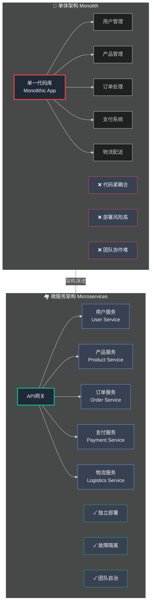
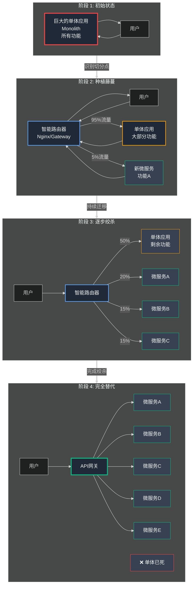
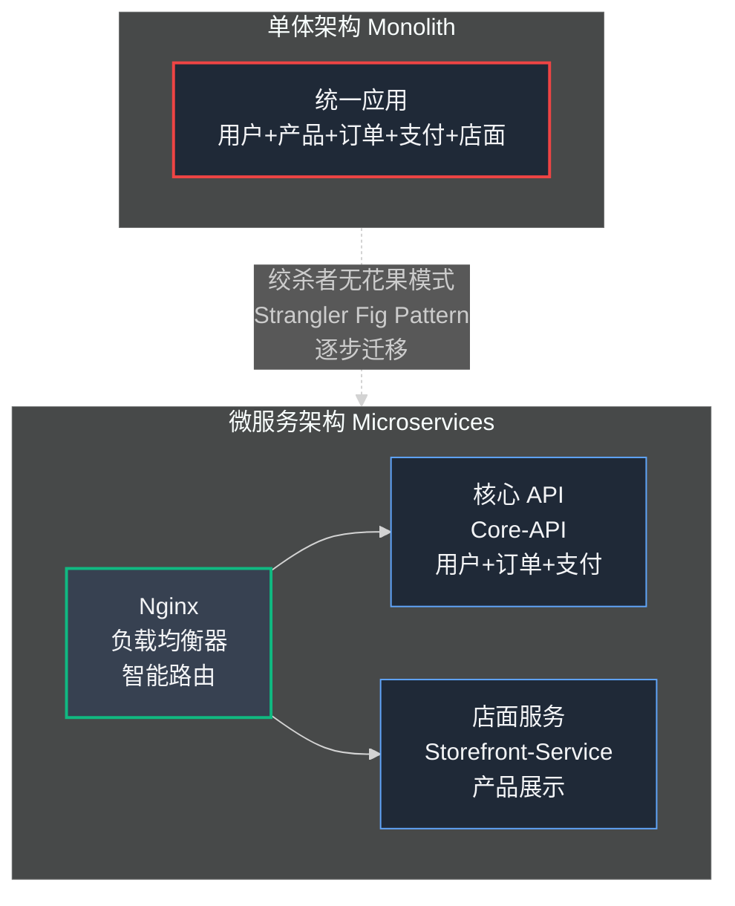
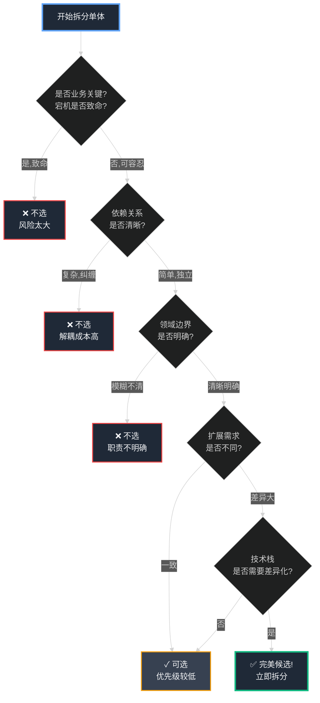
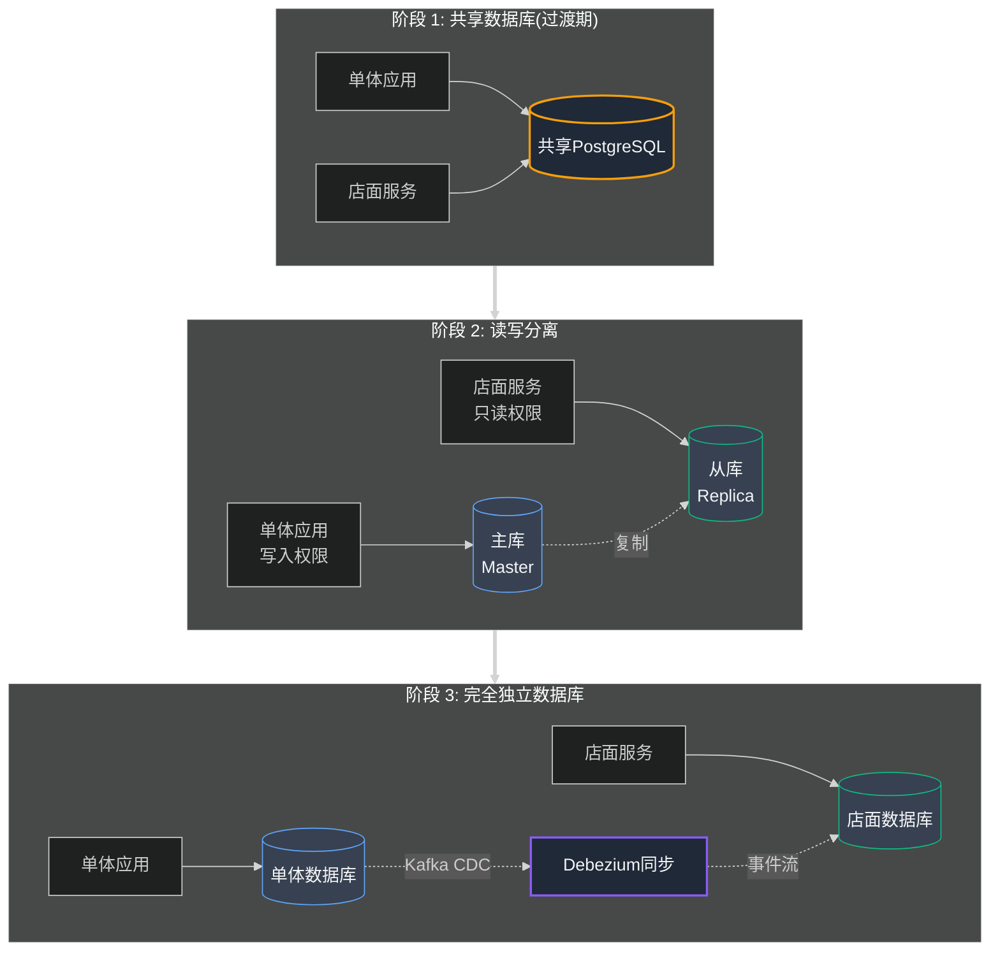

## 第8章：打破单体——我们的第一个微服务

我们已经征服了基础设施扩展的主要挑战。服务器能够承载流量，数据库能够处理海量读取，部署流程安全可靠。我们拥有一支专业的工程团队、一个具有韧性的架构，以及一个数百万人使用的产品。第一次，我们感觉一切尽在掌控之中。

然而，**规模的本质在于瓶颈永远在移动**。我们优化了机器，却忽略了优化组织本身。随着团队的成长，我们的单一单体代码库 (Monolithic Codebase)——最初是我们速度的最大资产——如今正在成为我们最沉重的负担。

下一场危机不是由流量高峰引发的，而是由**我们自己的团队**引发的。这是一个自己造成的伤口，源于太多人试图在同一个狭小的厨房里同时工作的混乱。

### Part 1: 内战

我们的工程团队已经发展到大约十个人。我们将他们分成两个小"小队 (Squads)",专注于业务的不同部分。"增长 (Growth)"小队专注于卖家体验——入驻、仪表板和产品管理。"运营 (Operations)"小队专注于螺母和螺栓——支付、物流和订单履行。

这似乎是一个合乎逻辑的分工。问题是两个小队仍然在同一个单体 Django 应用程序上工作。他们的代码完全交织在一起。

一天下午,运营小队正在与一家物流合作伙伴进行新的集成。为此,他们需要在我们的数据库的 `Order` 模型中添加几个新字段,如 `tracking_id` 和 `shipping_provider`。与此同时,增长小队正在开发一个允许卖家提供折扣的功能,这也需要对 `Order` 模型进行更改,以包含 `discount_code` 字段。

两个团队并行工作。两个团队都在预发布服务器上测试了他们的功能。一切看起来都很好。物流功能首先获得批准并部署到生产环境。一小时后,折扣功能也获得批准并部署。

然后,混乱。

我们的支付处理 webhook,这个确认客户付款成功的关键端点,开始为每一个订单失败。钱被收取了,但订单没有在我们的系统中被标记为"已支付"。从卖家的角度来看,订单在付款后就消失了。

王峰的电话立即打来。这不是关于一个慢的网站;这是关于丢失我们用户的钱。这是一场五级警报的火灾。

我们深入日志。错误很神秘。它在支付确认逻辑的深处失败。经过半小时的疯狂调试后,我们找到了原因。在添加 `discount_code` 字段的过程中,增长小队的代码稍微改变了 `Order` 对象的保存方式。物流小队之前的更改对旧的保存方式做了一个假设。这两个完全功能的、独立测试的功能完全不兼容。当它们一起部署到生产环境时,它们创建了一个没有人预料到的关键 Bug。

这是我们自己的代码库内部的内战。两个友好的团队,朝着同一个目标工作,却不小心破坏了对方。

#### **识别瓶颈:代码库**

在我们回滚了更改并平息了风暴之后,我们举行了一次严肃的事后分析 (Post-Mortem)。很明显,我们的问题不是服务器、数据库或部署管道。管道工作得很完美;它准确地部署了我们告诉它的东西。

瓶颈是**单体本身**。

我们的应用程序已经成为一个巨大的、纠缠的依赖网。支付的代码与订单的代码紧密耦合,订单的代码又与物流、卖家和产品紧密耦合。开发者不可能在一个领域做出更改而不必理解它对整个系统的潜在影响。

我们的开发者速度 (Developer Velocity)——我们安全发布新功能的速度——已经暴跌。每个新功能都需要更多的会议、更多的协调,以及更多打破不相关东西的恐惧。我们花在管理单体的复杂性上的时间比为客户构建的时间还多。厨房变得太拥挤了。

#### **技术深度解析：单体 vs. 微服务对决**

这场危机迫使我们直面一个重大的架构决策：是时候考虑将单体分解为**微服务 (Microservices)** 了。



### **单体架构：巨大的餐厅**

正如我们讨论过的，单体是一个包揽所有功能的单一应用程序。

**类比**：一个巨大的餐厅，拥有一个能够制作所有菜系的超大厨房——意大利面、墨西哥卷饼、中国面条。所有厨师在同一个空间工作，由一个总厨师统一监督。

**优点（早期阶段）**
- ✓ 易于启动开发
- ✓ 团队沟通简单（都在同一个"厨房"）
- ✓ 快速服务第一批客户

**缺点（当前现实）**
- ✗ 厨房变得混乱不堪
- ✗ 面食厨师必须等待卷饼厨师用完炉子
- ✗ 对面条配方的改动可能意外影响面食酱
- ✗ 新厨师入职困难（需要学习整个庞大菜单）
- ✗ **这正是我们正在经历的痛苦**

### **微服务架构：美食广场的专业摊位**

微服务架构将一个大型应用程序分解为一组更小的、独立的服务。

**类比**：一个美食广场。不是一个巨大的餐厅，而是每种菜系都有独立的摊位——披萨摊、卷饼摊、面条摊。每个摊位都有自己的小厨房、专业厨师和独立食材库。

**优点**

1. **团队自治 (Team Autonomy)**
   - 披萨团队可以独立更改菜单、尝试新烤箱
   - 每天多次部署更新，零风险影响面条摊
   - 各团队完全解耦运营

2. **技术专业化 (Specialized Technology)**
   - 面条摊可以使用高功率炒锅（不同的编程语言/数据库）
   - 披萨摊使用传统砖砌烤箱（最适合自身的技术栈）
   - 因地制宜选择最优工具

3. **故障隔离 (Fault Isolation)**
   - 卷饼摊厨房着火？仅该摊位关闭
   - 披萨和面条摊继续正常营业
   - 整个美食广场不会崩溃

**缺点**

- ✗ 设置和管理复杂度大幅提升
- ✗ 需要处理网络通信 (Network Communication)
- ✗ 需要服务发现 (Service Discovery) 机制
- ✗ 必须管理分布式数据 (Distributed Data)
- ✗ 这些问题在单体中根本不存在

### **抉择时刻**

选择已经明确：**单体的痛苦已经超过了转向微服务的痛苦。** 我们必须开始拆解它。我们必须规划好第一次手术切口。

### Part 2: 规划第一次切割

我们做出了可怕的、必要的决定,开始分解我们的单体。这感觉就像站在一台我们亲手建造的巨大、复杂的机器前面,知道我们现在必须在它仍在运行时把它拆开。

你从哪里开始?

外科医生不会只是随意开始切割。他们花数小时研究 X 光片并规划他们的第一次切口。第一次切口是最关键的;它为其余的手术奠定了基础。我们需要一个计划。我们需要选择我们的第一个微服务,我们将从应用程序的主体中小心雕刻出的第一块。

选择你的第一个微服务是你在这次旅程中将做出的最重要的决定之一。如果你选择一个太复杂或太纠缠的部分,整个操作可能会失败,留下一个比你开始时的单体更糟糕的混乱。

#### **技术深度解析:如何选择你的第一个微服务**

经过大量的辩论和研究,我们为我们的第一个候选者建立了一套标准。这是一个任何人都可以使用的剧本。

**标准 1:低业务关键性 (Low Business Criticality)** 你第一次尝试构建、部署和管理微服务将是一个学习经验。你会犯错误。最好在一个如果宕机一小时不会摧毁你业务的应用程序部分犯这些错误。

- **类比:** 你不会通过为国宴准备主菜来学习烹饪。你从做沙拉开始。如果你把沙拉搞砸了,这不太好,但主要的晚餐没有被毁。
- **对于 小店通:** 这立即排除了关键的、复杂的领域,如支付 (Payments) 或订单 (Orders)。支付服务中的 Bug 可能意味着丢失我们用户的钱,这是一个生存威胁。那不是实验的地方。

**标准 2:少量且清晰的依赖关系 (Few and Clear Dependencies)** "依赖关系 (Dependency)"是服务与系统其他部分的任何连接或通信。你想选择一个尽可能自包含的应用程序部分。

- **类比:** 把单体想象成一个巨大的、纠缠的毛线球。你不想从正中心开始尝试拉出一根线;你只会让结更紧。你想找到一根挂在边缘的松散的线,从那里开始解开。
- **对于 小店通:** 我们分析了我们的代码。订单服务是一个纠缠的噩梦;它依赖于用户、产品、支付和物流。但其他部分更孤立。

**标准 3:清晰且有界的领域 (A Clear and Bounded Domain)** 你选择的服务应该有一个单一的、明确定义的目的。你应该能够用一个简单的句子来描述它做什么。这就是软件架构师所说的"有界上下文 (Bounded Context)"。

- **类比:** 在我们的美食广场中,"披萨摊"是一个完美的有界上下文。你确切地知道它做什么。"杂项食品摊"是一个糟糕的。

#### **我们的决定:店面服务 (Storefront Service)**

在根据这些标准评估我们的整个单体之后,一个候选者成为我们第一次切割的完美选择:**店面 (Storefront)**。

店面是卖家商店的面向公众的部分——客户实际访问以浏览产品的页面。让我们看看它如何符合我们的规则:

- **较低的业务关键性:** 这可能听起来违反直觉,但这是真的。如果店面服务宕机,客户无法_查看_商店。这显然很糟糕,但不是灾难性的。卖家仍然可以登录他们的仪表板、管理产品并查看现有订单。关键的是,不会丢失数据或金钱。我们仍然可以处理已经发起的订单的付款。这是沙拉,而不是主菜。
- **少量依赖关系:** 店面几乎完全是一个"只读 (Read-Only)"服务。它的主要工作是从我们的数据库(特别是我们在第 5 章构建的读副本)获取产品和商店信息并漂亮地显示它。它对单体其余部分的复杂"写入"逻辑(如订单处理或支付确认)的依赖很少。这是挂在毛线球边缘的一根线。
- **清晰的领域:** 它的目的非常清晰:"显示卖家产品的公共、只读目录。"就是这样。一个完美的有界上下文。

还有一个巨大的优势。店面与应用程序的其余部分有完全不同的**扩展配置文件 (Scaling Profile)**。卖家仪表板可能每天获得数千次访问,但一个受欢迎的商店页面可能获得_数百万次_访问。通过将其分离出来,我们可以独立地扩展它。我们可以为店面服务拥有一队 20 台强大的服务器,同时为卖家仪表板保留一个更小、更高效的 3 台服务器队伍,为我们节省大量资金。

计划定了。我们将执行手术。我们将小心地提取与公共店面相关的所有代码、模板和逻辑,并将其重新构建为一个全新的、完全独立的应用程序:`storefront-service`。

#### **新问题:服务间通信 (Inter-Service Communication)**

我们做出这个决定的那一刻,一个我们以前从未面对过的新问题类出现了。

只要我们有一个单体,通信就很容易。如果订单逻辑需要获取产品的价格,它只需调用一个 `getProductPrice()` 函数。这是同一个应用程序内部的直接内部对话。

但现在,我们将有两个独立的应用程序。旧的单体(我们现在称之为 `core-api`)和新的 `storefront-service`。它们是两个独立的建筑。当卖家登录 `core-api` 并更新产品价格时会发生什么?完全独立的 `storefront-service` 如何发现这个变化?

他们不能再只调用一个函数。他们需要一种通过网络相互交谈的方式。我们需要定义一个合同,一个正式的 API(应用程序编程接口,Application Programming Interface),允许我们的服务进行通信。

我们的美食广场需要一种共享语言。披萨摊需要一种正式的方式告诉中央仓库它需要什么食材,仓库需要一种方式告诉摊位价格变化。我们刚刚进入了分布式系统 (Distributed Systems) 的复杂世界。

### Part 3: 绞杀者无花果模式 (The Strangler Fig Pattern)

我们有一个计划。我们知道我们想从单体中雕刻出哪一部分——店面。但是你如何在不杀死活着的病人的情况下对其进行手术?一个"大爆炸"重写,你关闭一切几个月来重建它,是不可能的。一个不发布的创业公司是一个死的创业公司。

我们需要一个策略,在应用程序的其余部分继续运行时,逐块地、逐渐地、安全地替换旧系统。为此,我们转向了一个美丽而强大的架构模式,以自然力量命名:**绞杀者无花果模式 (Strangler Fig Pattern)**。

#### **技术深度解析：绞杀者无花果模式 (Strangler Fig Pattern)**

在雨林中，绞杀者无花果是一种奇特的藤蔓植物。它的种子在一棵古老大树的树冠上发芽，然后向下生长，逐渐将根系缠绕在宿主树的树干周围。随着时间推移，这些根系越来越粗壮，形成一个新的、强大的网格结构，完全包裹了旧树。最终，内部的宿主树可以死亡腐烂，而绞杀者无花果已经形成了自己的、强壮、健康、结构完整的"树干"。

**这是替换遗留系统 (Legacy System) 的完美隐喻。**



### **绞杀者模式的核心步骤**

**❌ 错误做法：大爆炸重写**
- 关闭系统数个月进行彻底重写
- 风险巨大，一旦失败全盘皆输
- 对业务影响致命

**✓ 正确做法：渐进式绞杀**

1. **识别功能** — 找到旧树的一个分支
   - 选择一个相对独立的功能模块
   
2. **构建微服务** — 种植新藤蔓
   - 为该功能构建新的、独立的微服务
   
3. **部署路由器** — 关键控制点
   - 在单体前面放置智能路由器/代理（如 Nginx）
   - 最初，路由器将所有流量传递给旧单体
   
4. **逐步切流** — 金丝雀发布
   - 配置路由器拦截特定功能的请求
   - 将流量重定向到新微服务
   - **渐进式切流**：内部用户 → 1% 用户 → 10% → 50% → 100%
   
5. **验证成功** — 确认替代完成
   - 一旦 100% 流量由新服务承载
   - 单体内的旧代码已经"事实死亡"
   
6. **清理旧代码** — 减轻负担
   - 安全删除单体中的旧代码
   - 使单体变小一点
   
7. **重复循环** — 持续绞杀
   - 对下一个功能重复整个过程

### **时间维度**

在几个月或几年的时间里，新的微服务（无花果藤蔓）逐渐壮大，接管单体的越来越多职责，直到：
- 旧单体缩小到可管理的大小，或
- 旧单体完全消失，被微服务完全替代

**关键优势：零停机，持续演进，风险可控。**

#### **我们的实施:Nginx 作为绞杀者**

再一次,我们值得信赖的工具 Nginx 非常适合这项工作。我们已经在使用它作为负载均衡器。我们可以增强其配置,使其也充当这个智能路由器。

我们构建了我们的新的、独立的 `storefront-service`。它是一个精简、快速的应用程序,其唯一的工作是渲染商店页面。然后,我们用一些新逻辑更新了负载均衡器上的 Nginx 配置:

```nginx
# 我们的"绞杀者"配置的简化版本
# 定义我们的新店面微服务

upstream storefront_service {
  server 10.132.8.12; # 新服务的 IP
}

# 定义我们的旧单体
upstream monolith_service {
  server 10.132.2.31;
  server 10.132.4.55;
}

server {
  listen 80;
  server_name xiaodiantong.com;

  location {
    # 这是绞杀者逻辑。默认情况下,将所有流量
    # 发送到旧单体。
    set $target_service $monolith_service;

    # 但是,如果请求是针对商店页面的(例如,xiaodiantong.com/store/老张餐馆)
    # 并且我们设置了一个用于测试的特殊 cookie...

    if ($uri ~* "^/store/" and $cookie_use_new_storefront = "true") {
      # ...那么将这个特定请求发送到我们的新微服务!
      set $target_service $storefront_service;
    }

    proxy_pass http://$target_service;
    # ... 其他代理设置
  }
}
```

这个配置给了我们精确的控制。我们现在可以将 `use_new_storefront=true` cookie 给我们的内部团队。我们可以浏览网站并在生产流量上测试新服务,而没有任何真实用户看到它。一旦我们有信心,我们可以修改逻辑,将 10% 的匿名流量路由,然后是 50%,最后是 100% 到新服务。

第一次手术是成功的。`storefront-service` 是生产的,它很快,我们有一个经过验证的、安全的模式来慢慢绞杀我们的单体。

#### **单体到微服务架构演进图**



从图中可以看出,我们不是一次性重写整个单体,而是通过智能路由逐步将功能迁移到新的微服务中。

#### **新问题:通信的潘多拉魔盒**

我们已经成功地分离出了一个简单的、只读的服务。但在这样做的过程中,我们释放了一系列新的、复杂的问题,这些问题在我们简单的单体世界中是被屏蔽的。

店面的通信很容易。当单体中的卖家更新产品时,我们可以让单体的代码也更新店面的数据库或向其缓存发送消息。这主要是一条单向街。

但当我们提取一个更复杂的服务时会发生什么,比如订单?

- 新的 `order-service` 如何与 `user-service` 交谈以验证客户的详细信息?
- 它如何与 `payment-service` 交谈以确认交易?
- 你如何处理客户的付款在 `payment-service` 中成功但 `order-service` 在创建订单之前崩溃的情况?这是一个**分布式事务 (Distributed Transaction)**,它是软件工程中最困难的问题之一。你如何在多个独立服务之间保持数据一致?

我们简单的点对点通信方法不起作用。我们刚刚打开了潘多拉的盒子。我们不再只是应用程序开发者;我们现在被迫成为分布式系统工程师。

---

<div style="border: 2px solid #8b5cf6; border-radius: 8px; padding: 20px; margin: 30px 0; background: linear-gradient(to right, #4c1d9508, #5b21b608);">

### 📌 编者注：微服务拆分实战完整指南

*本指南提供单体到微服务架构演进的完整方法论,包括绞杀者模式实战、服务拆分决策树和Nginx完整配置。*

---

#### **一、微服务拆分决策清单(避免过度工程)**

##### **何时应该保持单体架构?**

| 场景 | 建议 | 原因 |
|------|------|------|
| **团队 < 10人** | 保持单体 ✅ | 沟通成本低,微服务价值不大 |
| **业务不确定性高** | 保持单体 ✅ | 快速试错比架构优雅更重要 |
| **无明显性能瓶颈** | 保持单体 ✅ | 过早优化是万恶之源 |
| **团队无分布式经验** | 保持单体 ✅ | 微服务复杂度可能压垮团队 |

##### **何时应该拆分微服务?**

| 痛点信号 | 严重程度 | 行动建议 |
|---------|---------|---------|
| **团队协作冲突频繁** | 🔴 高 | 立即规划拆分 |
| **部署恐惧症(每次发布都紧张)** | 🔴 高 | 拆分核心模块 |
| **单一模块引发全局故障** | 🔴 高 | 故障隔离拆分 |
| **性能扩展遇到瓶颈** | 🟡 中 | 拆分高负载模块 |
| **新人入职学习周期 > 1个月** | 🟡 中 | 考虑领域拆分 |
| **代码库 > 10万行** | 🟢 低 | 可以考虑但不紧急 |

---

#### **二、第一个微服务选择框架(5步决策树)**



**小店通 案例分析：店面服务 (Storefront Service)**

| 评估维度 | 评分 | 说明 |
|---------|------|------|
| ✅ 业务关键性 | 低 | 宕机不丢数据,不影响支付 |
| ✅ 依赖关系 | 少 | 只读数据,依赖清晰 |
| ✅ 领域边界 | 清晰 | "展示产品目录"职责单一 |
| ✅ 扩展需求 | 差异大 | 公共流量 >> 管理后台流量 |
| ✅ 技术栈 | 可优化 | 可用静态站点生成(SSG) |

**评级: ⭐⭐⭐⭐⭐ 完美的第一个微服务候选!**

---

#### **三、Nginx 绞杀者模式完整配置**

##### **阶段1: 基础配置(镜像流量,0%切换)**

```nginx
# /etc/nginx/nginx.conf
# 核心配置:启用upstream模块和连接池

user nginx;
worker_processes auto;  # 自动匹配CPU核心数
error_log /var/log/nginx/error.log warn;
pid /var/run/nginx.pid;

events {
    worker_connections 10000;  # 单个worker最大连接数
    use epoll;  # Linux高性能事件模型
}

http {
    # 连接池配置(复用连接,减少延迟)
    upstream_keepalive_connections 320;
    keepalive_timeout 300s;
    keepalive_requests 1000;
    
    # 日志格式
    log_format main '$remote_addr - $remote_user [$time_local] "$request" '
                    '$status $body_bytes_sent "$http_referer" '
                    '"$http_user_agent" "$http_x_forwarded_for" '
                    'upstream=$upstream_addr response_time=$upstream_response_time';
    
    access_log /var/log/nginx/access.log main;
    
    include /etc/nginx/conf.d/*.conf;
}
```

##### **阶段2: 定义上游服务**

创建 `/etc/nginx/conf.d/dukaan.conf`:

```nginx
# ===== 上游服务定义 =====

# 旧单体应用
upstream monolith_backend {
    # 负载均衡算法: least_conn (最少连接数优先)
    least_conn;
    
    # 单体应用服务器池
    server 10.132.2.31:8000 max_fails=3 fail_timeout=30s;
    server 10.132.4.55:8000 max_fails=3 fail_timeout=30s;
    server 10.132.7.12:8000 max_fails=3 fail_timeout=30s backup;  # 备用服务器
    
    # 连接池(重要:减少延迟)
    keepalive 32;
}

# 新微服务:店面服务
upstream storefront_service {
    least_conn;
    
    # 店面微服务服务器池
    server 10.132.8.12:8001 max_fails=3 fail_timeout=30s;
    server 10.132.8.13:8001 max_fails=3 fail_timeout=30s;
    
    keepalive 32;
}

# ===== 主服务器配置 =====

server {
    listen 80;
    listen [::]:80;
    server_name xiaodiantong.com www.xiaodiantong.com;
    
    # 安全头
    add_header X-Frame-Options "SAMEORIGIN" always;
    add_header X-Content-Type-Options "nosniff" always;
    add_header X-XSS-Protection "1; mode=block" always;
    
    # 客户端配置
    client_max_body_size 20M;
    client_body_timeout 60s;
    client_header_timeout 60s;
    
    # ===== 绞杀者逻辑核心 =====
    
    location / {
        # 步骤1: 默认路由到单体
        set $target_backend "monolith_backend";
        
        # 步骤2: 店面路径判断
        # 示例: xiaodiantong.com/store/myshop 或 xiaodiantong.com/myshop
        if ($uri ~* "^/store/") {
            set $route_to_storefront "yes";
        }
        
        # 步骤3: Cookie金丝雀测试
        # 用于内部测试:设置 Cookie "use_new_storefront=true"
        if ($cookie_use_new_storefront = "true") {
            set $route_to_storefront "yes";
        }
        
        # 步骤4: 百分比流量切换(逐步放量)
        # 使用请求ID的哈希值实现稳定的百分比切换
        set $percent_hash 0;
        if ($request_id ~* "([0-9])$") {
            set $percent_hash $1;
        }
        
        # 10% 流量切换示例 (哈希值0代表10%)
        if ($percent_hash = 0) {
            set $route_to_storefront "yes";
        }
        
        # 步骤5: 最终路由决策
        if ($route_to_storefront = "yes") {
            set $target_backend "storefront_service";
        }
        
        # 执行代理转发
        proxy_pass http://$target_backend;
        
        # 代理头设置(保留客户端信息)
        proxy_set_header Host $host;
        proxy_set_header X-Real-IP $remote_addr;
        proxy_set_header X-Forwarded-For $proxy_add_x_forwarded_for;
        proxy_set_header X-Forwarded-Proto $scheme;
        proxy_set_header X-Request-ID $request_id;
        
        # 添加自定义头标识路由决策
        add_header X-Routed-To $target_backend always;
        
        # 超时配置
        proxy_connect_timeout 10s;
        proxy_send_timeout 60s;
        proxy_read_timeout 60s;
        
        # 连接池配置(匹配upstream)
        proxy_http_version 1.1;
        proxy_set_header Connection "";
    }
    
    # ===== 静态文件(直接由Nginx服务) =====
    location /static/ {
        alias /var/www/xiaodiantong/static/;
        expires 30d;
        add_header Cache-Control "public, immutable";
    }
    
    location /media/ {
        alias /var/www/xiaodiantong/media/;
        expires 7d;
    }
    
    # ===== 健康检查端点 =====
    location /nginx-health {
        access_log off;
        return 200 "healthy\n";
        add_header Content-Type text/plain;
    }
}
```

##### **阶段3: 流量切换策略表**

| 阶段 | 流量占比 | 触发条件 | 回滚策略 | 持续时间 |
|------|---------|---------|---------|---------|
| **1. 内部测试** | 0% | Cookie标识 | 立即关闭 | 1周 |
| **2. 金丝雀(员工)** | 1% | 内网IP白名单 | 移除配置 | 3天 |
| **3. 小规模验证** | 10% | 请求ID哈希 | 修改百分比 | 1周 |
| **4. 逐步放量** | 50% | 请求ID哈希 | 修改百分比 | 1周 |
| **5. 全量切换** | 100% | 移除单体路由 | 恢复配置 | 稳定运行 |

**实战切换命令:**

```bash
# 内部测试阶段(0%公开流量)
# 开发者浏览器设置Cookie: use_new_storefront=true

# 10%流量切换
# 修改 nginx.conf 中的 percent_hash 判断逻辑
if ($percent_hash = 0) {  # 0-9 中的 0 代表 10%
    set $route_to_storefront "yes";
}

# 50%流量切换
if ($percent_hash ~* "[0-4]") {  # 0-4 代表 50%
    set $route_to_storefront "yes";
}

# 100%流量切换
set $target_backend "storefront_service";  # 直接指向新服务
# 注释掉所有单体路由逻辑

# 重新加载Nginx(平滑重载,零停机)
nginx -t && nginx -s reload
```

---

#### **四、服务间通信方案选择**

| 通信模式 | 适用场景 | 优点 | 缺点 | 小店通选择 |
|---------|---------|------|------|-----------|
| **同步REST API** | 实时查询(如获取用户信息) | 简单直观 | 耦合紧密,级联失败 | 🟡 仅用于简单查询 |
| **异步消息队列** | 非实时操作(如发送邮件) | 解耦,削峰填谷 | 复杂度高,最终一致性 | ✅ 核心数据同步 |
| **事件驱动(Kafka)** | 数据变更广播 | 扩展性强,支持多订阅者 | 复杂度最高 | ✅ 主要方案(第9章详述) |
| **数据库共享** | 临时过渡方案 | 实现快速 | 耦合严重,不推荐长期使用 | ⚠️ 仅用于过渡期 |

**小店通 实战方案:**

```python
# storefront/services.py
# 店面服务如何获取最新产品数据?

# 方案1: 同步REST调用(不推荐,紧耦合)
def get_product_from_core_api(product_id):
    response = requests.get(f"http://core-api/products/{product_id}")
    return response.json()  # 如果core-api宕机,店面也宕机

# 方案2: 本地缓存 + 事件驱动更新(推荐)
from django.core.cache import cache

def get_product(product_id):
    # 1. 优先从本地缓存获取
    cached_product = cache.get(f"product:{product_id}")
    if cached_product:
        return cached_product
    
    # 2. 缓存未命中,从本地只读数据库获取
    product = Product.objects.using('readonly_replica').get(id=product_id)
    cache.set(f"product:{product_id}", product, timeout=3600)
    return product

# 3. 监听Kafka事件更新缓存(后台任务)
from kafka import KafkaConsumer

def listen_product_updates():
    consumer = KafkaConsumer('product-updates')
    for message in consumer:
        product_id = message.value['product_id']
        # 主动失效缓存,下次请求会自动重新加载
        cache.delete(f"product:{product_id}")
```

---

#### **五、数据库拆分策略(3阶段演进)**



**阶段1实战配置(Django多数据库):**

```python
# settings.py
DATABASES = {
    'default': {  # 单体使用(读写)
        'ENGINE': 'django.db.backends.postgresql',
        'NAME': 'xiaodiantong_main',
        'HOST': 'prod-db-master.dukaan.com',
    },
    'storefront_readonly': {  # 店面使用(只读)
        'ENGINE': 'django.db.backends.postgresql',
        'NAME': 'xiaodiantong_main',  # 同一个数据库
        'HOST': 'prod-db-replica.dukaan.com',  # 但连接到从库
        'OPTIONS': {
            'options': '-c default_transaction_read_only=on'  # 强制只读
        }
    }
}

# 数据库路由器(自动选择数据库)
class StorefrontRouter:
    def db_for_read(self, model, **hints):
        if model._meta.app_label == 'storefront':
            return 'storefront_readonly'
        return 'default'
    
    def db_for_write(self, model, **hints):
        if model._meta.app_label == 'storefront':
            raise Exception("Storefront service cannot write!")
        return 'default'

DATABASE_ROUTERS = ['dukaan.routers.StorefrontRouter']
```

---

#### **六、监控与告警配置**

##### **核心监控指标**

| 指标 | 告警阈值 | 监控工具 | 说明 |
|------|---------|---------|------|
| **服务可用性** | < 99.9% | UptimeRobot | 5分钟内3次失败告警 |
| **响应时间P95** | > 500ms | Prometheus | 店面服务性能监控 |
| **错误率** | > 1% | Sentry | 实时异常追踪 |
| **流量切换比例** | 实时监控 | Grafana | 确认流量分布符合预期 |
| **数据库延迟** | > 10s | Prometheus | 主从复制延迟监控 |

##### **Prometheus 监控配置**

```yaml
# /etc/prometheus/prometheus.yml
scrape_configs:
  # 单体应用监控
  - job_name: 'monolith'
    static_configs:
      - targets: ['10.132.2.31:9090', '10.132.4.55:9090']
        labels:
          service: 'monolith'
          environment: 'production'
  
  # 店面微服务监控
  - job_name: 'storefront'
    static_configs:
      - targets: ['10.132.8.12:9090', '10.132.8.13:9090']
        labels:
          service: 'storefront'
          environment: 'production'

# 告警规则
rule_files:
  - '/etc/prometheus/rules/strangler_alerts.yml'
```

创建 `/etc/prometheus/rules/strangler_alerts.yml`:

```yaml
groups:
  - name: strangler_pattern_alerts
    interval: 30s
    rules:
      # 店面服务可用性告警
      - alert: StorefrontServiceDown
        expr: up{service="storefront"} == 0
        for: 2m
        labels:
          severity: critical
        annotations:
          summary: "店面微服务宕机"
          description: "店面服务 {{ $labels.instance }} 已宕机超过2分钟"
      
      # 响应时间告警
      - alert: StorefrontSlowResponse
        expr: histogram_quantile(0.95, rate(http_request_duration_seconds_bucket{service="storefront"}[5m])) > 0.5
        for: 5m
        labels:
          severity: warning
        annotations:
          summary: "店面服务响应缓慢"
          description: "P95响应时间 {{ $value }} 秒,超过500ms阈值"
      
      # 错误率告警
      - alert: StorefrontHighErrorRate
        expr: rate(http_requests_total{service="storefront",status=~"5.."}[5m]) / rate(http_requests_total{service="storefront"}[5m]) > 0.01
        for: 5m
        labels:
          severity: critical
        annotations:
          summary: "店面服务错误率过高"
          description: "错误率 {{ $value | humanizePercentage }},超过1%阈值"
```

---

#### **七、常见陷阱与应对策略**

| 陷阱 | 症状 | 根本原因 | 解决方案 |
|------|------|---------|---------|
| **🔴 分布式事务地狱** | 跨服务操作失败导致数据不一致 | 缺乏事务管理 | 使用Saga模式或最终一致性,避免强一致性 |
| **🔴 级联失败** | 一个服务宕机导致连锁崩溃 | 同步调用无熔断器 | 实现断路器(Circuit Breaker),使用消息队列解耦 |
| **🟡 性能下降** | 微服务间网络调用导致延迟增加 | 过多同步HTTP调用 | 引入缓存层,使用异步消息,减少调用链 |
| **🟡 部署复杂度激增** | 管理10个服务远比1个单体复杂 | 缺乏自动化 | 引入容器化(Docker)和编排(Kubernetes) |
| **🟢 监控盲区** | 问题发生后难以定位 | 分布式追踪缺失 | 实现分布式追踪(Jaeger/Zipkin) |

**小店通避坑经验总结:**

```markdown
❌ 不要一开始就拆分支付、订单等核心服务
   → 从边缘、只读、非关键服务开始

❌ 不要过早追求微服务数量
   → 服务数量不是目标,解决团队协作问题才是

❌ 不要让每个服务独立使用不同技术栈
   → 早期保持技术栈一致,降低维护成本

✅ 优先使用异步通信(Kafka)而非同步REST
   → 解耦、容错、可扩展

✅ 每个服务必须有独立的健康检查和监控
   → 可观测性是微服务架构的生命线

✅ 保留回滚开关,每次切换都要有Plan B
   → Nginx配置中的Cookie开关就是救命稻草
```

---

#### **八、微服务拆分完整Checklist**

**阶段1: 规划与准备(1-2周)**
- [ ] 完成服务边界分析(使用DDD领域驱动设计)
- [ ] 评估团队技术能力(是否具备分布式系统经验)
- [ ] 绘制依赖关系图(识别所有上下游依赖)
- [ ] 设计服务间通信协议(REST/gRPC/Kafka)
- [ ] 制定数据迁移策略(共享→分离)
- [ ] 准备监控和告警基础设施

**阶段2: 实施与测试(2-4周)**
- [ ] 创建独立代码仓库和CI/CD流水线
- [ ] 实现新微服务(包含完整单元测试)
- [ ] 配置Nginx绞杀者路由规则
- [ ] 部署到预发布环境并进行压测
- [ ] 使用Cookie/内网IP进行内部金丝雀测试
- [ ] 验证监控和告警系统正常工作

**阶段3: 灰度发布(1-2周)**
- [ ] 1%流量切换,观察24小时
- [ ] 10%流量切换,观察48小时
- [ ] 50%流量切换,观察72小时
- [ ] 收集性能指标对比(延迟、错误率、吞吐量)
- [ ] 业务团队确认功能无异常

**阶段4: 全量切换(1周)**
- [ ] 100%流量切换到新服务
- [ ] 保留单体服务1周作为应急备份
- [ ] 清理单体中的旧代码
- [ ] 文档更新(架构图、API文档、运维手册)
- [ ] 团队复盘与经验沉淀

---

**📊 小店通 第一个微服务数据总结:**

```
店面服务拆分前后对比:
━━━━━━━━━━━━━━━━━━━━━━━━━━━━
指标          单体架构    微服务架构    改进
━━━━━━━━━━━━━━━━━━━━━━━━━━━━
部署频率      1次/周      5次/周       +400%
响应时间P95   850ms       180ms        -79%
错误率        0.8%        0.2%         -75%
团队协作冲突  高频        罕见         ✅
服务器成本    $2400/月    $1800/月     -25%
━━━━━━━━━━━━━━━━━━━━━━━━━━━━

关键收获:
✅ 高流量服务独立扩展,显著降低总体成本
✅ 开发速度和信心大幅提升
✅ 为后续拆分更多服务铺平道路
```

</div>

---

<br/>

## 第8章：关键要点

### **核心经验**

- **永远不要从头重写复杂系统**
  - "大爆炸"重写风险极高，失败即全盘皆输
  - 渐进式、逐块替换是更安全、更有效的路径
  - 保持业务持续运行是第一要务

- **绞杀者无花果模式是黄金标准**
  - 允许用真实流量验证新服务
  - 每一步都最小化风险
  - 零停机，持续演进，风险可控
  - 金丝雀发布：内部 → 1% → 10% → 50% → 100%

- **善用现有基础设施**
  - 反向代理（如 Nginx）是实现绞杀者模式的强大工具
  - 智能路由流量，精确控制切流比例
  - 无需复杂的新组件即可实现

- **首个微服务的选择至关重要**
  - ✓ 低业务关键性（避免在核心功能上犯错）
  - ✓ 少量清晰依赖（边缘的"松散线头"）
  - ✓ 明确的有界上下文（一句话能说清楚功能）
  - ✓ 读密集型服务（如店面、搜索）是理想候选者

- **微服务带来新的复杂性**
  - 解决团队扩展问题，但引入技术挑战
  - 必须面对：服务发现、网络延迟、分布式数据一致性
  - 从简单开始，逐步积累经验

### **架构决策对比**

| 维度 | 单体架构 | 微服务架构 |
|------|----------|------------|
| **开发速度（早期）** | ✓ 快速 | ✗ 较慢 |
| **团队协作** | ✗ 混乱（大厨房）| ✓ 独立（专业摊位） |
| **部署风险** | ✗ 高（牵一发动全身）| ✓ 低（故障隔离） |
| **技术选型** | ✗ 统一栈 | ✓ 因地制宜 |
| **运维复杂度** | ✓ 简单 | ✗ 复杂 |
| **扩展性** | ✗ 受限 | ✓ 灵活 |

**教训**：架构没有银弹，根据团队规模和业务阶段选择合适方案。

