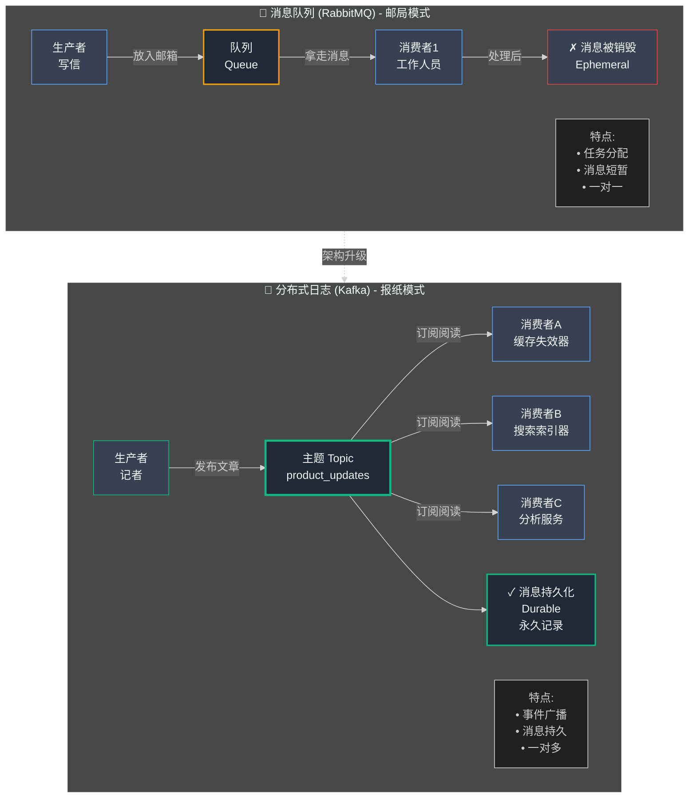
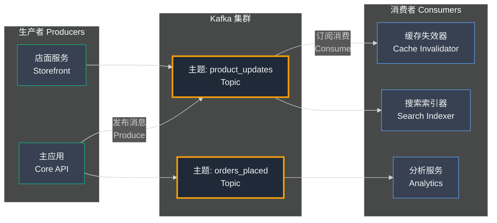
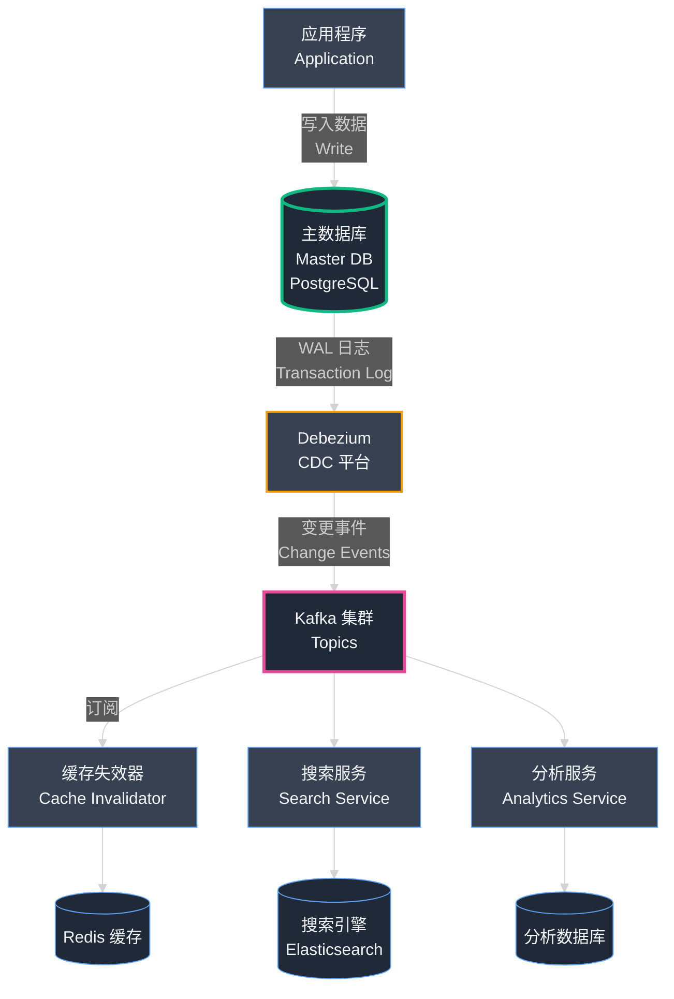

## 第9章：不可破坏的承诺——使用 Kafka 实现数据一致性

我们做到了！第一次成功的"手术"完成。我们新的、独立的 `storefront-service` 已经上线，运行快速且扩展优雅。绞杀者无花果模式为我们提供了一个安全的、可重复的未来流程。那一刻，我们似乎已经解锁了管理不断增长的复杂性的秘密。

然而，**在分布式系统的世界里，解决一个问题往往会揭示更深层次、更根本的问题潜伏在下面。**

我们的服务现在是独立的实体，生活在不同的"建筑"中。我们在它们之间建立的简单"电话线"——那个聪明但脆弱的缓存失效系统——即将在第一个真正的压力下崩溃。这向我们展示了一个残酷的真相：**通信不仅仅是一个功能，而是微服务架构的生死基础。**

### Part 1: 不稳定的监听器

与我们的第一个微服务一起生活很好。店面团队可以部署更改而不必担心破坏支付系统,核心 API 团队很高兴让大量的店面流量由独立的服务器队伍处理。分离正在起作用。

将我们的数据一致性维系在一起的关键是我们在第 7 章构建的小型独立 Python 脚本:"缓存失效器 (Cache Invalidator)"。这个单一脚本连接到我们的主数据库,不断 `LISTEN` `NOTIFY` 消息。当产品价格更改时,它会听到消息并忠实地从 Redis 删除正确的条目。

几周以来,它工作得完美无缺。但随后,故障开始了。

一天下午,一位卖家打电话给支持,很沮丧。"我过去一个小时一直在尝试进行闪购!我一直在改变我主要产品的价格,但我的客户都看到旧价格。我正在失去所有的势头!"

我们跳进服务器日志。我们检查了缓存失效器脚本。它崩溃了。脚本和数据库之间的临时网络故障导致连接断开,脚本没有自动恢复。它已经默默地死了一个多小时。在此期间,我们的卖家所做的每一次产品更新都未能使缓存失效。我们的商店充满了陈旧数据。

我们重新启动了脚本,问题就解决了,但损害已经造成。我们有一个**单点故障 (Single Point of Failure)**。

#### **识别问题:建立在祈祷之上的系统**

这个事件暴露了我们事件驱动系统 (Event-Driven System) 的根本弱点。`LISTEN`/`NOTIFY` 机制是 Postgres 的一个巧妙功能,但它不是一个健壮的、生产级的消息系统。

- **它很脆弱:** 正如我们发现的,如果我们的监听器服务崩溃或断开连接,在该停机时间期间数据库发送的任何消息都永远丢失了。没有持久性 (Persistence)。数据库只是向虚空喊出消息;如果没有人在听,消息就会消失。
- **它不能扩展:** 该系统是为一对一通信设计的。但如果我们需要更多服务对产品更新做出反应怎么办?如果一个新的 `search-service` 也需要知道产品的详细信息何时更改,以便它可以更新其搜索索引怎么办?我们必须构建另一个独立的监听器脚本,增加更多的复杂性和另一个故障点。
- **它缺乏洞察力:** 我们无法知道消息是否已成功处理。监听器收到了吗?它成功删除了 Redis 键吗?我们在盲目飞行。

我们的系统建立在一个脆弱的脚本将永远保持在线的希望之上。这不是工程;这是祈祷。

我们意识到我们需要用一个成熟的、工业强度的邮政服务取代我们简单的电话线。我们需要一个可以保证消息传递、允许多个接收者并保留每个已发送消息的记录的系统。我们需要一个真正的**消息总线 (Message Bus)**。

### Part 2: 邮政服务 vs. 报纸

我们知道我们需要一个消息总线,一种从一个服务向另一个服务发送信息的可靠方式。但当我们开始研究时,我们意识到构建这样一个系统有两种根本不同的哲学:传统的**消息队列 (Message Queue)** 和更现代的**分布式日志 (Distributed Log)**。

在它们之间选择是一个关键的决定,将塑造我们整个架构的未来。

#### **技术深度解析：消息队列 vs. 分布式日志**

这是现代系统设计中的一个**关键决策点**，让我们深入剖析两种截然不同的哲学。



### **1. 消息队列（如 RabbitMQ）：邮局模式**

传统的消息队列就像邮局或共享的待办事项列表。

**工作原理**
- **生产者 (Producer)**：写一封信（"使店铺 456 的缓存失效"），放入特定邮箱（队列）
- **消费者 (Consumer)**：专门的工作人员，从邮箱拿信
- **处理流程**：拿起信 → 执行任务 → **扔掉信**
- **关键特征**：消息是**短暂的 (Ephemeral)**，被消费后永久消失

**适用场景**
- ✓ 任务分配（一个任务必须由一个工作者完成）
- ✓ 点对点通信
- ✗ 需要多个服务处理同一事件

### **2. 分布式日志（如 Apache Kafka）：报纸模式**

Kafka 基于完全不同的原则——它是一个报纸出版商，而非邮局。

**工作原理**
- **生产者（记者）**：写文章"店铺 456 价格变更"
- **发布位置**：报纸的特定版面（Kafka 的 **Topic 主题**），如 `product_updates`
- **多个订阅者**：
  - 缓存失效器服务：订阅 `product_updates`，清除缓存
  - 搜索索引器服务：订阅同一 Topic，更新搜索索引
  - 分析服务：订阅同一 Topic，跟踪定价趋势
- **关键特征**：文章被阅读后**不会删除**，报纸是**持久的、永久的记录**

**适用场景**
- ✓ 一对多通信（多个服务需要处理同一事件）
- ✓ 事件溯源（保留完整历史）
- ✓ 容错恢复（服务崩溃后可从断点继续）

### **灵光一现的时刻**

我们的需求不仅仅是告诉一个服务使缓存失效。我们看到了未来：**系统的多个部分需要对同一事件作出反应。**

**场景：下单事件**
1. 配送服务：准备履行订单
2. 通知服务：向客户发送确认邮件
3. 分析服务：更新每日销售数据
4. 库存服务：减少商品库存

报纸（Kafka）模型完美适配这种一对多模式。它的**持久性 (Durability)** 赋予了我们渴望的可靠性：

- 如果缓存失效器崩溃，`product_updates` 消息安全地保留在 Kafka 中
- 服务恢复后，从断点继续阅读，**不会错过任何更新**
- 新服务上线？直接订阅 Topic，获取历史事件

**我们找到了答案：用 Apache Kafka 构建 小店通 的中枢神经系统。**

#### **技术深度解析:Kafka 作为 小店通 的中枢神经系统**

我们撕掉了脆弱的 `LISTEN`/`NOTIFY` 系统并开始集成 Kafka。为此,我们必须了解其核心组件。

- **生产者 (Producers):** 生产者是向 Kafka 主题写入数据的任何应用程序。对我们来说,主要生产者是我们的主单体。当卖家更新产品时,单体现在也会向 Kafka 生成一条小的、结构化的消息。
- **主题 (Topics):** 主题是发布消息的命名类别或源。我们从一个开始,`product_updates`,但很快意识到我们可以为系统中的每个重要事件创建主题:`orders_placed`、`new_users_registered`、`shipments_updated` 等。这些主题成为我们业务的官方记录历史。
- **消费者 (Consumers):** 消费者是订阅一个或多个主题并处理消息的任何应用程序。我们新的、改进的缓存失效器服务是我们的第一个消费者。它订阅了 `product_updates` 主题。Kafka 的一个关键功能是**消费者组 (Consumer Group)**,它允许你拥有一个服务的多个实例(如两个缓存失效器脚本)并行从主题读取,以实现可扩展性和容错性。
- **代理 (Brokers):** 代理是单个 Kafka 服务器。Kafka 集群 (Cluster) 由多个代理一起工作组成。这就是它如此有韧性的原因。如果一个代理服务器失败,其他代理会在不中断的情况下继续发布报纸。

我们选择了我们的新基础。下一步是实施:正式退役我们不稳定的监听器,让我们的单体成为全职记者,将每个重要事件发布到我们新的、坚不可摧的中央报纸。

#### **Kafka 消息队列架构图**



从图中可以看出,Kafka 作为中央消息总线,允许多个生产者发布事件,多个消费者独立地消费这些事件。

### Part 3: 实施和新现实

我们有了新的蓝图。我们将用一个由 Apache Kafka 驱动的健壮的中枢神经系统取代我们脆弱的电话线。下一步是实际手术:撕掉旧的、脆弱的监听器,并将我们的整个应用程序连接到这个新的、强大的消息总线。

#### **技术深度解析:实施**

**步骤 1: 设置 Kafka 集群**

Kafka 是一个复杂的、分布式的系统。从长远来看,我们会学习自己托管和管理它。但在开始时,我们的目标是速度和可靠性,而不是成为 Kafka 专家。所以,我们做出了一个战略决策:我们使用托管的 Kafka 服务。

像 Confluent Cloud 或 Aiven 这样的服务允许你通过几次点击启动一个生产就绪的、容错的 Kafka 集群。他们处理所有困难的部分——备份、监控和故障恢复——每月收费。这是一个关键的教训:**在采用复杂技术的早期阶段,依靠托管服务。** 它允许你的团队专注于使用工具,而不仅仅是保持它的活力。我们在不到一个小时内就启动并运行了我们的 Kafka "报纸出版社"。

**步骤 2: 使用 Debezium 实现变更数据捕获 (CDC) 的魔力**

现在,我们如何让我们的单体向我们的新报纸发布文章?

天真的方法是遍历我们整个的 Django 代码库,到处撒上 `kafka_producer.send()` 命令。在每个 `product.save()` 之后,我们会添加一行来发送 Kafka 消息。这将是一场噩梦。它会使我们的代码混乱,开发人员很容易在新功能中忘记添加它,导致数据不一致。

相反,我们使用了一个神奇的工具叫做 **Debezium**。

Debezium 是一个开源的**变更数据捕获 (CDC, Change Data Capture)** 平台。要理解它的作用,让我们回到我们的图书馆类比。

- **问题:** 你如何知道金库中的主手稿何时被更改?你可以要求作者每次写东西时都喊"我做了更改!",但他们可能会忘记。
- **Debezium 解决方案:** Debezium 就像直接放在主手稿上的高科技扫描仪。它不看作者;它看手稿本身。它在墨水干燥时阅读。在数据库的事务日志 (Transaction Log,WAL) 中添加、更改或删除单个单词的那一刻,Debezium 就会看到它,捕获确切的更改,将其格式化为完美的消息,并将其生成到正确的 Kafka 主题。

这对我们来说是革命性的。我们的单体应用程序**甚至不需要知道 Kafka 存在**。我们对应用程序的写入逻辑做零更改。我们只是像往常一样继续将数据保存到我们的 PostgreSQL 数据库。Debezium 在后台完全独立地工作,监视数据库的 WAL 并忠实地将每一次更改发布到我们的 Kafka 主题。这完全解耦了我们的应用程序和我们的消息系统。它更干净、更可靠,开发人员不可能忘记。

**步骤 3: 重写消费者**

最后一步是升级我们的缓存失效器服务。这很简单。我们删除了所有用于直接连接到 Postgres 并监听通知的旧的、复杂的代码。我们用一个标准的、久经考验的 Kafka 消费者库替换它。

新服务只是订阅 `product_updates` 主题(现在由 Debezium 可靠地填充)。当消息进来时,它会从消息有效载荷中读取 `store_id` 并发出 `redis_client.del()` 命令。由于 Kafka 的消费者组,我们现在可以同时运行这个服务的两个或三个实例。如果一个崩溃,其他的会无缝地接管。我们的单点故障消失了。

#### **新的蓝图**

我们的数据一致性架构现在是健壮的、可扩展的和优雅的。流程完全不同了。

**单体应用 → 主数据库 (WAL) → Debezium → Kafka 主题 → 消费者服务 → Redis**

应用程序写入数据库,系统的其余部分对该事件做出反应,Kafka 和 Debezium 充当坚不可摧的传输层。

#### **使用 Debezium 和 Kafka 的数据流图**



从图中可以看出,Debezium 自动捕获数据库的所有变更,发布到 Kafka,然后多个消费者服务可以独立地处理这些事件。

#### **新问题:运维复杂性 (Operational Complexity)**

我们解决了数据一致性问题。我们的系统现在比以往任何时候都更可靠。但我们的架构图中有了一个新的、大的、复杂的盒子。我们在运营的核心引入了一个有状态的、分布式的系统。

Kafka 非常强大,但它不是魔法。它是一个复杂的基础设施,需要管理和监控。我们现在必须担心新事物:

- Kafka 代理健康吗?
- 消息是否正确生成和消费?
- 我们的消费者服务有延迟吗?
- 我们的主题是否正在填满代理上的磁盘空间?

我们已经用新系统的**运维复杂性**换取了旧系统的脆弱性。我们的简单房子现在是一个拥有自己发电厂的复杂庄园。发电厂要可靠得多,但它需要熟练的工程师来维护它。这是一个必要的权衡,是构建真正的微服务架构的入场费。

---

<div style="border: 2px solid #10b981; border-radius: 8px; padding: 20px; margin: 30px 0; background: linear-gradient(to right, #05966908, #10b98108);">

### 📌 编者注：Kafka + Debezium 快速实战指南

*30分钟从零搭建Kafka集群 + Debezium CDC,实现微服务数据同步。*

---

#### **一、Kafka核心概念速查表**

| 概念 | 类比 | 作用 | 实例 |
|------|------|------|------|
| **Broker** | 报纸仓库 | 存储消息的服务器 | `kafka-broker-01` |
| **Topic** | 报纸类别 | 消息分类(如`product-updates`) | `xiaodiantong-products` |
| **Partition** | 报纸架子 | Topic的分片,并行处理 | `partition-0` |
| **Producer** | 报社 | 发送消息到Topic | 单体应用 |
| **Consumer** | 订阅者 | 读取并处理消息 | 店面服务 |
| **Consumer Group** | 订阅组织 | 多个消费者协作消费 | `storefront-consumers` |

---

#### **二、Docker Compose一键部署Kafka集群**

创建 `kafka-cluster/docker-compose.yml`:

```yaml
version: '3.8'

services:
  # Zookeeper(Kafka依赖的协调服务)
  zookeeper:
    image: confluentinc/cp-zookeeper:7.4.0
    hostname: zookeeper
    ports:
      - "2181:2181"
    environment:
      ZOOKEEPER_CLIENT_PORT: 2181
      ZOOKEEPER_TICK_TIME: 2000
    volumes:
      - zookeeper-data:/var/lib/zookeeper/data
      - zookeeper-logs:/var/lib/zookeeper/log
  
  # Kafka Broker
  kafka:
    image: confluentinc/cp-kafka:7.4.0
    hostname: kafka
    depends_on:
      - zookeeper
    ports:
      - "9092:9092"  # 外部访问
      - "29092:29092"  # 内部访问
    environment:
      KAFKA_BROKER_ID: 1
      KAFKA_ZOOKEEPER_CONNECT: 'zookeeper:2181'
      KAFKA_ADVERTISED_LISTENERS: PLAINTEXT://kafka:29092,PLAINTEXT_HOST://localhost:9092
      KAFKA_LISTENER_SECURITY_PROTOCOL_MAP: PLAINTEXT:PLAINTEXT,PLAINTEXT_HOST:PLAINTEXT
      KAFKA_OFFSETS_TOPIC_REPLICATION_FACTOR: 1
      KAFKA_TRANSACTION_STATE_LOG_MIN_ISR: 1
      KAFKA_TRANSACTION_STATE_LOG_REPLICATION_FACTOR: 1
      KAFKA_LOG_RETENTION_HOURS: 168  # 7天
      KAFKA_LOG_SEGMENT_BYTES: 1073741824  # 1GB
    volumes:
      - kafka-data:/var/lib/kafka/data
  
  # Debezium Kafka Connect(CDC核心)
  debezium:
    image: debezium/connect:2.3
    hostname: debezium
    depends_on:
      - kafka
    ports:
      - "8083:8083"
    environment:
      BOOTSTRAP_SERVERS: kafka:29092
      GROUP_ID: debezium
      CONFIG_STORAGE_TOPIC: debezium_configs
      OFFSET_STORAGE_TOPIC: debezium_offsets
      STATUS_STORAGE_TOPIC: debezium_statuses
      CONFIG_STORAGE_REPLICATION_FACTOR: 1
      OFFSET_STORAGE_REPLICATION_FACTOR: 1
      STATUS_STORAGE_REPLICATION_FACTOR: 1
  
  # Kafka UI(可选,便于可视化管理)
  kafka-ui:
    image: provectuslabs/kafka-ui:latest
    depends_on:
      - kafka
    ports:
      - "8080:8080"
    environment:
      KAFKA_CLUSTERS_0_NAME: xiaodiantong-cluster
      KAFKA_CLUSTERS_0_BOOTSTRAPSERVERS: kafka:29092
      KAFKA_CLUSTERS_0_ZOOKEEPER: zookeeper:2181

volumes:
  zookeeper-data:
  zookeeper-logs:
  kafka-data:
```

**快速启动:**

```bash
# 启动集群
cd kafka-cluster
docker-compose up -d

# 验证服务状态
docker-compose ps

# 访问Kafka UI: http://localhost:8080
```

---

#### **三、配置Debezium PostgreSQL Connector**

**步骤1: 启用PostgreSQL逻辑复制**

编辑 `postgresql.conf`:

```ini
wal_level = logical
max_wal_senders = 4
max_replication_slots = 4
```

重启PostgreSQL:

```bash
sudo systemctl restart postgresql
```

**步骤2: 创建Debezium用户**

```sql
-- 创建专用用户
CREATE USER debezium WITH REPLICATION PASSWORD 'your_password';

-- 授予必要权限
GRANT SELECT ON ALL TABLES IN SCHEMA public TO debezium;
GRANT USAGE ON SCHEMA public TO debezium;

-- 创建发布(Publication)
CREATE PUBLICATION dbz_publication FOR ALL TABLES;
```

**步骤3: 注册Debezium Connector**

创建 `debezium-postgres-connector.json`:

```json
{
  "name": "xiaodiantong-postgres-connector",
  "config": {
    "connector.class": "io.debezium.connector.postgresql.PostgresConnector",
    "database.hostname": "prod-db-master.dukaan.com",
    "database.port": "5432",
    "database.user": "debezium",
    "database.password": "your_password",
    "database.dbname": "xiaodiantong_prod",
    "database.server.name": "dukaan",
    "table.include.list": "public.products,public.stores,public.orders",
    "plugin.name": "pgoutput",
    "publication.name": "dbz_publication",
    "slot.name": "debezium_slot",
    "topic.prefix": "dukaan",
    "transforms": "unwrap",
    "transforms.unwrap.type": "io.debezium.transforms.ExtractNewRecordState",
    "transforms.unwrap.drop.tombstones": "false"
  }
}
```

注册Connector:

```bash
curl -X POST http://localhost:8083/connectors \
  -H "Content-Type: application/json" \
  -d @debezium-postgres-connector.json

# 查看Connector状态
curl http://localhost:8083/connectors/xiaodiantong-postgres-connector/status | jq
```

**生成的Topic命名规则:**
- `dukaan.public.products` - 商品表变更
- `dukaan.public.stores` - 商店表变更
- `dukaan.public.orders` - 订单表变更

---

#### **四、Python消费者实战代码**

**店面服务缓存失效消费者:**

```python
# storefront/kafka_consumer.py
from kafka import KafkaConsumer
from django.core.cache import cache
import json
import logging

logger = logging.getLogger(__name__)

class ProductUpdateConsumer:
    """监听商品变更,自动失效缓存"""
    
    def __init__(self):
        self.consumer = KafkaConsumer(
            'dukaan.public.products',
            bootstrap_servers=['localhost:9092'],
            group_id='storefront-cache-invalidator',
            value_deserializer=lambda m: json.loads(m.decode('utf-8')),
            auto_offset_reset='earliest',  # 从最早的消息开始
            enable_auto_commit=True
        )
    
    def start(self):
        logger.info("开始监听产品更新事件...")
        for message in self.consumer:
            try:
                self.handle_product_change(message.value)
            except Exception as e:
                logger.error(f"处理消息失败: {e}", exc_info=True)
    
    def handle_product_change(self, event):
        """处理商品变更事件"""
        operation = event.get('op')  # c=create, u=update, d=delete
        payload = event.get('payload', {})
        product_id = payload.get('id')
        
        if not product_id:
            return
        
        # 失效缓存
        cache.delete(f"product:{product_id}")
        logger.info(f"商品 {product_id} 缓存已失效 (操作: {operation})")

# 在Django management command中启动
# python manage.py consume_product_updates
```

**Django Management Command:**

```python
# storefront/management/commands/consume_product_updates.py
from django.core.management.base import BaseCommand
from storefront.kafka_consumer import ProductUpdateConsumer

class Command(BaseCommand):
    help = '启动Kafka消费者监听商品更新'
    
    def handle(self, *args, **kwargs):
        consumer = ProductUpdateConsumer()
        self.stdout.write(self.style.SUCCESS('启动Kafka消费者...'))
        consumer.start()
```

**作为后台服务运行(Supervisor):**

```ini
# /etc/supervisor/conf.d/kafka-consumer.conf
[program:storefront-kafka-consumer]
command=/home/xiaodiantong/venv/bin/python manage.py consume_product_updates
directory=/home/xiaodiantong/xiaodiantong-app
user=dukaan
autostart=true
autorestart=true
stdout_logfile=/home/xiaodiantong/logs/kafka-consumer.log
redirect_stderr=true
```

---

#### **五、监控与告警(Prometheus + Grafana)**

**Kafka Exporter配置:**

```yaml
# docker-compose.yml 添加
  kafka-exporter:
    image: danielqsj/kafka-exporter:latest
    depends_on:
      - kafka
    ports:
      - "9308:9308"
    command:
      - '--kafka.server=kafka:29092'
```

**关键监控指标:**

| 指标 | 告警阈值 | 说明 |
|------|---------|------|
| **Consumer Lag** | > 1000 | 消费积压,处理不过来 |
| **Broker Disk Usage** | > 80% | 磁盘快满,需清理旧数据 |
| **Under-replicated Partitions** | > 0 | 副本同步故障 |
| **Offline Partitions** | > 0 | 严重故障,立即告警 |
| **Message Rate** | 突降 | Producer可能故障 |

---

#### **六、常见问题排查**

| 问题 | 症状 | 解决方案 |
|------|------|---------|
| **Consumer Lag持续增长** | 消费速度<生产速度 | 增加Consumer实例,优化处理逻辑 |
| **Debezium连接失败** | `psycopg2.OperationalError` | 检查数据库权限和网络连通性 |
| **消息重复消费** | 同一事件被处理多次 | 实现幂等性,使用唯一ID去重 |
| **Topic磁盘占满** | `OutOfDiskSpaceException` | 调整retention策略或扩容磁盘 |
| **Replication lag** | 从库延迟 | 检查网络和磁盘I/O性能 |

---

#### **七、生产环境最佳实践**

**性能优化:**
- ✅ 为高吞吐Topic设置多个Partitions(建议: 3-6个)
- ✅ Consumer Group内Consumer数 ≤ Partition数
- ✅ 批量提交offset,减少网络开销
- ✅ 压缩大消息(使用`compression.type=lz4`)

**可靠性保障:**
- ✅ 设置`acks=all`确保消息持久化到所有副本
- ✅ 启用`enable.idempotence=true`防止消息重复
- ✅ 定期备份Kafka配置和Zookeeper数据
- ✅ 实现消费者健康检查和自动重启

**安全加固:**
- ✅ 启用SSL/TLS加密传输
- ✅ 配置SASL认证
- ✅ 限制Topic访问权限(ACL)
- ✅ 隔离敏感数据到独立Topic

**成本优化:**
- ✅ 合理设置消息保留时间(7天通常足够)
- ✅ 启用日志压缩(`cleanup.policy=compact`)
- ✅ 使用冷存储归档历史数据
- ✅ 监控并清理无用的Consumer Group

---

**📊 小店通 Kafka实战数据:**

```
部署后对比:
━━━━━━━━━━━━━━━━━━━━━━━━━━━
指标              LISTEN/NOTIFY    Kafka+Debezium
━━━━━━━━━━━━━━━━━━━━━━━━━━━
消息可靠性        脆弱(连接断开即丢失)  99.99%
消费者数量        1个(单点)         无限制
故障恢复时间      手动介入          自动,<1分钟
历史回溯          不支持            支持(7天)
运维复杂度        低               中等
月运行成本        $0               $150(3台broker)
━━━━━━━━━━━━━━━━━━━━━━━━━━━

关键收获:
✅ 彻底解决数据同步的单点故障
✅ 支持未来扩展更多微服务
✅ 运维复杂度可控,值得投资
```

</div>

---

<br/>

## 第9章：关键要点

### **核心经验**

- **简单的消息系统就是单点故障**
  - LISTEN/NOTIFY 脆弱：连接断开 = 消息丢失
  - 缺乏持久性：消息发送到虚空，无人监听即消失
  - 不能扩展：一对一通信，难以支持多消费者

- **Kafka 提供工业级可靠性**
  - 消息持久化：报纸模式，阅读后不销毁
  - 一对多广播：多个服务独立消费同一事件
  - 容错恢复：服务崩溃后从断点继续，零消息丢失
  - 事件溯源：保留完整历史，可回溯分析

- **CDC（变更数据捕获）是强大模式**
  - Debezium 自动捕获数据库变更（WAL）
  - 应用代码无需感知 Kafka 存在
  - 完全解耦：应用写数据库，Debezium 发布事件
  - 零遗漏：数据库级别监控，不依赖开发者记忆

- **托管服务降低学习成本**
  - 早期使用 Confluent Cloud / Aiven 等托管 Kafka
  - 专注于**使用**技术解决业务问题
  - 而非陷入**维护**基础设施的细节
  - 随团队成熟再考虑自建

- **强大工具带来运维复杂度**
  - 每个新组件都是新的监控点
  - Kafka 需要关注：代理健康、消费延迟、磁盘空间
  - 权衡：脆弱性 vs. 运维复杂性
  - 这是微服务架构的**入场费**

- **事件流是微服务的中枢神经**
  - 有了可靠的 Kafka 作为事件总线
  - 解锁了安全拆分单体的能力
  - 服务间通信不再是瓶颈
  - 可扩展的微服务架构成为可能

### **技术对比**

| 特性 | LISTEN/NOTIFY | 消息队列 (RabbitMQ) | 分布式日志 (Kafka) |
|------|---------------|---------------------|-------------------|
| **持久性** | ✗ 无 | ✓ 有限 | ✓✓ 强 |
| **消费模式** | 一对一 | 一对一 | 一对多 |
| **消息保留** | ✗ 即时消失 | ✗ 消费后删除 | ✓ 持久保留 |
| **容错恢复** | ✗ 差 | △ 一般 | ✓✓ 优秀 |
| **扩展性** | ✗ 受限 | △ 中等 | ✓✓ 极强 |
| **复杂度** | ✓ 简单 | △ 中等 | ✗ 复杂 |
| **适用场景** | 简单通知 | 任务队列 | 事件驱动架构 |

**教训**：微服务架构的基础是**可靠的事件通信机制**。

