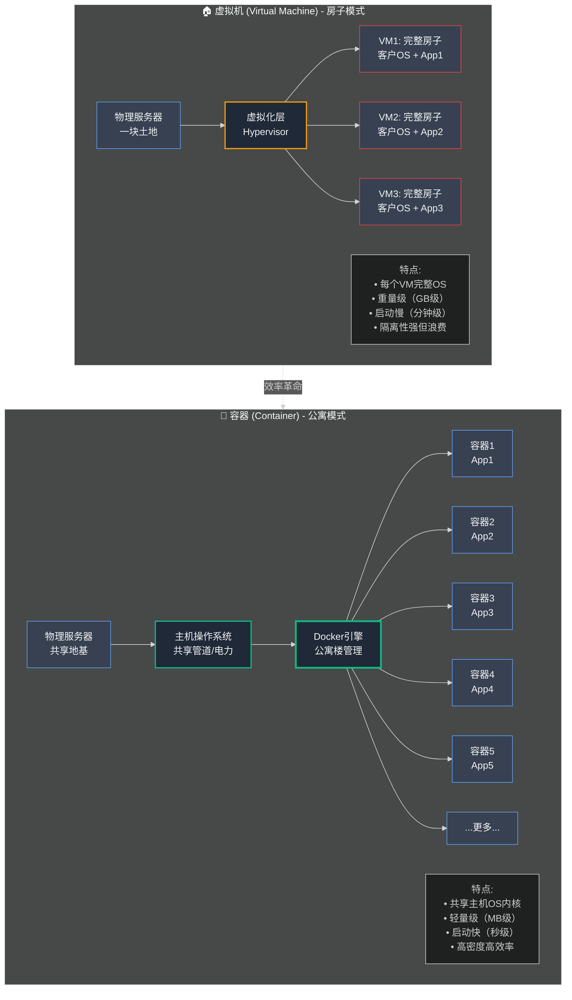
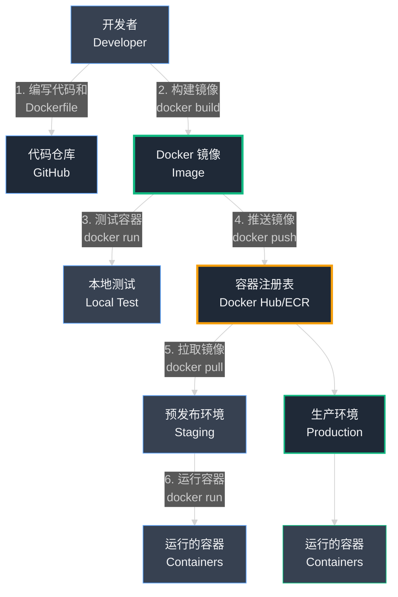
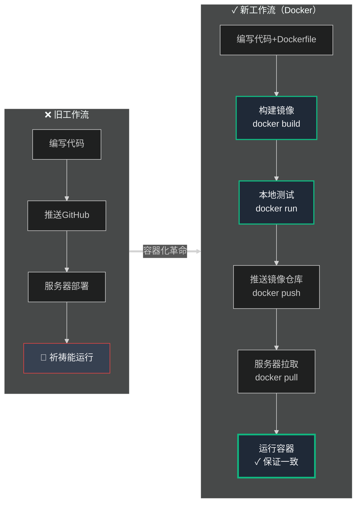

## 第10章:集装箱革命:Docker 简介

我们的架构正在变得强大。我们有一队自动扩展的 Web 服务器、一个容错的数据库,以及一个由 Kafka 确保数据可靠流动的中枢神经系统。我们有现代化、可扩展的科技公司的蓝图。

但在实际操作中,日常工作中,事情仍然很混乱。一种新的摩擦正在拖慢我们,一种不是来自系统崩溃,而是来自微小的、令人抓狂的不一致性的混乱。与此同时,我们来自 阿里云 的月度账单正在攀升到一个让王峰紧张的水平。我们建造了一个强大的引擎,但它效率低下,容易出现人为错误。

本章讲述我们如何通过采用一项不仅彻底改变了我们公司,而且改变了整个科技行业的技术来解决这些问题:**容器 (Containers)**。

### Part 1: 双头龙

我们在与一条双头龙战斗。一个头是折磨我们开发者的不一致性野兽。另一个头是悄悄吞噬我们金钱的低效率野兽。

**第一个头:"但它在我的机器上能运行!"**

我们的开发团队正在成长。我们有后端开发者、前端开发者和数据工程师,都在开发不同的功能。我们最敏锐的新工程师之一,我们叫她小林,被安排构建一个功能,为卖家生成 PDF 发票。

她找到了一个很棒的新 Python 库,`reportlab-ng`,使这个过程变得简单。她在她的 Macbook 上安装了它,编写了代码,并彻底测试了它。生成的发票很漂亮,像素完美。"它完美运行!"她宣布,在成功的代码审查后,她的功能被部署到我们的预发布环境。

一小时后,一个 Bug 报告进来了。预发布环境上的 PDF 一团糟。文本错位,格式完全损坏。

小林感到困惑。她从预发布环境拉下完全相同的代码并在她的笔记本电脑上运行它。PDF 是完美的。她把它推回到预发布环境。它们损坏了。这导致了开发者词汇中最令人沮丧的一句话:

**"我不明白……它在我的机器上能运行!"**

经过数小时痛苦的调试后,我们找到了原因。我们预发布环境中的 Ubuntu 服务器安装了与小林的 Macbook 略有不同的系统级字体库。PDF 库依赖于这些底层系统字体,微小的差异导致格式被破坏。

这种"环境漂移 (Environment Drift)"一直在发生。一个开发者可能使用 Python 3.9.6,而服务器使用 3.9.2。另一个开发者可能有一个特定库的较新版本。每一个微小的差异都是一个等待爆炸的地雷,在调试上浪费了无数小时,并在"开发 (Dev)"和"运维 (Ops)"之间造成了巨大的摩擦。

**第二个头:螺旋上升的 阿里云 账单**

与此同时,王峰打电话给我进行每周的预算审查。他听起来很担心。

"陈浩,我在看 阿里云 账单。它很大。它说我们运行了二十台应用服务器。但当我看我们的流量图表时,大部分时间只有一半在忙。另外十台在做什么?"

他是对的。我们的水平扩展正在起作用,但它效率非常低。每台服务器都是一个完整的虚拟机 (Virtual Machine,VM,一个 EC2 实例),有自己的操作系统,仅仅为了存在就占用了一大块 RAM 和 CPU。我们在此基础上运行我们的应用程序进程。为了安全起见,我们只会在每台机器上运行一个或两个服务,以避免它们相互干扰。

结果是一队长期利用不足的服务器。服务器 A 可能使用其 CPU 的 20%,服务器 B 可能达到 30%,但我们无法轻易地合并它们的工作负载。我们为整辆车付钱,即使我们只使用一个座位。这种低效率每月让我们损失数千美元。

#### **识别问题:不一致性和低效率**

龙的两个头都是由同样的核心问题驱动的:我们打包和运行软件的方式。

- **不一致性:** 我们的代码在开发者的笔记本电脑上的行为与在服务器上的行为不同,因为底层环境不同。
- **低效率:** 我们的服务器就像大型的、半空的房子。我们为整个房子付钱,但只住在一个房间里,因为我们担心不同房间的居住者可能会发生冲突。

我们需要一种方法将我们的代码及其所有依赖项打包到一个单一的、一致的、隔离的盒子中。我们需要一种方法在单个大型服务器上运行许多这些小的、隔离的盒子,而不会相互干扰。我们需要标准化集装箱的软件等价物。我们需要 **Docker**。

### Part 2: 魔法盒

我们面临两个不同的问题——不一致的环境和低效的服务器——但我们有一种预感,它们都可以被一个强大的新武器消灭。我们开始阅读博客文章和观看会议演讲,一个名字一次又一次地出现:**Docker**。

一开始我们没有理解它。它听起来很抽象和复杂。但随后我们遇到了一个类比,使一切都到位,一个类比是理解容器革命的关键。

#### **技术深度解析:集装箱类比**

在 1960 年代之前,海外运输货物是一场混乱的噩梦。船的货舱将是不同大小的桶、袋子、箱子和盒子的混乱堆积。装卸是一个缓慢的、手动的、非常昂贵的过程。货物经常丢失、损坏或被盗。

然后出现了标准化集装箱的发明。这个简单的金属盒子改变了世界。无论你运输香蕉、电子产品还是汽车都无关紧要;一切都放入相同大小的盒子。这些相同的盒子可以被起重机、火车和卡车以令人难以置信的效率堆叠、移动和运输。起重机操作员不需要知道或关心盒子里是什么;他们只需要知道如何移动盒子。

**Docker 是软件的标准化集装箱。**

在 Docker 之前,我们的应用程序就像那个混乱的货舱。要在服务器上运行它,我们必须手动安装正确版本的 Python、正确的系统库、正确的应用程序代码以及十几个其他依赖项。每台服务器都略有不同,就像每个桶和箱子的形状不同一样。

Docker 允许我们将整个应用程序——代码、特定版本的 Python、所有必需的库,甚至操作系统的必要部分——打包到一个单一的、整洁的、标准化的盒子中,称为**容器 (Container)**。

现在,我们可以拿起那个容器并在任何安装了 Docker 的服务器上运行它——小林的 Macbook、我们的预发布服务器、我们的生产服务器——它会以完全相同的方式工作,每次都是。"它在我的机器上能运行"的问题永远解决了。容器_就是_机器。

#### **Docker 组件:蓝图、盒子和建筑**

要使用 Docker,你只需要理解三个核心概念:

- **Dockerfile(蓝图):** Dockerfile 是一个简单的纯文本文件,包含构建容器镜像 (Container Image) 的逐步说明。它就像宜家的说明手册。
  - 步骤 1:从基本操作系统开始(例如,Ubuntu 20.04)。
  - 步骤 2:安装 Python 版本 3.9.6。
  - 步骤 3:将我们的应用程序代码复制到容器中。
  - 步骤 4:运行命令 'pip install -r requirements.txt' 来安装我们所有的依赖项。
  - 步骤 5:定义容器启动时应运行的命令。
- **镜像 (Image,平板包装盒):** 当你使用 Dockerfile 运行 `docker build` 命令时,Docker 执行这些指令并创建一个**镜像 (Image)**。镜像是最终的、打包好的、准备发货但目前不活跃的盒子。这是平板包装的宜家书架盒子,包含所有零件、螺丝和说明,准备组装。
- **容器 (Container,组装好的书架):** 当你在镜像上运行 `docker run` 命令时,你创建了一个**容器 (Container)**。容器是镜像的实时运行实例。这是完全组装好的书架,现在在你的客厅里,放着你的书。神奇的是,你可以从同一个单一镜像创建数百个相同的、隔离的容器。

#### **技术深度解析：虚拟机 vs. 容器**

"等等，"你可能在想，"这听起来很像虚拟机。"这是一个常见的误解，但理解它们之间的**本质区别**是掌握 Docker 效率提升的关键。



### **虚拟机 (VMs)：独立的房子**

VM 模拟一台**完整的物理计算机**，包括硬件。每个 VM 都需要运行自己的**客户操作系统**的完整副本。

**类比**
- **物理服务器** = 一块土地
- **每个 VM** = 一栋完整的、自包含的**房子**
- 每栋房子都有：沉重的地基、独立的墙壁、自己的管道和电气系统（客户操作系统）
- 你的应用程序 = 放在房子里的家具

**问题**
- ✗ 建造一整栋房子只为装饰一个房间 → **极度浪费**
- ✗ 每个 VM 占用 GB 级内存（完整操作系统）
- ✗ 启动时间：分钟级
- ✗ 密度低：一块土地只能建几栋房子

### **容器：高效的公寓楼**

容器**不模拟硬件**，它虚拟化操作系统。主机上的所有容器**共享主机的操作系统内核**。

**类比**
- **物理服务器** = 一块土地
- **Docker** = 一栋**公寓楼**
- **共享部分**：主要地基和管道（主机操作系统内核）→ **高效**
- **独立部分**：每个公寓有自己的锁、墙壁、家具（应用 + 依赖）→ **隔离**

**优势**
- ✓ 轻量级：MB 级大小（无需完整OS）
- ✓ 启动快速：秒级启动
- ✓ **高密度 (Density)**：一栋楼能容纳远多于几栋独立房子的公寓
- ✓ 完全隔离：各公寓互不干扰

### **效率对比**

| 特性 | 虚拟机 (VM) | 容器 (Container) |
|------|-------------|------------------|
| **大小** | GB级（完整OS） | MB级（仅应用+依赖） |
| **启动时间** | 分钟级 | 秒级 |
| **资源开销** | 高（每个VM完整OS） | 低（共享内核） |
| **密度** | 低（2-5个/服务器） | 高（10-50+个/服务器） |
| **隔离性** | 强（硬件级） | 强（进程级） |
| **成本** | 高 | 低 |

### **实际影响**

**之前（VM模式）**
- 一台大型服务器 → 运行 1-2 个应用进程
- CPU 利用率 20-30%
- 内存大量浪费
- 需要 20 台服务器

**之后（容器模式）**
- 一台大型服务器 → 运行 10-50 个隔离容器
- CPU 利用率 70-90%
- 资源充分利用
- 仅需 8 台服务器（削减 60%！）

**对 阿里云 账单的影响：每月节省数千美元。**

我们理解了理论。**容器是未来。** 现在是时候开始打包我们的第一个"集装箱"了。

### Part 3: 打包我们的第一个盒子

Docker 背后的理论是一个启示。它承诺解决我们两个令人烦恼的问题:困扰我们开发者的不一致性和耗尽我们银行账户的低效率。是时候从理论转向实践了。是时候编写我们的第一个 Dockerfile 并将我们的第一个应用程序打包到标准化容器中了。

#### **技术深度解析:编写我们的第一个 Dockerfile**

我们决定首先容器化我们最关键的应用程序:Python/Django 单体。Dockerfile 只是一个名为 `Dockerfile` 的纯文本文件,与你的代码一起存在。这是构建镜像的配方。我们的看起来像这样:

```dockerfile
# 步骤 1:从官方的、可信的基础镜像开始。
# 我们使用 Debian(Linux 操作系统)精简版上的特定版本的 Python。
FROM python:3.9-slim

# 设置环境变量,使 Python 在优化模式下运行。
ENV PYTHONUNBUFFERED 1

# 设置容器内的工作目录。所有后续命令
# 将从这里运行。
WORKDIR /app

# 将列出我们所有 Python 依赖项的文件复制到容器中。
COPY requirements.txt .

# 步骤 2:安装所有依赖项。
# 这一步被 Docker "缓存"。如果 requirements.txt 没有改变,

# Docker 不会重新运行这个,使未来的构建更快。
RUN pip install --no-cache-dir -r requirements.txt

# 步骤 3:将我们实际的应用程序代码复制到容器中。
COPY . .

# 步骤 4:定义容器启动时要运行的命令。
# 这个命令启动我们的 Gunicorn 应用服务器。

CMD ["gunicorn", "--bind", "0.0.0.0:8000", "dukaan.wsgi:application"]
```

这个简单的文件是我们的蓝图。它是我们应用程序环境的完美的、可重复的、版本控制的定义。不再有歧义。Python 的确切版本和依赖项的确切列表现在被编码了。

#### **新的工作流程:发货镜像,而不是代码**

Docker 完全改变了我们的开发和部署管道。

- **旧方法:** 开发者会在他们的笔记本电脑上编写代码,笔记本电脑有自己独特的环境。他们会将代码推送到 GitHub。然后我们的服务器会拉取该代码并尝试在_它们_自己独特的环境中运行它。环境之间的这个差距是 Bug 生存的地方。
- **新方法:** 工作流程现在以镜像为中心。
  - 开发者编写代码和 Dockerfile。
  - 在他们自己的笔记本电脑上,他们通过运行 `docker build .` 构建镜像。这创建了一个打包好的、自包含的盒子。
  - 他们通过在他们的笔记本电脑上运行_完全相同的镜像_作为容器来测试功能:`docker run <image_name>`。如果它在这里工作,我们有很高的信心它会在任何地方工作。
  - 他们现在不仅仅推送代码,还推送构建的**镜像**到一个中央**容器注册表 (Container Registry)**(如 Docker Hub 或 天猫 ECR)。注册表是容器镜像的仓库。
  - 我们的预发布和生产服务器不再从 GitHub 拉取代码。它们从注册表拉取预构建的、预测试的镜像并运行它。

根本的转变是这样的:**我们停止发货代码,开始发货镜像。** 环境现在与应用程序捆绑在一起。"它在我的机器上能运行"的问题死了。如果它在开发者笔记本电脑上的容器中工作,它会在生产服务器上的完全相同的容器中工作。

#### **Docker 镜像构建和部署流程图**



从图中可以看出,Docker 改变了我们的部署模式——我们不再直接部署代码,而是构建、测试和部署不可变的容器镜像。

#### **影响:削减成本**

第二个、同样戏剧性的影响是对我们的服务器账单的影响。我们立即开始将我们的服务器视为通用的"容器主机"。我们现在可以拿一个我们的大型 EC2 实例,用它来运行多个完全隔离的服务的容器。在单台机器上,我们可以有:

- 五个容器运行我们的主要 Django 单体。
- 十个容器用于高流量的 `storefront-service`。
- 两个容器用于我们的 `cache-invalidator` 服务。
- 三个容器用于一个新的图像调整器服务。

所有这些容器都在同一个主机机器上运行,共享操作系统内核但彼此完全隔离。我们的服务器利用率飙升。我们不再为二十个半空的房子付钱;我们为五栋完全占用的公寓楼付钱。我们能够将我们的应用服务器队伍减少超过 60%,成本节省是立即和巨大的。

#### **新问题:没有指挥的管弦乐队**

我们解决了不一致性和低效率的问题。但一如既往,解决一个问题会创造一个新的、更有趣的问题。

Docker 是构建、发货和运行单个容器的绝佳工具。但我们的生产环境现在是一个跨服务器队伍运行的数百个容器的复杂系统。这引入了一系列全新的问题:

- 如果服务器死了,我们如何将其 50 个容器移动到健康的服务器?
- 如果单个容器崩溃,谁负责自动重启它?
- 当我们想要部署代码的新版本时,我们如何执行滚动更新 (Rolling Update),用 100 个新容器替换 100 个旧容器而不会有任何停机?
- 当 `storefront-service` 的容器和 `core-api` 的容器可能在不同的主机机器上运行时,它们如何找到并相互交谈?

我们现在是一个庞大的容器管弦乐队的骄傲所有者。但我们试图手动管理它们,到处跑着告诉每个音乐家什么时候演奏。这是一种新的混乱。

我们需要一个指挥家。我们需要一个自动化系统来大规模管理容器的整个生命周期。我们需要一个**容器编排器 (Container Orchestrator)**。我们准备好迈出基础设施旅程的下一个巨大飞跃了:是时候学习 **Kubernetes** 了。

---

<div style="border: 2px solid #3b82f6; border-radius: 8px; padding: 20px; margin: 30px 0; background: linear-gradient(to right, #1e40af08, #2563eb08);">

### 📌 编者注：Docker生产级实战速查

*15分钟掌握Dockerfile最佳实践和镜像优化技巧*

---

#### **一、Dockerfile最佳实践(Django示例)**

```dockerfile
# === 多阶段构建(减少镜像体积70%) ===
# 阶段1: 构建阶段
FROM python:3.10-slim as builder
WORKDIR /build
# 只复制依赖文件(利用Docker缓存)
COPY requirements.txt .
# 安装到自定义目录
RUN pip install --user --no-cache-dir -r requirements.txt

# 阶段2: 运行阶段(最小化镜像)
FROM python:3.10-slim
WORKDIR /app

# 创建非root用户(安全最佳实践)
RUN useradd -m -u 1000 dukaan && chown -R dukaan:dukaan /app
USER dukaan

# 从构建阶段复制依赖
COPY --from=builder /root/.local /home/xiaodiantong/.local
ENV PATH=/home/xiaodiantong/.local/bin:$PATH

# 复制应用代码(最后复制,最大化缓存利用)
COPY --chown=dukaan:dukaan . .

# 健康检查
HEALTHCHECK --interval=30s --timeout=3s --start-period=40s \
  CMD python -c "import requests; requests.get('http://localhost:8000/health/')"

# 暴露端口
EXPOSE 8000

# 启动命令
CMD ["gunicorn", "--bind", "0.0.0.0:8000", "--workers", "4", "dukaan.wsgi:application"]
```

**优化对比:**
| 优化手段 | 镜像体积 | 构建时间 | 安全性 |
|---------|---------|---------|--------|
| 基础镜像 | 1.2GB → 180MB | - | - |
| 多阶段构建 | 180MB → 85MB | 3min → 1min | ✅ |
| 非root用户 | - | - | ✅✅ |
| .dockerignore | 85MB → 55MB | 1min → 30s | - |

---

#### **二、.dockerignore关键配置**

```bash
# .dockerignore - 排除不必要文件
__pycache__
*.pyc
*.pyo
*.pyd
.Python
*.so
.git
.gitignore
.env
.venv
venv/
*.log
*.md
tests/
.pytest_cache
.coverage
htmlcov/
node_modules/
*.sqlite3
media/  # 用户上传,不打包进镜像
```

---

#### **三、Docker Compose生产配置**

```yaml
# docker-compose.prod.yml
version: '3.8'

services:
  web:
    build:
      context: .
      dockerfile: Dockerfile
    image: dukaan/web:${VERSION:-latest}
    container_name: xiaodiantong-web
    restart: unless-stopped
    environment:
      - DJANGO_SETTINGS_MODULE=dukaan.settings_prod
      - DATABASE_URL=postgresql://user:pass@db:5432/dukaan
    volumes:
      - static:/app/static
      - media:/app/media
    ports:
      - "8000:8000"
    depends_on:
      - db
      - redis
    networks:
      - xiaodiantong-net
    deploy:
      resources:
        limits:
          cpus: '2'
          memory: 2G
        reservations:
          cpus: '1'
          memory: 1G
  
  db:
    image: postgres:14-alpine
    volumes:
      - postgres-data:/var/lib/postgresql/data
    environment:
      - POSTGRES_DB=dukaan
      - POSTGRES_USER=dukaan
      - POSTGRES_PASSWORD=${DB_PASSWORD}
    networks:
      - xiaodiantong-net
  
  redis:
    image: redis:7-alpine
    command: redis-server --maxmemory 256mb --maxmemory-policy allkeys-lru
    networks:
      - xiaodiantong-net

volumes:
  postgres-data:
  static:
  media:

networks:
  xiaodiantong-net:
    driver: bridge
```

---

#### **四、镜像优化核心技巧**

| 技巧 | 优化效果 | 实现方式 |
|------|---------|---------|
| **使用Alpine基础镜像** | -60%体积 | `python:3.10-alpine` |
| **多阶段构建** | -50%体积 | 分离构建和运行环境 |
| **合并RUN命令** | -30层数 | `RUN cmd1 && cmd2 && cmd3` |
| **利用构建缓存** | -70%构建时间 | COPY按依赖顺序 |
| **清理APT缓存** | -100MB | `rm -rf /var/lib/apt/lists/*` |

**实战示例:**

```dockerfile
# ❌ 不好的做法(每个RUN创建一层)
RUN apt-get update
RUN apt-get install -y gcc
RUN apt-get install -y python3-dev
RUN pip install -r requirements.txt
RUN apt-get remove -y gcc python3-dev
# 结果: 5层,400MB

# ✅ 好的做法(单层,清理缓存)
RUN apt-get update && \
    apt-get install -y --no-install-recommends gcc python3-dev && \
    pip install --no-cache-dir -r requirements.txt && \
    apt-get purge -y --auto-remove gcc python3-dev && \
    rm -rf /var/lib/apt/lists/*
# 结果: 1层,120MB
```

---

#### **五、Docker常用命令速查**

```bash
# === 镜像管理 ===
docker build -t dukaan/web:v1.0 .  # 构建镜像
docker images  # 列出镜像
docker rmi image_id  # 删除镜像
docker image prune -a  # 清理未使用镜像

# === 容器管理 ===
docker run -d -p 8000:8000 --name xiaodiantong-web dukaan/web:v1.0
docker ps  # 列出运行中容器
docker ps -a  # 列出所有容器
docker logs -f container_id  # 查看日志
docker exec -it container_id bash  # 进入容器
docker stop/start/restart container_id
docker rm container_id  # 删除容器

# === 生产运维 ===
docker stats  # 实时资源监控
docker inspect container_id  # 详细信息
docker system df  # 磁盘使用情况
docker system prune -a --volumes  # 深度清理

# === Compose快捷命令 ===
docker-compose up -d  # 后台启动
docker-compose logs -f service_name  # 查看日志
docker-compose exec web bash  # 进入web容器
docker-compose down  # 停止并删除
docker-compose restart service_name  # 重启服务
```

---

#### **六、生产环境Checklist**

**安全:**
- [ ] 使用非root用户运行容器
- [ ] 定期更新基础镜像(安全补丁)
- [ ] 使用私有镜像仓库(Harbor/ECR)
- [ ] 扫描镜像漏洞(`docker scan`)
- [ ] 不在镜像中存储敏感信息(使用环境变量或Secrets)

**性能:**
- [ ] 利用多阶段构建减小镜像体积
- [ ] 合理设置资源限制(CPU/内存)
- [ ] 配置健康检查(HEALTHCHECK)
- [ ] 使用卷(volumes)持久化数据
- [ ] 启用日志轮转(防止磁盘占满)

**监控:**
- [ ] 集成Prometheus监控
- [ ] 配置日志聚合(ELK/Loki)
- [ ] 设置告警规则
- [ ] 定期检查`docker stats`

---

**📊 小店通 Docker收益:**
```
容器化前后对比:
━━━━━━━━━━━━━━━━━━━━━━━━━
服务器利用率  20% → 75%  (+375%)
部署时间      45min → 3min  (-93%)
环境问题      高频 → 零   (✅)
阿里云成本节省   -65%   ($2400→$840/月)
━━━━━━━━━━━━━━━━━━━━━━━━━
```

</div>

---

<br/>

## 第10章：关键要点

### **核心经验**

- **Docker 解决双头龙问题**
  - **不一致性**："它在我的机器上能运行"彻底消失
  - **低效率**：服务器利用率从 20% 提升到 70%+
  - 一石二鸟：开发体验 + 成本优化

- **Dockerfile 是环境蓝图**
  - 将依赖项编码为版本控制的配置文件
  - 确保应用在任何地方都以相同方式运行
  - 从"祈祷能运行"到"保证能运行"

- **思维转变：从代码到镜像**
  - **旧方式**：发货代码 → 服务器上配置环境 → 祈祷兼容
  - **新方式**：构建镜像 → 测试镜像 → 发货镜像 → 运行镜像
  - 容器镜像 = 应用 + 环境的**不可变包**
  - 测试通过的镜像 = 生产可用的镜像

- **高密度利用率降低成本**
  - VM 模式：1 服务器 = 1-2 应用（密度低）
  - 容器模式：1 服务器 = 10-50 容器（密度高）
  - 服务器需求削减 60%+
  - 阿里云 账单每月节省数千美元

- **容器编排是下一步**
  - 管理 3-5 个容器：手动可行
  - 管理 100+ 个容器：噩梦
  - 容器是基础，编排器是必然（Kubernetes 即将登场）
  - 自动化：重启、调度、滚动更新、服务发现

### **技术对比**

| 维度 | 虚拟机 (VM) | 容器 (Container) |
|------|-------------|------------------|
| **隔离级别** | 硬件级 | 进程级 |
| **资源占用** | GB级（完整OS） | MB级（仅应用） |
| **启动速度** | 分钟级 | 秒级 |
| **密度** | 低（2-5/服务器） | 高（10-50+/服务器） |
| **可移植性** | 中等 | 极高 |
| **成本效率** | 低 | 高 |
| **管理复杂度** | 中等 | 低（单个）高（大规模） |

### **工作流转变**



**教训**：容器不仅是技术工具，更是思维方式的革命——**环境即代码**。

