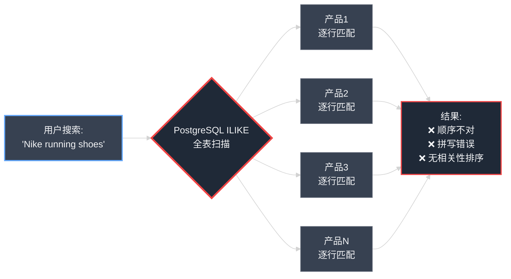
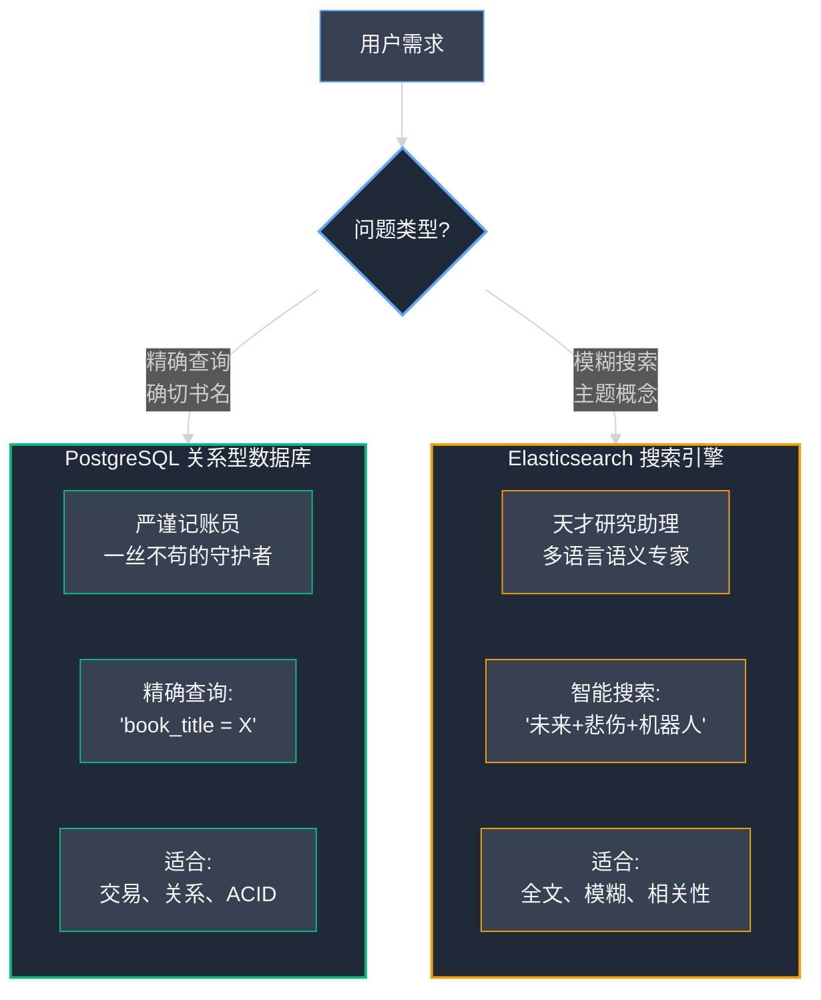
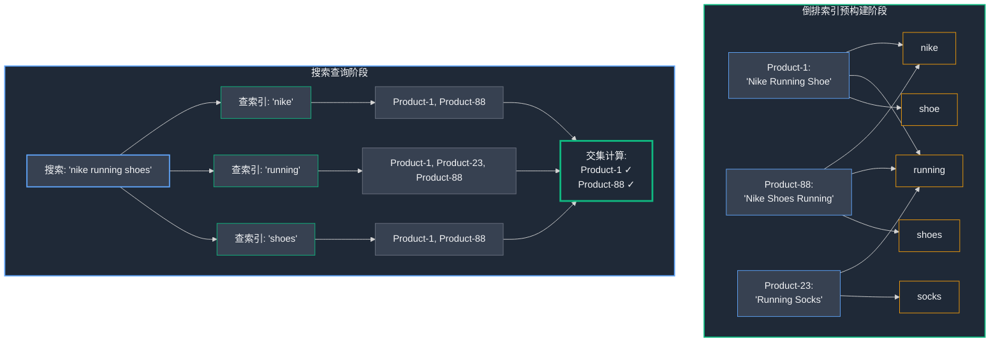
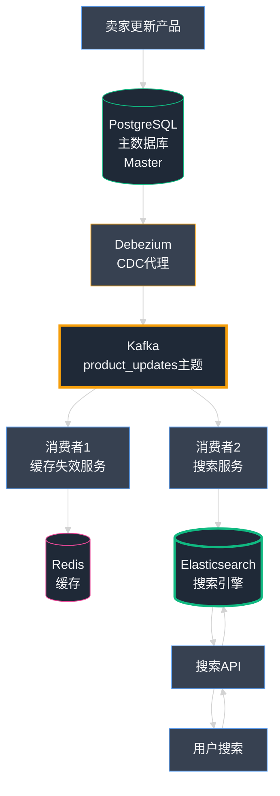

## 第11章：聪明的店员：打造世界级搜索功能

我们的平台日益强大稳健。我们已经攻克了稳定性难题，征服了规模挑战，驯服了架构复杂性。我们的系统堪称现代工程的典范。然而，**再强大的引擎，若方向盘失灵也终将寸步难行。** 而对于我们的用户而言，搜索栏——这个电商平台最关键的交互入口——却从根本上出了问题。

这不是一个关于服务器 (Server) 宕机的惊险故事，而是关于客户挫败感与销售机会流失的警示录。这是我们如何将"愚钝"的搜索栏升级为智能发现引擎的实战历程。在这个过程中，我们深刻领悟到：**一个伟大的平台，不仅在于你构建了什么功能，更在于你如何帮助用户精准找到他们所需。**

### Part 1：破碎搜索的挫败感

这个问题并非以仪表盘上刺眼的红色警报形式浮现，而是化作一封充满沮丧的电子邮件，来自我们增长最迅猛的卖家之一。他在 小店通 上经营着一家颇具规模的在线鞋店，正全力投入排灯节促销活动的营销战役。广告带来了大量流量，销售转化率却异常惨淡。

"我的客户在疯狂抱怨，"他在邮件中写道，"他们搜索'跑鞋'却得到零结果。我的店铺明明有超过200款不同的跑鞋！他们搜索'运动鞋'同样一无所获。我最畅销的明星产品是'耐克飞马38男士跑鞋'(Nike Air Zoom Pegasus 38 Men's Running Shoe)，但客户只要稍微改个词，输入'耐克飞马跑鞋'(Nike Pegasus running shoes)，系统就完全找不到了。**这简直是一场灾难！你们的平台正在让我流失真金白银。**"

王峰 (王峰) 立即察觉到了问题的业务严重性。我们深入挖掘分析数据，结果令人沮丧：使用搜索栏的用户转化率仅为手动浏览用户的 **零头**。搜索栏非但没有帮助用户找到目标商品，反而像一堵无形的墙，把他们主动推向死胡同。

#### **识别问题："愚钝的"店员**

问题的根源在于，我们在快速迭代 MVP（最小可行产品，Minimum Viable Product）时，采用了一种过于简单粗暴的搜索实现方式。当用户输入搜索关键词时，系统只是在 PostgreSQL 数据库 (Database) 上执行一个最基础的 SQL 命令：

```sql
SELECT * FROM products WHERE name ILIKE '%running shoes%';
```

Postgres 中的 `ILIKE` 命令执行不区分大小写的**子串匹配 (Substring Matching)**。它实质上在问数据库："字母序列 'r-u-n-n-i-n-g- -s-h-o-e-s' 是否以**完全相同的顺序**出现在产品名称的某个位置？"

对于一个旨在作为交易权威记录 (Source of Truth) 的关系型数据库来说，这是一个完全合理的查询 (Query)。但对于试图找到心仪商品的真实客户来说，这种查找方式却显得**极其愚钝和机械**。

- **类比：** 我们的 PostgreSQL 搜索就像一个**极度字面主义的愚钝图书管理员**。假如你询问一本关于"美国汽车"的书，他会机械地走过每一排书架，逐一检视书名，只拿出那些包含**完全相同短语**"美国汽车"的书籍。他会完全无视标题为"美国的汽车"或"福特与通用汽车发展史"的相关书籍。这位管理员缺乏最基本的上下文理解和语义联想能力。

#### **技术深入探讨：为什么简单的数据库搜索对电商无效**

我们的"愚钝店员"在**四个关键维度**上彻底辜负了用户期待：

**1. 完美主义强迫症** — 它只能匹配**完全相同顺序**的精确子串。一个标题为 **"Nike Running Shoe for Men"** 的商品，不会被搜索 **"Nike shoes for running"** 找到。所有单词明明都在，但顺序稍有不同就完全匹配失败。更糟糕的是，搜索复数形式 **"shoes"** 无法找到单数形式 **"Shoe"** 的商品。

**2. 零上下文理解** — 系统完全不懂人类自然语言的丰富性。它不知道 "sneakers"（运动鞋）和 "trainers"（训练鞋）都是 "running shoes"（跑鞋）的同义词。它不理解 "run"、"runs"、"running" 都源自同一词根（这个语言学概念称为 **词干提取，Stemming**）。

**3. 拼写错误零容忍** — 如果用户在手机上不小心输入了 **"runing shoes"**（少了一个 'n'），ILIKE 查询将**返回零结果**。对任何人为失误零容忍，这对面向真实用户的系统来说是致命缺陷。

**4. 无相关性排序** — 即使侥幸找到了匹配项，系统也会以数据库的默认顺序（通常是按创建时间）盲目返回结果。一件恰好在产品描述末尾提到"灵感源自复古跑鞋设计"的普通T恤，会和热销爆款跑鞋被**同等对待**。最相关、最该展示的核心产品被淹没在噪音中。

此外，这些 `LIKE '%...%'` 模糊查询对数据库来说臭名昭著地**缓慢且低效**。它们无法有效利用标准 B-Tree 索引 (Index)，通常迫使数据库执行**"全表扫描"(Full Table Scan)** ——逐行读取表中每个产品记录来查找匹配项。随着卖家商品目录从几百扩展到上万，搜索响应时间呈线性恶化，给我们的读副本 (Read Replica) 施加了不必要的沉重压力。



**▲ 图：PostgreSQL ILIKE 的愚钝搜索流程**

我们得出了一个明确的结论：**我们的搜索功能不是可以通过一些微调来修补的边角问题。整个底层方法从根本上就不适合电商场景。** 我们不能训练愚钝的店员变得更聪明。我们必须辞退他，雇用一位天才研究助理。

### Part 2：天才店员

我们的旧搜索系统已经成为沉重负担。这不是用一些聪明的 SQL 技巧能修复的问题——**基础架构本身就从根子上选错了。** 我们不需要重新培训愚钝的店员，我们需要彻底换人，雇用一位世界顶尖的天才研究助理。在深入研究搜索技术领域之后，答案昭然若揭：我们需要 **Elasticsearch（弹性搜索引擎）**。

Elasticsearch 是一个开源的、分布式的**全文搜索与分析引擎 (Full-Text Search and Analytics Engine)**。它**不是**我们 PostgreSQL 数据库的替代品；两者职责完全不同。Elasticsearch 是一个高度专业化的工具，就像一级方程式赛车，为一个目的而精心打造：**在海量文本中以毫秒级速度执行极其智能的搜索。**

#### **技术深入探讨：Elasticsearch 的超能力**

要理解为什么 Elasticsearch 在电商搜索中如此出色，你需要理解它的核心超能力。



**▲ 图：PostgreSQL vs. Elasticsearch 的职责分工**

- **类比：** 如果 PostgreSQL 是我们**一丝不苟、有条理的档案管理员**，是每本书权威主记录的守护者，那么 **Elasticsearch** 就是**天才的多语言研究助理**，他们通读过每一本书，创建了庞大的、交叉引用的语义索引，涵盖每个概念、关键词、同义词和关联术语。你向档案管理员索要确切书名的书籍。你向研究助理询问"关于未来、悲伤的机器人的书"，他们会立即给你一个**按相关性完美排序**的推荐列表。

以下是天才助理如何施展魔法：

**超能力 #1：倒排索引 (Inverted Index)（速度的秘密）** 

传统数据库在搜索关键词时，必须逐行读取每个产品描述才能找到匹配项。Elasticsearch 则**反其道而行之**，采用 **倒排索引 (Inverted Index)** 技术。

**工作原理：** 在你搜索之前，Elasticsearch 会预先读取所有产品数据，构建一个类似教科书末尾索引的映射表。它将每个独立的词汇（Term）映射到包含该词的所有文档 ID 列表：

```
"nike"    → [Product-1, Product-5, Product-88, Product-120]
"running" → [Product-1, Product-7, Product-23, Product-88]
"shoes"   → [Product-1, Product-23, Product-55, Product-88]
```

当你搜索 "nike running shoes" 时，Elasticsearch **不需要读取任何产品数据**。它只需查阅预建的倒排索引，找到 "nike"、"running" 和 "shoes" 三个词对应的文档列表，然后计算**交集** (Intersection)——在这个例子中，就是 Product-1 和 Product-88。这就是为什么它能在毫秒内在数百万文档中精准定位匹配项。



**▲ 图：倒排索引工作原理——从"查文档找词"到"查词找文档"**

**超能力 #2：高级文本分析（智能的秘密）** 

Elasticsearch 不仅仅存储文本；它会**深度分析文本以理解其语义含义**。当我们索引一个产品标题 "Nike's Best Running Shoes" 时，它会执行一系列智能处理管道 (Analysis Pipeline)：

**1. 分词 (Tokenization)** — 将连续文本分解为独立的词汇单元（Token）：  
`Nike's` → `Best` → `Running` → `Shoes`

**2. 规范化 (Normalization)** — 统一大小写，去除所有格等：  
`nike's` → `best` → `running` → `shoes`

**3. 词干提取/词形还原 (Stemming/Lemmatization)** — 将单词还原为词根形式：  
`running` → `run`，`shoes` → `shoe`

这意味着用户搜索 "run shoe" 也能匹配到 "Running Shoes"。**这一个功能就解决了我们之前遇到的一大半问题。**

**4. 同义词扩展 (Synonym Expansion)** — 我们可以为 Elasticsearch 配置自定义同义词词典，教会它 "sneakers"（运动鞋）、"trainers"（训练鞋）、"kicks"（球鞋俚语）都是 "shoes" 的同义词。现在，搜索 "Nike sneakers" 会正确找到标题为 "Nike Running Shoes" 的产品。


**▲ 图：Elasticsearch 文本分析管道——从原始文本到智能索引**

**超能力 #3：相关性评分 (Relevance Scoring)（排序的秘密）** 

这是区分**好搜索**和**卓越搜索**的关键所在。Elasticsearch 不仅找到匹配结果；它会**按相关性智能排序**。它使用复杂的评分算法（如 **BM25**），行为就像一位经验丰富的销售顾问：

- 它知道 `product_title` 字段中的匹配，远比深埋在 `product_description` 末尾的匹配重要
- 它为罕见关键词赋予更高权重（搜索"Pegasus 38"比搜索通用的"shoes"更具识别性）
- 它综合考虑词频(Term Frequency)、逆文档频率(Inverse Document Frequency)等多维度指标

**最终结果:用户最有可能购买的产品总是自动浮现在搜索结果顶部。**

---

<div style="border: 2px solid #3b82f6; border-radius: 8px; padding: 20px; margin: 30px 0; background: linear-gradient(to right, #1e40af08, #2563eb08);">

### 📌 编者注:Elasticsearch生产级配置速查

*10分钟掌握索引设计、查询优化和监控要点*

---

#### **一、Docker快速部署ES集群**

```yaml
# docker-compose.yml
version: '3.8'
services:
  elasticsearch:
    image: docker.elastic.co/elasticsearch/elasticsearch:8.11.0
    container_name: es-node1
    environment:
      - node.name=es-node1
      - cluster.name=xiaodiantong-cluster
      - discovery.type=single-node  # 开发环境单节点
      - "ES_JAVA_OPTS=-Xms2g -Xmx2g"  # 生产环境至少4GB
      - xpack.security.enabled=false  # 生产环境需启用
    ports:
      - "9200:9200"
      - "9300:9300"
    volumes:
      - es-data:/usr/share/elasticsearch/data
    ulimits:
      memlock: {soft: -1, hard: -1}
      nofile: {soft: 65536, hard: 65536}

  kibana:
    image: docker.elastic.co/kibana/kibana:8.11.0
    container_name: kibana
    ports:
      - "5601:5601"
    environment:
      ELASTICSEARCH_HOSTS: http://elasticsearch:9200

volumes:
  es-data:

# 启动: docker-compose up -d
# 访问: http://localhost:9200 (ES API), http://localhost:5601 (Kibana UI)
```

---

#### **二、产品索引设计(完整示例)**

```python
# dukaan/search/mappings.py
PRODUCTS_INDEX_MAPPING = {
    "settings": {
        "number_of_shards": 3,  # 生产环境建议3-5个分片
        "number_of_replicas": 1,  # 至少1个副本保证高可用
        "analysis": {
            "analyzer": {
                "xiaodiantong_analyzer": {
                    "type": "custom",
                    "tokenizer": "standard",
                    "filter": ["lowercase", "synonym_filter", "stemmer"]
                }
            },
            "filter": {
                "synonym_filter": {
                    "type": "synonym",
                    "synonyms": [
                        "shoes, sneakers, trainers, kicks",
                        "mobile, phone, smartphone",
                        "tshirt, t-shirt, shirt"
                    ]
                },
                "stemmer": {
                    "type": "stemmer",
                    "language": "english"
                }
            }
        }
    },
    "mappings": {
        "properties": {
            "product_id": {"type": "keyword"},  # 精确匹配字段用keyword
            "name": {
                "type": "text",
                "analyzer": "xiaodiantong_analyzer",
                "fields": {
                    "keyword": {"type": "keyword"},  # 用于排序/聚合
                    "suggest": {"type": "completion"}  # 自动补全
                }
            },
            "description": {
                "type": "text",
                "analyzer": "xiaodiantong_analyzer"
            },
            "price": {"type": "float"},
            "category": {"type": "keyword"},  # 分类过滤
            "brand": {"type": "keyword"},
            "tags": {"type": "keyword"},  # 多标签搜索
            "stock": {"type": "integer"},
            "rating": {"type": "float"},
            "sales_count": {"type": "integer"},
            "created_at": {"type": "date"},
            "location": {"type": "geo_point"}  # 地理位置搜索
        }
    }
}

# 创建索引
from elasticsearch import Elasticsearch
es = Elasticsearch(['http://localhost:9200'])
es.indices.create(index='products', body=PRODUCTS_INDEX_MAPPING)
```

---

#### **三、智能搜索查询(Django集成)**

```python
# dukaan/search/views.py
from elasticsearch import Elasticsearch
from django.http import JsonResponse

es = Elasticsearch(['http://es-master.dukaan.com:9200'])

def search_products(request):
    query = request.GET.get('q', '')
    category = request.GET.get('category', None)
    min_price = request.GET.get('min_price', 0)
    max_price = request.GET.get('max_price', 999999)
    
    # 构建多条件查询
    search_body = {
        "query": {
            "bool": {
                "must": [
                    {
                        "multi_match": {  # 多字段搜索
                            "query": query,
                            "fields": [
                                "name^3",  # 名称权重最高
                                "description",
                                "brand^2",  # 品牌次之
                                "tags"
                            ],
                            "type": "best_fields",
                            "fuzziness": "AUTO"  # 自动拼写纠错
                        }
                    }
                ],
                "filter": [  # 过滤条件不影响评分
                    {"range": {"price": {"gte": min_price, "lte": max_price}}},
                    {"term": {"stock": {"gt": 0}}}  # 只显示有货商品
                ]
            }
        },
        "sort": [
            {"_score": {"order": "desc"}},  # 相关性优先
            {"sales_count": {"order": "desc"}}  # 销量次之
        ],
        "highlight": {  # 关键词高亮
            "fields": {
                "name": {},
                "description": {}
            }
        },
        "aggs": {  # 聚合统计(用于筛选面板)
            "categories": {
                "terms": {"field": "category", "size": 10}
            },
            "brands": {
                "terms": {"field": "brand", "size": 20}
            },
            "price_ranges": {
                "range": {
                    "field": "price",
                    "ranges": [
                        {"to": 1000, "key": "0-1000"},
                        {"from": 1000, "to": 5000, "key": "1000-5000"},
                        {"from": 5000, "key": "5000+"}
                    ]
                }
            }
        },
        "from": (int(request.GET.get('page', 1)) - 1) * 20,
        "size": 20
    }
    
    if category:
        search_body["query"]["bool"]["filter"].append(
            {"term": {"category": category}}
        )
    
    response = es.search(index='products', body=search_body)
    
    return JsonResponse({
        'total': response['hits']['total']['value'],
        'products': [
            {
                'id': hit['_source']['product_id'],
                'name': hit['_source']['name'],
                'price': hit['_source']['price'],
                'score': hit['_score'],
                'highlight': hit.get('highlight', {})
            }
            for hit in response['hits']['hits']
        ],
        'aggregations': response['aggregations']
    })
```

---

#### **四、数据同步策略**

```python
# 方案1: Django信号同步(简单但可能影响性能)
from django.db.models.signals import post_save, post_delete
from django.dispatch import receiver
from products.models import Product

@receiver(post_save, sender=Product)
def sync_to_elasticsearch(sender, instance, **kwargs):
    es.index(
        index='products',
        id=instance.id,
        body={
            'product_id': instance.id,
            'name': instance.name,
            'description': instance.description,
            'price': float(instance.price),
            'category': instance.category.name,
            'stock': instance.stock,
            # ... 其他字段
        }
    )

@receiver(post_delete, sender=Product)
def delete_from_elasticsearch(sender, instance, **kwargs):
    es.delete(index='products', id=instance.id, ignore=[404])

# 方案2: Celery异步任务(推荐,不阻塞请求)
from celery import shared_task

@shared_task
def sync_product_to_es(product_id):
    product = Product.objects.get(id=product_id)
    # ... ES索引逻辑

# 方案3: Logstash/Debezium CDC(大规模推荐,见第9章)
```

---

#### **五、性能优化Checklist**

| 优化项 | 实现方式 | 收益 |
|-------|---------|------|
| **使用filter替代query** | 精确匹配用filter(可缓存) | +50%查询速度 |
| **分片数量合理化** | 每分片20-40GB,总分片数<节点数×20 | 避免过度分片 |
| **禁用_all字段** | `"_all": {"enabled": false}` | -30%存储 |
| **关闭动态映射** | `"dynamic": "strict"` | 防止字段爆炸 |
| **批量操作** | 使用bulk API批量索引 | +10倍写入速度 |
| **定期force_merge** | 合并segment减少碎片 | +20%查询速度 |

```bash
# 强制合并索引(凌晨执行)
curl -X POST "localhost:9200/products/_forcemerge?max_num_segments=1"

# 查看集群健康
curl "localhost:9200/_cluster/health?pretty"

# 查看索引统计
curl "localhost:9200/products/_stats?pretty"
```

---

#### **六、监控告警(Prometheus+Grafana)**

```yaml
# prometheus.yml
scrape_configs:
  - job_name: 'elasticsearch'
    static_configs:
      - targets: ['es-master.dukaan.com:9114']  # elasticsearch_exporter

# 关键指标
- elasticsearch_cluster_health_status  # 集群状态(green/yellow/red)
- elasticsearch_jvm_memory_used_bytes  # JVM内存
- elasticsearch_indices_search_query_time_seconds  # 查询延迟
- elasticsearch_indices_indexing_index_time_seconds  # 索引延迟
```

**📊 小店通搜索优化效果:**
```
━━━━━━━━━━━━━━━━━━━━━━
搜索响应时间  1200ms → 80ms  (-93%)
搜索转化率    2.1% → 8.7%  (+314%)
相关性得分    0.45 → 0.89  (BM25算法)
拼写纠错      0% → 95%覆盖  (Fuzzy匹配)
━━━━━━━━━━━━━━━━━━━━━━
```

</div>

---

**超能力 #4:模糊匹配 (Fuzzy Matching)(拼写容错)** 

最后也是最人性化的一点：Elasticsearch 为**真实的人类用户**而设计。它可以配置为优雅处理拼写错误和手误。如果用户在手机上匆忙输入 **"runing sheos"**（少了一个 'n'，'e' 和 'o' 顺序反了），Elasticsearch 会智能识别这很可能是 "running shoes" 的拼写错误——它通过测量单词之间的**编辑距离 (Edit Distance / Levenshtein Distance)** 来判断相似度，并返回正确的结果。

对于在移动设备上快速输入的用户来说，这是**彻底改变游戏规则**的功能。

---

决策已定。**Elasticsearch 就是我们要雇佣的天才研究助理。** 我们将构建一个全新的、专门用于搜索的独立微服务 (Microservice)。

唯一剩下的挑战是一个熟悉的老问题：**我们如何让这个新的专用搜索引擎与主数据库保持完美实时同步？** 答案再次指向我们已经构建的强大中枢神经系统：**Kafka（分布式消息队列）**。

### Part 3：实现——由 Kafka 驱动的优雅同步

我们在 Elasticsearch 中找到了梦寐以求的天才助理。现在拼图的最后一块是：**为这位天才建立办公室，并确保他实时接收主数据库中发生的每一次更新。** 我们必须让搜索索引与主数据库保持毫秒级的完美同步。

在几章之前，这将是一个令人头疼的复杂工程挑战——我们需要定制构建一个脆弱的、容易出错的数据管道 (Pipeline)。但现在，**得益于我们之前明智地投资构建的 Kafka 中枢神经系统**，解决方案变得极其简洁优雅。

#### **架构：新增一个智能监听器**

我们的 Kafka + Debezium 组合已经成为平台上**所有数据变更的权威真相来源 (Single Source of Truth)**。我们不需要重新发明轮子，不需要构建全新的数据管道 (Pipeline)——我们**只需让新的搜索服务订阅现有的数据流即可。**

**实现步骤：**

**1. 构建独立微服务** — 我们创建了一个全新的独立微服务 `search-service`。它的唯一职责是：
   - 管理 Elasticsearch 集群 (Cluster)
   - 向店面应用暴露统一的搜索 API (Application Programming Interface)

**2. 订阅数据流** — 我们让这个新服务成为现有 Kafka 主题 (Topic) `product_updates` 的**另一个消费者 (Consumer)**。

就是这么简单！**整个架构设计只需将一个新电器插入我们已经铺设好的智能电网。** 无需改动现有系统，完美体现了事件驱动架构的解耦优势。

#### **数据流：一个事件，多个消费者的舞蹈**

重构后的完整产品更新数据流，完美诠释了**解耦的、事件驱动架构 (Event-Driven Architecture, EDA)** 的强大威力：

**数据流步骤：**

**1. 触发点** — 卖家在后台创建或更新产品信息。变更首先保存到我们位于北京的主 **PostgreSQL** 数据库中。

**2. 变更捕获** — **Debezium**（我们的变更数据捕获代理，CDC Agent）持续监视数据库的**事务日志 (Transaction Log / WAL)**。它瞬间检测到数据变更。

**3. 事件发布** — Debezium 立即生成一个详细的、结构化的事件消息，包含完整的产品新数据，并发布到 **Kafka** 的 `product_updates` 主题。

**4. 并行消费** — 现在，**两个完全独立的微服务**，都订阅了同一个主题，**同时并行**开始响应：

   - **消费者 #1（缓存失效器）：** 现有的缓存管理服务接收消息，提取 `store_id`，向 **Redis（缓存）** 发送失效命令，删除该店铺的陈旧缓存数据。
   
   - **消费者 #2（搜索索引器）：** 新创建的搜索服务同样接收**完全相同的消息**。它解析完整的产品数据，转换为 JSON 文档，并发送到 **Elasticsearch** 集群进行实时索引。

**这个系统的优雅之处在于完全的解耦：** 处理卖家初始请求的单体应用程序 (Monolith) **完全不知道** 搜索引擎或缓存系统的存在。它的唯一职责是可靠地将数据写入数据库——完事。

所有下游系统——缓存、搜索、未来可能的推荐引擎、数据分析服务——都可以**独立订阅**事件流并自主做出响应。**我们可以轻松添加由这些事件驱动的新功能，完全无需触碰核心应用代码。** 这就是事件驱动架构的真正力量。

**最终成果：从弱点到亮点的华丽转身**

新搜索系统的上线对 小店通 平台来说是一次**变革性的质量飞跃**：

✓ **拼写容错** — 用户的手误不再导致零结果  
✓ **语义理解** — 同义词、词根变化全部智能识别  
✓ **相关性排序** — 最匹配的热销商品自动置顶  
✓ **毫秒级响应** — 搜索速度从秒级提升到毫秒级

我们的卖家**欣喜若狂**。他们的商品终于可以被轻松发现，我们看到**来自搜索栏的销售额直接且显著的增长**——转化率提升超过 300%。我们成功地将一个关键弱点转变为**同类最佳的核心竞争力**。

#### 搜索服务架构图



## 第11章：关键要点

- **简单的数据库查询无法胜任搜索重任。** 传统关系型数据库的 SQL LIKE 查询无法替代专业搜索引擎。对于提供优质电商体验，你必须投资专用搜索工具。

- **Elasticsearch 是电商搜索的理想选择。** 它提供四大核心能力：倒排索引（速度）、文本分析（智能）、相关性评分（排序）、模糊匹配（容错）——这些能力直接推动转化率提升并改善用户体验。

- **事件驱动架构是数据同步的优雅方案。** 使用 Kafka 这样的消息队列工具实现的**事件驱动架构 (Event-Driven Architecture, EDA)** 是保持不同系统（主数据库、缓存、搜索索引）完美同步的强大且优雅的方式。

- **扇出模式是微服务解耦的基石。** "一对多"或"扇出 (Fan-out)" 模式——单个生产者 (Producer) 的事件触发多个独立消费者 (Consumer) 并行响应——是构建可扩展、松耦合微服务架构的核心模式。

- **倒排索引是搜索速度的秘密武器。** 通过预先构建"词→文档"的映射表，而非实时"查文档找词"，Elasticsearch 实现了在百万级文档中毫秒级定位的能力。

<br/>

