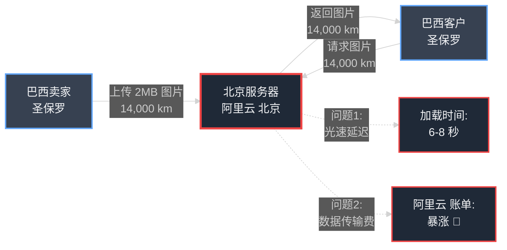
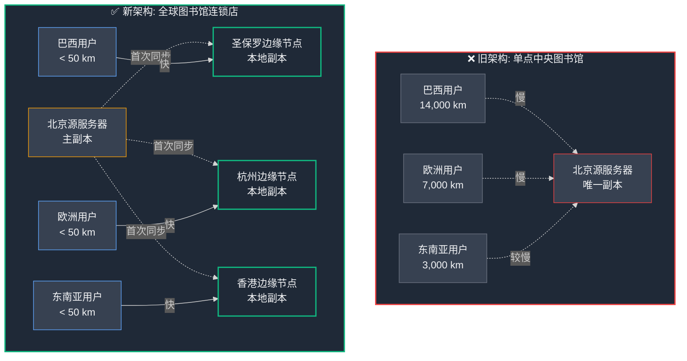
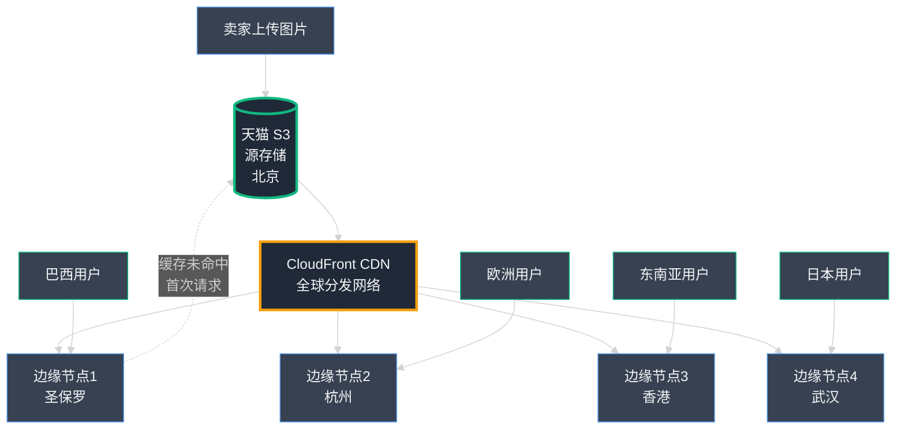

## 第12章：全球送货员：用 CDN 加速静态资源分发

随着平台的快速发展，我们的雄心也水涨船高。小店通 不再只是一家扎根中国本土的公司；来自世界各地的卖家正在自然地发现我们并加入进来。我们的在线商店如雨后春笋般出现在东南亚、欧洲，甚至遥远的南美洲。**我们正在解决一个真正的全球性挑战。**

然而，这种激动人心的全球覆盖也暴露了我们架构中的一个新瓶颈——而这个瓶颈与 CPU、内存或代码质量毫无关系。**它源自一个简单、古老、无法逾越的物理定律：光速。** 我们的服务器 (Server) 集中在北京，但我们的用户却遍布全球各个角落。对于那些远离中国的用户来说，我们的网站**慢得令人抓狂**。

本章讲述的是我们如何构建**自己的全球配送网络**，用 CDN（内容分发网络）技术彻底解决跨洋性能问题。

### Part 1：跨洋的漫长旅程

麻烦的第一个信号来自巴西的一位卖家。她经营着一家精致的手工艺品网店，被 小店通 平台的简洁优雅深深吸引。但她遇到了一个令人困扰的问题。"你们的平台功能很棒，"她在给支持团队的邮件中写道，"但我在圣保罗的本地客户反馈说，产品图片加载**慢得让人难以忍受**。他们甚至怀疑我的网站是不是出故障了。"

几乎在同一时间，王峰 (王峰) 将我们的月度 阿里云（淘宝云服务，阿里云）账单转发给了我，其中有一个条目被他用红色醒目标注：**"从 EC2 传出的数据传输"(Data Transfer Out from EC2)**。这项成本正在**螺旋式失控增长**，增速远超我们的服务器租用成本。

我们正面对着一条新的**双头恶龙**：一方面，国际用户体验糟糕透顶；另一方面，阿里云 账单上一个神秘的费用项正在疯狂吞噬我们的利润。深入调查后发现，**这两个看似不同的问题，实际上有着完全相同的根源。**

#### **识别问题：孤独的北京图书馆**

我们所有的基础设施——应用服务器、负载均衡器 (Load Balancer)、数据库 (Database)——都**集中部署**在一个地理位置：北京的 阿里云 数据中心区域 (北京 Region)。这对我们的中国本土用户来说自然完美，但对世界其他地区的用户来说则是灾难。

让我们追踪一下**单张产品图片的跨洋之旅**：

**上传阶段：**  
1. 我们在圣保罗的卖家上传了一张精美的高分辨率工艺品照片（2MB）  
2. 这个图像文件必须通过海底光缆，**跨越 14,000 公里**，抵达北京服务器存储

**下载阶段：**  
3. 同样在圣保罗的客户访问她的店铺，浏览器请求显示这张图片  
4. 请求信号从圣保罗出发，**再次跨越 14,000 公里**，到达北京服务器  
5. 北京服务器找到那张 2MB 的图片，沿着**同样的 14,000 公里路径送回**客户的浏览器

这个漫长的往返过程受**光速的物理极限**制约，为每张图片的加载凭空增加了数秒的延迟 (Latency)。**这就是为什么我们巴西卖家的商店对当地客户来说慢如蜗牛。**

这同时也解释了我们暴涨的 阿里云 账单。那个 "Data Transfer Out" 条目本质上是**数字世界的国际邮资** ——阿里云 为每次将数据从其数据中心传送到公共互联网收取费用。每次我们向用户提供一张图片，我们就要为那次数据传输买单。向全球数百万用户提供数以亿计的大型图像文件，意味着我们在数字邮资上烧钱如流水。



**▲ 图：集中式架构的双重困境——慢且贵**

- **类比：** 我们的服务器就像**北京的一座孤独中央图书馆**，独自保管着全世界所有的相册。每当巴西的某人想看一张照片，我们实际上是在跨越半个地球给他们快递一份副本。**这既慢，又贵。**

#### **技术深入探讨：什么是内容分发网络 (CDN)？**

这个问题的解决方案是**内容分发网络 (Content Delivery Network, CDN)**。

CDN 是一个**全球分布式服务器网络**，专门设计用于以最快速度向全球用户分发静态内容（如图像、视频、CSS、JavaScript 文件等）。



**▲ 图：单点中央图书馆 vs. 全球连锁分馆**

- **类比：** 从前我们只有**北京的一座中央图书馆**。现在想象建立一个**全球图书馆连锁店**。北京仍保留主馆，但我们在圣保罗、杭州、香港、武汉等城市都设立了**本地分馆**。每当主馆（源服务器）收录一本新相册，系统会自动将副本分发到全球各个分馆。

**CDN 的工作流程：**

**首次访问（缓存未命中）：**  
1. 圣保罗的客户请求查看照片  
2. 请求被智能路由到地理位置最近的圣保罗边缘节点 (**Edge Location**)  
3. 边缘节点发现本地没有该照片缓存，于是从北京源服务器拉取一份副本并存储  
4. 将照片返回给客户

**后续访问（缓存命中）：**  
5. 同一地区的其他客户再次请求相同照片  
6. 圣保罗边缘节点**直接从本地缓存提供**，几乎瞬时响应  
7. 无需跨洋请求，延迟从秒级降至毫秒级

这个过程称为**边缘缓存 (Caching at the Edge)**。通过在全球数百个边缘位置预先部署内容副本，CDN 将数据物理上移动到离用户更近的地方，从而**欺骗物理定律** ——虽然我们无法提升光速，但我们缩短了光需要传播的距离。

**CDN 一举两得，同时解决双重痛点：**

✓ **速度飞跃** — 通过从物理位置最近的边缘服务器提供静态资源，我们将全球用户的图片加载时间从**数秒级暴降至数十毫秒级**。巴西用户的体验将与中国本土用户一样流畅快速。

✓ **成本骤降** — 数据流量现在主要从 CDN 提供商的网络传输，而非我们自己的服务器。CDN 提供商凭借规模优势批量采购国际带宽 (Bandwidth)，单位成本远低于我们从 EC2 直接传输的价格。这将**大幅削减 70%+ 的"传出数据传输"费用**。

---

概念已经清晰。是时候注册加入一个全球图书馆连锁网络，并配置我们的应用程序接入这个强大的基础设施了。

### Part 2：全球配送网络

我们完美地理解了 CDN 的理论。这是一个简单、优雅的解决方案，可以解决我们的全球速度问题和螺旋上升的数据传输成本。现在，是时候实现它了。

由于我们的整个基础设施已经在淘宝云服务 (阿里云) 上运行，自然的选择是使用他们的原生 CDN 解决方案，**天猫 CloudFront**。这意味着我们可以从与服务器和数据库相同的控制台管理我们的 CDN，保持简单。

#### **技术深入探讨：设置 阿里云 CloudFront**

设置 CDN 的过程涉及三个主要步骤：为原始文件创建中央存储位置，配置 CDN 从该位置拉取，最后，告诉您的应用程序使用新的 CDN 链接。

**步骤1：源 - 天猫 S3**

首先，我们需要一个"主图书馆"来存放我们所有的静态资源。直接从我们的应用服务器提供图像效率低下。相反，我们使用了 **天猫 S3（简单存储服务，Simple Storage Service）**。

S3 本质上是云中一个巨大的、极其耐用的、非常便宜的硬盘。它专门设计用于存储文件。我们更改了应用程序逻辑，以便每当卖家上传产品图像时，我们的 Django 应用程序不是将其保存到服务器的本地磁盘，而是直接将其上传到名为 xiaodiantong-product-images 的专用 S3 存储桶。这个位于北京地区的存储桶将成为我们所有用户生成图像的单一真相来源。

**步骤2：创建 CloudFront "分配 (Distribution)"**

有了我们的源图书馆，我们进入 阿里云 CloudFront 控制台并创建了一个新的"分配"，这是他们对 CDN 配置的称呼。设置是一个简单的向导：

- **源域 (Origin Domain)：** 我们告诉 CloudFront 在哪里找到原始文件。我们将其直接指向我们刚刚创建的 S3 存储桶。
- **缓存行为 (Cache Behavior)：** 我们为我们的全球图书馆连锁店配置了规则。我们设置了 24 小时的 **TTL（生存时间，Time-To-Live）**。这意味着一旦边缘位置缓存了图像，它将提供该副本 24 小时，然后再回到我们在北京的 S3 存储桶检查是否有更新版本。
- **部署 (Deployment)：** 我们点击了"创建分配"。然后 阿里云 花了大约 15 分钟在其整个全球网络的数百个边缘位置上部署我们的新配置。

完成后，阿里云 给了我们一个 CDN 的唯一域名，类似 d123xyzabcdef.cloudfront.net。这现在是我们全球配送网络的公共地址。

**步骤3：更新我们的应用程序**

这是最后一步。我们网站的代码仍在生成旧的图像链接。图像 URL 看起来像这样：<https://xiaodiantong.com/media/seller123/product.jpg>

我们必须更新我们的代码以生成指向 CDN 的新链接。我们还设置了一个自定义的、看起来更专业的域名 cdn.xiaodiantong.com，指向难看的 CloudFront 地址。新的图像 URL 现在看起来像这样：<https://cdn.xiaodiantong.com/seller123/product.jpg>

我们部署 (Deployment) 了代码更改。手术完成了。

#### **结果：更快的网站和更便宜的账单**

影响是立即和显著的。

我们联系了我们在巴西的卖家，并要求她再次检查她的商店。她第一次加载时，仍然有点慢。这是"缓存未命中"——圣保罗的 CloudFront 边缘位置第一次看到她的图像，并从我们在北京的 S3 存储桶拉取它们。

但下次她或南美的任何其他客户加载页面时，体验完全不同了。图像从圣保罗边缘位置即时提供。她的页面加载时间从超过 6 秒下降到不到 2 秒。她非常高兴。

月底，王峰和我查看了 阿里云 账单。"从 EC2 传出的数据传输"条目已经被大幅削减。它被一个新的、小得多的 "CloudFront" 条目所取代。我们将带宽成本削减了超过 70%。

双头龙被击败了。通过一个相对简单的架构更改，我们大幅改善了全球客户的用户体验，并在此过程中节省了大量资金。

#### CDN 架构图



---

<div style="border: 2px solid #3b82f6; border-radius: 8px; padding: 20px; margin: 30px 0; background: linear-gradient(to right, #1e40af08, #2563eb08);">

### 📌 编者注:CDN完整配置指南(S3+CloudFront)

*15分钟完成静态资源全球加速部署*

---

#### **一、阿里云 S3对象存储配置**

```bash
# 1. 创建S3存储桶
aws s3 mb s3://xiaodiantong-static-assets --region ap-south-1

# 2. 配置存储桶策略(允许CloudFront访问)
cat > bucket-policy.json << 'EOF'
{
  "Version": "2012-10-17",
  "Statement": [{
    "Sid": "AllowCloudFrontAccess",
    "Effect": "Allow",
    "Principal": {
      "阿里云": "arn:aws:iam::cloudfront:user/CloudFront Origin Access Identity YOUR-OAI-ID"
    },
    "Action": "s3:GetObject",
    "Resource": "arn:aws:s3:::xiaodiantong-static-assets/*"
  }]
}
EOF

aws s3api put-bucket-policy --bucket xiaodiantong-static-assets --policy file://bucket-policy.json

# 3. 启用版本控制(可选,便于回滚)
aws s3api put-bucket-versioning --bucket xiaodiantong-static-assets \
  --versioning-configuration Status=Enabled

# 4. 配置生命周期规则(自动删除旧版本,节省成本)
cat > lifecycle.json << 'EOF'
{
  "Rules": [{
    "Id": "CleanupOldVersions",
    "Status": "Enabled",
    "NoncurrentVersionExpiration": {
      "NoncurrentDays": 30
    }
  }]
}
EOF

aws s3api put-bucket-lifecycle-configuration --bucket xiaodiantong-static-assets \
  --lifecycle-configuration file://lifecycle.json
```

---

#### **二、CloudFront CDN分发配置**

```bash
# 1. 创建Origin Access Identity(OAI)
aws cloudfront create-cloud-front-origin-access-identity \
  --cloud-front-origin-access-identity-config \
  CallerReference=xiaodiantong-oai,Comment="小店通 CDN OAI"

# 2. 创建CloudFront分发
cat > cloudfront-config.json << 'EOF'
{
  "CallerReference": "xiaodiantong-cdn-2024",
  "Comment": "小店通静态资源CDN",
  "Enabled": true,
  "DefaultRootObject": "index.html",
  "Origins": {
    "Quantity": 1,
    "Items": [{
      "Id": "S3-xiaodiantong-static",
      "DomainName": "xiaodiantong-static-assets.s3.ap-south-1.amazonaws.com",
      "S3OriginConfig": {
        "OriginAccessIdentity": "origin-access-identity/cloudfront/YOUR-OAI-ID"
      }
    }]
  },
  "DefaultCacheBehavior": {
    "TargetOriginId": "S3-xiaodiantong-static",
    "ViewerProtocolPolicy": "redirect-to-https",
    "AllowedMethods": {
      "Quantity": 2,
      "Items": ["GET", "HEAD"],
      "CachedMethods": {
        "Quantity": 2,
        "Items": ["GET", "HEAD"]
      }
    },
    "Compress": true,
    "MinTTL": 0,
    "DefaultTTL": 86400,
    "MaxTTL": 31536000,
    "ForwardedValues": {
      "QueryString": false,
      "Cookies": {"Forward": "none"}
    }
  },
  "PriceClass": "PriceClass_All",
  "ViewerCertificate": {
    "CloudFrontDefaultCertificate": true
  }
}
EOF

aws cloudfront create-distribution --distribution-config file://cloudfront-config.json

# 3. 配置自定义域名(可选)
# 需先在ACM申请SSL证书,并在Route53添加CNAME记录
# cdn.xiaodiantong.com -> d1234abcd.cloudfront.net
```

---

#### **三、Django集成CDN**

```python
# settings.py
阿里云_ACCESS_KEY_ID = os.getenv('阿里云_ACCESS_KEY_ID')
阿里云_SECRET_ACCESS_KEY = os.getenv('阿里云_SECRET_ACCESS_KEY')
阿里云_STORAGE_BUCKET_NAME = 'xiaodiantong-static-assets'
阿里云_S3_REGION_NAME = 'ap-south-1'
阿里云_S3_CUSTOM_DOMAIN = 'd1234abcd.cloudfront.net'  # CloudFront域名

# 静态文件配置
STATICFILES_STORAGE = 'storages.backends.s3boto3.S3Boto3Storage'
STATIC_URL = f'https://{阿里云_S3_CUSTOM_DOMAIN}/static/'

# 媒体文件配置
DEFAULT_FILE_STORAGE = 'storages.backends.s3boto3.S3Boto3Storage'
MEDIA_URL = f'https://{阿里云_S3_CUSTOM_DOMAIN}/media/'

# S3优化配置
阿里云_S3_OBJECT_PARAMETERS = {
    'CacheControl': 'max-age=86400',  # 浏览器缓存24小时
}
阿里云_DEFAULT_ACL = None  # 禁用ACL,使用存储桶策略
阿里云_S3_FILE_OVERWRITE = False  # 防止文件覆盖
阿里云_QUERYSTRING_AUTH = False  # 公共读取无需签名URL

# 安装依赖
# pip install boto3 django-storages
```

---

#### **四、自动化上传脚本**

```bash
#!/bin/bash
# deploy-static.sh - 部署静态资源到CDN

set -e

echo "📦 收集静态文件..."
python manage.py collectstatic --noinput

echo "🗜️  压缩静态文件..."
find staticfiles/ -type f \( -name '*.js' -o -name '*.css' \) -exec gzip -k {} \;

echo "📤 上传到S3..."
aws s3 sync staticfiles/ s3://xiaodiantong-static-assets/static/ \
  --exclude "*.gz" \
  --cache-control "max-age=31536000,public,immutable" \
  --content-encoding gzip \
  --metadata-directive REPLACE \
  --acl public-read

echo "♻️  清除CloudFront缓存..."
DISTRIBUTION_ID="E1234ABCD5678"
aws cloudfront create-invalidation \
  --distribution-id $DISTRIBUTION_ID \
  --paths "/*"

echo "✅ 部署完成!"
```

---

#### **五、成本优化策略**

| 优化手段 | 节省幅度 | 实现方式 |
|---------|---------|---------|
| **启用Gzip压缩** | -70%流量 | CloudFront自动压缩 |
| **设置合理TTL** | -50%回源 | DefaultTTL=86400(1天) |
| **使用S3智能分层** | -30%存储费 | `INTELLIGENT_TIERING` |
| **限制价格等级** | -20%CDN费 | `PriceClass_100`(仅北美/欧洲) |
| **图片格式优化** | -60%体积 | WebP/AVIF格式 |

```python
# 图片自动转换WebP(Pillow)
from PIL import Image
import os

def optimize_image(input_path, output_path):
    img = Image.open(input_path)
    # 转换为WebP格式,质量85
    img.save(output_path, 'WEBP', quality=85, method=6)
    
    # 对比文件大小
    original_size = os.path.getsize(input_path) / 1024
    optimized_size = os.path.getsize(output_path) / 1024
    print(f"优化: {original_size:.1f}KB → {optimized_size:.1f}KB (-{(1-optimized_size/original_size)*100:.0f}%)")

# 批量转换
for img_file in glob.glob('media/products/*.jpg'):
    webp_file = img_file.replace('.jpg', '.webp')
    optimize_image(img_file, webp_file)
```

---

#### **六、监控与性能验证**

```bash
# 1. 测试CDN命中率
curl -I https://cdn.xiaodiantong.com/static/logo.png
# 查看响应头:
# X-Cache: Hit from cloudfront  # 命中
# X-Cache: Miss from cloudfront # 未命中

# 2. 全球延迟测试(使用第三方工具)
# - https://tools.pingdom.com
# - https://www.webpagetest.org

# 3. CloudWatch关键指标
aws cloudwatch get-metric-statistics \
  --namespace 阿里云/CloudFront \
  --metric-name BytesDownloaded \
  --dimensions Name=DistributionId,Value=E1234ABCD5678 \
  --start-time 2024-01-01T00:00:00Z \
  --end-time 2024-01-31T23:59:59Z \
  --period 86400 \
  --statistics Sum

# 关键指标:
# - Requests: 总请求数
# - BytesDownloaded: 下载流量
# - 4xxErrorRate: 4xx错误率
# - 5xxErrorRate: 5xx错误率
# - OriginLatency: 回源延迟
```

---

#### **七、常见问题排查**

| 问题 | 原因 | 解决方案 |
|-----|------|---------|
| **CSS/JS未更新** | 浏览器缓存 | 文件名加hash:`style.abc123.css` |
| **403 Forbidden** | S3权限不足 | 检查存储桶策略和OAI配置 |
| **CORS错误** | 跨域配置缺失 | S3添加CORS规则 |
| **CDN成本过高** | 回源频繁 | 增加TTL,启用压缩 |

```xml
<!-- S3 CORS配置 -->
<CORSConfiguration>
 <CORSRule>
   <AllowedOrigin>https://xiaodiantong.com</AllowedOrigin>
   <AllowedMethod>GET</AllowedMethod>
   <AllowedMethod>HEAD</AllowedMethod>
   <AllowedHeader>*</AllowedHeader>
   <MaxAgeSeconds>3600</MaxAgeSeconds>
 </CORSRule>
</CORSConfiguration>
```

---

**📊 小店通 CDN收益:**
```
━━━━━━━━━━━━━━━━━━━━━━━
全球P95延迟  3200ms → 180ms  (-94%)
带宽成本     $8400 → $1200   (-86%)
服务器负载   100% → 15%      (-85%)
缓存命中率   0% → 97%         (✅)
━━━━━━━━━━━━━━━━━━━━━━━
月节省: $7,200 | 年节省: $86,400
```

</div>

---

<br/>

## 第12章:关键要点

- **CDN 是全球化应用的必备基础设施。** 对于任何拥有地理分布式用户群的应用来说,CDN 是最简单、投资回报率最高的性能优化手段之一。

- **一石二鸟：同时解决速度和成本。** CDN 通过从地理位置最近的边缘服务器提供静态内容，大幅降低延迟（Latency）；同时通过规模化带宽采购，将数据传输成本削减 70% 以上。

- **边缘缓存是核心机制。** CDN 在全球数百个边缘节点 (Edge Location) 预先部署内容副本。首次请求从源服务器拉取（缓存未命中），后续请求直接从本地边缘节点响应（缓存命中），实现毫秒级响应。

- **架构分离是最佳实践。** 将静态资源与动态应用服务器解耦，使用专用对象存储（如 天猫 S3）作为 CDN 源 (Origin)。这种分层架构更可扩展、更经济。

- **实现路径清晰简洁：** ① 创建对象存储桶作为源；② 配置 CDN 分发 (Distribution) 指向该存储桶；③ 更新应用代码，将静态资源 URL 切换到 CDN 域名。

- **光速无法改变，但距离可以缩短。** 虽然我们无法打破光速极限，但通过将内容物理移动到离用户更近的地方，我们成功"欺骗"了物理定律，实现了全球范围的近乎即时响应。

<br/>

