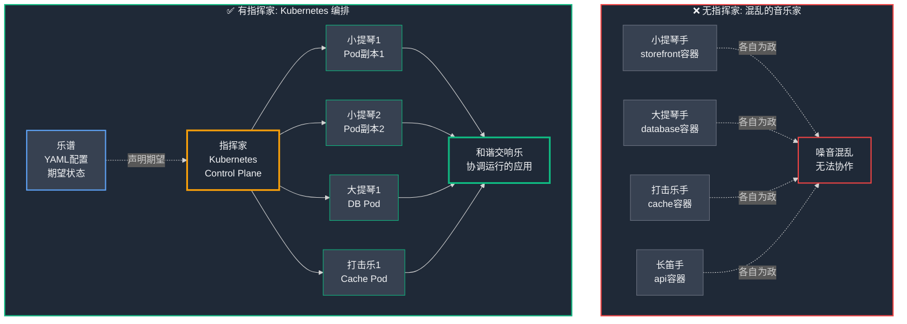
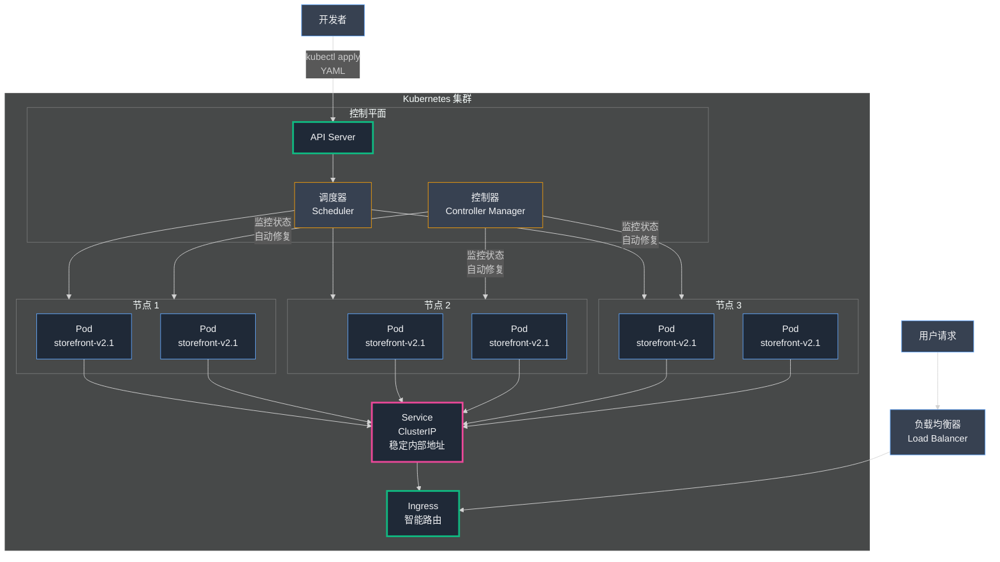

## 第13章：指挥家：用 Kubernetes 编排容器交响乐

Docker 彻底改变了我们的世界。那个臭名昭著的"在我的机器上明明可以工作"的问题烟消云散。我们的部署 (Deployment) 变得高度一致，我们的服务器 (Server) 资源利用率比以往任何时候都更高效。**我们感觉自己发现了一种超能力** ——可以将应用程序的任何部分打包成一个整洁、可移植的标准容器，并在任何地方运行它。

但我们很快发现了这种新力量的**阴暗面**。我们用一支由**数百个**整洁、有序的容器 (Container) 组成的庞大军队，替换掉了原本几十台混乱的虚拟机。然而，**一支军队需要一位将军，一支舰队需要一位海军上将。** 我们新的容器化世界演变成了一种**新形式的混乱**，而我们正试图纯手工管理这一切——这根本不可持续。

本章讲述的是我们进入复杂但强大的**容器编排 (Container Orchestration)** 世界的征程，以及我们如何为容器交响乐团找到真正的指挥家：**Kubernetes（K8s，容器编排平台）**。

### Part 1：没有指挥家的管弦乐队

在我们采用 Docker 之后的前几个月感觉像是生产力的爆发。但随着我们从单体架构 (Monolith) 中分离出更多服务，我们的容器数量从十几个增长到一百多个，运营的现实开始变成一场噩梦。我成了公司薪酬最高、压力最大的手工码头工人。

崩溃点出现在周六凌晨2点。

一个警报把我惊醒："主机无法访问：app-server-07"。我们的一台 EC2 实例遭遇硬件故障并离线了。在过去，这本来是一个用我们的负载均衡器 (Load Balancer) 就能解决的简单问题。但这台服务器一直在为各种服务运行 30 个不同的容器——部分 API、缓存失效器、图像调整大小服务等等。

我的"修复"是一场疯狂的手动抢救。

- 启动一个新的、空的 EC2 实例。
- SSH 进入它并安装 Docker。
- 试图记住哪 30 个容器在死掉的服务器上运行。
- 手动输入 30 个不同的 docker run ... 命令，试图在凌晨2点不在长镜像名称或端口映射中打错字。

我花了将近一个小时进行压力大、容易出错的工作来恢复服务。系统可以工作，但过程很脆弱，依赖于我的记忆和打字技能。这不是一个真正的解决方案。

部署同样令人恐惧。发布 storefront-service 的新版本现在意味着更新我们服务器群中的 50 个运行容器。我们必须进行复杂的手动舞蹈，停止旧容器，启动新容器，等待它健康，然后移到下一个，希望我们不会给用户造成任何停机时间 (Downtime)。

王峰 (王峰) 能看出压力。"你看起来好像一周没睡觉了，"他在我们的一次通话中说。"我们交付得更快了，但你已经成为瓶颈 (Bottleneck)。我们不能让整个公司的稳定性依赖于你手动在终端中输入命令。"

他是对的。我把晚上的时间花在扑灭运营火灾上，而不是白天构建更好的产品。我开始研究其他公司如何大规模管理容器。一个名字不断出现，一个看起来不可能复杂和令人生畏的名字：**Kubernetes**。

学习曲线看起来像一堵垂直的墙。文档充满了奇怪的新词：Pod、Deployment、Service、Ingress、ReplicaSet、YAML 文件。感觉像是在学习一种新的、外星的语言。但承诺太大了，无法忽视。一个自动化、自我修复的系统的承诺。

我告诉王峰，"我需要消失一周。我要把自己锁在房间里学习这个 Kubernetes 东西。我认为这是我们能在下一阶段增长中存活下来的唯一方式。"

#### **识别问题：我们需要一个容器管理器**

我为期一周的深入研究 Kubernetes 兔子洞之旅证实了我的怀疑。我们不只是缺少一个工具；我们缺少整整一类软件。我们的手动过程在四个关键方面失败：

- **没有自我修复：** 当容器崩溃时，它会一直死掉，直到人类重新启动它。当服务器死掉时，它的容器永远消失了，直到人类在别处重建它们。
- **没有智能调度：** 我们手动决定哪些容器应该在哪个服务器上运行，导致效率低下。
- **没有自动化推出：** 部署新代码是一个有风险的、手动的停止和启动容器的过程。
- **没有服务发现：** 当 order-service 容器可以在任何时候在服务器之间启动、停止和移动时，它如何可靠地找到并与 50 个 user-service 容器中的一个通信？

我们不仅需要_运行_容器。我们需要一个系统来自动_管理_它们的整个生命周期。我们需要一个容器编排器。

<br/>

#### **技术深入探讨：什么是容器编排？**

容器编排 (Container Orchestration) 的最佳类比是**交响乐团与指挥家**。



**▲ 图：无指挥家的混乱 vs. Kubernetes 的和谐编排**

**类比展开：**

- **各个容器 = 音乐家** — 每个容器都是一位专业演奏家。`storefront-service` 容器是小提琴手，`database-connector` 是大提琴手，`image-resizer` 是打击乐手。
  
- **没有指挥家的灾难** — 如果你只是把这 100 位才华横溢的音乐家扔进一个房间，告诉他们"开始演奏"，你会得到的是**可怕的、刺耳的混乱噪音**。这正是我们手工管理容器时的真实写照。

**要创造美妙的音乐，你需要一位指挥家 (Conductor)：**

✓ **持有乐谱（期望状态）** — 指挥家知道每个乐章应该如何演奏  
✓ **协调演奏时机** — 他们告诉小提琴何时开始、何时停止  
✓ **控制节奏音量** — 确保整体和谐，不会有人抢拍或跑调  
✓ **应急响应机制** — 如果小提琴手的琴弦断了（容器崩溃），指挥家会无缝地示意另一位小提琴手立即接替

**Kubernetes 就是我们容器管弦乐队的指挥家。**

**关键理解：** Kubernetes **不会替代** Docker。Docker 仍然是每位音乐家演奏的乐器（容器运行时）。Kubernetes 是**主大脑**，它告诉服务器集群中的所有 Docker 实例该做什么。它确保最终的表演——我们运行的应用系统——**精确匹配乐谱（YAML 配置文件）所描述的期望状态**。

---

我们找到了梦寐以求的指挥家。现在，是时候学习如何阅读和编写他的音乐语言——理解 **Pod、Service、Deployment** 等 Kubernetes 核心概念。

### Part 2：学习乐谱

我为期一周的深入研究 Kubernetes 是一次谦卑的经历。很明显，这是解决我们问题的答案，但概念是抽象的，术语是陌生的。要指挥我们新的容器管弦乐队，我首先必须学习指挥家的语言。

我发现 Kubernetes 建立在几个简单、强大的想法上。一旦你理解了这些核心构建块，整个系统就开始变得有意义。

#### **技术深入探讨：核心 Kubernetes 组件**

让我们分解 Kubernetes 的基本词汇。

**1. 节点 (Node)：音乐家的椅子**

一个 **节点 (Node)** 是单个服务器——作为我们舰队一部分的物理或虚拟机。它是一台工作机器，已配置为 Kubernetes "集群 (Cluster)" 的一部分。它的工作是准备好并等待来自指挥家的指令。

- **类比：** **节点**是管弦乐队舞台上的椅子。它们是音乐家将坐下来演奏的物理位置。我们拿出我们的 EC2 实例群，在它们上安装必要的 Kubernetes 软件，它们就成为了我们新集群中的节点——一组空的、准备使用的椅子。

**2. Pod：音乐家**

这是最基本的概念。在 Docker 世界中，最小的单元是容器。在 Kubernetes 世界中，最小的可部署单元是 **Pod**。

Pod 是一个或多个容器的包装器。对于 99% 的情况，最简单的是将 **Pod 视为单个运行的容器**。

- **类比：** **Pod** 是**坐在椅子上的单个音乐家**。Pod 为容器提供直接环境——网络、存储、存在的空间。我们从不告诉 Kubernetes "运行容器"。我们总是告诉它"创建 Pod"，Pod 的配置指定在其中运行哪个容器镜像 (Image)。这个额外的抽象层是 Kubernetes 力量的来源。

**3. 服务 (Service)：部门路标**

Pod 是凡人。它们可以崩溃并被替换。当 Kubernetes 替换崩溃的 Pod 时，新的 Pod 将有一个全新的、不同的内部 IP 地址 (IP Address)。这产生了一个巨大的问题：如果我们的 storefront-service Pod 需要与我们的 api-service Pod 通信，当它们的地址不断变化时，它们如何找到它们？

答案是 **服务 (Service)**。Service 为一组 Pod 提供单个、稳定的网络端点（一致的 IP 地址和 DNS 名称）。

- **类比：** 乐团有 20 位小提琴手（Pod）。您不希望指挥家必须跟踪每位小提琴手的个人姓名。相反，在他们的部门前面有一个大路标，上面写着"**小提琴 (Violins)**"（服务）。Service 知道哪些小提琴手目前是健康和在场的。当 storefront-service 想要与 API 通信时，它不会要求特定的 Pod；它只是向 "api-service" 的稳定地址发送请求。Service 充当内部负载均衡器，接收请求并将其转发到后面的一个健康的 API Pod。如果一个 API Pod 死亡并被替换，Service 会自动更新其健康端点列表。storefront 永远不知道或不关心。

**4. 部署 (Deployment)：乐谱**

这是所有一切汇聚的地方。**Deployment（部署）** 是我们人类描述我们期望状态的地方。它是告诉指挥家我们希望乐团演奏什么的蓝图。

- **类比：** **Deployment** 是交给指挥家的**乐谱**。这个乐谱包含所有关键指令：
  - **"我需要 50 个 storefront-service Pod 的副本。"**（这个部门应该有多少音乐家）。
  - **"它们必须使用 Docker 镜像 dukaan/storefront:v2.1。"**（他们应该演奏哪个版本的乐器）。
  - **"当我给你新版本的音乐时，执行滚动更新：一个一个地更换音乐家，这样音乐永远不会停止。"**（在不停机的情况下部署新代码的策略）。

Kubernetes 的真正魔力在于它如何处理这个乐谱。指挥家（Kubernetes 控制平面）处于一个恒定的循环中，将 Deployment（期望状态）与舞台上实际发生的情况（当前状态）进行比较。

如果乐谱说应该有 50 个 storefront Pod，但指挥家只数到 49 个，因为一个刚刚崩溃了，它不会恐慌。它只是说，"当前状态与期望状态不匹配"，并立即在健康的节点上创建一个新的 storefront Pod，将计数恢复到 50。这就是我们梦寐以求的自我修复能力。

我们理解了这些概念。我们有词汇来描述我们的需求：我们想要一个 **Deployment** 来管理在我们的 **节点**上运行的一组 **Pod**，以及一个 **Service** 让它们彼此通信。

现在，是时候学习如何编写乐谱本身了。

### Part 3：编写乐谱 (YAML)

我们已经学习了概念。我们知道 Kubernetes 是指挥家，将使用我们期望状态的"乐谱"来管理我们的容器管弦乐队。现在是时候学习如何编写那个音乐了。这意味着接受一种关于基础设施的新思维方式，并学习 Kubernetes 的语言：**YAML**。

#### **技术深入探讨：声明式 vs 命令式**

这是迁移到 Kubernetes 时最重要的哲学转变。

- **旧方式（命令式，Imperative）：** 这是我们一直在工作的方式。我们给系统一系列逐步的命令。"SSH 进入服务器 A。运行这个 docker run 命令。现在 SSH 进入服务器 B。运行这个其他的 docker run 命令。"
  - **类比：** 你是一个微观管理者，告诉学徒_如何_建造椅子。"首先，拿四条腿。接下来，找到座位。现在，用三个螺丝固定左前腿......"这很乏味，容易出错，而且如果出了问题就不能适应。
- **Kubernetes 方式（声明式，Declarative）：** 这是完全不同的。你不告诉 Kubernetes _如何_做某事。你只是描述你想要实现的**最终状态**，然后让 Kubernetes 找出到达那里的最佳方式。
  - **类比：** 你是一个客户，给专家木匠一张椅子的详细蓝图。你说，"我想要一把看起来完全像这样的椅子。它必须有四条腿，涂成蓝色，高 20 英寸。"你不告诉他们先固定哪条腿。专家木匠（Kubernetes）拿着你的蓝图（你的配置文件）并使其成为现实。如果他们建造它并注意到一条腿摇晃，他们会修复它。如果他们注意到颜色不对，他们会重新粉刷。他们的全部工作就是不断努力使现实与蓝图相匹配。

这就是魔力。你声明你的期望状态，Kubernetes 在后台不知疲倦地工作，作为一个"协调引擎"来强制执行它。这个声明式模型的蓝图是用一种称为 **YAML** 的格式编写的。YAML 是一种人类可读的数据格式，使用简单的缩进和键值对来描述配置。

#### **技术深入探讨：我们的第一个 Deployment YAML**

是时候为我们的 storefront-service 编写乐谱了。我们创建了一个名为 storefront-deployment.yaml 的文件。一开始看起来很吓人，但它只是对我们想要的东西的精确描述。

让我们逐行分解我们的第一个 Deployment 蓝图。

```yaml
# 1. API 版本和 Kind 告诉 Kubernetes 这是什么类型的对象。
# 我们正在创建一个 "Deployment"。
apiVersion: apps/v1
kind: Deployment

# 2. Metadata 是关于对象本身的数据，比如它的名称。
metadata:
  name: storefront-deployment

# 3. Spec（规范）是最重要的部分。
# 这是我们的期望状态——椅子的蓝图。
spec:
  # 4. 我们想要运行 50 个相同的应用程序副本。
  replicas: 50

  # 5. 这告诉 Deployment 如何找到它应该管理的 Pod。
  # 它寻找任何具有标签 "app: storefront" 的 Pod。
  selector:
    matchLabels:
      app: storefront

  # 6. 这是 Pod 本身的模板或蓝图。
  # Deployment 将基于此模板创建 50 个 Pod。
  template:
    metadata:
      # 7. 我们给 Pod 一个标签，以便 Deployment 可以找到它们。
      labels:
        app: storefront

    spec:
      # 8. 本节定义要在 Pod 内运行的容器。
      containers:
        - name: storefront-container
          # 9. 这是最关键的一行：要运行的特定 Docker 镜像。
          image: dukaan/storefront:v2.1

          # 10. 告诉 Kubernetes 我们的应用程序在容器内监听哪个端口。
          ports:
            - containerPort: 8000
```

#### **kubectl apply 的魔力**

这个 YAML 文件只是一个文本文件。它本身什么也不做。我们需要一种方法将这个乐谱交给我们的指挥家。执行此操作的命令是 kubectl（发音为"koob-control"），这是与 Kubernetes 集群交互的主要工具。

我们运行了一个命令：

> kubectl apply -f storefront-deployment.yaml

然后，魔法开始了。

Kubernetes 读取了我们的文件。它看到期望状态是"运行 dukaan/storefront:v2.1 镜像的 50 个 Pod"。它查看了集群的当前状态，看到"0 个匹配的 Pod"。协调循环启动了。Kubernetes 的调度器 (Scheduler) 智能地在我们的各个节点上找到空间，并在接下来的几秒钟内启动了我们 storefront Pod 的 50 个副本。

当我们需要部署更新时，真正的力量变得清晰了。我们有一个新版本的代码，v2.2。我们只是编辑了 YAML 文件并更改了一行：image: dukaan/storefront:v2.2。

然后，我们运行了**完全相同的命令**：kubectl apply -f storefront-deployment.yaml。

我们不必告诉 Kubernetes 如何执行更新。它查看了新蓝图，将其与运行系统进行比较，并理解了差异。它自动启动了"滚动更新"，杀死一个旧的 v2.1 Pod 并启动一个新的 v2.2 Pod，等待它健康后再移动到下一个。它在所有 50 个副本上执行此操作，没有任何停机时间。这是我们一直梦想的安全、自动化和无聊的部署过程。

我们已经把乐谱交给了指挥家，管弦乐队开始演奏。但到目前为止，他们在一个隔音的房间里演奏。我们仍然需要一种方法来打开门，让观众——我们的用户——听到音乐。

### Part 4：打开音乐厅的大门

我们已经成功地把乐谱交给了指挥家。我们的 Kubernetes 集群 (Cluster) 是活的，我们的 storefront-deployment 正在尽职地维护正好 50 个运行的 Pod，根据需要修复和替换它们。管弦乐队演奏得很完美。

只有一个问题：他们在一个完全隔音的房间里演奏。

我们的 Pod 在集群内的私有内部网络上运行。外部互联网上的任何人都无法访问它们。我们有一个没有观众的管弦乐队。最后一步是创建一种安全可靠的方式来打开门，让我们的用户进来听音乐。这是 Kubernetes **服务 (Service)** 的工作。

我们已经讨论过 Service 如何为 Pod 提供稳定的内部地址以便彼此_通信_。但 Service 也可以配置为向外部世界公开这些 Pod。这就是你必须选择**服务类型 (Service Type)** 的地方。

#### **技术深入探讨：Kubernetes 服务类型解释**

Kubernetes 提供了几种打开门的方式，每种都是为不同的用例设计的。选择正确的方式对于构建安全且具有成本效益的系统至关重要。

**1. ClusterIP：私人对讲机**

这是默认的 Service 类型。它提供一个**仅从集群内部可访问**的稳定 IP 地址。

- **类比：** 这是音乐厅内的私人**对讲系统**。指挥家可以用它与"小提琴"部门通话，"小提琴"可以用它与"打击乐"部门通话。但站在音乐厅外面街道上的人无法访问这个对讲系统。
- **用例：** 这是所有内部服务到服务通信的主力。当我们的 order-service 需要从我们的 user-service 获取数据时，它将与 user-service 的 ClusterIP 通信。这是最常见和最安全的服务类型。

**2. NodePort：消防通道**

NodePort 服务将内部 ClusterIP 暴露在集群中**每个节点**的特定高编号端口上。

- **类比：** 这就像在每个音乐家的椅子（节点）旁边打开一个**消防通道门**。如果你知道建筑物的主地址和特定的消防通道门号（例如，Node_IP:30080），你可以直接访问该服务。这有点笨拙，你必须知道去哪栋楼，但这是一种快速进入的方式。
- **用例：** 这主要用于**调试 (Debugging) 或临时访问**。开发人员可能使用 NodePort 快速测试新服务，而无需设置适当的负载均衡器的麻烦。它通常不用于真正的生产流量，因为它不安全，并且需要客户端知道特定节点的 IP。

**3. LoadBalancer：主入口**

这是在 阿里云 或 腾讯云 等云提供商上将服务公开到互联网的标准、最常见的方式。当您创建 LoadBalancer 类型的 Service 时，您会获得 NodePort 提供的所有内容，但 Kubernetes 还会自动为您配置一个真实的外部云负载均衡器。

- **类比：** 这是音乐厅的宏伟**主入口和售票柜台**。云提供商构建了一个适当的、面向公众的入口（具有公共 IP 地址的负载均衡器）。这个入口接收所有进来的观众（互联网流量），并自动将他们引导到一个可用的消防通道门（NodePort），然后引导他们到正确的音乐家（Pod）。
- **用例：** 这是向互联网公开单个服务的完美方式。如果你有一个主要的 API，你为它创建一个 LoadBalancer 类型的 Service，你的云提供商会给你一个单一的、稳定的 IP 地址，你可以将你的域名指向它。

**4. Ingress：智能礼宾员**

LoadBalancer 服务很棒，但它有一个缺点：每次创建一个时，你都会配置一个新的云负载均衡器，这可能会变得昂贵。如果你有 10 个不同的服务想要公开怎么办？你不想为 10 个单独的负载均衡器付费。

这就是 **Ingress** 的用武之地。Ingress 本身不是一种 Service 类型，而是位于多个服务前面的更智能、更强大的层。

- **类比：** **Ingress** 就像一个庞大建筑物前台的智能**礼宾员**，该建筑物容纳多个音乐厅。观众来到一个单一的主入口（一个负载均衡器）。他们向礼宾员出示他们的票。礼宾员看着票说，"啊，你是来听摇滚音乐会的（/rock），请去 A 厅。你是来听古典演出的（/classical），请去 B 厅。"
- **用例：** 这是管理微服务架构 (Microservices Architecture) 外部访问的最具成本效益和最强大的方式。你使用一个 LoadBalancer 服务将流量引入你的 Ingress 控制器。然后 Ingress 使用一组规则根据 URL 路径（/api、/storefront）或主机名（api.xiaodiantong.com、store.xiaodiantong.com）将流量路由到不同的内部 ClusterIP 服务。

#### **我们的实现**

对于我们的 storefront-service，我们使用了 Ingress。这是完美的选择。我们为整个集群提供了一个主负载均衡器，我们的 Ingress 控制器充当智能礼宾员。我们创建了一条规则，说"任何到 xiaodiantong.com/store/\* 的流量都应该路由到 storefront-service 的内部 ClusterIP。"

我们为 Ingress 规则又写了一个 YAML 文件，运行 kubectl apply，就这样，音乐厅的大门打开了。公共互联网现在可以访问我们的 storefront-service，它在我们新的 Kubernetes 集群内作为 50 个自我修复、自动管理的 Pod 运行。

我们做到了。我们驯服了数百个容器的混乱。我们有一个管弦乐队的指挥家。

---

<div style="border: 2px solid #3b82f6; border-radius: 8px; padding: 20px; margin: 30px 0; background: linear-gradient(to right, #1e40af08, #2563eb08);">

### 📌 编者注:Kubernetes生产级实战速查

*20分钟掌握kubectl命令、YAML配置和故障排查*

---

#### **一、本地K8s环境快速搭建**

```bash
# 方案1: k3d (推荐,最轻量)
curl -s https://raw.githubusercontent.com/k3d-io/k3d/main/install.sh | bash
k3d cluster create xiaodiantong-dev --agents 2 --port 8080:80@loadbalancer

# 方案2: Minikube (功能完整)
curl -LO https://storage.googleapis.com/minikube/releases/latest/minikube-linux-amd64
sudo install minikube-linux-amd64 /usr/local/bin/minikube
minikube start --cpus=4 --memory=8192 --driver=docker

# 安装kubectl
curl -LO "https://dl.k8s.io/release/$(curl -L -s https://dl.k8s.io/release/stable.txt)/bin/linux/amd64/kubectl"
sudo install -o root -g root -m 0755 kubectl /usr/local/bin/kubectl

# 验证安装
kubectl cluster-info
kubectl get nodes
```

---

#### **二、storefront-service完整部署配置**

```yaml
# storefront-deployment.yaml
apiVersion: apps/v1
kind: Deployment
metadata:
  name: storefront-service
  namespace: production
  labels:
    app: storefront
    version: v2.1
spec:
  replicas: 5  # 副本数量
  strategy:
    type: RollingUpdate  # 滚动更新策略
    rollingUpdate:
      maxSurge: 2        # 更新时最多多2个Pod
      maxUnavailable: 1  # 更新时最多1个Pod不可用
  selector:
    matchLabels:
      app: storefront
  template:
    metadata:
      labels:
        app: storefront
        version: v2.1
    spec:
      # 反亲和性(Pod分散到不同节点)
      affinity:
        podAntiAffinity:
          preferredDuringSchedulingIgnoredDuringExecution:
          - weight: 100
            podAffinityTerm:
              labelSelector:
                matchExpressions:
                - key: app
                  operator: In
                  values:
                  - storefront
              topologyKey: kubernetes.io/hostname
      
      containers:
      - name: storefront
        image: dukaan/storefront:v2.1
        imagePullPolicy: IfNotPresent
        ports:
        - containerPort: 8000
          name: http
        
        # 环境变量
        env:
        - name: DATABASE_URL
          valueFrom:
            secretKeyRef:
              name: db-credentials
              key: url
        - name: REDIS_URL
          value: redis://redis-master:6379/0
        - name: DJANGO_SETTINGS_MODULE
          value: dukaan.settings_prod
        
        # 资源限制(关键!)
        resources:
          requests:
            cpu: 500m      # 最少需要0.5核
            memory: 512Mi  # 最少需要512MB
          limits:
            cpu: 1000m     # 最多使用1核
            memory: 1Gi    # 最多使用1GB
        
        # 健康检查
        livenessProbe:   # 存活探针(失败则重启Pod)
          httpGet:
            path: /health/
            port: 8000
          initialDelaySeconds: 30
          periodSeconds: 10
          timeoutSeconds: 3
          failureThreshold: 3
        
        readinessProbe:  # 就绪探针(失败则从Service移除)
          httpGet:
            path: /health/ready/
            port: 8000
          initialDelaySeconds: 10
          periodSeconds: 5
          timeoutSeconds: 2
          failureThreshold: 2
        
        # 挂载配置文件
        volumeMounts:
        - name: config
          mountPath: /app/config
          readOnly: true
      
      volumes:
      - name: config
        configMap:
          name: storefront-config

---
# storefront-service.yaml
apiVersion: v1
kind: Service
metadata:
  name: storefront-service
  namespace: production
spec:
  type: ClusterIP
  selector:
    app: storefront
  ports:
  - port: 80
    targetPort: 8000
    protocol: TCP
    name: http
  sessionAffinity: ClientIP  # 会话保持(可选)

---
# storefront-ingress.yaml
apiVersion: networking.k8s.io/v1
kind: Ingress
metadata:
  name: storefront-ingress
  namespace: production
  annotations:
    nginx.ingress.kubernetes.io/rewrite-target: /$2
    nginx.ingress.kubernetes.io/ssl-redirect: "true"
    nginx.ingress.kubernetes.io/rate-limit: "100"  # 限流
    cert-manager.io/cluster-issuer: letsencrypt-prod
spec:
  ingressClassName: nginx
  tls:
  - hosts:
    - xiaodiantong.com
    secretName: xiaodiantong-tls
  rules:
  - host: xiaodiantong.com
    http:
      paths:
      - path: /store(/|$)(.*)
        pathType: Prefix
        backend:
          service:
            name: storefront-service
            port:
              number: 80

---
# storefront-hpa.yaml (水平自动扩缩容)
apiVersion: autoscaling/v2
kind: HorizontalPodAutoscaler
metadata:
  name: storefront-hpa
  namespace: production
spec:
  scaleTargetRef:
    apiVersion: apps/v1
    kind: Deployment
    name: storefront-service
  minReplicas: 5
  maxReplicas: 50
  metrics:
  - type: Resource
    resource:
      name: cpu
      target:
        type: Utilization
        averageUtilization: 70  # CPU超过70%则扩容
  - type: Resource
    resource:
      name: memory
      target:
        type: Utilization
        averageUtilization: 80
  behavior:  # 扩缩容策略
    scaleDown:
      stabilizationWindowSeconds: 300  # 缩容前稳定5分钟
      policies:
      - type: Percent
        value: 50  # 每次最多缩容50%
        periodSeconds: 60
    scaleUp:
      stabilizationWindowSeconds: 0  # 立即扩容
      policies:
      - type: Percent
        value: 100  # 每次最多扩容100%
        periodSeconds: 15

# 部署命令
# kubectl apply -f storefront-deployment.yaml
# kubectl apply -f storefront-service.yaml
# kubectl apply -f storefront-ingress.yaml
# kubectl apply -f storefront-hpa.yaml
```

---

#### **三、kubectl核心命令速查**

```bash
# === 查看资源 ===
kubectl get pods -n production               # 查看Pod列表
kubectl get pods -o wide                     # 显示更多信息(节点/IP)
kubectl get pods -w                          # 实时监控
kubectl get pods --selector app=storefront   # 按标签筛选
kubectl describe pod storefront-abc123       # 详细信息
kubectl logs storefront-abc123 -f            # 查看日志(实时)
kubectl logs storefront-abc123 --previous    # 查看前一个容器日志(崩溃时)
kubectl top pods                             # 查看资源使用情况

# === 调试操作 ===
kubectl exec -it storefront-abc123 -- bash   # 进入容器
kubectl port-forward pod/storefront-abc123 8000:8000  # 端口转发
kubectl cp storefront-abc123:/app/logs/error.log ./local.log  # 复制文件

# === 部署管理 ===
kubectl apply -f deployment.yaml             # 创建/更新资源
kubectl rollout status deployment/storefront # 查看滚动更新状态
kubectl rollout history deployment/storefront # 查看历史版本
kubectl rollout undo deployment/storefront   # 回滚到上一版本
kubectl rollout undo deployment/storefront --to-revision=3  # 回滚到指定版本
kubectl scale deployment storefront --replicas=10  # 手动扩容

# === 故障排查 ===
kubectl get events --sort-by='.lastTimestamp'  # 查看集群事件
kubectl get pod storefront-abc123 -o yaml      # 查看Pod完整配置
kubectl delete pod storefront-abc123           # 删除Pod(会自动重建)
kubectl drain node-1 --ignore-daemonsets --delete-emptydir-data  # 驱逐节点(维护时)

# === ConfigMap & Secret ===
kubectl create configmap storefront-config --from-file=config.yaml
kubectl create secret generic db-credentials \
  --from-literal=url=postgresql://user:pass@db:5432/dukaan
kubectl get secret db-credentials -o jsonpath='{.data.url}' | base64 -d  # 查看Secret内容

# === 快捷别名(添加到~/.bashrc) ===
alias k='kubectl'
alias kgp='kubectl get pods'
alias kgs='kubectl get svc'
alias kgd='kubectl get deployments'
alias kdp='kubectl describe pod'
alias kl='kubectl logs -f'
alias kex='kubectl exec -it'
```

---

#### **四、常见故障排查流程**

| 问题症状 | 排查命令 | 可能原因 |
|---------|---------|---------|
| **Pod一直Pending** | `kubectl describe pod` | 资源不足,调度失败,PVC未绑定 |
| **Pod崩溃重启(CrashLoopBackOff)** | `kubectl logs --previous` | 应用启动失败,健康检查失败 |
| **Pod状态ImagePullBackOff** | `kubectl describe pod` | 镜像不存在,私有仓库认证失败 |
| **服务无法访问** | `kubectl get endpoints` | Selector不匹配,Pod未就绪 |
| **HPA不生效** | `kubectl get hpa`,`kubectl top pods` | Metrics Server未安装,资源未达阈值 |

```bash
# 完整排查流程示例
# 1. 查看Pod状态
kubectl get pods -n production | grep storefront

# 2. 查看详细事件
kubectl describe pod storefront-abc123 -n production | tail -20

# 3. 查看日志
kubectl logs storefront-abc123 -n production --tail=100

# 4. 检查健康检查端点
kubectl exec storefront-abc123 -n production -- curl -s http://localhost:8000/health/

# 5. 查看资源使用
kubectl top pod storefront-abc123 -n production

# 6. 查看Service endpoints
kubectl get endpoints storefront-service -n production

# 7. 测试Service连通性
kubectl run test-pod --rm -it --image=curlimages/curl -- \
  curl http://storefront-service.production.svc.cluster.local/health/
```

---

#### **五、生产环境最佳实践Checklist**

**资源管理:**
- [ ] 所有Pod设置`requests`和`limits`(防止资源争抢)
- [ ] 使用HPA自动扩缩容
- [ ] 设置PodDisruptionBudget(保证最小可用副本数)
- [ ] 配置ResourceQuota限制命名空间资源

**高可用:**
- [ ] 生产环境至少3个副本
- [ ] 配置Pod反亲和性(分散到不同节点)
- [ ] 设置合理的健康检查(liveness/readiness)
- [ ] 使用滚动更新策略(`RollingUpdate`)

**安全:**
- [ ] 使用Secret存储敏感信息(不用ConfigMap)
- [ ] 启用RBAC权限控制
- [ ] 镜像使用明确版本标签(不用`:latest`)
- [ ] 定期扫描镜像漏洞

**监控告警:**
- [ ] 部署Prometheus+Grafana
- [ ] 配置关键指标告警(CPU/内存/重启次数)
- [ ] 集成日志聚合(ELK/Loki)
- [ ] 设置PagerDuty/Slack告警通知

```yaml
# PodDisruptionBudget示例
apiVersion: policy/v1
kind: PodDisruptionBudget
metadata:
  name: storefront-pdb
spec:
  minAvailable: 3  # 至少保证3个Pod可用
  selector:
    matchLabels:
      app: storefront
```

---

#### **六、监控集成(Prometheus)**

```yaml
# servicemonitor.yaml
apiVersion: monitoring.coreos.com/v1
kind: ServiceMonitor
metadata:
  name: storefront-monitor
  namespace: production
spec:
  selector:
    matchLabels:
      app: storefront
  endpoints:
  - port: http
    path: /metrics
    interval: 15s

# 关键指标
- kube_pod_status_phase{phase="Running"}  # Pod状态
- kube_pod_container_resource_requests   # 资源请求
- kube_pod_container_resource_limits     # 资源限制
- container_cpu_usage_seconds_total      # CPU使用
- container_memory_working_set_bytes     # 内存使用
- kube_deployment_status_replicas        # 副本数
```

---

**📊 小店通 K8s收益:**
```
━━━━━━━━━━━━━━━━━━━━━━━━
自动扩容        手动 → 自动HPA  (响应时间<30s)
资源利用率      35% → 78%  (+123%)
部署速度        15min → 2min  (-87%)
服务可用性      99.5% → 99.95%  (+0.45%)
运维人力成本    -60%  (自动化运维)
━━━━━━━━━━━━━━━━━━━━━━━━
```

</div>

---

#### Kubernetes 架构图



## 第13章：关键要点

- **Kubernetes 是容器交响乐团的指挥家。** 它用自动化的、声明式的智能编排，替代了手动的、容易出错的运维苦力活，将运维工程师从琐碎重复中解放出来。

- **拥抱声明式配置思维模式。** 不要告诉 Kubernetes **如何 (How)** 做某事（命令式），而是用 YAML 文件描述你想要的**最终状态 (What)**（声明式），Kubernetes 的协调引擎会不知疲倦地工作，确保现实始终匹配期望。

- **理解四大核心组件：**  
  • **Node（节点）** — 工作机器/服务器  
  • **Pod** — 最小部署单元，通常包含一个容器  
  • **Deployment** — 管理 Pod 副本的蓝图和控制器  
  • **Service** — 为 Pod 提供稳定网络端点的抽象层

- **自我修复是内置超能力。** 如果 Pod 崩溃或节点宕机，Deployment 控制器会自动检测并替换故障实例，无需人工干预，始终维持声明的副本数量。

- **选择合适的服务暴露方式：**  
  • **ClusterIP** — 仅集群内部通信（默认）  
  • **NodePort** — 开发调试临时访问  
  • **LoadBalancer** — 单个服务的云负载均衡器  
  • **Ingress** — 多服务的智能路由网关（推荐生产环境使用）

- **声明式 vs. 命令式是哲学转变。** 从"SSH 登录执行脚本"（命令式）转向"定义期望状态 YAML"（声明式），这是基础设施管理的范式革命——Infrastructure as Code 的终极形态。

### Part 4：追求极速（构建世界级边缘网络）

我们从头开始重建了公司的引擎。我们从一个单一的、溅射的服务器变成了一个由 Kubernetes 管理的弹性的、自我修复的、可扩展的容器管弦乐队。我们解决了稳定性、一致性和工作流的问题。我们建造了一座堡垒，我们相信它可以经受任何风暴。

本书的这一部分是关于接下来会发生什么。这是关于一场意外的飓风袭击我们堡垒的时刻，以及它保持屹立不倒的惊人原因。这是关于我们如何发现在潮汐中生存的秘密不是更大的墙，而是更好的海岸线的故事。

<br/>

