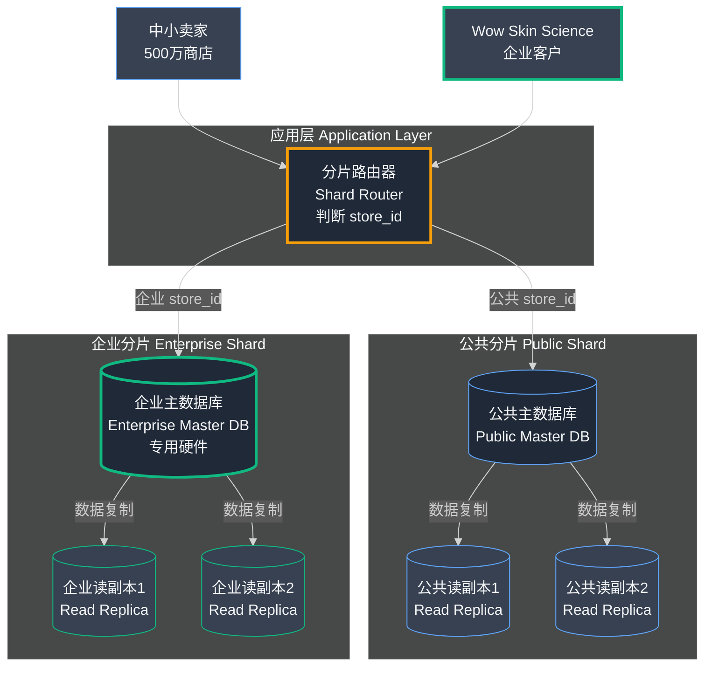
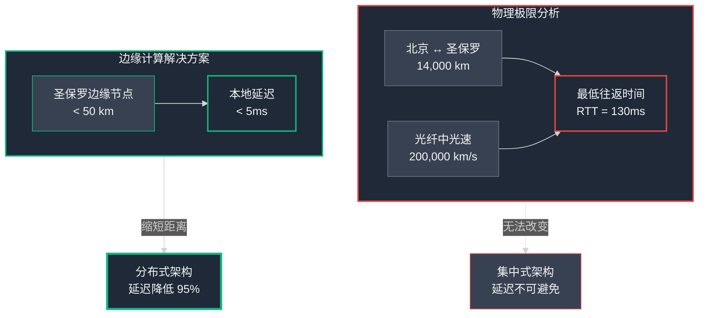

## 第14章：鲨鱼池效应：烈火试炼

在中国创业生态系统中，没有什么比"鲨鱼池效应"更伟大、更可怕、更令人渴望的事件了。当一家小企业在极受欢迎的电视节目_鲨鱼池中国版 (Shark Tank 中国)_ 上出现时，他们的网站流量不只是增加；而是在几分钟内经历了数十万好奇观众的近乎垂直的激增。这是对任何电商平台的终极烈火试炼。

我们以为我们新的 Kubernetes 集群 (Cluster) 已经准备好了。事实是，没有任何集中式系统能够做到。

### Part 1：不可能的峰值

那是一个安静的周四晚上。值班工程师正在处理一些小警报。晚上 9:45，消息出现在我们公司的 Slack 中："**伙计们！Jain Shikanji 现在正在鲨鱼池节目上！**"

每个人都立即打开了我们的 Grafana 监控 (Monitoring) 仪表盘。我们都在看同一个图表："并发用户数"。一直徘徊在几百左右的曲线突然变成了一堵垂直的墙。它冲过 10,000，然后是 30,000，然后是 50,000，在令人震惊的 **80,000 并发用户**处达到峰值。

Slack 上出现了紧张的沉默。在我们脑海中，我们都在做数学计算。我们的 storefront-service 在 10 个 Pod 上运行。即使进行了最佳优化，这 10 个 Pod 也不可能处理 80,000 个同时在线用户。我们都在看"Pod 计数"图表，等待我们的水平 Pod 自动扩展器 (Horizontal Pod Autoscaler) 启动并开始其英勇的扩展。

但一件奇怪的事情正在发生。用户流量处于不可能的峰值，但我们在北京的 10 个 Pod 上的 CPU 只是略有升高。HPA 看到 CPU 没有达到其 70% 的危机阈值，几乎没有添加任何新 Pod。网站仍然快如闪电。没有警报。什么都没有坏。

一位高级工程师在 Slack 中打破了沉默："我不明白。数学对不上。10 个 Pod 如何在不融化的情况下服务 80,000 个并发？HPA 甚至还没有时间做出反应。发生了什么？"

他是对的。我们都感觉到了。堡垒坚守住了，但不是因为我们想的那个原因。我们幸存下来了，但感觉就像我们意外发现了一个我们不知道自己拥有的秘密超能力。

#### **技术深入探讨：响应式自动扩展的局限性**

要理解那天晚上的谜团，你首先需要理解为什么我们计划的防御 HPA 会失败。

典型的自动扩展循环，如 Kubernetes HPA 使用的循环，是**响应式的 (Reactive)**。它不会预测流量；它对流量的影响做出反应。该过程有几个步骤，每个步骤都需要时间：

- **指标收集 (Metric Collection)：** 一个称为 Metrics Server 的组件从所有 Pod 中抓取数据（如 CPU 使用率）。这不会实时发生；它以设定的间隔发生，通常每 15 到 30 秒一次。
- **检测和决策：** HPA 控制器分析此数据。它看到 CPU 已经飙升，并计算需要多少新 Pod 才能将平均值降低到目标。这一步很快，但它只能在_收集指标后_发生。
- **Pod 启动：** 这是最慢的部分。Kubernetes 必须将新 Pod 调度到可用的节点 (Node) 上。然后节点必须拉取 Docker 镜像 (Image)（这可能需要时间）并启动容器 (Container)。最后，容器内的应用程序需要启动并"准备好"为流量提供服务。

从初始流量峰值到新 Pod 实际为用户提供服务的总时间可能轻易达到 **2 到 5 分钟**。

**为什么 HPA 在"山洪"面前失败**

"鲨鱼池效应"不是涨潮；它是海啸。流量在不到 60 秒的时间内从接近零到绝对峰值。

- **类比：** 响应式自动扩展就像注意到开始下大雨，决定在你的房子上建一个扩建部分以保持一切干燥。当你打好地基时，山洪已经席卷了你的城镇。

当 HPA 可以将我们的集群从 10 个 Pod 扩展到它需要的 150 个时，最初的、压倒性的 80,000 用户浪潮已经一次又一次地淹没并使原来的 10 个 Pod 崩溃了十几次。

那么，如果 HPA 太慢而不能成为英雄，是什么拯救了我们？

我们幸存下来的原因不是因为我们在北京的中央 Kubernetes 集群及时扩展了。它幸存下来是因为**那 80,000 用户负载的绝大部分甚至从未到达我们的中央集群。**

它被我们为完全不同的原因已经构建的高度可扩展的、大规模分布式的**边缘网络 (Edge Network)** 吸收和服务：追求极速的探索。这个网络就像一个全球减震器，在海啸的力量到达我们的主城市之前，将其分散到数十个较小的位置。我们_如何_以及_为什么_构建这个网络的故事是我们旅程的下一章。

Jain Shikanji 事件对我们来说是一个分水岭时刻。这是对我们平台隐藏力量的意外发现。但这种力量根本不是意外。这是我们几个月前开始的深思熟虑和痴迷探索的直接结果。一个与流量峰值无关，而与我们最大的全球竞争对手有关的探索。

这是我们如何向 有赞 宣战的故事，以及我们如何决定让速度成为我们最重要的功能的故事。

## 第15章：对 有赞 的战争：性能即功能

到这个时候，小店通 在中国市场已经是一个知名品牌。我们增长很快。但为了吸引更大的卖家并在国际上扩张，我们不断与电商全球巨头进行比较：**有赞**。

王峰 (王峰)，我的联合创始人，对此非常痴迷。他会花费白天和黑夜注册 有赞 试用，分析他们的商店，并与使用这两个平台的商家交谈。他在寻找一个弱点，他们盔甲上的一道裂缝。

一天晚上，他打电话给我，兴奋得像一位刚刚找到敌人秘密弱点的将军。

"陈浩 (陈浩)，我找到了，"他说，声音低沉而兴奋。"我知道我们如何能赢。他们的商店在这里很慢。真的很慢。一个典型的 有赞 商店在中国的客户加载需要三、有时四秒钟。"

他是对的。有赞 的基础设施主要位于北美。对于他们的核心市场来说，它很快。但对于德里或深圳的客户来说，每个请求都必须穿越半个地球往返。

"这是我们的机会，"王峰继续说。"我们现在无法在功能上超越他们，他们有 10 年的领先优势。但我们可以更快。不只是快一点。如果我们可以_即时_快，在世界任何地方？这是一个没人能忽视的功能。"

那次谈话改变了一切。我们公司的使命转变了。我们不再只是构建一个易于使用的电商平台。我们正在追求构建地球上最快的电商体验。要做到这一点，我首先必须了解我们新敌人的基本物理学：**延迟 (Latency)**。

#### **技术深入探讨：互联网的物理学**

为什么在美国托管的 有赞 商店在中国很慢？答案与服务器功率关系不大，而与物理定律关系更大。

**概念：延迟是真正的瓶颈**

当你衡量一个网站加载需要多长时间时，你在衡量两件事：

- **处理时间 (Processing Time)：** 服务器思考、查询数据库 (Database) 和构建页面需要多长时间。
- **网络时间 (Network Time)：** 您的请求到达服务器以及服务器的响应返回给您需要多长时间。

到目前为止，我们一直在优化处理时间。但网络时间受到一个硬性的、不可打破的物理限制的控制：**光速**。

互联网上的数据通过光纤电缆以大约三分之二的光速传播。从中国北京到美国弗吉尼亚州的数据中心（一个主要的托管中心）的距离约为 13,000 公里。单个数据包的往返距离为 26,000 公里。

让我们做个数学计算：

- 光纤中的光速：约 200,000 公里/秒
- 往返距离：26,000 公里
- 最小理论时间：26,000 公里 / 200,000 公里/秒 = 0.13 秒或 **130 毫秒 (ms)**。

这是**往返时间 (RTT, Round Trip Time)**。130ms 是中国浏览器和美国服务器之间的单次对话可能达到的绝对最快速度。

但加载安全网页不是一次对话；这是一系列必须按顺序发生的对话：

- **DNS 查询 (DNS Lookup)：** "这个域名的 IP 地址是什么？"（1 次往返）
- **TCP 握手 (TCP Handshake)：** "你好服务器，我想开始一个连接。"（1 次往返）
- **TLS 握手 (TLS Handshake)：** "让我们建立一个安全的、加密的连接。"（2 次往返）
- **HTTP 请求 (HTTP Request)：** "好的，现在请给我发送实际的网页。"（1 次往返）

仅仅为了获得 HTML 页面的第一个字节，中国的用户必须等待至少 5 次往返。

> 5 次往返 * 130ms/次 = 650ms

这意味着在美国托管的 有赞 商店对中国用户来说_至少_有 650ms 的延迟，甚至在任何东西开始出现在屏幕上之前。而这还没有考虑网络拥塞和下载所有图像、CSS 和 JavaScript 文件所需的时间。3-4 秒的加载时间是不可避免的。这是物理学征收的税。

我们不能让光速更快。我们不能让我们的用户更靠近 有赞 的服务器。所以，我们决定做唯一可能的另一件事。

我们将把服务器移到更靠近用户的地方。到处都是。同时。我们即将进入**边缘计算 (Edge Computing)** 的世界。

### Part 2：证据和确凿证据

我们有一个植根于物理定律的理论，即我们最大的竞争对手有一个关键弱点。但理论还不够。为了证明大规模工程努力和公司战略全面转变的合理性，我们需要冷酷、确凿的数据。我们需要证明它。

所以，我们公开了。在 X（前身为 Twitter）上的一系列帖子中，我向全世界阐述了我们的论点。我提出了一个大胆、直接的声明：**"有赞 有一个严重的性能问题。"**

**证据：中国顶级品牌**

我们不只是提出声明；我们展示了我们的工作。我们选取了中国四个最顶级、最受尊敬的 D2C 品牌，它们都在 有赞 上运行，并对它们进行了测试：**boAt、Bummer、Urbanmonkey 和 Hammer**。

我们从中国测试位置通过标准性能分析工具运行了他们的主页。结果清晰而一致：加载时间慢、性能评分低以及用户体验迟缓。

我们的公开运动开始引起关注，甚至引起了 有赞 自己的性能工程总监科林·本德尔 (Colin Bendell) 的回应。他驳斥了我们的发现，将缓慢归咎于一个常见的替罪羊："**现在不应该是这样，最常见的问题是 3P 内容**"（第三方内容）。

他暗示问题不是 有赞 的平台，而是卖家自己的应用程序、分析脚本和营销标签。这是一个合理的解释，它把责任推回给了商家。但我们知道他错了，我们决心证明这一点。

**确凿证据：加拿大 vs 中国测试**

为了反驳"3P 内容"理论，我们设计了一个简单但具有毁灭性的实验。我们选取了相同的商店——boAt 和 Bummer——并再次运行性能测试。但这次，我们并排为每个商店运行两个测试，只改变一个变量：

- **测试 A：** 位置设置为**中国**。
- **测试 B：** 位置设置为**加拿大**，有赞 的主场。

结果天壤之别。正如我在推特上展示的，Bummer 在加拿大的商店不再是一个 bummer（令人失望的）——它很快。boAt 商店飞快。两个测试中的第三方内容——脚本、应用程序、小部件——是相同的。唯一改变的是用户的物理位置。

这是我们的确凿证据。问题不是卖家的应用程序。问题是 有赞 的核心基础设施。它在加拿大快，在中国慢。

 

#### **技术深入探讨：TTFB 是确凿证据**

暴露真相的关键指标是 **TTFB**，或**首字节时间 (Time to First Byte)**。

TTFB 是服务器响应性和用户与该服务器之间网络延迟的纯粹衡量标准。它是从浏览器请求网页到收到 HTML 文档的第一个_字节_所经过的时间。这个测量发生在浏览器开始下载大型图像或执行任何繁重的第三方 JavaScript 之前。

我们的测试揭示了我推特上的惊人真相：

- 对于 boAt，中国的 TTFB **比加拿大高 7 倍**。
- 对于 Bummer，中国的 TTFB **比加拿大高 3 倍**。

正如我公开展示的，如果你在中国打开 boAt 网站并查看浏览器开发者工具中的"Network"选项卡，你会看到主文档请求需要超过 **1.06 秒**。一秒钟的等待，只是为了让服务器发回一个 98KB 文本文件的第一小部分！

这就是"光速税"在起作用。那一秒的延迟是跨越全球旅程的不可否认的证明。它证明了 有赞 的核心架构集中在北美。他们没有"正确"的技术来以应有的性能为全球受众服务。

#### **概念：什么是边缘计算？**

我们找到了歌利亚盔甲上的裂缝。问题是距离。因此，解决方案必须是消除这个距离。

你不能打败光速。但你可以作弊。你可以缩短比赛。

这是**边缘计算 (Edge Computing)** 的核心原则。

边缘计算是一种架构方法，不是在集中式云中处理数据（如北美的单个数据中心），而是将计算和数据存储尽可能靠近用户的物理位置。

你不是在一个国家建立一个巨大的中央大脑，而是在世界各地的数十个城市建立一个由较小的、同步的"迷你大脑"（或**边缘节点 (Edge Node)**）网络。当中国的用户尝试访问你的服务时，他们不会与美国的主大脑通话。他们与北京或德里的本地迷你大脑通话。

有赞 的架构是集中式的。我们的将是分布式的。他们迫使用户前往服务器。

我们将把服务器带到用户面前。这是 小店通 全球边缘网络背后的基本思想。

很好。这是故事的关键部分。与 有赞 的公开战斗和我们边缘网络的成功不仅验证了我们的工作——它还吸引了一类全新的关注，导致了一个新的、更大的扩展挑战。

这是我们如何引入我们的第一个企业巨头的故事，以及它如何迫使我们再次演变我们的数据库 (Database) 架构。这个新章节将完美地契合我们对边缘网络的深入探讨之后。

## 第16章：巨鲸：引入企业巨头

我们的公开性能测试和鲨鱼池效应的故事开始在中国 D2C 社区引起轰动。我们的信息清晰且有数据支持：小店通 比 有赞 快。这个大胆的声明就像一块磁铁，不仅吸引了我们最初开始的小卖家，还吸引了更大的鱼。

有一天，王峰接到一个让我们所有人都停下来的电话。这是来自 **Wow Skin Science** 领导团队的电话，这是中国最大和最成功的 D2C 品牌之一。他们是一个年收入 1000 克罗尔（万，中国货币单位，1 万 = 1000万）的巨头。他们看到了我们的声明，他们很感兴趣，但深表怀疑。他们的挑战很简单："证明它。"

这是一个新章节的开始，它将迫使我们超越一刀切的平台，构建一个真正的企业级解决方案。

### Part 1：挑战和"哦，糟糕"的时刻

Wow Skin Science 的团队很敏锐。他们同意了为期一周的试用。他们不会转移整个商店，但他们会对 小店通 上托管的登陆页面运行一个小型、有针对性的营销活动。他们想用自己的真实世界流量看到我们的边缘网络在起作用。

那一周，我们整个团队都处于高度警戒状态。我们在他们的营销活动流量进入时观察仪表盘。我们的平台表现完美。页面在眨眼之间加载，用户体验流畅，我们的性能声明用他们自己的数据验证了。他们印象深刻。

一周后，他们回电话了。

"我们被说服了，"他们的技术主管说。"性能令人难以置信。我们想迁移我们的整个运营——我们的完整目录、我们数百万的客户、我们整个年收入 1000 克罗尔的业务——到 小店通。"

我们团队 Slack 中的最初反应是纯粹的欣喜若狂。这是我们所构建的一切的终极验证。获得这种规模的客户将一夜之间改变我们公司的轨迹。

然后，欣喜若狂被一个安静的、集体的"哦，糟糕......"的恐惧时刻所取代。

Wow Skin Science 的规模与我们处理过的任何事物都不同。他们的订单量预计将是我们其他所有 500 万家商店当前总量的 **20 倍**。他们的一次新产品发布将产生比 Jain Shikanji 鲨鱼池峰值更多的流量。

我们正在盯着一头鲸鱼，我们必须弄清楚如何在不让整个舰队沉没的情况下把它弄进我们的船。

#### **识别问题："嘈杂的邻居"**

我们的全球边缘网络旨在处理大量_读_流量。但_写_流量——新订单、客户注册、库存更新——最终都必须由我们在北京的单个中央主 PostgreSQL 数据库 (Database) 处理。

到目前为止，这很好。我们数百万的小卖家创造了一个可预测的、分布式的负载。但 Wow Skin Science 不同。他们是一个单一实体，可以在非常短的时间内产生世界末日般的写流量。

这产生了经典的**"嘈杂的邻居"(Noisy Neighbor)** 问题。

- **类比：** 我们建造了一个庞大、高效的公共高速公路系统（我们的平台）。现在，一千辆巨型怪物卡车（Wow Skin Science）车队想要使用我们的高速公路。如果它们在闪购期间都上路，它们可能会造成如此巨大的交通堵塞，以至于让所有普通汽车（我们数百万的小卖家）完全停滞不前。

相反，我们数百万小商店中的一个病毒式时刻理论上可能导致一个微小的减速，这会影响 Wow 的关键运营。对于他们这种规模的品牌来说，这种共享风险是不可接受的。我们不能把鲸鱼放在与其他所有人相同的鱼缸里。我们必须为他们建造自己的私人海洋。这导致我们首次真正实现**数据库分片 (Database Sharding)**。

### Part 2：企业堡垒

架构解决方案很明确：我们必须完全隔离它们。我们不能只给他们更强大的服务器；我们必须给他们自己的专用基础设施，从数据库开始。

#### **技术深入探讨：什么是数据库分片？**

我们已经使用副本 (Replica) 扩展了我们的数据库_读_。但分片是一种扩展数据库**写**的技术。

- **类比：** 我们当前的数据库是整个国家的单个巨大中央图书馆。它变得太忙，无法处理公共请求和来自大型公司的大量专业请求。**分片 (Sharding)** 是决定建立一个完全独立的、专门服务于"企业和大型客户"的新国家图书馆的决定，而原始图书馆继续为普通公众服务。它们是两个具有自己员工和资源的独立系统。

从技术上讲，分片是一种水平分区 (Horizontal Partitioning) 类型。你不只是拥有一个主数据库，而是拥有多个主数据库，应用程序中的路由层决定为任何给定的请求与哪个数据库通信。

#### **我们的实现：每个企业一个分片**

我们设计了一个简单但非常强大的分片策略。

- **公共分片 (Public Shard)：** 这是我们现有的、强大的主数据库集群。它将继续为我们数百万现有的和未来的中小型卖家提供服务。
- **企业分片 (Enterprise Shard)：** 我们配置了一个全新的、完全独立的主数据库集群，拥有自己专用的顶级裸金属硬件。这个分片是为一个目的而创建的：为 Wow Skin Science 提供服务。

这需要对我们应用程序的核心逻辑进行重大更改。我们必须在代码中构建一个"分片路由器"。在我们的应用程序执行任何数据库查询 (Query) 之前，它首先会执行一个简单的检查：

- 这个请求是针对哪个 store_id 的？
- 这个 store_id 是否在我们的企业客户列表中？
- 如果**是**，打开与**企业分片数据库**的连接。
- 如果**否**，打开与**公共分片数据库**的连接。

这个逻辑在我们的整个代码库中实现，确保我们企业客户和公共卖家的数据和工作负载从请求首次到达我们的应用程序的那一刻起就完全相互隔离。

#### **堡垒的好处**

这种架构完美地解决了"嘈杂的邻居"问题。

- **性能隔离 (Performance Isolation)：** Wow Skin Science 商店上的大规模闪购将猛烈冲击他们专用的企业数据库分片，但公共分片上的我们数百万其他卖家将感受不到任何影响。他们的怪物卡车现在有了自己的私人超级高速公路。相反，如果一个小卖家的产品走红，公共分片上产生的流量峰值不会给 Wow 的运营造成哪怕一毫秒的延迟。
- **增强的安全性和控制 (Enhanced Security and Control)：** 对于大型企业客户来说，这种数据隔离是一个巨大的功能。他们的客户和订单数据不仅在逻辑上分离；它在物理上分离到不同的机器上，提供了更高级别的安全性，并使满足合规标准更容易。
- **面向未来的可扩展模型 (A Scalable Model for the Future)：** 这种架构为我们提供了一个可重复的未来剧本。当下一个企业巨鲸出现时，我们不必为公共数据库的容量感到恐慌。我们可以简单地为他们配置一个新的、专用的"分片 3"。这个决定是我们新的"小店通 企业版"产品的基础，使我们能够服务两个截然不同的市场细分，而不会损害任何一方的体验。

#### 数据库分片架构图

## 第14-16章：关键要点

### 核心架构洞察

- **响应式自动扩展对突发流量无效。** 像 Kubernetes HPA 这样的响应式扩展系统需要 2-5 分钟来检测指标→做出决策→启动新 Pod。对于"山洪"式流量峰值（如鲨鱼池效应，60秒内从 0 到 80,000 用户），它们永远来不及响应。

- **边缘网络是全球流量的分布式减震器。** 通过在全球数百个地理位置分散计算和缓存，大部分流量在边缘就地消化，永远不会冲击中央服务器。这是应对全球流量峰值的终极武器。

### 性能即核心竞争力

- **性能就是功能，速度就是优势。** 在竞争激烈的市场中，**亚秒级的响应速度**可以成为压倒性的差异化因素。通过专注为全球用户提供即时体验，可以战胜功能更丰富但更慢的老牌巨头（如 有赞）。

- **理解互联网的物理学极限。** 延迟 (Latency) 受**光速**这一宇宙常数限制。北京↔圣保罗往返最低理论延迟 130ms，实际更高。减少延迟的唯一方法是**缩短物理距离** ——这正是边缘计算 (Edge Computing) 的核心价值。

**▲ 图：光速极限与边缘计算的破解之道**

- **TTFB（首字节时间）是性能的黄金指标。** Time to First Byte 精确测量服务器响应性和网络延迟，是揭示架构集中化或分布化程度的确凿证据。小店通 的公开测试显示：boAt 网站中国 TTFB 比加拿大高 **7 倍**。

### 数据库架构演进

- **数据库分片是扩展写操作的关键。** 当单个企业客户（如 Wow Skin Science）的写流量可能是其他 500 万小卖家总和的 **20 倍**时，物理隔离成为必需——通过按客户分片，构建专用数据库集群，彻底防止"嘈杂的邻居"(Noisy Neighbor) 问题。

- **企业客户需要专用基础设施。** 大型 B2B 客户对性能隔离、数据安全、合规审计有特殊需求。按客户/租户分片 (Per-Tenant Sharding) 是实现这一点的强大策略，也是构建 SaaS 多租户架构的重要里程碑。

 

