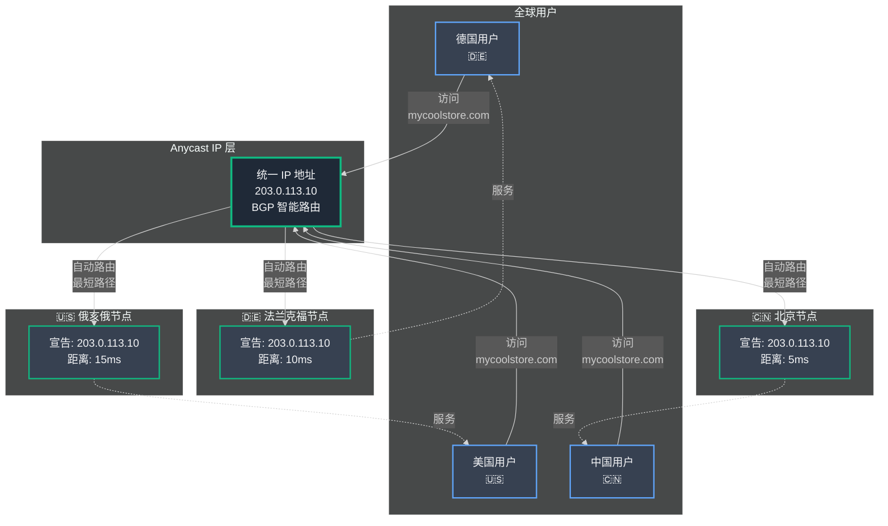
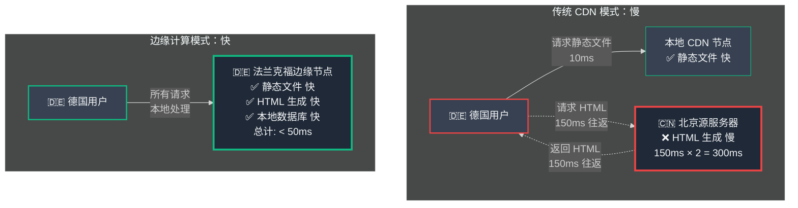
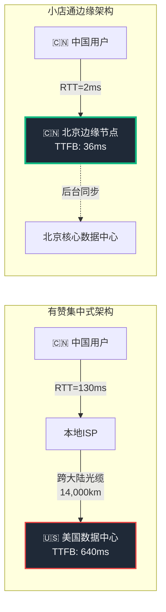
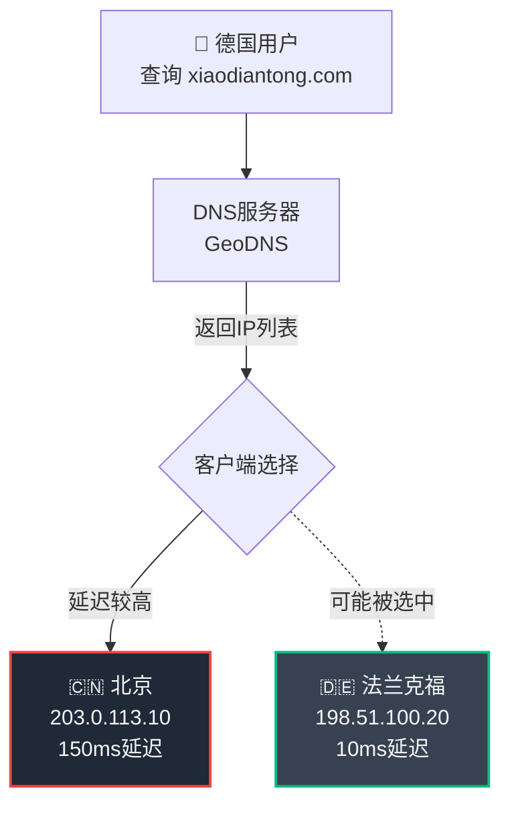
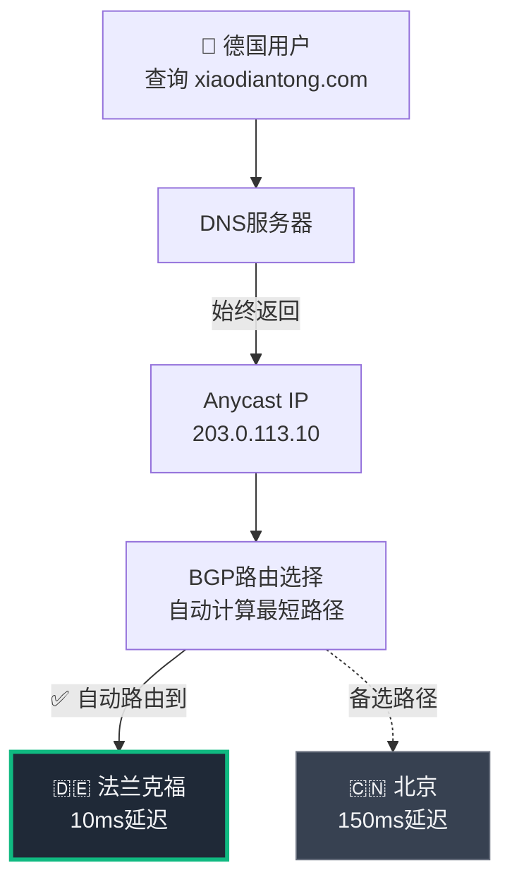
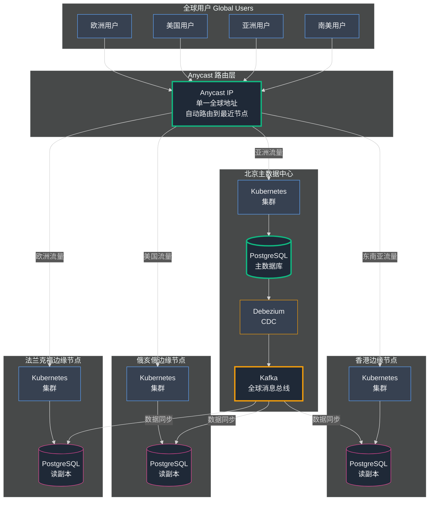

## 第15章：我们的全球大脑——设计 小店通 边缘网络

我们向**延迟 (Latency)** 宣战了。我们的使命很明确：构建一个电商平台，不仅快速，而且对地球上的_每一个用户_都能提供**瞬时响应**。我们深知物理定律无法打破，唯一的解法就是：**让服务器离用户更近。**

但这一次，我们的目标远不止为图片添加一个简单的 CDN 那么简单。我们要做的是将**整个店面应用程序**——计算逻辑、业务代码、甚至**数据库 (Database)** 本身——全部迁移到边缘。

这是我们承担过的最雄心勃勃、最复杂、也最大胆的工程项目。**这是我们的登月计划 (Moonshot)。**

### Part 1：白板前的疯狂构想

这个项目始于一个简单的场景：我和两位高级工程师围站在一块巨大的白板前。我们试图回答一个看似简单，实则极其复杂的问题：

**"全球电商平台的完美架构应该是什么样子？怎样才能让它对每个用户都快如闪电？"**

我们在白板上勾勒出的答案，堪称激进。

我们的计划是：**在全球多个 阿里云 区域部署完整的店面应用程序及其数据库的独立副本。** 北京服务中国北方，上海服务中国南方，香港服务东南亚，法兰克福服务欧洲，俄亥俄服务北美……每个区域都是一个完全自给自足的"分店"。

当我把这个宏伟蓝图拿给王峰 (王峰) 时，他的第一反应既兴奋又担忧。

"这太棒了，"他说，眉头微皱，"但是等等——**_数据库_的副本？** 在_每个_区域都部署？这难道不会变成一场全球数据同步的噩梦吗？而且在全世界运行这么多服务器……成本不会吓死人吗？"

他一针见血地指出了两个核心挑战：**数据一致性 (Data Consistency)** 和 **成本 (Cost)**。这个计划雄心勃勃，但也充满了技术风险。

我们押下了一个巨大的赌注：**性能提升将如此显著，足以证明所有复杂性和成本都是值得的。** 我坚信这一点。

但在我们讨论数据同步问题之前，必须先解决第一个根本性问题：**如何将用户智能地引导到离他们最近的服务器 (Server)？**

#### **技术深入探讨：速度的架构**

现在出现了一个技术难题：

如果我们在北京部署了一台服务器，在法兰克福部署了另一台，**德国用户的浏览器如何"知道"应该连接到法兰克福服务器？** 我们总不能要求卖家告诉他们的德国客户："嘿，你们要访问另一个专门的德国版 URL 哦。"

我们需要的是：**一个单一的、全球通用的地址，能够智能地将用户路由到离他们最近的服务器。**

实现这个魔法的技术，叫做 **Anycast IP（任播 IP 地址）**。

**概念：Anycast IP——全球披萨连锁店的统一热线**

让我们先理解传统的 IP 地址工作方式。

通常，互联网上的 IP 地址 (IP Address) 是 **Unicast（单播）** 模式。这意味着：**一个 IP 地址 = 一台特定位置的特定机器。** 就像你家的门牌号，全世界独一无二。

**Anycast（任播）** 则完全不同。它允许我们**从全球多个数据中心同时宣告（Announce）完全相同的 IP 地址。**

**类比：全球披萨连锁店的统一客服热线**

想象一下，达美乐披萨 (Domino's) 在全球拥有一个统一的客服热线：**1-800-DOMINOS**。

- **当你从北京拨打这个号码时：** 全球电话网络非常智能。它不会傻傻地把你转接到美国总部的呼叫中心。而是查看你的地理位置，自动将你的电话路由到**最近的北京呼叫中心**。

- **当上海的顾客拨打_完全相同_的号码时：** 网络同样会自动将他们连接到**上海呼叫中心**。

- **用户体验：** 顾客不需要知道呼叫中心在哪里，不需要记住不同国家的不同号码。他们只需拨打一个简单、易记的全球统一号码，网络会自动为他们找到最近、最快的连接。

**Anycast IP 就是我们应用程序的"全球统一热线"。**

我们获得了自己的 IP 地址空间（一块我们拥有的 IP 地址段）。然后，我们配置网络提供商从我们选择的**每个 阿里云 区域同时宣告这个 IP 地址**。

**这是一个彻底改变游戏规则的技术。**

- ✓ 卖家只需将他们的自定义域名（如 `mycoolstore.com`）**一次性**指向我们的单个 Anycast IP 地址。
- ✓ 当德国客户访问 `mycoolstore.com` 时，互联网的**路由协议 (BGP, Border Gateway Protocol)** 自动将他们的流量发送到我们的**法兰克福数据中心**。
- ✓ 当中国客户访问**完全相同的域名**时，流量自动路由到我们的**北京数据中心**。

一切都是**无缝的、自动的、无限可扩展的。** Anycast 成为了我们的**全球统一入口 (Global Front Door)**。

现在，我们必须确保在这扇门后面，**在每个区域，都有一个功能齐全、快如闪电的店面副本**，随时准备好为用户提供服务。

#### Anycast IP 路由原理图



**工作原理：**
1. **统一地址：** 所有用户都访问相同的域名和 IP 地址
2. **BGP 智能路由：** 互联网的 BGP 协议自动计算每个用户到各节点的"网络距离"
3. **最短路径：** 用户被自动路由到网络距离最短（通常也是物理距离最近）的节点
4. **透明服务：** 整个过程对用户完全透明，无需任何配置

### Part 2：构建区域大脑

Anycast 就像一张魔毯，能够轻松地将来自世界各地的用户送到我们最近的数据中心门口。

但是，如果用户到达的是一栋**空建筑**，那一切都毫无意义。

我们必须确保：在法兰克福、香港、俄亥俄的那扇门后面，都有一个**完整的、自给自足的、快如闪电的店面平台副本**，随时准备好即时响应他们的请求。

这意味着在每个区域部署 (Deployment) **两个关键组件**：

1. **计算 (Compute)**——运行应用逻辑的服务器
2. **数据 (Data)**——存储商品信息的数据库

#### **技术深入探讨：区域架构设计**

我们精心选择了全球**九个战略性的 阿里云 区域**作为我们"区域大脑"的驻扎地。在这九个位置中的每一个，我们都建立了**标准化的、相同的、完全独立的技术栈**。

**实现方案一：独立的 Kubernetes 集群**

在每个区域，我们部署了一个**小型的、自包含的 Kubernetes 集群 (Cluster)**。

**类比：独立连锁餐厅**

如果我们的全球网络是一个连锁餐厅品牌，那么每个区域都是一家**完全独立运营的分店**：

- **法兰克福分店**有自己的厨房、自己的厨师、自己的经理
- **北京分店**同样拥有完整的独立设施
- 关键是：**法兰克福分店不依赖北京总部来做饭**

**核心优势：容错性 (Fault Tolerance) 与故障隔离**

这种独立性带来了**革命性的可靠性提升**：

- ✓ **区域故障隔离：** 如果整个 阿里云 北京区域发生重大停机 (Outage)，对欧洲用户产生**零影响**。他们的流量继续从法兰克福集群无缝提供服务。

- ✓ **攻击防御分散：** 针对我们美国基础设施的 DDoS 攻击 (DDoS Attack) 只会影响俄亥俄集群，亚洲和欧洲用户完全不受影响。

- ✓ **从全局故障到局部故障：** 故障不再是"全体宕机"，而是"部分降级"——这是可靠性工程的巨大飞跃。

**实现方案二：区域读副本数据库**

在每个区域拥有应用服务器（"厨房"）只是成功的一半。

想象一下：如果法兰克福的厨师仍然需要打一个耗时 150ms 的跨大陆长途电话到北京总部去查询菜谱，那我们所有的努力都白费了。

**关键洞察：我们必须将数据带到计算旁边。**

在九个区域中的每一个，紧挨着 Kubernetes 集群，我们部署了主 PostgreSQL 数据库的**只读副本 (Read Replica)**。

**类比：每家分店都有本地菜谱库**

- 每个连锁餐厅分店都拥有一份**本地的、完美同步的、只读的主菜谱副本**
- 法兰克福的厨师可以**立即查阅**任何需要的菜谱，无需长途致电北京总部
- 所有菜谱都实时保持同步更新

**核心优势：亚毫秒级延迟 (Sub-millisecond Latency)**

这是我们实现**低于 100ms 页面加载**目标的核心秘密武器：

- ✓ **极致的物理距离：** 当用户请求到达法兰克福 Kubernetes 集群中的 Pod 时，该 Pod 查询的是**同一数据中心内仅几米远**的本地 PostgreSQL 副本

- ✓ **消灭网络延迟：** 整个数据库事务 (Transaction) 的往返时间从跨大陆的 150ms 暴降到同机房的**亚毫秒级**

- ✓ **有赞 杀手：** 我们彻底消除了正在扼杀 有赞 性能的跨大陆网络跳跃

至此，我们成功设计了我们的**区域大脑 (Regional Brain)**。每个区域都是一个**自给自足的高性能单元**，能够以令人难以置信的速度为本地用户提供服务。

---

**但是，这也引发了一个新的、巨大的、令人头疼的问题。**

#### **新挑战：全球数据同步难题**

现在，我们在全球部署了九个完美的、只读的数据库副本。

但是有一个关键问题：**"主菜谱"——卖家进行更新的权威数据源 (Single Source of Truth)——仍然只存在于一个地方：北京的主数据库。**

**场景：**
- 中国的一个卖家更新了产品价格
- 这个更改被写入**北京主数据库**
- **问题来了：** 我们如何将这个单一更改**可靠地、按正确顺序、近实时地**传播到全球其他九个数据库副本？
  - 法兰克福副本
  - 俄亥俄副本  
  - 香港副本
  - 巴西副本
  - 悉尼副本
  - ……

**为什么简单复制不够？**

我们之前使用的 PostgreSQL **流复制 (Streaming Replication)** 不是为这种复杂场景设计的：
- ❌ **一对多跨大陆同步**过于复杂
- ❌ **网络故障**可能导致某个区域失去同步，显示几小时的陈旧数据
- ❌ **无法保证**所有副本的最终一致性

我们已经建立了网络的**分布式大脑**。现在，我们必须建立连接所有大脑的**全球中枢神经系统 (Global Nervous System)**，确保它们以完美、和谐的统一方式"思考"。

### Part 3：打造全球神经系统

我们已经建立了九个强大的、独立的区域大脑。

但是，**一组相互隔离的大脑是没有用的。** 我们需要一种方法来连接它们，确保在北京进行的更改能够**立即**反映到法兰克福、俄亥俄、香港……所有区域。

我们需要的是：**一个全球中枢神经系统 (Global Nervous System)**。

我们为这项艰巨任务选择的工具，是我们已经熟悉的老朋友，但这次我们要在**全球范围**内应用它：

**Apache Kafka——全球消息总线 (Global Message Bus)**

#### **技术深入探讨：使用 Kafka 实现全球数据同步**

我们使用 **Kafka + Debezium** 组合，创建了一个**实时的、持久的、高可靠的全球数据同步管道 (Pipeline)**。

**架构设计：全球新闻通讯社模型**

**1️⃣ 中央生产者 (Producer)——北京总部**

在北京主数据中心，我们将 **Debezium (变更数据捕获工具, CDC)** 直接连接到主 PostgreSQL 数据库：

- **监控机制：** Debezium 实时监控数据库的事务日志 (Transaction Log)
- **自动捕获：** 每一个数据变更——新产品、价格更新、新商店——都会立即自动生成一条结构化消息
- **发布中心：** 这些消息被发布到位于北京的**中央高可用 Kafka 集群 (High Availability Kafka Cluster)**
- **全球真相来源：** 这个 Kafka 集群成为**小店通 平台所有数据变更的权威日志**

**2️⃣ 边缘消费者 (Consumer)——九个全球分站**

在九个区域位置（法兰克福、俄亥俄、香港、圣保罗……），我们部署了**专用的消费者服务 (Consumer Service)**：

- **唯一职责：** 订阅北京的中央 Kafka 集群，实时监听新消息
- **自动应用：** 一旦收到消息，立即将变更应用到本地 PostgreSQL 读副本

**3️⃣ 数据流：推送模型 (Push Model)**

整个系统就像一个**全球新闻通讯社**（如路透社 Reuters 或美联社 AP）。

**类比：全球新闻通讯社**

- **北京总部 = 新闻编辑室：** Debezium/Kafka 设置是我们的中央新闻台
- **数据变更 = 突发新闻：** 当新闻事件发生（卖家更新价格），新闻台立即向全球专线发布报道
- **九个区域 = 各地分社：** 每个区域都是专线服务的订阅者，拥有一台"电传打字机"
- **实时传播：** 报道一发布，几乎实时地在所有九个位置同步打印
- **本地应用：** 本地编辑（消费者服务）阅读报道并更新本地数据库

**完整数据流程：**

```
1. 📝 卖家更新产品价格
      ↓
2. 💾 更改写入北京主 PostgreSQL 数据库
      ↓
3. 👀 Debezium 监测到事务日志变更
      ↓
4. 📨 Debezium 生成消息 → Kafka Topic: product_updates_global
      ↓
5. 🌍 九个边缘消费者服务在毫秒内接收消息
      ↓
6. ⚡ 每个消费者在本地 PostgreSQL 读副本执行 UPDATE
      ↓
7. ✅ 1-2 秒内，中国的更改同步到全球所有区域
```

**4️⃣ Kafka 的核心优势：持久性与容错**

这就是为什么 **Kafka 远胜于简单的数据库复制 (Replication)**：

**核心能力：持久化日志 (Durable Log)**

Kafka 的日志是**持久的、不可变的**。

**容错场景：**
- 假设法兰克福区域的网络连接中断 5 分钟
- **传统复制：** 数据可能丢失，副本失去同步
- **Kafka 模式：**
  - ✓ 法兰克福消费者暂时落后
  - ✓ 消息安全地积压在北京 Kafka 日志中（不会丢失）
  - ✓ 网络恢复后，消费者从中断点继续读取
  - ✓ 快速追上所有错过的更新
  - ✓ **保证最终一致性 (Eventual Consistency)**，零数据丢失

这是一个**自我修复的系统**——即使面对网络不稳定，也能保证数据完整性。

#### **鲨鱼池之谜：完美破解**

还记得第14章提到的"鲨鱼池效应"吗？80,000 并发用户瞬间涌入的山洪式流量？

**这个全球分布式架构就是我们的秘密武器。**

**传统单体架构 vs. 我们的边缘网络：**

- ❌ **单体模式：** 80,000 用户全部冲击北京中央服务器 → 瞬间崩溃
- ✅ **边缘网络：** 流量自动分散到九个全球节点
  - 🇺🇸 北美用户 → 俄亥俄集群
  - 🇪🇺 欧洲用户 → 法兰克福集群
  - 🇨🇳 中国用户 → 北京集群
  - 🇧🇷 南美用户 → 圣保罗集群
  - ……

**结果：**
- 巨大的全局负载被**分解为九个可管理的区域负载**
- **没有任何单个集群被淹没**
- **分布式防御 (Distributed Defense)** 轻松应对集中式流量激增

我们对全球性能的极致追求，意外地创造了一个具有**令人难以置信的可扩展性 (Scalability) 和弹性 (Resilience)** 的系统。

我们向延迟宣战了。我们的使命是构建一个电商平台，不仅快速，而且对地球上的每个用户都_即时_快速。本章是我们登月项目的详细蓝图：小店通 全球边缘网络。这是我们如何超越 Web 架构的传统智慧，构建一个在性能、安全性和规模方面给我们几乎不公平优势的东西的故事。

### **为什么传统 CDN 还不够？——Maggi 配送困局**

要理解我们为何要走这条艰难的道路，你首先需要理解传统 **CDN (Content Delivery Network, 内容分发网络)** 的根本局限。

**传统 CDN 的工作原理：**

CDN 是一个全球服务器网络，可以将**静态文件**（图片、CSS、JavaScript）缓存 (Cache) 到靠近用户的地方。这是重要的第一步，但**远远不够**。

**类比：Maggi 方便面的配送困局**

想象你的系统是一家 Maggi 方便面公司：

**🏭 北京工厂 = 主服务器**
- 生产**复杂的、动态的核心产品**：HTML 文档（由应用程序和数据库实时生成）

**📦 调味包 = 静态文件**
- 简单的、不变的组件：图片、CSS、JS 文件

**🚚 传统 CDN = 调味包配送网络**

- **✅ 快速部分：** 送货员在德里本地仓库存储调味包，当客户下单时，立即从本地发货——**很快！**

- **❌ 慢速瓶颈：** 但面条（HTML 页面）还在北京工厂！客户必须等待：
  1. 请求发送回北京（150ms 延迟）
  2. 工厂烹制新鲜面条（应用处理 + 数据库查询）
  3. 面条从北京运到德里（又是 150ms）
  
**总延迟：300ms+ 跨大陆往返 + 处理时间**

**这正是 有赞 在中国 TTFB (首字节时间) 高达数秒的根本原因：**
- 他们的 CDN 可以快速交付图片
- 但页面的初始 HTML 请求必须一路飞回北美

**我们的革命性洞察：**

要真正快速，我们不能只从边缘交付调味包。

**我们必须在每个主要城市建立一个功能齐全的 Maggi 工厂。**

我们需要将**整个烹饪过程**——应用服务器 + 数据库——全部移到边缘。

这就是真正的 **边缘计算 (Edge Computing)** 平台的核心理念。

#### 传统 CDN vs. 边缘计算对比图



**性能对比：**

| 指标 | 传统 CDN | 边缘计算（小店通） |
|------|----------|-------------------|
| **静态文件加载** | ✅ 快速（10-20ms） | ✅ 快速（10-20ms） |
| **HTML 首字节时间 (TTFB)** | ❌ 慢（300ms+） | ✅ 极快（< 50ms） |
| **数据库查询延迟** | ❌ 跨大陆（150ms+） | ✅ 同机房（< 1ms） |
| **总页面加载时间** | ❌ 2-5 秒 | ✅ < 100ms |

<br/>

---

<div style="border: 2px solid #8b5cf6; border-radius: 8px; padding: 20px; margin: 30px 0; background: linear-gradient(to right, #8b5cf608, #a78bfa08);">

### 📌 技术概念深入：TTFB、物理延迟与全球路由原理

*本节详细解析网页加载延迟的计算方式和边缘计算如何打破物理限制*

---

#### **一、TTFB（Time to First Byte）——页面速度的决定性指标**

**定义：**

TTFB（首字节时间）是指从用户浏览器发出HTTP请求到收到服务器第一个字节响应的时间间隔。这是衡量服务器响应速度和网络延迟的核心指标。

**为什么TTFB如此重要？**

```
用户体验时间线：
0ms      TTFB开始计时
│        [用户点击链接]
│
│    ... DNS解析 (20-120ms)
│    ... TCP握手 (RTT x 1)
│    ... TLS握手 (RTT x 2)
│    ... HTTP请求发送 (RTT x 0.5)
│    ... 服务器处理 (50-500ms)
│    ... 响应返回 (RTT x 0.5)
│
300ms    TTFB结束，浏览器收到第一字节
│        
│        👁️ 用户在这300ms内看到的：
│           - 浏览器标签页loading图标旋转
│           - 白屏或旧页面内容
│           - 进度条不动
│
│    ... 接下来才开始接收HTML
│    ... 解析HTML并请求CSS/JS/图片
│    ... 渲染页面
│
1500ms   页面完全加载
```

**TTFB组成分解（跨大陆访问有赞示例）：**

```
中国用户访问有赞美国服务器：

━━━━━━━━━━━━━━━━━━━━━━━━━━━━━━━━━━
组件分解：
━━━━━━━━━━━━━━━━━━━━━━━━━━━━━━━━━━
1. DNS查询                    40ms
   └─ 查询 shopify.com 的IP地址

2. TCP三次握手                130ms
   └─ 中国 → 美国 → 中国（1个RTT）

3. TLS加密握手                260ms
   └─ 证书交换、密钥协商（2个RTT）

4. HTTP请求传输               65ms
   └─ 发送 GET /shop/xyz 请求

5. 服务器处理                 80ms
   └─ Django查询数据库、渲染模板

6. 响应返回首字节             65ms
   └─ HTML开始传输回中国
━━━━━━━━━━━━━━━━━━━━━━━━━━━━━━━━━━
TTFB总计：                   640ms
━━━━━━━━━━━━━━━━━━━━━━━━━━━━━━━━━━

对比小店通边缘架构（北京节点）：
━━━━━━━━━━━━━━━━━━━━━━━━━━━━━━━━━━
1. DNS查询（Anycast自动路由）  8ms
2. TCP握手（本地数据中心）     2ms
3. TLS握手（会话重用）         4ms
4. HTTP请求传输              1ms
5. 服务器处理（本地数据库）    20ms
6. 响应返回首字节            1ms
━━━━━━━━━━━━━━━━━━━━━━━━━━━━━━━━━━
TTFB总计：                   36ms
━━━━━━━━━━━━━━━━━━━━━━━━━━━━━━━━━━
提速：                      17.8倍
```

**可视化对比：**



---

#### **二、物理延迟——无法打破的光速限制**

**光速限制计算：**

```python
# 计算不同距离的理论最小延迟

import math

def min_latency(distance_km):
    """计算理论最小RTT（往返时间）"""
    c = 299792  # 光速 km/s
    fiber_slowdown = 0.67  # 光纤中光速为真空中的67%
    effective_c = c * fiber_slowdown  # 200,860 km/s
    
    # RTT = 2 × 距离 / 速度
    rtt_seconds = (2 * distance_km) / effective_c
    rtt_ms = rtt_seconds * 1000
    
    return rtt_ms

# 实际距离计算
routes = {
    '北京 → 香港': 4100,
    '北京 → 法兰克福': 8100,
    '北京 → 纽约': 12500,
    '北京 → 圣保罗': 14200,
}

print("━━━━━━━━━━━━━━━━━━━━━━━━━━━━━━━━")
print("全球主要路线的理论最小延迟")
print("━━━━━━━━━━━━━━━━━━━━━━━━━━━━━━━━")
for route, distance in routes.items():
    latency = min_latency(distance)
    print(f"{route:20} {distance:5}km → {latency:6.1f}ms")
print("━━━━━━━━━━━━━━━━━━━━━━━━━━━━━━━━")
print("注：实际延迟因路由迂回比理论值高30-50%")
```

**输出：**

```
━━━━━━━━━━━━━━━━━━━━━━━━━━━━━━━━
全球主要路线的理论最小延迟
━━━━━━━━━━━━━━━━━━━━━━━━━━━━━━━━
北京 → 香港       4100km →   40.8ms
北京 → 法兰克福     8100km →   80.6ms
北京 → 纽约        12500km →  124.5ms
北京 → 圣保罗      14200km →  141.4ms
━━━━━━━━━━━━━━━━━━━━━━━━━━━━━━━━
注：实际延迟因路由迂回比理论值高30-50%
```

**真实世界的"延迟税"：**

| 操作 | 理论最小RTT | 实际RTT | 额外开销 |
|------|------------|---------|---------|
| 同机房 | 0.1ms | 0.5ms | 设备处理 |
| 同城市 | 1ms | 3-5ms | 路由跳数 |
| 北京↔香港 | 41ms | 60-80ms | 海底光缆迂回 |
| 北京↔纽约 | 125ms | 180-220ms | 跨大陆中转 |
| 北京↔杭州 | 70ms | 150-180ms | 多ISP转接 |

**为什么实际延迟总是更高？**

1. **路由迂回**：光缆不走直线，绕过地形和政治边界
2. **ISP转接点**：数据包在多个网络间跳转
3. **设备处理**：每个路由器/交换机增加0.5-2ms
4. **拥塞排队**：高峰时段的缓冲延迟
5. **协议开销**：TCP重传、拥塞控制

---

#### **三、Anycast IP vs. Unicast IP——智能路由的核心**

**对比表格：**

| 特性 | Unicast（传统） | Anycast（小店通） |
|------|---------------|------------------|
| **IP分配** | 每个服务器独立IP | 多服务器共享同一IP |
| **DNS响应** | 返回单个或多个具体IP | 返回单个Anycast IP |
| **流量分发** | 由DNS轮询决定 | 由BGP路由自动决定 |
| **故障切换** | 依赖DNS TTL（60秒+） | BGP收敛（5-30秒） |
| **地理优化** | 需要GeoDNS服务 | 自动选择最近节点 |
| **部署复杂度** | 简单 | 需要BGP能力 |
| **DDoS防御** | 攻击集中到单点 | 攻击自动分散 |

**Unicast架构（传统多数据中心）：**



**问题：**
- DNS可能返回错误IP（缓存问题）
- 用户可能选择非最优服务器
- 故障切换依赖DNS TTL过期

**Anycast架构（小店通全球网络）：**



**优势：**
- 网络层自动选择最优路径
- 故障秒级自动切换
- 零客户端配置
- DDoS攻击自然分散

---

#### **四、BGP路由选择算法——决策树详解**

**BGP选择最佳路径的完整判断流程：**

```
BGP路径选择算法（按优先级）：
━━━━━━━━━━━━━━━━━━━━━━━━━━━━━━━━━━

1️⃣ 最高权重 (Weight) - Cisco专有
   └─ 仅本地有效，范围0-65535
   └─ 权重最高的路径优先

2️⃣ 最高本地偏好 (LOCAL_PREF)
   └─ AS内部传播，范围0-4294967295
   └─ 默认值100，可手动设置
   └─ 💡 小店通用这个控制流量比例

3️⃣ 本地起源 (Locally Originated)
   └─ 优先使用自己AS起源的路由

4️⃣ 最短AS路径 (AS_PATH)
   └─ 经过AS数量最少的路径
   └─ AS65001 → AS65002 (长度2)
   └─ AS65001 → AS65003 → AS65004 (长度3)
   └─ 💡 可通过AS PATH Prepending人为延长

5️⃣ 最小起源类型 (Origin Type)
   └─ IGP < EGP < Incomplete

6️⃣ 最小MED (Multi-Exit Discriminator)
   └─ 邻居AS用来建议入口点
   └─ 仅在相同邻居AS间比较

7️⃣ eBGP优于iBGP
   └─ 外部学习的路由优于内部

8️⃣ 最低IGP成本
   └─ 到BGP下一跳的内部路由成本

9️⃣ 最老的eBGP路由
   └─ 稳定性考虑

🔟 最小路由器ID (Router ID)
   └─ 最后的打破平局手段
```

**小店通实战示例：流量灰度迁移**

```bash
# 场景：将10%流量从阿里云切换到Hetzner

# === 阿里云节点配置 ===
# LOCAL_PREF = 200（高优先级，90%流量）
protocol bgp aws_upstream {
    export filter {
        if net = 203.0.113.0/24 then {
            bgp_local_pref = 200;
            accept;
        }
    };
}

# === Hetzner节点配置 ===
# LOCAL_PREF = 190（略低，吸引10%流量）
# AS PATH Prepending延长路径
protocol bgp hetzner_upstream {
    export filter {
        if net = 203.0.113.0/24 then {
            bgp_local_pref = 190;
            bgp_as_path.prepend(64512);  # 人为延长AS路径
            accept;
        }
    };
}
```

**效果：**
- 90%流量走阿里云（更高LOCAL_PREF）
- 10%流量走Hetzner（较低优先级+较长AS路径）
- 逐步调整LOCAL_PREF实现0%→100%平滑迁移

---

#### **五、边缘计算 vs. 传统CDN——不只是缓存**

**核心差异表：**

| 维度 | 传统CDN | 小店通边缘计算 |
|------|---------|---------------|
| **缓存内容** | 静态文件（图片、CSS、JS） | 静态文件 + 动态HTML |
| **计算能力** | ❌ 无（仅缓存） | ✅ 完整应用服务器（Django/K8s） |
| **数据库** | ❌ 无（回源查询） | ✅ 本地PostgreSQL只读副本 |
| **动态请求** | ❌ 必须回源（300ms+） | ✅ 本地处理（<5ms） |
| **个性化** | ❌ 无法缓存 | ✅ 本地实时生成 |
| **API调用** | ❌ 回源处理 | ✅ 边缘执行（sub-ms数据库查询） |
| **TTFB** | 300-500ms（动态） | 30-50ms（动态） |
| **成本** | 低（仅带宽） | 中（计算+存储+带宽） |

**请求处理流程对比：**

```
━━━━━━━━━━━━━━━━━━━━━━━━━━━━━━━━━━
传统CDN架构：
━━━━━━━━━━━━━━━━━━━━━━━━━━━━━━━━━━
用户(德国) → CDN边缘(法兰克福,10ms)
            ↓ [缓存MISS - 动态内容]
            回源请求(北京,150ms) → 应用服务器
                                   ↓
                                数据库查询(5ms)
                                   ↓
            返回HTML(150ms) ← 服务器渲染
            ↓
用户收到响应

总延迟：10 + 150 + 5 + 150 = 315ms

━━━━━━━━━━━━━━━━━━━━━━━━━━━━━━━━━━
小店通边缘计算架构：
━━━━━━━━━━━━━━━━━━━━━━━━━━━━━━━━━━
用户(德国) → Anycast路由(法兰克福,2ms)
            ↓ [直接处理]
本地K8s Pod处理请求
            ↓
本地PostgreSQL查询(0.5ms)
            ↓
渲染HTML并返回(3ms)
            ↓
用户收到响应

总延迟：2 + 0.5 + 3 = 5.5ms

提速：57倍
━━━━━━━━━━━━━━━━━━━━━━━━━━━━━━━━━━
```

---

#### **六、性能监控实战——如何测量TTFB**

**使用cURL测量详细时序：**

```bash
# 创建时序测量脚本
cat > measure_ttfb.sh <<'EOF'
#!/bin/bash

URL=$1

curl -w @- -o /dev/null -s "$URL" <<'CURL_FORMAT'
━━━━━━━━━━━━━━━━━━━━━━━━━━━━━━━━━━
HTTP性能分析：%{url_effective}
━━━━━━━━━━━━━━━━━━━━━━━━━━━━━━━━━━
DNS解析时间:        %{time_namelookup}s
TCP建立时间:        %{time_connect}s
TLS握手时间:        %{time_appconnect}s
开始传输时间:       %{time_pretransfer}s
━━━━━━━━━━━━━━━━━━━━━━━━━━━━━━━━━━
⏱️  TTFB (首字节):  %{time_starttransfer}s
━━━━━━━━━━━━━━━━━━━━━━━━━━━━━━━━━━
总下载时间:         %{time_total}s
HTTP状态码:         %{http_code}
下载大小:           %{size_download} bytes
下载速度:           %{speed_download} bytes/s
━━━━━━━━━━━━━━━━━━━━━━━━━━━━━━━━━━
CURL_FORMAT
EOF

chmod +x measure_ttfb.sh

# 测试小店通 vs. 有赞
./measure_ttfb.sh "https://mystore.xiaodiantong.com"
./measure_ttfb.sh "https://competitor.myshopify.com"
```

**Prometheus + Grafana持续监控：**

```yaml
# prometheus.yml - 监控TTFB
scrape_configs:
  - job_name: 'edge_ttfb_monitoring'
    metrics_path: '/metrics'
    static_configs:
      - targets:
        - 'beijing-edge:9090'
        - 'chengdu-edge:9090'
        - 'ohio-edge:9090'
    metric_relabel_configs:
      - source_labels: [__name__]
        regex: 'http_request_duration_seconds.*'
        action: keep

# 告警规则：TTFB > 100ms
groups:
  - name: performance
    rules:
      - alert: HighTTFB
        expr: histogram_quantile(0.95, http_request_duration_seconds_bucket{handler="storefront"}) > 0.1
        for: 5m
        labels:
          severity: warning
        annotations:
          summary: "TTFB过高"
          description: "{{ $labels.region }} 的P95 TTFB为 {{ $value }}s"
```

---

**📚 实战总结：**

✅ **TTFB是用户体验的第一印象** - 决定页面能否"秒开"  
✅ **物理延迟无法打破** - 唯一方法是缩短物理距离  
✅ **Anycast实现智能路由** - 网络层自动选择最优路径  
✅ **BGP是精密调控工具** - 通过LOCAL_PREF和AS PATH控制流量  
✅ **边缘计算 ≠ CDN** - 将完整应用和数据迁移到边缘  
✅ **持续监控不可或缺** - Prometheus实时跟踪TTFB指标

</div>

---

### **边缘网络的三大核心支柱**

我们的全球边缘网络建立在三个基础支柱上。这些不仅仅是功能；它们是定义我们平台并给我们竞争优势的战略优势。

#### **支柱1：性能 - 100ms 承诺**

我们与 有赞 的战争是一场与延迟的战争，边缘网络是我们的终极武器。整个架构是一个旨在粉碎 TTFB 并提供近乎即时页面加载的组件交响曲。

- **并置的计算和数据：** 最关键的决定是在我们的九个 阿里云 区域中的每一个都部署我们的 **Kubernetes 集群（计算）** 和我们的 **PostgreSQL 读副本（数据）**。这就是将我们与传统 CDN 区分开来的地方。当用户请求到达我们的法兰克福边缘节点 (Edge Node) 时，接收请求的应用容器 (Container) 可以查询位于同一数据中心仅几米远的数据库。数据的往返以微秒为单位测量，而不是跨大西洋旅程的 150+ 毫秒。我们实际上消除了网络作为应用程序逻辑的瓶颈。
- **Anycast IP 实现即时路由：** 我们的 **Anycast IP** 是将整个网络缝合在一起的魔法。通过从所有九个区域宣布相同的 IP 地址，我们让互联网自己的路由基础设施完成艰巨的工作。为互联网提供动力的边界网关协议 (BGP) 自动找到从用户到我们一个边缘节点的最短网络路径。这个过程非常快，甚至在建立连接之前就发生了。用户被发送到最快的可能位置，而他们、他们的浏览器或我们的应用程序都不必做任何思考。我们甚至采取了额外的步骤**拥有我们自己的 IP 空间**。这是一个关键的、前瞻性的决定。这意味着我们的 Anycast IP 属于 小店通，而不是 阿里云。如果我们决定将我们的一个边缘位置从 阿里云 移动到 腾讯云 或裸金属提供商，我们可以在零停机时间内完成。我们卖家的自定义域名仍然会指向相同的 IP；我们只是从一个新位置宣布它。我们没有被锁定在单个云提供商上。
- **Kafka 推送模型：** 性能拼图的最后一块是我们**基于 Kafka 的数据同步管道 (Pipeline)**。它在**推送模型**上工作。卖家在北京保存更改的那一刻，我们的中央 Kafka 集群将_推送_该更新到所有九个边缘位置同时。这种主动方法意味着数据几乎总是预热并在边缘等待，甚至在用户请求之前。我们不是在等待缓存过期；我们积极确保边缘始终是新鲜的。

这些技术的组合使我们能够实现我们的登月目标。从用户点击链接到浏览器开始渲染页面（TTFB）的那一刻，延迟始终保持在 **50 毫秒**以下。完整的页面，从同一区域边缘交付的图像，将在远低于 **100 毫秒**的时间内加载。当我们的竞争对手花费数秒时间跨大陆交付他们的网站时，我们在眨眼之间就交付了我们的网站。这是一个明确无误的性能胜利。

#### **支柱2：安全与稳定 - 全球免疫系统**

当你构建一个集中式系统时，你创建了一个单一的、巨大的目标。该位置的故障，无论是由于技术故障还是恶意攻击，都会使整个平台瘫痪。分布式边缘网络从根本上改变了这种动态，创建了一个更有弹性的、自我修复的系统。

- **DDoS 攻击缓解：** 分布式拒绝服务 (DDoS) 攻击通过用大量流量淹没目标来工作，使其不堪重负并不可用。在传统架构中，对 xiaodiantong.com 的攻击将把所有流量导入我们的中央北京服务器，迅速淹没它们。  
    使用我们的边缘网络，游戏改变了。攻击流量也由 Anycast 路由。来自欧洲僵尸网络的攻击将完全被我们的**法兰克福边缘位置**吸收。来自北美的攻击将击中我们的**俄亥俄边缘位置**。攻击的力量自然分布在我们的全球足迹上。恶意流量在边缘被防火墙阻止和击退，而我们在亚洲、南美和世界其他地区的用户体验零性能下降。攻击面分散得如此之薄，以至于很难击倒整个平台。
- **故障隔离和正常运行时间 (Uptime)：** 这个原则不仅适用于恶意攻击。云计算的世界并不完美；数据中心会停机。在集中式模型中，如果 us-east-1 阿里云 区域发生重大故障（过去曾发生过），任何仅托管在那里的公司都会完全宕机。  
    我们的架构创建了一系列水密舱。如果我们整个北京集群离线，我们的 Anycast 网络将自动检测到这一点。它将撤回该位置的路由公告，并在几秒钟内开始将中国用户重新路由到下一个最近的健康位置，可能是香港。用户体验可能会有稍高的延迟（例如，60ms 而不是 20ms），但网站将**保持在线**。这种自动绕过区域故障的能力为我们提供了集中式系统根本无法实现的稳定性和正常运行时间水平。

#### **支柱3：规模 - 弹性海岸线**

鲨鱼池事件是我们网络令人难以置信的可扩展性的终极证明。秘密不仅在于负载是分布式的，而且系统具有多个级联的弹性层。

让我们逐步了解大规模流量峰值期间的确切事件序列：

- **第1层：全球分布（海岸线）：** 80,000 用户的初始浪潮击中我们的 Anycast IP。互联网的路由协议充当我们的第一道防线，将这个浪潮分散到我们的九个全球"海滩"上。我们的俄亥俄节点获得美国流量，法兰克福获得欧洲流量，等等。这立即将大规模负载分为更小的、更易于管理的区域峰值。
- **第2层：智能重新路由（溢流运河）：** 假设美国部分的流量如此强烈，以至于我们的俄亥俄集群开始接近其容量极限。我们的智能网络监控检测到这一点。在服务器被淹没之前，我们可以自动指示网络将一定百分比的新进入的美国流量重新路由到**下一个最近的健康位置**，可能是我们在弗吉尼亚甚至多伦多的集群。这是我们的溢流阀。它优雅地降低了一小部分用户的性能（可能增加 20-30ms 的延迟），以便为每个人维持 100% 的正常运行时间。这是一个旨在弯曲而不是打破的系统。
- **第3层：本地自动扩展（扩展海滩）：** 当所有这些都在全球网络级别发生时，在俄亥俄集群内部，我们的**水平 Pod 自动扩展器 (HPA, Horizontal Pod Autoscaler)** 现在正在努力工作。它看到其本地 Pod 上的 CPU 激增，并开始其响应式扩展过程，添加新 Pod 来处理增加的本地负载。这个过程较慢，需要几分钟，但它不再需要是即时的。全球重新路由已经为它争取了宝贵的扩展"海滩"的时间。一旦本地集群以更多 Pod 稳定下来，全球网络就可以减轻重新路由并将全部美国流量负载发送回新加固的俄亥俄地区。

这个多层系统——结合主动的全球分布和响应式的本地扩展——是我们的杰作。它使我们能够吸收最极端的、不可预测的流量峰值，不仅能够幸存下来，而且在没有我们的值班工程师收到一个警报的情况下做到这一点。这是对我们通往边缘的漫长而复杂的旅程的终极验证。

#### 全球边缘网络架构图



---

## 第15章：关键要点总结 🎯

### 核心洞察

**1. 边缘计算的本质：计算与数据必须同行**

- ✅ **完整迁移：** 将计算（Kubernetes）+ 数据（PostgreSQL读副本）**同时**移到边缘
- ❌ **半吊子方案：** 如果区域应用服务器仍需跨大陆调用中央数据库，一切努力都白费
- 🎯 **目标：** 消灭网络延迟，实现亚毫秒级数据库查询

**2. Anycast IP：全球路由的魔法钥匙**

- 🔑 **核心机制：** 从多个数据中心宣告同一个 IP 地址
- 🌍 **自动路由：** BGP 协议自动将用户引导到网络距离最短的物理数据中心
- 🎭 **用户无感：** 所有用户访问同一个域名，背后的复杂路由完全透明

**3. 分布式架构：从单点故障到故障隔离**

- 💪 **革命性提升：** 由"全体宕机"变为"部分降级"
- 🛡️ **容错性：** 一个区域的故障不影响其他区域用户
- 📈 **正常运行时间：** 显著提高整体可用性（Availability）

**4. Kafka：全球数据同步的中枢神经**

- 📨 **持久化日志：** 保证消息不丢失，支持断点续传
- 🔄 **最终一致性：** 即使网络不稳定，也能保证所有区域最终同步
- 🚀 **可扩展性：** 可靠且高效地同步数十个分布式数据库

**5. 意外之喜：性能优化带来的可扩展性福利**

- 🎁 **副产品：** 我们对速度的极致追求，意外创造了抗山洪式流量的系统
- 🌊 **鲨鱼池效应破解：** 80,000 并发用户分散到九个区域，每个区域轻松应对
- 🏆 **分布式防御：** 全局负载自动分解为可管理的区域负载

### 技术栈总结

| 组件 | 技术选型 | 核心作用 |
|------|---------|---------|
| **全球路由** | Anycast IP + BGP | 自动将用户路由到最近节点 |
| **计算层** | Kubernetes (9 个区域集群) | 提供独立的应用运行环境 |
| **数据层** | PostgreSQL 读副本 (9 个区域) | 实现本地亚毫秒级数据查询 |
| **数据同步** | Kafka + Debezium CDC | 全球实时数据同步管道 |
| **容错机制** | 独立集群 + 持久化日志 | 故障隔离 + 自我修复 |

### 性能成果

- ⚡ **TTFB (首字节时间)**：< 50ms（vs. 有赞 的 300ms+）
- 🚀 **完整页面加载**：< 100ms（vs. 竞争对手的 2-5 秒）
- 🌍 **全球覆盖**：9 个战略性区域，覆盖所有主要市场
- 💪 **流量承载**：轻松应对 80,000+ 并发用户

优秀。架构已建成。它已经过火的考验。现在，我们进入旅程的最后阶段：掌握我们创建的强大、复杂和昂贵的机器。

### Part 5：掌握机器（优化和自动化）

构建一个强大的引擎是一回事。学习如何调整它以获得最大性能、有效地补充燃料并自动化其维护是另一回事。在我们故事的最后部分，我们从架构师和建造者转变为主操作员。

我们创建了一个全球性的、有弹性的、快如闪电的平台。但它很昂贵，有时仍然是一个黑匣子。接下来的章节是关于我们对效率、可见性和全自动化的追求。这是我们如何将我们强大的机器变成一个真正世界级的、具有成本效益的、自动驾驶的运营的故事。

<br/>

