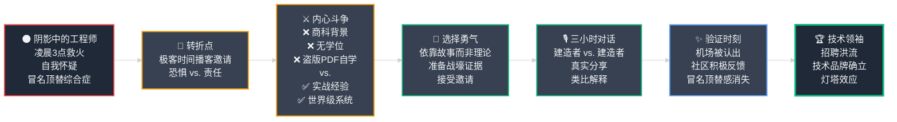

## 第16章：聚光灯——从意外 CTO 到技术领袖

多年来，我的世界只有一个**带绿色文本的黑屏**。

我的战斗是在沉默中进行的——对抗崩溃的服务器 (Server)、失效的数据库 (Database)、飙升的延迟 (Latency)。我们的成功用冰冷的指标来衡量：正常运行时间 (Uptime) 图表上稳定的绿线、监控面板上下降的延迟数字。

我们建造了一台令人难以置信的机器，**但我们是在黑暗中默默建造的。**

---

然而，随着我们平台的不断成长，世界开始注意到了。

关于 小店通 令人难以置信的性能、我们创新的边缘网络 (Edge Network)、我们与 有赞 的技术对决……这些耳语开始变得越来越响亮。

有一天，**聚光灯找到了我。**

这是一个新型烈火试炼的故事——这一次，不是与服务器崩溃或数据库瓶颈有关，而是与面对**作为一个自学工程师的我，内心深处根深蒂固的恐惧**有关。

### Part 1：那封邮件与内心的尖叫

**周二下午，一封邮件静静地落入我的收件箱。**

主题行简洁而正式：

> _"邀请：极客时间播客与池建强对话"_

我的心脏瞬间开始狂跳。

---

**对于中国创业生态系统中的任何人来说，池建强和极客时间播客都是传奇。**

池建强是一位 **hardcore (硬核)** 的、**第一性原理 (First Principles)** 思维的工程师。他是一位备受尊敬的技术领袖，以直言不讳著称，从不回避指出技术泡沫和炒作。

他的播客是**三小时无删减的技术深度对谈**——没有客套话，没有表面功夫，只有纯粹的技术细节解剖。这是一场**真正的极客盛宴 (Geek Fest)**。

**而嘉宾名单……嘉宾名单简直是中国科技界的名人堂。**

之前的嘉宾包括：

- **蒋涛**  
  CSDN 创始人兼 CEO——中国开发者社区的教父级人物

- **左耳朵耗子 (陈皓)**  
  阿里巴巴、亚马逊前技术专家——处理过亿级并发流量的系统大师

- **张云泉**  
  饿了么前 CTO、红杉资本技术顾问——中国创业生态的技术领袖

**这些人不仅仅是 CTO，他们是中国科技的开拓者。** 他们是我们所有工程师渴望构建的那种世界级系统的架构师。他们清一色是 **清华、北大、浙大** 等名校毕业生，拥有深厚的计算机科学理论功底，算法、数据结构、分布式系统理论……信手拈来。

---

**而第四位嘉宾，应该是我。**

老实说，我的第一反应**不是兴奋**。

这是**纯粹的、冰冷的、令人窒息的恐惧。**

**我害怕得要死。**

**冒名顶替综合症 (Imposter Syndrome)——那个在我整个职业生涯中一直是安静伴侣的恶魔——现在在我耳边尖叫。**

**我凭什么资格坐在那把椅子上？**

我是谁？
- ❌ 一个来自贵州山区小村庄的**商科孩子**
- ❌ 那个连 **CA (特许会计师)** 考试学费都负担不起的穷小子
- ❌ 那个从**盗版 PDF** 自学 PHP 的野路子程序员
- ❌ 那个在**凌晨 3 点看着服务器崩溃**、在火灾中摸索出系统设计的"救火队员"

**我对那些他们在名校大学课堂上教授的概念，几乎零理论知识。**

如果池建强要求我：
- 用教科书定义解释 **CAP 定理 (CAP Theorem)**
- 在白板上推导算法的 **大 O 时间复杂度 (Big O Notation)**
- 证明某个分布式共识算法的正确性

**我会当场冻结。我会被揭露为一个骗子。**

---

**更糟糕的是，这不仅仅关乎我个人。赌注巨大。**

- 我将代表 **小店通**
- 我将代表我的**整个工程团队**——一群极其有才华的人，他们把信任托付给我
- 我说的任何一句蠢话、犯的任何一个错误，都会连累他们所有人
- 这会损害我们在技术社区辛苦建立的声誉
- 这会撤销我们为打造技术品牌所做的所有努力

**我的第一本能是：礼貌地拒绝邀请。躲回我感到安全的阴影中。**

---

**但后来，我想到了我们的旅程。**

我想到了：
- ✅ 我们令人难以置信的**全球边缘网络**——9 个区域，<100ms 页面加载
- ✅ 我们大胆的**裸金属迁移**——从 阿里云 逃离黄金牢笼，成本削减 60%+
- ✅ 我们精密的**可观测性平台**——Grafana + Prometheus，实时监控全球流量
- ✅ 我们在**鲨鱼池效应**中的完美表现——80,000 并发用户，零宕机

**我们有一个值得讲述的故事。** 一个真实的、在战壕中摸爬滚打、从零构建世界级产品的故事。

**如果我因为恐惧而不敢讲述它，那还有谁会讲？**

---

**这不再是关于我个人了。**

**这是关于我们。这是关于 小店通。这是一种责任。**

---

心脏提到嗓子眼，手指微微颤抖，我回复了那封邮件：

> _"我很荣幸。期待对话。"_

发送。

### Part 2：三小时极客马拉松对话

播客前的几天，是一片焦虑的模糊。

我没有试图死记硬背计算机科学教科书——我知道那是徒劳无功的。

**相反，我决定依靠我唯一真正的优势：故事。**

- ❌ 我**不会**试图成为房间里最聪明的理论学者
- ✅ 我**要**成为最真实的实战建造者 (Builder)

**我的准备策略：**
- 📊 收集我们的架构演进图
- 📈 准备鲨鱼池峰值期间的 Grafana 实时监控仪表盘
- 💰 整理裸金属迁移的成本节省图表（阿里云 8万美元/月 → 5000美元/月）
- 🔥 梳理那些凌晨3点的生产事故故事

**我不会引用抽象理论；我要展示来自战壕的血淋淋证据。**

---

**录制当天**

我走进工作室，心脏狂跳，手心冒汗。

布置很专业，灯光刺眼，摄像机的红灯让人紧张。池建强用坚定的握手迎接我——他正如我想象的：**敏锐、专注、深度技术化。**

然而，**当我们开始交谈的那一刻，我的恐惧开始消融。**

他不是来用算法难题刁难我的。**他是一个建造者，想和另一个建造者对话。** 问题不是抽象的教科书定义；它们是真实的、血肉的工程挑战。

我们从最开始讲起：那台曾经支撑整个 小店通 公司的 **512MB DigitalOcean Droplet 小水滴服务器**，以及它在凌晨 3 点崩溃如何成为我**扩展 (Scaling)** 的第一课。

**接下来的三个小时，不是一次采访——这是两个痴迷于解决难题的技术人之间的深度极客马拉松对话。**

我忘记了摄像机。我忘记了观众。我只是在和一位工程师同行交谈，分享这本书中的所有故事。

我所谓的弱点——缺乏正规培训——成了我的超能力。我不能依靠复杂的行话，所以我必须从第一性原理解释事情，使用我用来理解它们的相同简单类比。

- 当池建强问到如何处理我们无服务器边缘函数 (Serverless Edge Function) 的冷启动时，我没有进行关于 lambda 演算的技术讲座。我使用了 **方便面的例子**。"第一个访问新函数的客户必须等待两分钟才能烧开水，"我解释道。"但之后的每个客户都能立即得到他们的方便面。"这个概念立刻就明白了。这是一种解释复杂无服务器问题的简单、相关的方式。
- 我们深入探讨了我们迁移到 **裸金属 (Bare Metal)，使用像 E2E Networks 这样的提供商**，以及我们实现的疯狂的、几乎令人难以置信的成本节省。
- 我们谈到了我们如何在第一次请求时就为卖家的自定义域名即时颁发 **SSL 证书 (SSL Certificate)** 的魔力，这是我们团队非常自豪的一项边缘工程。
- 对话甚至转向了构建团队的哲学和关于面试中 **DSA（数据结构和算法，Data Structures & Algorithms）** 的大辩论。我分享了我诚实的、街头智慧的观点：我可以 Google 一个排序算法，但我不能 Google 在凌晨 3 点修复生产数据库崩溃的勇气。我们重视构建和在实践中学习，这种哲学深深共鸣。

我只是在讲述我们的故事。当三个小时结束时，我精神上筋疲力尽，但感到一种解脱。我幸存下来了。我真实地讲述了我们的故事。现在，由世界来评判了。

#### **后果：机场时刻**

播客一周后上线。我很紧张，但中国技术社区的反应是立即的、压倒性的积极。Twitter 和 LinkedIn 上的评论不是关于我缺乏学位；它们是关于我们解决的现实世界问题。工程师们对我们构建系统所采取的实用、不废话的方法感到兴奋。

最超现实的时刻出现在几周后。我在机场，等待登机。一个年轻人走向我，看起来有点犹豫。

"打扰一下，先生，"他说。"你是陈浩 (陈浩) 吗？"

我点了点头，感到惊讶。

"先生，我看了你的极客时间播客，"他说，脸上露出光彩。"太棒了。你解释边缘网络的方式简直令人难以置信。谢谢你。"

我惊呆了。这是第一次，我在公共场合被认出，不是作为创始人，而是作为一名工程师。来自贵州山区的男孩在第一份工作时感觉像个冒名顶替者，现在在机场因他的技术见解而被感谢。这是一个深刻的情感和验证时刻。几周来一直困扰我的恐惧消失了，取而代之的是一种安静的归属感。

个人认可是超现实的，但播客的真正影响即将回到办公室打击我们。它刚刚为全国最好的工程师点亮了一座巨大的灯塔。

### Part 3：灯塔和回声

"机场时刻"的个人验证是一次深刻的经历。但那次三小时对话的真正、持久的影响不是对我的自我；而是对我们公司，它以我们从未预料到的方式回荡给我们。

在高度竞争的科技创业世界中，有一种货币比风险投资更有价值：**工程人才 (Engineering Talent)**。在播客之前，我们只是众多试图说服聪明人加入我们使命的创业公司之一。

播客之后，一切都改变了。我们点亮了一座灯塔。

#### **人才的洪流**

我们的招聘页面以前会收到稳定的申请者涓流，现在变成了洪流。我自己的 LinkedIn 收件箱充满了来自中国一些最好的产品公司的高级工程师的消息。但变化在于对话的_质量_和_意图_。

播客充当了我们正在解决的那种困难、有趣问题的三小时深入广告。顶级工程师不只是在寻找工作；他们在寻找挑战。正如视频上的一条评论所说，播客是一个**"非正式的系统设计课程"**。我们不再只是一个拥有优秀产品的创业公司；社区在说**"从技术角度来看，这家公司看起来很棒。"**

我们的招聘流程转变了。播客成为我们的终极过滤器和磁铁。终极赞美，以及这么多人联系的原因，被一条简单的评论捕捉到：**"谁不想和这样的 CTO 一起工作。"**

#### **"街头智慧"CTO 的验证**

对我个人来说，最有力的反馈是对我非传统旅程的验证。多年来我一直背负的冒名顶替综合症，作为一个满是计算机科学毕业生的房间里的"商科孩子"的恐惧，在我阅读评论时开始消解。

人们不关心我的学位。他们关心我们解决的现实世界问题。他们称我为**"原始的、知识渊博的、街头智慧的 CTO"**和**"真正意义上的工程师"**。一条让我深受触动的评论是，**"对这个人印象深刻！！他如何从非技术背景切换到技术背景，掌握所有细节！！"**

另一条把所有事情都放在了透视中：**"英语对我和很多人来说都是问题。我很惊讶在这里看到，但他取得了这么多成就给了我信心。"** 这是一个谦卑的提醒，我的故事不仅仅是我自己的；它是无数在这个行业感觉像局外人的人的灵感来源。

#### **本书的诞生**

播客很长——超过三个小时。我担心没有人会看。但不断出现的评论是某个版本的：**"最初我想，谁会看这么长的视频，但当我看的时候，没有意识到时间是何时过去的。"** 我们创造了一些引人入胜的东西，人们觉得这是一次"令人愉快的对话"。

但特别是一条评论，播下了最终成长为你手中这本书的种子。

一位名叫哈里达尚 (Haridarshan ) 的观众写道：**"......人们可以根据整个采访中涵盖的主题创建一本系统设计书。"**

当我读到这个时，灵光一闪。他是对的。社区不仅仅是被娱乐；他们在学习。他们在从战壕讲述的故事中看到了价值。那条评论，以及与之类似的数十条评论，是我需要的最后推动。这是对这个故事的验证——一个普通人通过烈火试炼来弄清楚事情的故事——是一个值得完整讲述的故事。

在许多方面，那个播客是本书的第一稿。它证明了诚实而真实地讲述你的故事是你能做的最有力的事情——为你的公司、为你的社区、为你自己。

---

## 第16章：关键要点总结 🎯

### 核心洞察

**1. 你的工程故事是最强大的招聘武器**

- 💡 **顶级人才被难题吸引，而不仅仅是高薪**
- 🎯 **公开分享你的技术挑战和解决方案**
- 🧲 **把公司打造成技术品牌，成为工程师的灯塔**
- 📢 **渠道：** 博客文章、技术播客、开发者大会演讲、开源贡献

**2. 真实性 > 学历背景**

- ✅ **用故事解释复杂概念的能力 > 学术资历**
- ✅ **实战经验 + 类比思维 = 最强共鸣**
- ✅ **街头智慧 (Street Smart) vs. 书本聪明 (Book Smart)**
- 🎁 **"弱点"可以成为"超能力"——缺乏术语让你用人话解释技术**

**3. 走出舒适区才有成长**

- 🚀 **最大的机会往往在恐惧的另一边**
- 💪 **面对冒名顶替综合症，选择勇气而非逃避**
- 🎭 **从幕后工程师到聚光灯下的技术领袖**
- 🔥 **责任感 > 个人恐惧：为团队而战**

**4. 播客/分享的连锁反应**

- 📈 **招聘流量激增：** 从涓流变洪流
- ⭐ **候选人质量提升：** 吸引真正热爱技术挑战的工程师
- 🏆 **技术品牌建立：** 社区认可："这家公司从技术角度看很棒"
- 📚 **知识传播：** 观众评论："这是一堂非正式的系统设计课"

### 从冒名顶替者到技术领袖——成长路径图

### 心理转变：从恐惧到力量

| 阶段 | 内心状态 | 关键转变 |
|------|---------|---------|
| **1. 幕后工程师** | 冒名顶替综合症、自我怀疑 | 建造了令人难以置信的系统，但在阴影中 |
| **2. 收到邀请** | 纯粹恐惧、想要逃避 | 名校天才们的名人堂，我凭什么？ |
| **3. 内心斗争** | 责任感 vs. 恐惧 | "如果我不讲，谁来讲我们的故事？" |
| **4. 战略准备** | 焦虑但有目标 | 不拼理论，拼实战故事和证据 |
| **5. 对话进行中** | 恐惧消融、进入心流 | 建造者对建造者，忘记摄像机 |
| **6. 社区反馈** | 震惊、感动、验证 | "街头智慧 CTO"、"真正的工程师" |
| **7. 灯塔效应** | 归属感、技术领袖 | 招聘洪流、技术品牌确立 |

### 实际影响

- 🎤 **3小时播客** → 中国技术社区热烈反响
- 📈 **招聘页面** → 从涓流到洪流
- ⭐ **候选人质量** → 来自顶级公司的高级工程师主动联系
- 💬 **评论热度** → "谁不想和这样的 CTO 一起工作"
- 📚 **知识传播** → "非正式的系统设计课程"
- 🌱 **本书诞生** → 观众建议："可以写一本系统设计书"

 

