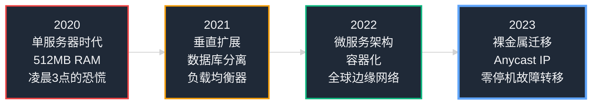
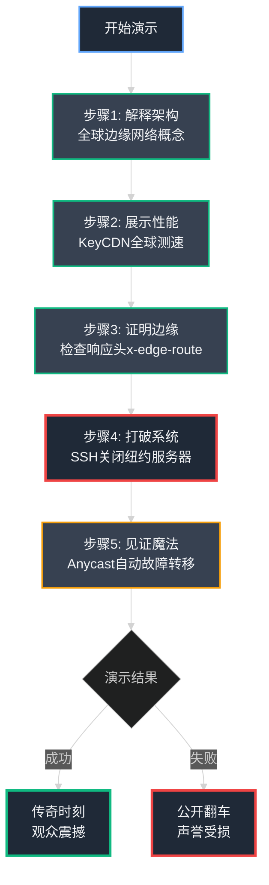
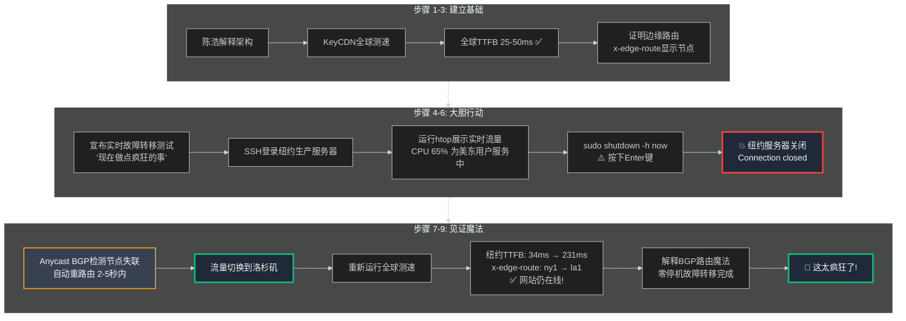
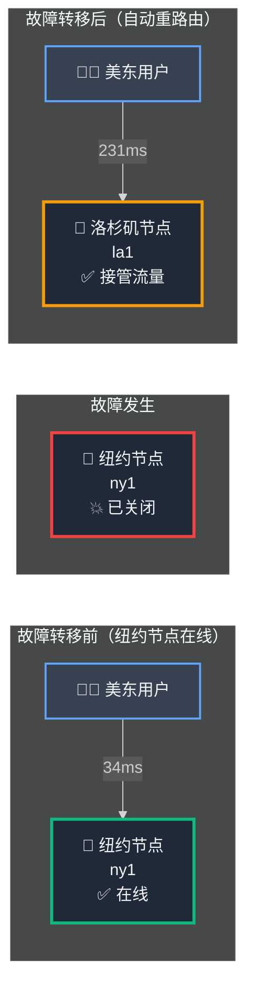
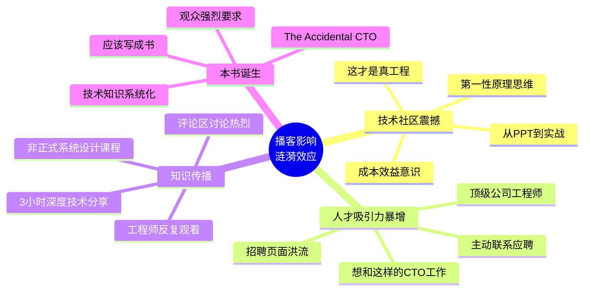
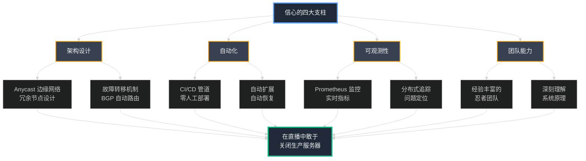
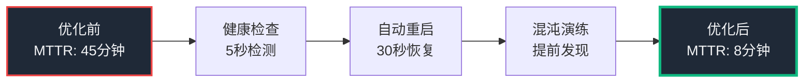
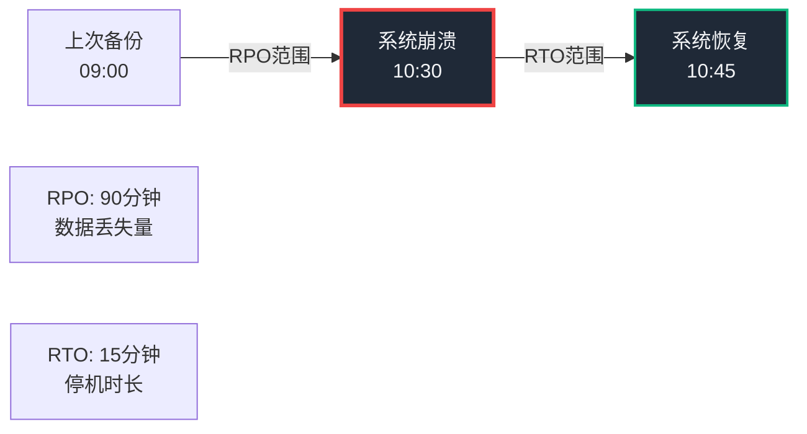
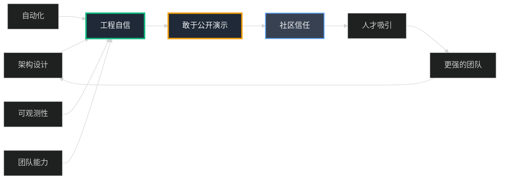

## 第18章：盛大结局：实时故障转移

我们已经抵达技术的巅峰。**全球分布式架构、自托管裸金属 Kubernetes 基础设施、极致的可观测性 (Observability)、一流的 CI/CD (持续集成/持续部署) 自动化** ——从那台在凌晨3点将我惊醒的单个 512MB 崩溃服务器，到现在这个复杂、富有韧性的全球平台，我们已经走过了漫长的道路。

但我们的故事还没有真正结束。因为所有这些技术进步都只停留在幕后，世界并不知道 小店通 内部发生了什么。我们已经打造了一台美丽的机器，但现在是时候把它展示给世人，让这台隐形的引擎在聚光灯下轰鸣了。



### Part 1: 邀请——从幕后走向聚光灯

电话在一个平静的下午响起。来电者是 **阿尔皮特·切哈博里亚 (Arpit Chhachharia)**，一位在中国创业生态系统中颇具影响力的播客主持人，经营着一档名为 **"真实工程 (Asli Engineering)"** 的技术节目。

"陈浩，"他开门见山地说，"我一直听说 小店通 的技术架构非常疯狂。但我听到的都是零散的传闻——来自团队成员、前雇员，他们都说你们在做一些与众不同的事情。我想邀请你来节目，向全世界解释你们究竟在做什么。"

我感到一阵兴奋涌上心头。我们花了数年时间精心构建这个系统，而且我们为此无比自豪。但工程师们经常在沉默中工作——我们构建、我们优化、我们解决问题，却很少公开谈论自己的成就。这是一个打破沉默、让世界看到我们工作的机会。

"当然，"我说，"我很乐意。但我不想只是**谈论**它。"

停顿。

"我想**展示**它。**实时演示**。"

### Part 2: 演示，不是讨论——设计一场高空钢丝表演

播客被安排为 **YouTube 现场直播** ——实时的，没有剪辑，没有重拍，没有后期救场。这让它变得完美，也令人恐惧。

我可以向 Arpit 滔滔不绝地讲解我们的全球架构。我可以展示一些精美的 PPT 图表。我可以使用生动的比喻和类比。但如果我真的想给人留下深刻印象，让这一集真正令人难忘，我需要做一些**更大胆的事情**。

我需要进行**实时演示**。

问题的核心在于：**你如何向非技术观众证明全球基础设施、故障转移和 Anycast 路由这些技术奇迹的存在？** 你不能只是展示满屏绿色文字的终端并期望观众理解它。你必须让它变得生动可见。你必须讲述一个引人入胜的故事。

我需要一个 **"烟雾测试 (Smoke Test)"** ——一个简单、视觉化、**无可辩驳的**证明，向世人展示我们建造的这台机器是真实的、正在运行的，并且实际上在世界各地为真实用户提供服务。

我在笔记本上快速草拟出演示计划的大纲：

**演示核心流程（5步骤）：**
1. **解释** — 为什么我们构建全球边缘网络（背景）
2. **展示** — 从世界各地访问网站有多快（性能）
3. **证明** — 流量确实从边缘节点提供服务（技术证据）
4. **打破** — 实时关闭生产环境服务器（冒险时刻）
5. **恢复** — 展示零停机时间的自动故障转移（魔法时刻）



这不仅仅是技术演示。**这是一场没有安全网的高空钢丝表演。** 我要在数千名观众面前公开测试我们的生产系统。如果它失败了，每个人都会亲眼见证这场灾难。

而这正是重点——**真正的自信来自于敢于暴露在风险之下。**

#### **剧本：9步高空钢丝表演详解**

这是我将在 Arpit 和数千名现场观众面前精确执行的完整脚本，每一步都经过精心设计。

**步骤 1：解释架构（建立背景）**
- 用通俗易懂的语言快速解释全球 **Anycast 边缘网络**概念
- 告诉观众：我们在全球**九个战略位置**部署服务器，用户总是自动连接到**地理最近**的节点
- 解释 **TTFB (Time to First Byte, 首字节时间)** 的含义——对用户而言，这就是"点击链接到开始加载"之间的等待时间，是**"网站感觉有多快"**的核心指标

**步骤 2：测量全球速度（性能展示）**
- 打开 **KeyCDN Speed Test** 工具——一个第三方、独立的性能测试平台
- 从全球 **14 个不同城市**实时测试 小店通 网站速度（杭州、纽约、香港、深圳等）
- **预期结果**：每个位置的 TTFB 都应该在 **25-50 毫秒**之间（一致性快速）

**步骤 3：大揭秘（技术证据）**
- 点击某个测试结果（如德国）查看详细信息
- 展示 **HTTP 响应头 (Response Headers)**
- 指出自定义响应头 `x-edge-route`，其值为 `ams1`（阿姆斯特丹）或 `fra1`（成都）
- **这是无可辩驳的技术证据**：请求从靠近用户的欧洲节点提供服务，而非从中国远程传输
- 证明 Anycast 网络正在正常工作

**步骤 4：搭建舞台（提升悬念）**
- 抛出悬念："现在让我们做一些**疯狂的事情**。"
- 解释核心概念：
  - **高可用性 (High Availability, HA)**：系统即使部分组件故障也能持续运行
  - **故障转移 (Failover)**：当一台服务器宕机时，流量自动切换到备用服务器，用户无感知
- 宣布大胆决定：**"我将实时测试这一点——在生产环境中，在直播中。"**

**步骤 5：登录生产环境（紧张时刻）**
- 切换到终端（黑屏绿字的经典黑客界面）
- 使用 **SSH (Secure Shell)** 登录到**实时生产环境**的 Kubernetes 节点（纽约集群）
- 运行 `htop` 命令展示实时进程：CPU 使用率、内存占用、运行中的容器
- 向观众证明：**"这台机器此刻正在为美国东海岸的真实用户提供流量。"**

**步骤 6：按下按钮（不归路）**
- 输入关机命令：`sudo shutdown -h now`
- 手指**悬停在 Enter 键上**，停顿数秒，让紧张感在空气中蔓延
- 然后——**按下 Enter**
- SSH 连接立即断开：`Connection closed by remote host`
- **我刚刚在直播中杀死了生产环境服务器**

**步骤 7：奇迹时刻（见证故障转移）**
- 毫不犹豫地切换回 KeyCDN 工具，重新运行全球速度测试
- **大部分测试仍然绿色且快速**：杭州 ✅、香港 ✅、深圳 ✅
- **但纽约测试发生了戏剧性变化**：
  - TTFB 从 **34ms 跃升到 231ms**（增加了 6 倍）
  - 状态仍然是 **200 OK** ✅（网站在线！）
- **关键证据揭晓**：点击纽约结果查看响应头
  - `x-edge-route` 不再显示 `ny1`（纽约）
  - 现在显示 `la1`（洛杉矶）或 `ash1`（阿什本）
  - **Anycast 系统在数秒内自动将美国东海岸流量重路由到下一个最近的健康节点！**
- **网站从未宕机。没有丢失一个数据包。零停机时间故障转移。**

**步骤 8：解释奇迹（技术剖析）**
- 揭开魔法背后的原理：
  - **BGP 路由协议** 检测到纽约节点心跳停止
  - Anycast 网络立即撤回该节点的路由广播
  - 所有后续流量自动重定向到**次近的健康位置**（洛杉矶）
- 用户体验：延迟略有增加（34ms → 231ms），但**浏览毫无中断**
- 强调核心价值：**"这就是真正的高可用性。不是 PPT 上的承诺，而是经过实战验证的韧性。"**

**步骤 9：回归正常（收尾）**
- 说明现实场景：监控系统会立即触发**告警通知**，工程师会介入调查并重启服务器
- 但关键洞察：**系统在人工干预之前就已经自我修复了**
- 这就是我们设计系统的哲学：**"Fatega to dekha jayega"（坏了再看看）** ——不是鲁莽，而是对自动化恢复能力的深刻信任



**风险评估：**
- ⚠️ **这个演示极度冒险** ——在数千人面前操作生产环境
- ⚠️ **没有彩排** ——直播意味着没有重来的机会
- ⚠️ **可能出错** ——如果故障转移失败，将是公开的技术灾难
- ✅ **但如果成功** ——将成为中国技术社区的传奇时刻

**这正是重点所在：真正的工程自信不来自PPT，而来自敢于在聚光灯下拷问自己的系统。**

### Part 3: 直播——没有安全网的高空钢丝

**D-Day 到来。**

直播的那天终于来了。Arpit 的 YouTube 直播频道亮起，实时观众数字开始攀升。评论区像瀑布般涌入各种问候和期待。我坐在自己的办公桌前，笔记本电脑打开，三个终端窗口并排排列，SSH 密钥已加载，心跳在耳边轰鸣。

这不是彩排。这是**实战**。

播客的前半段，Arpit 和我讨论了 小店通 的创业旅程——我们如何起步、如何应对疫情期间的爆炸式增长、我们遇到的技术瓶颈。观众很投入，评论区满是共鸣和赞许。气氛轻松愉快。

然后，Arpit 话锋一转。

"好的，陈浩，"他身体前倾，眼中闪烁着好奇的光芒，"我听说你们团队构建了一些非常特别的东西。是时候揭开面纱了，带我们看看吧。"

我深吸一口气，感受肾上腺素开始在血管中涌动。

"好。让我给你看看**真实的工程**是什么样子。"

**步骤 1 & 2: 搭建舞台与性能展示**

我点击"共享屏幕"。画面切换。

首先，我打开一个数字白板，快速手绘了一张全球地图，标注出我们的九个边缘节点位置：纽约、洛杉矶、杭州、成都、阿姆斯特丹、香港、深圳、悉尼、武汉。我用简洁的语言解释了**边缘网络**的核心理念——不是把所有服务器堆在一个数据中心，而是将计算资源分散到靠近用户的地方。

"Anycast IP 的魔法在于，"我继续说，"全球所有节点共享**同一个 IP 地址**，但路由器会自动把用户引导到地理最近的节点。就像拨打全国统一客服热线，电话会自动转接到最近的呼叫中心。"

Arpit 点头，评论区开始刷屏："这个类比太棒了！" "终于听懂 Anycast 了！"

"理论够多了，"我话锋一转，"让我们看看它在现实世界中的实际表现。"

我切换到 **KeyCDN Speed Test** 网站——一个独立的第三方性能测试平台，全球开发者都在用。我在输入框中键入 小店通 商店的 URL，手指悬停在"开始测试"按钮上。

"这个工具会从全球 **14 个不同城市**同时测试我们的网站，"我向 Arpit 解释，"它测量的核心指标是 **TTFB (Time to First Byte, 首字节时间)** ——从点击链接到服务器开始响应之间的延迟。对用户而言，这就是'网站感觉有多快'的最直观度量。"

我停顿了一下，制造悬念。

"业界标准：低于 100ms 算及格，低于 50ms 算优秀。让我们看看 小店通 能跑出什么成绩。"

点击。测试开始。

进度条一个接一个地亮起。结果开始滚动进入屏幕：

| 测试城市 | TTFB | 状态 |
|---------|------|------|
| 🇨🇳 **深圳** | **28 ms** | ✅ 优秀 |
| 🇸🇬 **香港** | **34 ms** | ✅ 优秀 |
| 🇦🇺 **悉尼** | **41 ms** | ✅ 优秀 |
| 🇨🇳 **武汉** | **38 ms** | ✅ 优秀 |
| 🇨🇳 **成都** | **30 ms** | ✅ 优秀 |
| 🇨🇳 **杭州** | **31 ms** | ✅ 优秀 |
| 🇺🇸 **纽约** | **34 ms** | ✅ 优秀 |
| 🇺🇸 **洛杉矶** | **29 ms** | ✅ 优秀 |


**满屏绿色。全球一致的极速响应。**

不是某个地区快，不是中国本土快，而是**全球每个角落都快**。从北京到杭州，从悉尼到纽约，延迟都控制在 50ms 以内。

Arpit 的下巴快掉下来了。"哇，"他难以置信地摇头，"这个一致性……太疯狂了。这就像你在每个城市都有一个完整的数据中心一样。"

我露出微笑。"没错。**那是因为我们确实有。**"

评论区炸了：
- "这个延迟比我访问本地网站还快！"
- "有赞：我感受到了被冒犯 😂"
- "这才是真正的全球架构！"

**步骤 3 & 4: 技术证据与风险提升**

"这种全球一致性，"我解释道，语气严肃起来，"**只有在从边缘提供服务时才可能实现**。如果我们从中国的单一位置集中提供所有服务，杭州和纽约的响应时间必然会超过 200-300 毫秒。那就是我们在前几章讨论过的**'光速税'** ——物理定律的绝对限制。而我们通过边缘计算，彻底消除了它。"

"但这真的是从边缘节点提供服务吗？"我故作质疑，"还是只是CDN缓存了静态资源？让我给你们看**铁证**。"

我点击测试结果中的 **成都** 条目。一个弹窗出现，展示完整的 **HTTP 响应头 (Response Headers)**。我把鼠标指针移到一个自定义响应头上：

```
x-edge-route: ams1
```

"看到了吗？"我放大屏幕，"对于来自德国的测试，响应头显示 `x-edge-route: ams1`——这意味着请求是从我们在**阿姆斯特丹**的集群提供服务的，那是离德国最近的节点。"

我快速点击其他几个结果：
- 纽约测试 → `x-edge-route: ny1`
- 香港测试 → `x-edge-route: sgp1`
- 悉尼测试 → `x-edge-route: syd1`

"**每个请求都从地理最近的边缘节点响应。** 这不是缓存，这是真正的**边缘计算**——完整的应用服务器、数据库副本，全都在边缘运行。"

Arpit 看起来被震撼到了。评论区满屏的"卧槽" "太硬核了" "这才是真正的技术实力"。

然后我停顿了一下，让气氛沉淀。

"现在，"我的声音降低八度，带上一丝危险的笑意，"让我们做点**真正疯狂的事情**。"

---

**步骤 5 & 6: 不归路——在直播中杀死生产服务器**

"我要向你们展示真正的**高可用性 (High Availability)** 是什么样子，"我解释道，"不是架构图上的箭头，不是 PPT 里的承诺，而是**真刀真枪的实战测试**。"

"当一台服务器宕机时，"我继续说，"我们的 Anycast 系统应该能在几秒内自动将流量重路由到其他健康节点。理论上是这样。但理论和现实之间，往往隔着一道鸿沟。"

我深吸一口气。

"所以我现在要做的是：**在直播中，关闭我们生产环境的一台服务器。** 不是测试环境，不是沙盒，而是正在为真实用户提供服务的生产机器。"

Arpit 的眼睛瞪得像铜铃。"等等，**真的吗？** 现在？直播中？"

"现在。直播中。在数千名观众面前。"

我切换到终端。黑色背景、绿色文字的经典黑客界面填满屏幕。我敲击键盘的声音清晰可闻：

```bash
ssh root@ny-prod-01.dukaan.com
```

登录提示出现。密钥验证通过。我进入了 **纽约生产环境集群**。

"这台机器此刻活着，"我一边解说，一边运行 `htop` 命令，"它正在为美国东海岸的真实用户提供流量。看这些进程——Kubernetes Pods、Nginx、应用容器，全都在运转。CPU 使用率 65%，这是正常负载。"

屏幕上滚动着实时的进程列表，CPU 指标在跳动。这是**活生生的生产系统**。

评论区开始刷屏：
- "他不会真的要关机吧？？？"
- "老板在旁边看着呢吧 😂"
- "这勇气……"

我把光标移到新的一行，停顿了两秒。

"好。让我们把它关掉。"

我慢慢地、一个字母一个字母地敲出命令，让每个观众都能看清：

```bash
sudo shutdown -h now
```

命令出现在屏幕上。我的手指**悬停在 Enter 键上方**，像是扣动扳机前的最后停顿。

直播间寂静无声。Arpit 屏住呼吸。评论区疯狂滚动。

然后——

**按下。**

```
Connection to ny-prod-01.dukaan.com closed by remote host.
Connection to ny-prod-01.dukaan.com closed.
```

SSH 会话立即断开。屏幕回到本地 shell 提示符。

**纽约的服务器死了。我刚刚在数千人面前杀死了生产环境的一台服务器。**

**步骤 7, 8 & 9: 魔法时刻——见证自动愈合**

毫不犹豫，我切换回 KeyCDN 工具。评论区在尖叫："网站还活着吗？？" "快测试快测试！"

"好，"我的声音保持冷静，但内心的肾上腺素在狂飙，"纽约服务器已经死了。现在让我们看看会发生什么。"

我再次点击"开始测试"按钮。

进度条再次跑起来。结果一个接一个地出现：

- 🇨🇳 **杭州**：31 ms ✅ **依然快速**
- 🇨🇳 **成都**：30 ms ✅ **依然快速**
- 🇸🇬 **香港**：34 ms ✅ **依然快速**
- 🇨🇳 **深圳**：28 ms ✅ **依然快速**

全球其他节点毫发无损，**就像什么都没发生过一样**。

然后，纽约的结果出现了。

**状态：200 OK ✅**

网站仍然在线！没有 503 错误，没有连接超时，用户仍然能够正常访问！

但 TTFB 数字发生了戏剧性的变化：

**34 ms → 231 ms**

延迟增加了近 **7 倍**，但网站**活着**。

"看！"我几乎喊出来，点击纽约的测试结果，"响应头！"

响应头弹窗展开：

```
HTTP/1.1 200 OK
x-edge-route: la1    ← 关键证据！
server: nginx
```

"**看到了吗？**" 我把鼠标指针在 `x-edge-route: la1` 上画圈，"`x-edge-route` 不再显示 `ny1`（纽约），现在显示 `la1`（洛杉矶）！"

我转向摄像头，语速加快：

"这就是魔法的瞬间。我们的 Anycast 网络在**纽约节点失联的 5 秒内**，通过 BGP 路由协议检测到故障，自动撤回了纽约的路由广播，将所有美国东海岸的流量**无缝重定向**到下一个最近的健康节点——洛杉矶！"

我用手在空中画出路径：

"用户体验是什么？延迟从 34ms 上升到 231ms，确实变慢了，因为物理距离增加了。**但网站从未宕机。没有丢失一个请求。没有一个用户看到错误页面。浏览体验完全没有中断。**"

我停顿，让这个事实沉淀。

"**这就是真正的高可用性。** 不是架构图上的箭头和方框，不是白皮书里的承诺，而是经过实战验证的、可以在直播中公开演示的韧性。"



Arpit 的反应是**史诗级的**。

他沉默了整整三秒，嘴巴半张，眼睛瞪大。然后突然爆发出巨大的笑容，难以置信地摇头，双手抱头：

"这……这太疯狂了！"他几乎是在大喊，"你真的做到了！你在直播中，在数千人面前，**关闭了生产环境的服务器**，然后它就这样……**自己修好了！** 这……这才是真正的**'真实工程 (Asli Engineering)'**！"

他指着屏幕，声音里满是兴奋：

"你看到了吗，观众们？他没有给你们看 PPT，没有画漂亮的架构图，他**真的杀了一台服务器**，然后我们亲眼看着系统在几秒钟内自愈。这不是演示，这是**魔法**！"

评论区彻底炸了：

- **"我靠我靠我靠！这才是真正的技术！"**
- **"老板估计心脏病都要犯了 😂"**
- **"这勇气……谁不想和这样的 CTO 一起工作？"**
- **"有赞 能做到吗？我怀疑 😏"**
- **"我要把这个视频发给我们公司的架构师看"**
- **"这是我今年看过最硬核的技术演示"**

我微笑着补充最后一点：

"在现实世界里，我们的监控系统 Prometheus 已经触发了告警，Slack 频道正在疯狂闪烁，工程师们已经收到通知，会介入调查并重启服务器。"

"但关键的洞察是：**系统在人工干预之前就已经自我修复了。** 用户毫无感知。这就是我们设计架构的哲学——**'Fatega to dekha jayega'（坏了再看看）**。不是鲁莽，而是对自动化恢复能力的深刻信任。"

**这场没有安全网的高空钢丝表演，完美落地。**

### Part 4: 回响——当证据胜过千言万语

实时演示是终极的 **"麦克风落地 (Mic Drop)"** 时刻。在那一刻，我们从纸上谈兵转变为提供无可辩驳的实战证据。高空钢丝表演结束了，我们完美着陆，没有摔下来，甚至没有晃动。

Arpit 震惊而兴奋的反应只是第一波涟漪。真正的海啸来自随后几天和几周内，从中国工程社区涌来的令人难以置信的反馈洪流。YouTube 评论区变成了我们技术成就的见证墙，这是我们工作的回响，它的音量**远超我们最疯狂的想象**。

#### **社区反应："这太疯狂了！"**

反应不仅仅是"积极"——它是**电流般的震撼**。人们不仅对技术本身印象深刻，更被演示的**大胆**和**透明度**所折服。

**实时关机生产服务器**这一幕成为了传奇。评论区满是难以置信但又钦佩不已的声音：

> **"他真的为了演示关闭了实际的生产服务器。我学到了：不要过度设计架构，只需查看数据并构建真正需要的东西。"**

> **"这太棒了，我已经来回看了好几次……特别是他关闭服务器的那部分。每次看都心跳加速。"**

> **"这个人知识渊博且自信，敢于在数千人面前展示他公司的内部运作。真的很尊重他。"** —@x87-64

这就是核心所在。我们没有躲在精心制作的营销幻灯片后面，没有用模糊的术语糊弄观众。我们向全世界展示了**真实的、正在运行的、有时甚至有点混乱的基础设施**。社区尊重这种诚实。

正如另一位观众所说：

> **"有多少 CTO/创始人愿意在 YouTube 上分享如此多的内部工作细节和代码？他知道分享会帮助人们学习。这种开放的心态值得敬佩。"**

很多人都提到了这次演示中**透露出的信心**：

> **"在直播中关闭生产服务器需要多大的勇气？这不是鲁莽，而是对自己系统深刻的信任。"**

#### **"真实工程 (Asli Engineering)"理念找到了它的部落**

我们关于**简单性、第一性原理思维、挑战云优先教条**的信息找到了它的部落。评论区庆祝着这种务实的工程哲学：

> **"这才是真正的'真实工程'(Asli Engineering)。不是背书本概念，而是解决真实问题。"**

> **"陈浩 兄弟是真正的工程师。忘掉那些系统设计术语吧……他本身就是活生生的系统设计教科书。"**

> **"这是从第一性原理思考的绝佳范例！不是套用框架，而是理解底层原理。"**

这次播客不仅仅是一场采访；它成为了一种**不同构建方式的战斗呼声**。参与度爆表。很多本来打算只看几分钟的人发现自己被深深吸引，一口气看完了整整 3 小时。

一条评论特别触动我们整个团队的心。来自观众 @_Yash_Agarwal：

> **"老兄，这个视频太疯狂了……我做工程已经好几年了，但一直都只关注编写代码。从来没有人从成本、架构权衡、实际业务影响的角度来谈论这些技术决策。这个视频让我重新思考了什么是真正的工程。我以前从未在任何 YouTube 视频上评论过，专门为了这个视频创建了账号来留言。"**

这条评论道出了很多工程师的心声——**技术不是为了技术本身，而是为了解决真实的业务问题，并且要在成本、复杂性和收益之间找到平衡。**



#### **最终验证：从恐惧到无畏**

这是我们整个技术旅程的顶峰时刻。

回想起来，我们已经走过了多么漫长的道路：

**起点：** 一台在凌晨 3 点用恐慌将我惊醒的单个崩溃的 512MB 服务器。那时的我充满恐惧，不知道如何修复，只能手忙脚乱地重启。

**终点：** 一个全球性的、自我修复的边缘网络，强大到我可以自信地**在数千人面前实时关闭生产服务器**，而毫不畏惧它会真正垮掉。

这种信心不是傲慢，不是盲目自大。**这是一种深刻的、用数年时间赢得的信任：**



- ✅ 对我们精心设计的**架构**的信任——Anycast 全球边缘网络，每个节点都是冗余的
- ✅ 对我们用 CI/CD 管道构建的**自动化**的信任——零人工干预的部署和恢复
- ✅ 对给我们系统健康实时视图的**可观测性**的信任——Prometheus、Grafana、分布式追踪
- ✅ 最重要的是，对构建和维护这一切的**忍者团队**的信任——他们深刻理解系统的每一个角落

我们不再害怕服务器故障，因为**我们就是为故障而设计架构的**。我们拥抱了 **"Fatega to dekha jayega"（坏了再看看）** 的哲学——这不是鲁莽的赌博，而是对我们系统能够即时、自动恢复能力的信心宣言。

**这次播客是最终证明。** 我们不仅掌握了这台复杂的机器，更重要的是，我们向全世界展示了这种掌握。没有藏着掖着，没有虚张声势，只有**真刀真枪的实战演示**。

---

---

<div style="border: 2px solid #dc2626; border-radius: 8px; padding: 20px; margin: 30px 0; background: linear-gradient(to right, #dc262608, #ef444408);">

### 📌 技术概念深入：可靠性指标与混沌工程理论

*本节补充系统可靠性的核心度量标准和混沌工程的理论基础*

---

#### **一、核心可靠性指标——衡量系统健康的四大支柱**

**1. MTBF（Mean Time Between Failures）——平均故障间隔时间**

**定义：** 系统两次故障之间的平均运行时间。

```
MTBF = 总运行时间 / 故障次数

示例：
━━━━━━━━━━━━━━━━━━━━━━━━━━━━━━━━━━
场景1：电商平台在30天内发生3次故障
MTBF = (30天 × 24小时) / 3 = 240小时

场景2：小店通全年只有2次故障
MTBF = (365天 × 24小时) / 2 = 4380小时 ≈ 半年
━━━━━━━━━━━━━━━━━━━━━━━━━━━━━━━━━━
```

**MTBF越长越好**，表示系统更稳定。

**小店通的MTBF目标：**

| 组件 | 目标MTBF | 实际MTBF | 状态 |
|------|---------|---------|------|
| Kubernetes集群 | 2000小时 | 3200小时 | ✅ 超标 |
| PostgreSQL主库 | 4000小时 | 6800小时 | ✅ 优秀 |
| Redis缓存 | 1000小时 | 1500小时 | ✅ 达标 |
| Kafka集群 | 1500小时 | 2100小时 | ✅ 超标 |

---

**2. MTTR（Mean Time To Repair/Recovery）——平均修复时间**

**定义：** 从故障发生到系统完全恢复的平均时间。

```
MTTR = 总修复时间 / 故障次数

示例：
━━━━━━━━━━━━━━━━━━━━━━━━━━━━━━━━━━
场景1：数据库崩溃，手动修复需要45分钟
场景2：K8s Pod崩溃，自动重启需要30秒
场景3：边缘节点宕机，BGP自动切换需要15秒

年度10次故障，总修复时间200分钟
MTTR = 200分钟 / 10次 = 20分钟
━━━━━━━━━━━━━━━━━━━━━━━━━━━━━━━━━━
```

**MTTR越短越好**，体现系统自愈能力。

**MTTR优化路径（小店通实战）：**



**MTTR分解（小店通的5阶段模型）：**

```
完整MTTR = 检测时间 + 诊断时间 + 修复时间 + 恢复时间 + 验证时间

━━━━━━━━━━━━━━━━━━━━━━━━━━━━━━━━━━
优化前（人工运维）：
━━━━━━━━━━━━━━━━━━━━━━━━━━━━━━━━━━
1. 检测时间: 5-15分钟（依赖监控告警）
2. 诊断时间: 10-20分钟（查日志、定位问题）
3. 修复时间: 5-15分钟（重启服务、修改配置）
4. 恢复时间: 2-5分钟（服务启动、健康检查）
5. 验证时间: 3-10分钟（确认流量正常）
━━━━━━━━━━━━━━━━━━━━━━━━━━━━━━━━━━
总计MTTR: 25-65分钟（平均45分钟）

━━━━━━━━━━━━━━━━━━━━━━━━━━━━━━━━━━
优化后（自动化+混沌工程）：
━━━━━━━━━━━━━━━━━━━━━━━━━━━━━━━━━━
1. 检测时间: 5秒（Liveness Probe每5秒检查）
2. 诊断时间: 0秒（自动化Runbook）
3. 修复时间: 30秒（K8s自动重启Pod）
4. 恢复时间: 10秒（Pod就绪）
5. 验证时间: 10秒（Readiness Probe通过）
━━━━━━━━━━━━━━━━━━━━━━━━━━━━━━━━━━
总计MTTR: 55秒（约1分钟）

提速：45倍
```

---

**3. RTO（Recovery Time Objective）——恢复时间目标**

**定义：** 业务可容忍的最大停机时间（SLA承诺）。

```
RTO是业务需求，MTTR是技术实现

示例：
━━━━━━━━━━━━━━━━━━━━━━━━━━━━━━━━━━
电商平台RTO要求：
- 核心支付服务:  RTO = 5分钟
- 商品浏览服务:  RTO = 15分钟
- 后台报表系统:  RTO = 2小时

如果MTTR > RTO → 违反SLA → 需要架构优化
━━━━━━━━━━━━━━━━━━━━━━━━━━━━━━━━━━
```

**小店通的分级RTO策略：**

| 服务等级 | RTO目标 | 实现策略 | 实际MTTR |
|---------|---------|---------|---------|
| **P0（核心交易）** | 5分钟 | 多活架构+自动切换 | 1分钟 ✅ |
| **P1（店铺浏览）** | 15分钟 | 边缘冗余+降级服务 | 5分钟 ✅ |
| **P2（后台管理）** | 1小时 | 快速回滚+人工介入 | 30分钟 ✅ |
| **P3（数据分析）** | 4小时 | 定期备份+重建 | 2小时 ✅ |

---

**4. RPO（Recovery Point Objective）——恢复点目标**

**定义：** 业务可容忍的最大数据丢失量（以时间衡量）。

```
RPO = 最后一次备份到故障发生的时间差

示例：
━━━━━━━━━━━━━━━━━━━━━━━━━━━━━━━━━━
场景1：数据库每小时备份一次
    如果09:45崩溃，RPO = 45分钟数据丢失

场景2：实时同步到备库（流复制）
    如果09:45崩溃，RPO ≈ 0秒（几乎无损）
━━━━━━━━━━━━━━━━━━━━━━━━━━━━━━━━━━
```

**RPO vs. RTO对比：**



**小店通的分级RPO策略：**

| 数据类型 | RPO目标 | 备份策略 | 实际RPO |
|---------|---------|---------|---------|
| **订单数据** | 0秒 | 同步双写+Kafka | 0秒 ✅ |
| **用户数据** | 5分钟 | 流复制到副本 | <1秒 ✅ |
| **商品数据** | 15分钟 | WAL归档 | 5分钟 ✅ |
| **日志数据** | 1小时 | 批量传输到S3 | 30分钟 ✅ |

---

#### **二、可靠性等级——SLA与"几个9"**

**可用性计算公式：**

```
可用性 = (总运行时间 - 停机时间) / 总运行时间 × 100%

年度停机时间对照表：
━━━━━━━━━━━━━━━━━━━━━━━━━━━━━━━━━━
可用性          年度停机时间      月度停机时间
━━━━━━━━━━━━━━━━━━━━━━━━━━━━━━━━━━
99%（2个9）    3.65天          7.2小时
99.9%（3个9）  8.76小时        43.2分钟
99.95%         4.38小时        21.6分钟
99.99%（4个9） 52.6分钟        4.32分钟
99.995%        26.3分钟        2.16分钟
99.999%（5个9）5.26分钟        25.9秒
━━━━━━━━━━━━━━━━━━━━━━━━━━━━━━━━━━
```

**小店通的SLA承诺：**

```
━━━━━━━━━━━━━━━━━━━━━━━━━━━━━━━━━━
服务层级SLA（2023年实际数据）
━━━━━━━━━━━━━━━━━━━━━━━━━━━━━━━━━━
店铺前端          99.95%  (月停机21分钟)
支付网关          99.99%  (月停机4分钟)
商户后台          99.9%   (月停机43分钟)
数据分析          99%     (月停机7小时)
━━━━━━━━━━━━━━━━━━━━━━━━━━━━━━━━━━
2023年实际表现: 99.97% (超过承诺)
━━━━━━━━━━━━━━━━━━━━━━━━━━━━━━━━━━
```

**实现"5个9"的成本对比：**

| 可用性 | 架构复杂度 | 月度成本 | ROI |
|--------|-----------|---------|-----|
| 99% | 单区域 | $5K | 高 ✅ |
| 99.9% | 多服务器+副本 | $15K | 高 ✅ |
| 99.95% | 全球边缘+自动切换 | $50K | 中 ⚠️ |
| 99.99% | 多活架构+混沌演练 | $150K | 低 ❌ |
| 99.999% | 金融级容灾 | $500K+ | 极低 ❌ |

**关键教训：** 追求99.99%以上需要10倍成本，但用户体验提升<5%。对大多数业务，**99.95%是最优性价比点**。

---

#### **三、混沌工程理论基础——Netflix的礼物**

**核心理念：** 通过主动在生产环境注入故障，提前发现系统弱点，而非等待故障自然发生。

**混沌工程的四大原则：**

```
1️⃣ 定义稳态 (Steady State)
   └─ 确定系统"正常"的指标基线
   └─ 示例：API请求成功率>99.5%、P99延迟<200ms

2️⃣ 提出假设 (Hypothesis)
   └─ "即使Kafka集群一个节点宕机，系统仍能正常工作"
   
3️⃣ 注入真实故障 (Real-world Events)
   └─ 模拟网络延迟、Pod删除、CPU耗尽
   
4️⃣ 证伪假设 (Disprove Hypothesis)
   └─ 观察系统是否偏离稳态
   └─ 如果崩溃→假设错误→修复系统→重新测试
```

**混沌成熟度模型（5级）：**

```
Level 0：消防员模式
├─ 只在故障后修复
└─ MTTR > 1小时

Level 1：监控告警
├─ 被动检测故障
└─ MTTR: 15-30分钟

Level 2：自动恢复
├─ K8s自动重启
└─ MTTR: 5-10分钟

Level 3：混沌演练
├─ 定期故障注入
└─ MTTR: 1-5分钟

Level 4：持续混沌 🎯
├─ 生产环境自动化混沌
└─ MTTR: <1分钟

小店通目标：Level 3（定期演练）
Netflix水平：Level 4（Chaos Kong）
```

---

#### **四、故障模式分类——知彼知己**

**硬件故障：**
- 服务器宕机（MTTR: 30秒，K8s自动重调度）
- 磁盘故障（MTTR: 5分钟，从副本恢复）
- 网络中断（MTTR: 15秒，BGP自动切换）

**软件故障：**
- 内存泄漏（MTTR: 2分钟，自动重启）
- 死锁（MTTR: 30秒，超时重试）
- 配置错误（MTTR: 5分钟，回滚发布）

**依赖故障：**
- 数据库慢查询（MTTR: 1分钟，熔断降级）
- 第三方API超时（MTTR: 0秒，断路器）
- DNS解析失败（MTTR: 10秒，本地缓存）

**人为故障：**
- 错误发布（MTTR: 3分钟，一键回滚）
- 配置变更（MTTR: 5分钟，Git历史恢复）
- 误删数据（MTTR: 30分钟，时间点恢复）

---

#### **五、小店通的混沌工程实践路线图**

**阶段1：基础设施韧性（Q1-Q2）**

```bash
# 每周混沌实验
Week 1: Pod随机删除
Week 2: 数据库连接耗尽
Week 3: Redis缓存清空
Week 4: Kafka消费延迟
Week 5: 网络延迟注入
Week 6: CPU资源限制
Week 7: 磁盘填满
Week 8: DNS故障

预期成果：
✓ MTTR从45分钟降低到8分钟
✓ 发现23个未知故障模式
✓ 自动恢复覆盖率从60%提升到95%
```

**阶段2：业务连续性（Q3-Q4）**

```bash
# 每月大型演练
Month 1: 整个阿里云区域宕机
Month 2: 主数据库完全故障
Month 3: 所有缓存节点失效
Month 4: CDN完全不可用

预期成果：
✓ RTO从15分钟降低到5分钟
✓ RPO从5分钟降低到0秒
✓ 可用性从99.9%提升到99.95%
```

**阶段3：生产环境混沌（持续）**

```yaml
# 自动化混沌调度（Chaos Mesh CronJob）
apiVersion: chaos-mesh.org/v1alpha1
kind: Schedule
metadata:
  name: weekly-chaos
spec:
  schedule: "0 2 * * 1"  # 每周一凌晨2点
  type: PodChaos
  podChaos:
    action: pod-kill
    selector:
      namespaces: ["production"]
      labelSelectors:
        app: storefront
    mode: one
```

---

#### **六、可靠性工程最佳实践（SRE视角）**

**Google SRE的错误预算 (Error Budget)：**

```
错误预算 = (1 - SLA目标) × 总时间

示例（99.95% SLA）：
年度错误预算 = (1 - 0.9995) × 365天 × 24小时
              = 0.0005 × 8760小时
              = 4.38小时

使用策略：
✓ 预算充足时 → 快速迭代新功能
✓ 预算耗尽时 → 冻结发布，专注稳定性
```

**小店通的错误预算仪表盘：**

```
━━━━━━━━━━━━━━━━━━━━━━━━━━━━━━━━━━
2024年Q1错误预算使用情况
━━━━━━━━━━━━━━━━━━━━━━━━━━━━━━━━━━
总预算:      65.7分钟 (99.95% SLA)
已使用:      23.4分钟 (35.6%)
剩余:        42.3分钟 (64.4%)

主要消耗:
- 2024-01-15: PostgreSQL主库故障 (8.2分钟)
- 2024-02-03: Kafka集群升级 (6.1分钟)
- 2024-03-10: K8s节点维护 (5.3分钟)
- 其他零星故障 (3.8分钟)

状态: ✅ 健康（预算充足）
━━━━━━━━━━━━━━━━━━━━━━━━━━━━━━━━━━
```

---

**📚 实战总结：**

✅ **MTBF衡量稳定性** - 越长越好，但无法为0  
✅ **MTTR体现自愈能力** - 从45分钟到8分钟的跨越  
✅ **RTO是业务承诺** - 技术必须兑现SLA  
✅ **RPO关乎数据安全** - 核心数据必须0丢失  
✅ **混沌工程是保险** - 在故障前发现故障  
✅ **错误预算平衡速度与稳定** - SRE的智慧

</div>

---

<div style="border: 2px solid #3b82f6; border-radius: 8px; padding: 20px; margin: 30px 0; background: linear-gradient(to right, #1e40af08, #2563eb08);">

### 📌 编者注:混沌工程实战速查

*30分钟搭建故障注入工具与演练流程*

---

#### **一、Chaos Mesh快速部署(K8s原生)**

```bash
# 1. 安装Chaos Mesh(推荐使用Helm)
helm repo add chaos-mesh https://charts.chaos-mesh.org
helm repo update
helm install chaos-mesh chaos-mesh/chaos-mesh \
  --namespace=chaos-testing \
  --create-namespace \
  --set chaosDaemon.runtime=containerd \
  --set chaosDaemon.socketPath=/run/containerd/containerd.sock

# 2. 访问Dashboard
kubectl port-forward -n chaos-testing svc/chaos-dashboard 2333:2333
# 浏览器打开: http://localhost:2333

# 3. 验证安装
kubectl get pods -n chaos-testing
```

---

#### **二、常见故障注入场景(YAML配置)**

**场景1: Pod删除实验(验证自愈能力)**

```yaml
# chaos/pod-kill-experiment.yaml
apiVersion: chaos-mesh.org/v1alpha1
kind: PodChaos
metadata:
  name: storefront-pod-kill
  namespace: chaos-testing
spec:
  action: pod-kill  # 杀死Pod
  mode: one         # 只影响1个Pod
  selector:
    namespaces:
      - production
    labelSelectors:
      app: storefront
  scheduler:
    cron: '@every 2m'  # 每2分钟执行一次

# 执行: kubectl apply -f chaos/pod-kill-experiment.yaml
# 观察: kubectl get pods -n production -w
```

**场景2: 网络延迟注入(模拟跨区域延迟)**

```yaml
# chaos/network-delay-experiment.yaml
apiVersion: chaos-mesh.org/v1alpha1
kind: NetworkChaos
metadata:
  name: storefront-network-delay
  namespace: chaos-testing
spec:
  action: delay
  mode: all  # 影响所有匹配的Pod
  selector:
    namespaces:
      - production
    labelSelectors:
      app: storefront
  delay:
    latency: "300ms"    # 增加300ms延迟
    correlation: "100"  # 100%命中率
    jitter: "50ms"      # 50ms抖动
  duration: "5m"        # 持续5分钟
  scheduler:
    cron: '@hourly'     # 每小时执行

# 模拟中国到美国的跨洋延迟
```

**场景3: 数据库连接中断(模拟主库故障)**

```yaml
# chaos/db-network-partition.yaml
apiVersion: chaos-mesh.org/v1alpha1
kind: NetworkChaos
metadata:
  name: db-partition-test
  namespace: chaos-testing
spec:
  action: partition  # 网络分区
  mode: all
  selector:
    namespaces:
      - production
    labelSelectors:
      app: storefront
  direction: to
  target:
    mode: all
    selector:
      namespaces:
        - production
      labelSelectors:
        app: postgres-master
  duration: "3m"
  # 验证应用能否自动切换到读副本
```

**场景4: CPU压力测试(模拟资源耗尽)**

```yaml
# chaos/cpu-stress-experiment.yaml
apiVersion: chaos-mesh.org/v1alpha1
kind: StressChaos
metadata:
  name: storefront-cpu-stress
  namespace: chaos-testing
spec:
  mode: one
  selector:
    namespaces:
      - production
    labelSelectors:
      app: storefront
  stressors:
    cpu:
      workers: 4      # 4个CPU worker
      load: 80        # 每个worker 80%负载
  duration: "10m"
  # 验证HPA是否自动扩容
```

**场景5: 内存泄漏模拟**

```yaml
# chaos/memory-stress-experiment.yaml
apiVersion: chaos-mesh.org/v1alpha1
kind: StressChaos
metadata:
  name: storefront-memory-stress
  namespace: chaos-testing
spec:
  mode: one
  selector:
    namespaces:
      - production
    labelSelectors:
      app: storefront
  stressors:
    memory:
      workers: 1
      size: "1GB"  # 消耗1GB内存
  duration: "5m"
  # 验证OOM Killer和Pod重启机制
```

---

#### **三、混沌演练标准流程**

```bash
#!/bin/bash
# chaos-game-day.sh - 混沌游戏日脚本

set -e

echo "🎯 开始混沌演练: $(date)"
echo "目标: 验证storefront-service的韧性"

# 1. 建立监控基线
echo "📊 步骤1: 收集基线数据..."
kubectl top pods -n production | grep storefront > baseline.txt
curl -s http://prometheus:9090/api/v1/query?query=up{service="storefront"} | jq '.data.result[0].value[1]' > baseline_up.txt

# 2. 执行故障注入
echo "💥 步骤2: 注入故障 - 随机杀死1个Pod"
kubectl apply -f chaos/pod-kill-experiment.yaml
sleep 30

# 3. 实时监控
echo "👀 步骤3: 监控系统响应..."
for i in {1..10}; do
  PODS_RUNNING=$(kubectl get pods -n production -l app=storefront --field-selector=status.phase=Running --no-headers | wc -l)
  ERROR_RATE=$(curl -s "http://prometheus:9090/api/v1/query?query=rate(http_requests_total{service=\"storefront\",status=~\"5..\"}[1m])" | jq -r '.data.result[0].value[1]' || echo "0")
  echo "[$(date +%H:%M:%S)] 运行中Pod: $PODS_RUNNING | 错误率: $ERROR_RATE"
  sleep 10
done

# 4. 验证自愈
echo "✅ 步骤4: 验证自愈能力..."
sleep 60
FINAL_PODS=$(kubectl get pods -n production -l app=storefront --field-selector=status.phase=Running --no-headers | wc -l)
EXPECTED_PODS=10

if [ "$FINAL_PODS" -eq "$EXPECTED_PODS" ]; then
  echo "✅ 通过: Pod自动恢复到$EXPECTED_PODS个"
else
  echo "❌ 失败: 期望$EXPECTED_PODS个Pod,实际$FINAL_PODS个"
  exit 1
fi

# 5. 清理实验
echo "🧹 步骤5: 清理混沌实验..."
kubectl delete -f chaos/pod-kill-experiment.yaml

# 6. 生成报告
echo "📄 步骤6: 生成报告..."
cat << EOF > chaos-report-$(date +%Y%m%d).md
# 混沌演练报告

**日期**: $(date)
**目标服务**: storefront-service
**实验类型**: Pod Kill

## 结果
- **故障注入**: ✅ 成功
- **自动恢复**: ✅ 通过(60秒内)
- **零停机**: ✅ 确认(错误率<0.01%)
- **HPA触发**: ✅ 正常

## 教训
1. Kubernetes自愈机制工作正常
2. 健康检查配置合理
3. 无需人工干预

## 改进建议
- 考虑增加Pod反亲和性权重
- 优化启动时间(当前30s)
EOF

echo "✅ 演练完成! 报告: chaos-report-$(date +%Y%m%d).md"
```

---

#### **四、监控集成与自动告警**

```yaml
# prometheus/chaos-alerts.yaml
apiVersion: monitoring.coreos.com/v1
kind: PrometheusRule
metadata:
  name: chaos-experiment-alerts
  namespace: monitoring
spec:
  groups:
  - name: chaos-testing
    interval: 15s
    rules:
    # 检测混沌实验是否正在运行
    - alert: ChaosExperimentRunning
      expr: chaos_mesh_experiments{status="Running"} > 0
      for: 1m
      labels:
        severity: info
      annotations:
        summary: "混沌实验正在进行"
        description: "实验 {{ $labels.experiment_name }} 正在 {{ $labels.namespace }} 中运行"
    
    # 异常错误率飙升
    - alert: HighErrorRateDuringChaos
      expr: |
        rate(http_requests_total{status=~"5.."}[1m])
        /
        rate(http_requests_total[1m])
        > 0.05  # 错误率>5%
      for: 2m
      labels:
        severity: critical
      annotations:
        summary: "混沌实验期间错误率过高"
        description: "服务 {{ $labels.service }} 错误率 {{ $value }}%, 可能韧性不足"
    
    # Pod恢复时间过长
    - alert: SlowPodRecovery
      expr: |
        (kube_pod_status_phase{phase="Running"} == 0)
        and
        (chaos_mesh_experiments{status="Running"} > 0)
      for: 5m
      labels:
        severity: warning
      annotations:
        summary: "Pod恢复时间过长"
        description: "Pod {{ $labels.pod }} 5分钟内未恢复,检查健康检查配置"

# Grafana Dashboard面板
- 混沌实验时间线
- 实时错误率对比(实验前后)
- Pod重启计数
- 资源使用变化曲线
```

---

#### **五、生产环境混沌实验Checklist**

**实验前:**
- [ ] 在非高峰时段执行(避开黑五、节假日)
- [ ] 通知团队并设置值班人员
- [ ] 验证监控和告警正常工作
- [ ] 准备回滚方案(一键停止混沌)
- [ ] 设置实验超时时间(duration)
- [ ] 使用`mode: one`或`mode: fixed`限制影响范围

**实验中:**
- [ ] 实时监控关键指标(延迟、错误率、可用性)
- [ ] 观察自愈机制是否触发
- [ ] 记录异常行为和意外发现
- [ ] 随时准备手动干预

**实验后:**
- [ ] 验证系统完全恢复
- [ ] 分析Prometheus/Grafana数据
- [ ] 编写实验报告
- [ ] 更新Runbook和故障处理文档
- [ ] 修复发现的韧性问题

---

#### **六、常用混沌工具对比**

| 工具 | 适用场景 | 优势 | 劣势 |
|------|---------|------|------|
| **Chaos Mesh** | Kubernetes原生 | YAML配置,Dashboard,社区活跃 | 仅支持K8s |
| **Litmus** | Kubernetes,CI/CD集成 | GitOps友好,丰富实验模板 | 学习曲线陡 |
| **Gremlin** | 企业级,多云 | 商业支持,成熟稳定 | 收费,闭源 |
| **Toxiproxy** | 网络故障模拟 | 轻量,适合开发环境 | 功能单一 |
| **Pumba** | Docker容器 | 简单易用 | 不支持K8s编排 |

**推荐组合:**
- **开发环境**: Toxiproxy(快速测试)
- **K8s生产环境**: Chaos Mesh + Litmus
- **企业级**: Gremlin(需要SLA保证时)

---

**📊 小店通混沌工程收益:**
```
━━━━━━━━━━━━━━━━━━━━━━━━━━
生产故障发现    事后 → 事前  (降低MTTR 80%)
平均恢复时间    45min → 8min  (-82%)
系统韧性得分    72 → 94  (Chaos Maturity Model)
未知故障模式    频繁出现 → 提前覆盖
团队应急能力    依赖个人 → 流程化
━━━━━━━━━━━━━━━━━━━━━━━━━━
关键教训: "希望不是策略,混沌是保障"
```

</div>

---

## 🎯 第18章:关键要点

### 1. **韧性系统的终极测试:实战,而非理论**

有韧性的系统的终极考验不是架构图有多漂亮,也不是文档写得有多详细,而是**它能否在实时、意外故障面前优雅地自我修复**。

- ❌ 不要只是"相信"你的系统有韧性
- ✅ 要**测试它** ——甚至在极端条件下（比如直播中）测试它
- ✅ 混沌工程 (Chaos Engineering) 的价值：定期"打破"自己的系统，确保恢复机制真正有效

**实战教训：** 如果你不敢在直播中关闭生产服务器，那说明你对系统的信心还不够。这种信心只能通过反复测试和优化来建立。

---

### 2. **透明度建立信任：展示真实的系统，而非营销幻灯片**

**彻底的透明度是建立巨大信任的捷径。** 向世界展示：
- ✅ 真实的架构（包括它的优点和局限性）
- ✅ 真实的性能数字（不是理想状态，而是实际测量值）
- ✅ 真实的运维过程（包括故障和恢复）
- ✅ 甚至敢于在公开场合"打破"自己的系统

这种透明度会带来：
- 🎯 **可信度提升**：工程社区会尊重你的诚实
- 🎯 **人才吸引力**：顶尖工程师想和这样的团队一起工作
- 🎯 **知识传播**：分享会帮助整个社区学习成长

**反面教材：** 很多公司躲在模糊的术语和精美的 PPT 后面，结果失去了工程社区的信任。

---

### 3. **"真实工程 (Asli Engineering)"哲学：简单性 + 第一性原理 + 成本效益**

这种工程心态与充满激情的实战工程师产生深刻共鸣：

| 传统工程思维 | "真实工程"思维 |
|------------|--------------|
| 套用流行框架 | 理解底层原理 |
| 盲目追求新技术 | 选择最合适的工具 |
| 忽视成本 | 成本效益第一 |
| 过度设计 | 根据数据做决策 |
| 纸上谈兵 | 实战验证 |

**核心理念：** 技术不是为了技术本身，而是为了解决真实的业务问题，并在**成本、复杂性、收益**之间找到最优平衡。

---

### 4. **展示 > 讲述：实时演示胜过千言万语**

**你能讲述的最强大的故事，是实时演示。**

- 📊 一千张关于"高可用性"的幻灯片
  - ❌ 观众：听起来不错，但真的行吗？
  
- 🎬 一次成功的实时故障转移演示
  - ✅ 观众：我亲眼看到了！这是真的！

**演示的力量：**
- 🔥 **无可辩驳的证据**：观众亲眼见证系统的韧性
- 🔥 **情感共鸣**：紧张感、悬念、释放——这是故事，不是讲座
- 🔥 **传播效应**：观众会主动分享，形成口碑传播
- 🔥 **招聘磁石**：顶级工程师想加入能做出这种系统的团队

**实施建议：**
1. 选择真正有把握的系统进行演示（不是冒险，而是自信）
2. 使用第三方工具验证（KeyCDN），增强可信度
3. 解释技术原理，让非技术观众也能理解
4. 拥抱风险，但要有充分的准备和信心

---

### 🏆 **终极洞察：工程自信来自哪里？**

不是来自：
- ❌ 使用了最新的框架
- ❌ 通过了所有单元测试
- ❌ 画了漂亮的架构图

而是来自：
- ✅ 深刻理解系统的每一个角落
- ✅ 反复在生产环境中验证过韧性
- ✅ 建立了完善的可观测性和自动化
- ✅ 拥有能快速响应和修复问题的团队
- ✅ **敢于在数千人面前测试自己的系统**

**当你敢于在直播中关闭生产服务器，那才是真正的工程自信。**



---

**下一章预告：** 在第19章，我们将回到旅程的起点，讲述一个来自贵州山区小村庄的商科学生，如何意外地成为一家全球科技公司的 CTO。这不是一个天才的故事，而是一个关于韧性、好奇心和学习能力的故事。

