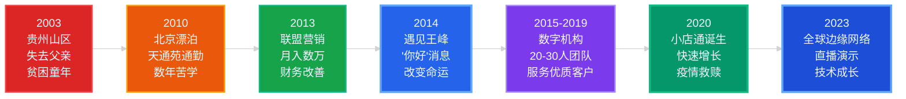
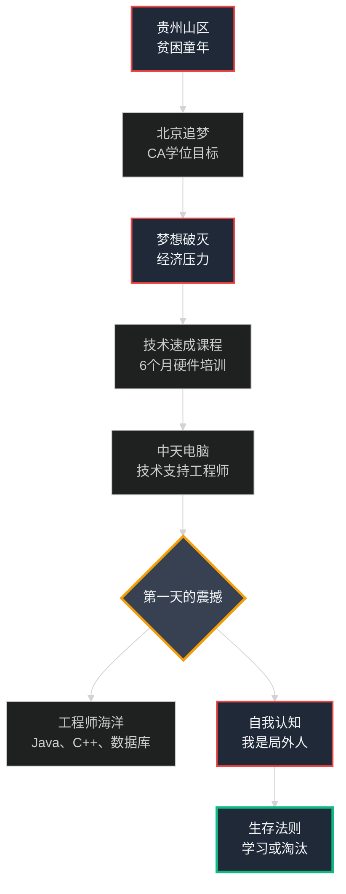
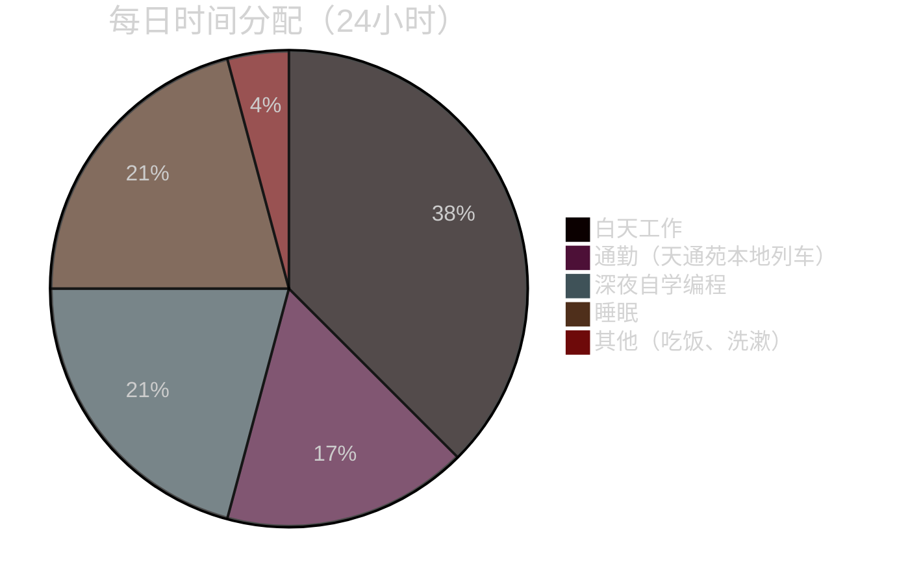
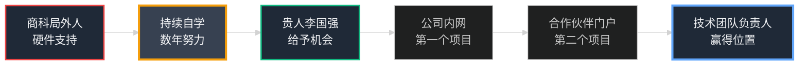
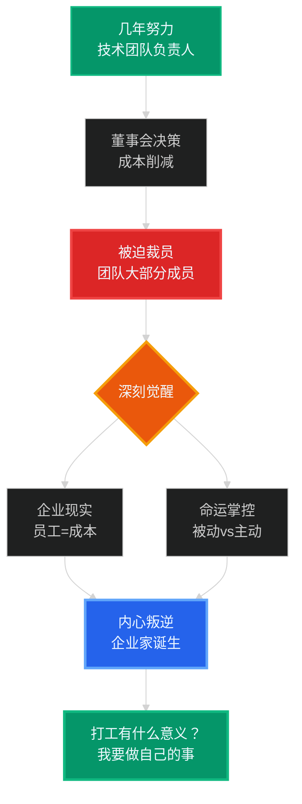
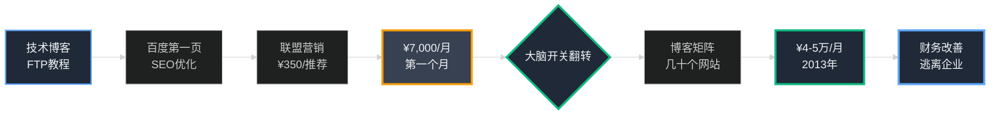
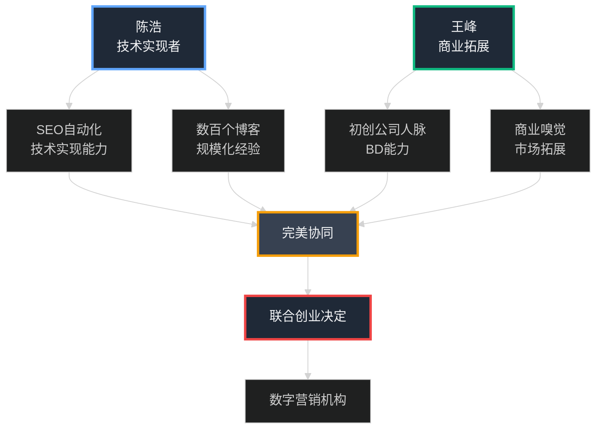
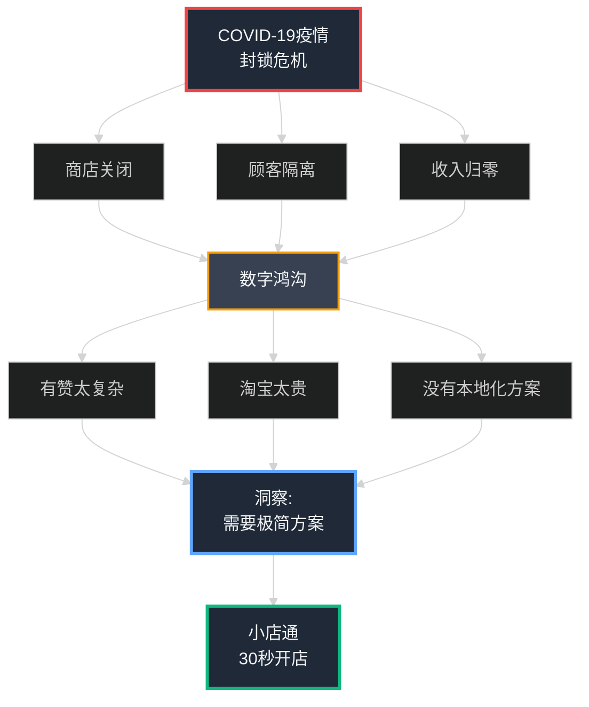
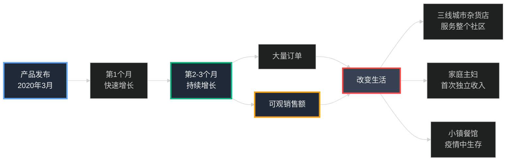

## 第19章：意外的 CTO ——一个北漂者的奋斗史

你刚刚读完了一个**系统的故事**——关于服务器、代码、全球网络的技术编年史。这是一个复杂引擎如何被构建的故事，一块一块，在压力和痛苦中拼凑而成。

但每个引擎背后都有一个**灵魂**——一个驱动者，一个有着自己故事的人。

**这就是那个故事。**

这不是一个**注定伟大的 IIT 神童**的精致故事，不是那种写在商学院案例研究里的"天才传奇"。这是一个混乱的、不可能的、常常充满绝望的旅程，讲述了一个来自**贵州山区小村庄的商科学生**，没有名校学位、没有人脉关系、没有资金背景，如何在被扔进火中后，凭借纯粹的韧性和学习能力，最终成为一家**科技公司的技术负责人**。

**这是一个意外的故事。** 但也许，正是因为它的"意外"，才更值得讲述。

### Part 1: 梦想之城的十字路口 ——北京，承诺与挣扎

#### **在程序员的世界里的商科孩子**

我的故事始于一个**远离中国科技中心闪亮高楼**的地方——贵州山区的一个尘土飞扬的小村庄。我的童年被两件决定性的事件塑造：

1. **在我三岁时失去父亲** ——从此，家庭的经济重担全部落在母亲肩上
2. **被母亲坚定不移的力量抚养长大** ——她是一名裁缝，一针一线地为我们缝制出生活

母亲的手指在缝纫机上飞舞，她的眼睛里燃烧着一个简单而坚定的梦想：**让儿子逃离贫困，成为一名大学毕业生。** 在那个村庄，大学学位就是通往另一个世界的门票。

但梦想需要金钱。现实总是更残酷。

完成商科 10+2 教育后，我怀揣着成为**特许会计师 (Chartered Accountant)** 的目标来到了**北京**。

当我第一次走在这座城市的街道上，心中涌起的是兴奋、恐惧和一种说不清的躁动。这里的一切都是陌生的——发动机的轰鸣、地铁的呼啸、霓虹灯的闪烁。在这座从咖啡馆到天安门广场，从CBD到胡同的城市里，我只是无数怀揣梦想的年轻人中的一个。

但梦想很快就被现实击碎了。在财务压力的严酷现实面前，CA 学位的梦想像泡沫一样破灭了。我付不起学费，无法再继续学业。母亲的梦想不得不暂时搁置。**我必须找工作，我必须生存下去。**

**我在这里寻找，也在这里失去。** 但我别无选择，只能继续前行。

---

**命运的转折点到来了。**

在完成了为期六个月的**计算机硬件速成课程**后（这是我能负担得起的唯一技术培训），我在一家名为 **中天电脑** 的公司找到了一个职位——技术支持工程师。听起来不错，但现实很快给了我当头一棒。

我永远不会忘记**第一天走进那个办公室的感觉**。

胃里像打了一个焦虑的结。办公室是一片**工程师的海洋**——他们带着我无法理解的自信在键盘上飞舞，流利地讨论着 Java、C++、数据库模式这些我从未听说过的"编码语言"。他们都有**计算机科学学位**，这是我不具备的荣誉徽章，是进入这个世界的通行证。

而我？我是一个知道如何修打印机、重装 Windows 系统的**商科孩子**。

那种感觉是压倒性的：**我是局外人，我是冒名顶替者。**

那第一天，我理解了一个将定义我接下来十年生活的残酷真理：

**在这个世界里，你要么学习，要么变得无关紧要。** (Learn or become irrelevant.)

#### 天通苑 本地列车上的誓言 ——在拥挤中锻造的决心

这个改变人生的决定不是在安静的书斋里做出的，不是在某个顿悟的时刻突然降临的。

**它是在北京地铁的熔炉中锻造的。**

我的日常旅程是一场长达**四小时的生存奥德赛**——从遥远的 **天通苑 郊区**到 **中关村** 的办公室，单程两小时，往返四小时。

每天清晨5点，我挤上地铁5号线。车厢里挤满了和我一样的年轻人——程序员、销售、服务员、快递员……**我们在这里挣扎，在拥挤的车厢里相互告慰。** 没有人说话，但每个人眼中都闪烁着同样的东西：对那些奄奄一息的梦想的执着。

地铁的轰鸣声，电子报站的机械音，成千上万人的呼吸声交织在一起。在这钢铁洪流中，**我在这里活着，我在这里挣扎，我在这里寻找着什么。**

每天往返四小时，周围是陌生的面孔，但我知道，我们都在追逐着同样的东西——一个在这座城市立足的机会，一个证明自己的机会。

就是在那每日的挣扎中，在那些漫长的通勤时光里，我对自己发了一个誓言：

> **"我不会只是生存。我会比所有人都努力工作。我会学习工程师的语言，直到我说得比他们更流利。如果这座城市不给我机会，我就自己创造机会。"**

从那天起，我的生活变成了一个**极度压缩的时间表**：

**每天的循环：**
- ⏰ **上午 7:00-9:00** ：天通苑 → 中关村，挤在拥挤的车厢里（在地铁上也会看技术文档）
- 💼 **上午 9:00-下午 6:00** ：在 中天 工作（9 小时）
- 🚆 **下午 6:00-8:00** ：中关村 → 天通苑，精疲力竭地返回
- 💻 **晚上 8:00-凌晨 1:00** ：**自学编程**（5 小时）
- 😴 **凌晨 1:00-6:00** ：睡眠（5 小时，虽然不够但还能坚持）

**这样的生活持续了几年。** 不是七年都这样，但最拼的那几年确实如此。

- ❌ 几乎没有周末（周末会花更多时间学习）
- ❌ 很少假期
- ❌ 社交生活几乎为零

当别人和朋友出去玩、看电影、享受生活时，我在家里和电脑在一起，像一个饥饿的人吞噬面包一样吞噬着 **WordPress 教程**，然后剥开它的源代码来理解 **PHP**，然后更深入地钻研 **MySQL** 数据库。

**学习路径（自学技术栈）：**
1. HTML/CSS 基础 → 静态网页
2. WordPress → 内容管理系统
3. PHP → 动态网站后端
4. MySQL → 数据库设计
5. JavaScript → 前端交互
6. Linux → 服务器管理

---

**贵人出现。**

我很幸运遇到了一个经理——**李国强**——他看到了我眼中那种近乎绝望的渴望。他没有看到一个"没有学位的商科学生"，他看到了一个**愿意学习、愿意付出一切的人**。

他给我扔了一根救命稻草。

"陈浩，"他有一天说，"建立新的公司内网。"

这是一个测试。我把自学到的一切都倾注其中。我熬了三个通宵。我完成了。

他又推动我。"现在，建立合作伙伴门户。"

我又完成了。

他继续鼓励我，给我真实的项目来测试我不断增长的技能。他是我职业生涯中**第一个真正相信我的人**。

**我不再是局外人了。** 通过持续的努力和学习，我赢得了我的位置。几年的天通苑通勤，几年的深夜编程，几年的睡眠不足——这一切都是值得的。

我从一个修打印机的技术支持，逐渐成长为**技术团队的骨干**，最终能够**领导一个由 20-30 名工程师组成的团队**。

### Part 2: 催化剂与逃离 ——从企业打工人到自由创业者

#### **斧头落下——残酷的企业现实**

几年的持续努力得到了回报。我已经从那个修打印机的"商科孩子"爬上了企业的阶梯，现在我**领导着一个由 20-30 名工程师组成的团队**。我有：
- ✅ 一份稳定的工作
- ✅ 不错的薪水
- ✅ 同行的尊重
- ✅ 在中国的技术圈里站稳了脚跟

我以为这就是成功。我以为我已经实现了母亲的梦想。

**然后，斧头落下了。**

---

那是一个普通的周二早晨。我被叫去参加一个紧急会议。会议室里坐着几个西装革履的高管，他们的脸上没有表情，就像手术台上的外科医生。

这是一个在千里之外的**董事会会议室**做出的冷酷企业决定——为了削减成本，整个技术团队必须被"优化"。

然后他们给了我一个**不可能的任务**：

> **"陈浩，公司决定'优化'团队结构。你的团队 20 多个人，大部分都要走。这是'裁员广进'，你懂的。"**

我愣住了。这些是我**多年来指导和共事的人**，是我从零开始培养的团队，是和我一起加班到深夜、一起庆祝项目上线的同事。

现在我必须走出去，看着他们的眼睛，告诉他们：**"公司决定裁员，你们的工作没了。"**

---

**我永远不会忘记他们眼中的神情。**

- 😢 **困惑** ——"为什么是我？"
- 💔 **背叛** ——"我们这么努力工作，结果是这样？"
- 😰 **恐惧** ——"我的家庭怎么办？我的房贷怎么办？"

这些都是**有才华的人**，他们为公司付出了一切。他们牺牲了周末，牺牲了和家人的时间，全力以赴地工作。而在一瞬间，在一个 Excel 表格的决策下，他们被无情地抛弃了。

当我看着他们收拾桌子，带着纸箱走出办公室时，一个**深刻而愤世嫉俗的想法**像闪电一样击中了我：

> **在所有的奉献之后，他们对自己的生活完全没有控制权。他们的命运不是掌握在自己手中，而是掌握在冷冰冰的电子表格里。所谓的"裁员广进"，不过是企业用谐音梗来粉饰残酷现实的遮羞布。**

**那一刻，我内心的企业家诞生了。**

我走出那个办公室，站在北京的街头。夜幕降临，CBD的霓虹灯开始闪烁，远处是北京的夜空。这些年来，**我在这里欢笑过，在这里哭泣过，在这里迷惘过。**

几年的天通苑地铁，几年的深夜编程，几年的卑微与挣扎。我突然意识到：

- 🔥 **"打工有什么意义？** 无论你多努力，命运永远掌握在别人手中。"
- 🔥 **"我要做自己的事情。** 我要掌控自己的命运。"
- 🔥 **"我在这座城市熬了这么多年，不是为了任人摆布。"**

这座城市塑造了我，也磨砺了我。**我在这里寻找着什么，现在，是时候找到它了。**

#### **百万人民币的博客——意外的财务自由**

我没有宏伟的商业计划，没有风险投资，没有团队。我只是回到了我所知道的：**我的技能和互联网**。

我在一个我深入理解的小众技术主题上开始了一个简单的博客：**"如何创建免费的 FTP 账户"**。我利用几年自学积累的 **SEO (搜索引擎优化)** 知识，让它在百度第一页上排名。

几周后，一封邮件落入我的收件箱。

这是来自一家我从未听说过的公司。他们说他们喜欢我的博客，想在我的文章中放置他们的**联盟链接 (Affiliate Links)**。

"我甚至不知道'联盟营销'是什么意思，"但他们提供的条件让我心动：**每个注册用户推荐 ¥350 人民币佣金**。

听起来好得令人难以置信，但我没有什么可失去的。我点了"同意"。

---

**一个月后。**

我登录他们的后台仪表盘，心脏因好奇和一丝希望而狂跳。

屏幕加载出来。我的眼睛睁大了。

**20 个推荐转化。**

我颤抖着手指快速计算：**20 × ¥350 = ¥7,000 人民币**

**我的大脑里有一个开关被触发了。**

¥7,000 人民币。这比我在企业里拼命工作、献出几年青春的**整个月薪**还要多。而这个收入是在**我睡觉的时候产生的**。

我不是看到了一次性的运气，我看到了一台**可以复制、可以扩展的机器**——一台我可以亲手建造、完全控制、无限扩展的赚钱机器。

我变得专注。我深入地钻研**联盟营销 (Affiliate Marketing)** 的世界，学习一切能学的东西：
- SEO 关键词研究
- 内容营销策略
- 转化率优化
- 多网站矩阵管理

我不再只有一个博客。我建立了**几十个博客**，针对不同的产品和关键词，形成一个自动化的内容矩阵。

**收入逐步增长。**

经过一年多的努力，到 **2013 年底**，我的博客矩阵每月能稳定产生 **¥3-5 万人民币的收入**。好的月份能到 **¥7 万**，但平均下来在 **¥4-5 万**左右。

| 时间线 | 月收入 | 里程碑 |
|--------|--------|---------|
| 第1个月 | ¥7,000 | 第一桶金 |
| 第3个月 | ¥1.5-2万 | 规模验证 |
| 第6个月 | ¥2.5-3万 | 全职创业 |
| 第12个月 | ¥4-5万（峰值¥7万） | 财务相对自由 |

**我找到了逃离企业世界的方法。我获得了更多自由。**

但我仍然只是**一个人的军队**。我建立真正庞大的东西的追求才刚刚开始。下一步，我需要从"一个人"变成"一个团队"。

### Part 3: 王峰——改变命运的"你好"消息

我已经达到了在贵州山区村庄里**从未敢想象的收入水平**。月收入 ¥4-5 万人民币，在中国意味着我已经进入了中产阶级，生活不再为基本开支发愁。

但我清楚地知道：**我是一个人的军队，我正在逼近一个人所能做的物理极限。**

我的下一阶段不是"更努力地工作"（我已经每天工作很长时间了），而是**"更聪明地工作"**——将手动流程转化为自动化系统，将个人技能转化为可扩展的产品。

我开始编写软件来复制和扩展自己。我写了自动化脚本来：
- 自动创建博客
- 自动发布内容
- 自动管理 SEO
- 自动追踪转化

很快，我不再是管理十几个网站的站长，而是通过自动化脚本管理了 **几百个博客**。这个系统最终演变成一个 **SEO 工具平台**，我和几个朋友一起将它产品化。虽然规模没有到 1500 个那么夸张，但确实实现了规模化运营。

我们建立了一个**真正的产品，一家真正的科技公司**。

---

我对这个构建和扩展的新世界感到兴奋。我开始在 **微信朋友圈** 上分享我的实验：
- 📊 流量增长图表的截图
- 💰 收入报告和转化数据
- 📝 关于什么有效、什么无效的详细笔记

我不是想炫耀。我只是沉浸在创造的喜悦中，想与世界分享这种热情。

**我不知道，其中一个帖子将改变我的生活。**

---

#### **"你好"——改变命运的消息**

**2014 年某一天**，我的 微信朋友圈 消息请求里弹出了一条新消息。

来自一个陌生人，名叫 **王峰**。

我点开了消息。他的第一句话很简单：

> **"你好，我看到了你的 SEO 实验。我们能聊聊吗？"**

但他的后续消息不同于其他人。它们不只是询问"怎么做"的技巧问题。它们**敏锐、有策略，显示出对商业的理解**。

经过几次聊天，我知道：**我必须见这个人。**

他话语中的自信是有吸引力的。他不是一个"想要创业"的人，而是一个**已经在创业路上的人**。

---

**我们在北京的一家咖啡店见面。**

连接是**自然的**，就像两块拼图扣在一起。

他以有经验的创业者的信念说话，已经在做一些项目。而我，对如何让互联网按我的意愿行事有深刻的、**在实践中积累的技术知识**。

**我们摊开了底牌。协同效应一目了然：**

| 王峰 | 陈浩 |
|-------------|-------------------|
| 🎯 商业拓展能力强，业务开发专家 | 💻 技术实现者，执行专家 |
| 📇 有初创公司人脉资源 | 🛠️ 验证过的技术实现能力 |
| 💬 善于沟通，能说服客户 | 🔧 能建造产品的工程师 |
| 🎭 **外向、魅力型** | 🤓 **内向、执行型** |

**这是一个很好的匹配。** 一个"阳"，一个"阴"。一个向外拓展，一个向内建造。

我们当场做出了决定：

> **"停止各自为战。让我们联合起来，一起建立一些有价值的东西。"**

**我们成立了一家数字营销机构。** 这将成为 小店通 诞生前的预演，是我们学习如何共同工作、如何构建可扩展业务的训练场。

 

#### **从机构到强力公司**

合作关系一开始就很顺利。王峰带来的第一个客户就是一笔不错的交易,为我们带来了 **几十万人民币** 的收入。我们从第一天就盈利了。

我们把这些收入投资回建立团队。我们招募了一支精干的团队——大约 **20-30 名** 我们能找到的最敏锐的增长专家和工程师。我们一起在中国初创生态系统中逐渐站稳脚跟。

在接下来的几年里,我们与一些不错的客户合作:包括一些高增长初创公司、上市公司,甚至一些知名企业。我们不只是运行广告活动;我们是他们的增长合作伙伴,帮助他们实现互联网规模。我们为客户构建的系统确实产生了可观的有机流量。

这一时期是我们的现实世界 MBA。这是我们理解规模的实验室。我们从内部看到了多家互联网企业成功和失败的模式。我们确切地了解了什么有效,什么无效。

我们取得了不错的成功。我们有一个优秀的团队、一个盈利的业务和良好的声誉。我们从业内优秀的人那里学到了增长的秘密。舞台已经搭建好迎接我们的下一幕。我们只是不知道它的催化剂将是一场将永远改变世界的全球危机。

### Part 4: 小店通 革命——从疫情危机到数字救赎

我们已经建立了一个成功的数字营销机构、一个由 20-30 名成员组成的优秀团队、一套强大的内部技术平台。我们很舒适，很盈利，很安全。

**但世界即将改变，随之而来的是我们的整个使命。**

---

**快进到 2020 年初。**

**COVID-19 疫情像海啸一样席卷全球**，让整个中国陷入停顿。对于大量小店主、杂货店老板、街边小贩——这些构成中国经济命脉的小商人来说，这是一场**生存危机**：

- 🔒 **商店被迫关闭** ——政府强制封锁
- 🚫 **顾客无法出门** ——居家隔离令
- 💸 **日常收入瞬间归零** ——没有收入，但房租、贷款、家庭开支还在继续
- 😰 **绝望蔓延** ——很多家庭连下一顿饭都成了问题

与此同时，中国的一部分人正在**迅速数字化**——在线订购杂货、电子产品、一切。但这些小企业主却被**抛在了数字鸿沟的另一边**：

- ❌ **有赞**：太复杂，全英文，需要信用卡，不符合中国小商家习惯
- ❌ **淘宝**：佣金太高，入驻门槛高，小商家玩不起
- ❌ **现有平台**：要么太贵，要么不是为他们设计的

**他们被困住了。**

---

**王峰 看到的不是新闻标题，而是个人危机。**

他来自店主家庭，他认识这些人，他理解他们的痛苦。他看到了：
- 😢 绝望的眼神
- 🆘 对简单解决方案的迫切需求
- 💡 一个可以帮助很多人的生活机会

**那时我们进行了将定义我们生活的对话。**

我们决定将**我们学到的一切**——我们对规模的知识、我们构建技术的能力、我们对互联网增长的深刻理解——全部用于解决这**一个巨大的、紧迫的问题**。

> **"让我们建立一个真正为中国小商家设计的产品。让每个人都能在 30 秒内拥有自己的在线商店。"**

**我们决定建立 小店通。**

**产品理念极其简单（MVP 精神）：**

1. 📱 下载 小店通 移动应用
2. 📷 用手机相机拍摄产品照片并上传
3. 🔗 获得一个独特的商店链接（如 `yourshop.xiaodiantong.com`）
4. 💬 在 微信 上分享链接给客户
5. 💰 开始接受在线订单

**30 秒。** 任何人都能做到，无论技术水平如何。

---

**我们推出了应用。没有营销，没有广告，只是真心想帮助这些商家生存下去。**

**反应超出了我们的预期。增长非常迅速。**

**前几个月的增长情况：**

| 指标 | 情况 | 说明 |
|-----|------|------|
| 📱 **注册商家** | **快速增长** | 中国各地小企业主，数量持续攀升 |
| 📦 **订单数量** | **大量订单** | 帮助完成了大量交易 |
| 💰 **GMV** | **可观销售额** | 帮助商家实现了不错的交易额 |
| 🌍 **覆盖范围** | **全中国** | 从一线到六线城市都有用户 |
| ⏱️ **开店时间** | **< 30 秒** | 真正的极简体验 |
| 💵 **成本** | **免费** | 疫情期间免费使用 |

**用户的故事令人感动和鼓舞：**

- 💚 **三线城市的小杂货店**突然能够为整个社区在线配送
- 💚 **家庭主妇**第一次销售手工制品并获得独立收入
- 💚 **小镇餐馆**通过接受在线订单在疫情中生存下来
- 💚 **街边小贩**转型成为数字商家

**这不只是一个产品。这是很多人的实用工具。**

---

**这种快速增长吸引了投资者的关注：**

我们确实收到了一些投资机构的关注和接触。虽然最终的合作情况不便详细透露，但确实有投资人对我们的模式和增长潜力表示认可。

他们看到了我们所看到的：**一个正在解决真实问题的产品。**

---

**所以，我们来到了故事的现在。**

你刚刚读到的整个技术旅程——从第一个凌晨 3 点关于崩溃的 512MB 服务器的惊慌电话，到建立一个可以承受流量高峰、拥有全球边缘网络、能在直播中关闭生产服务器的系统——**这一切都是为了跟上 小店通 快速增长的无计划、无脚本、边打边学的过程。**

**我是谁？**

- ❌ 不是 IIT 毕业生
- ❌ 不是计算机科学专业
- ❌ 没有名校学位
- ❌ 没有家庭背景
- ❌ 没有风险投资人脉

我只是一个**来自贵州山区小村庄的商科学生**，一个在 天通苑 本地列车上发誓要学习的人，一个被扔进深水区、被迫学习如何在火中构建产品的人。

**我是意外的 CTO。**

---

## 🎯 最后的信息

**如果这本书有一个核心信息，那就是：**

> **你不需要完美的简历或名牌大学的学位来构建有价值的东西。**

**你所需要的只是：**

1. ❤️ **一个你深切关心的问题** ——关心到让你夜不能寐
2. 🔥 **不懈的、燃烧的好奇心** ——愿意学习解决它所需的一切
3. 💪 **韧性** ——在无数次失败后依然站起来
4. 🤝 **对的合作伙伴** ——找到那个和你互补的人

---

**我们的使命还在继续：**

- 🎯 帮助更多中国小商人真正数字化
- 🎯 让每个人都能拥有自己的在线生意
- 🎯 用技术赋能最底层的小商家

有我们团队的支持，最重要的是，有我们每天并肩作战的**优秀的工程师团队**，我们会继续朝着这个目标前进。

---

**想想看，这一切都始于：**

- 🌱 一条简单的"你好"消息（王峰 → 陈浩，2014）
- 🌱 一个关于疫情中挣扎的小商家的对话（2020）
- 🌱 一个"让我们帮助他们"的简单决定

**从贵州山区的村庄，到北京的天通苑地铁，到技术团队负责人，到服务众多商家。**

**我在这里欢笑，我在这里哭泣；我在这里活着，也在这里成长；我在这里祈祷，我在这里迷惘；我在这里寻找，也在这里找到。**

从一个怀揣梦想的少年，到在地铁里发誓要改变命运的北漂青年，再到今天成为技术团队负责人——这座城市见证了这一切。

如果有一天有人问我："后悔来北京吗？"

我会说：**"在这里，我感觉到了我的存在。在这里，有太多让我眷恋的东西——挣扎过的天通苑地铁，奋战过的凌晨三点，还有那些和我一样在这座城市追梦的人们。"**

北京，给了我最艰难的考验，也给了我最宝贵的机会。

**这就是意外 CTO 的故事。这就是一个北漂者的奋斗史。**

---

**北京，北京。**

# 献词

 ** 致王峰 **

在生活中,你会遇到成为朋友的人,如果你幸运的话,还有一些成为合作伙伴的人。但一生中只有一次,如果星星真的对齐,你会找到一个人,他就是你自己故事的另一半。

成为一名企业家是一项残酷的事业。它从一个人身上榨取了太多——身体上、精神上和情感上。这是一条孤独的道路,充满了焦虑和压力,通常即使是我们最亲密的家人也无法完全理解。有些时候,特别是在早期,我们不得不真正投入我们的血汗和泪水,只是为了让我们开始的东西漂浮起来。在这一切中,你的激情,你疯狂的、坚定不移的意愿去做任何需要做的事情来让它工作,增加了我们的胜算,并把我们带到了今天的位置。

找到那一个能够看着一张空白画布并在脑海中看到完全相同的画的人是如此该死的困难。那个拥有相同愿景,但也有那额外的眼光来发现最终设计中 0.5 像素差异的人。而我真的、真正地幸运,在这一切中有你在我身边。

该死的,在过去的 13 年里,我可能和你在一起的时间比和我自己的家人在一起的时间还要多。我们从两个有疯狂想法的年轻人成长为一起建立这个令人难以置信的东西。我们战斗过,我们庆祝过,我们几乎失败过,我们胜利过,总是作为一个单一的单位。

这本书充满了扩展服务器和数据库的故事,但真正的故事是从你的那条"你好"消息开始的。这是一个建立在坚定不移的信任之上的伙伴关系的故事。你永远是我代码的火花,我架构的愿景。

更重要的是,你激励并向我展示了如何生活。

这既是你的,也是我的。

致我的联合创始人,我的兄弟。

