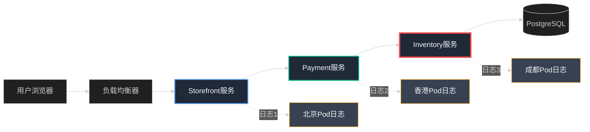
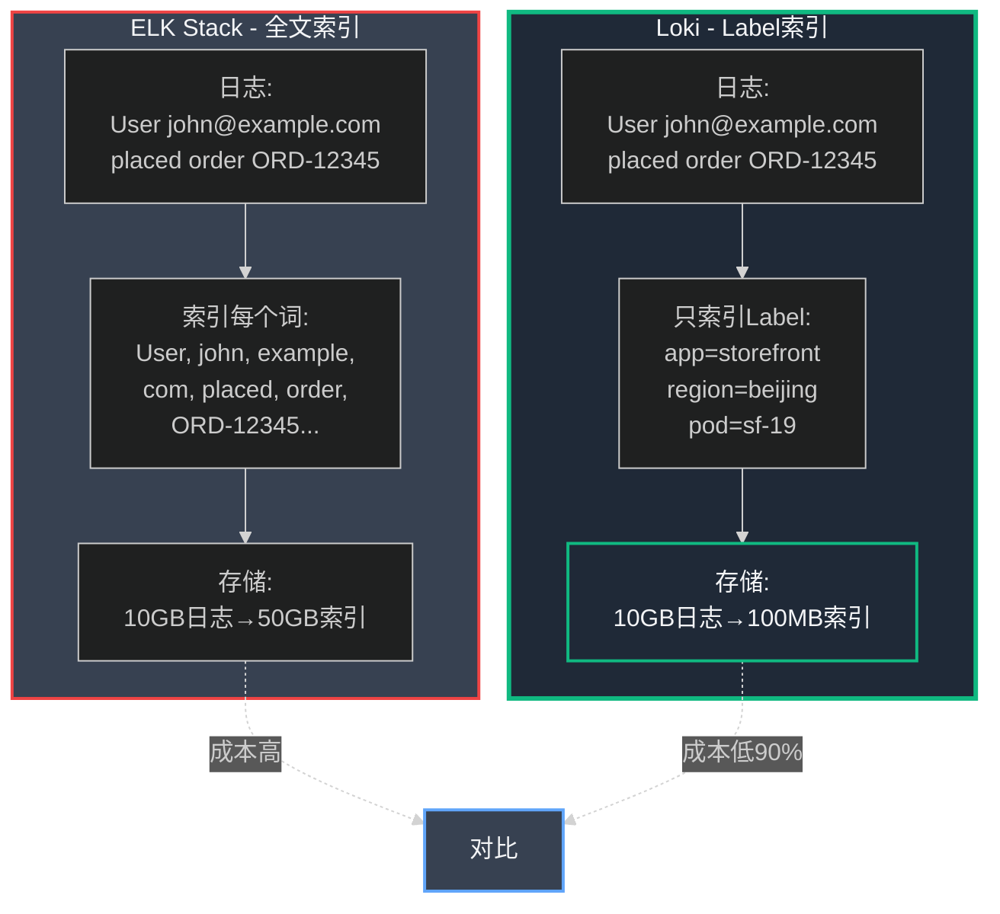
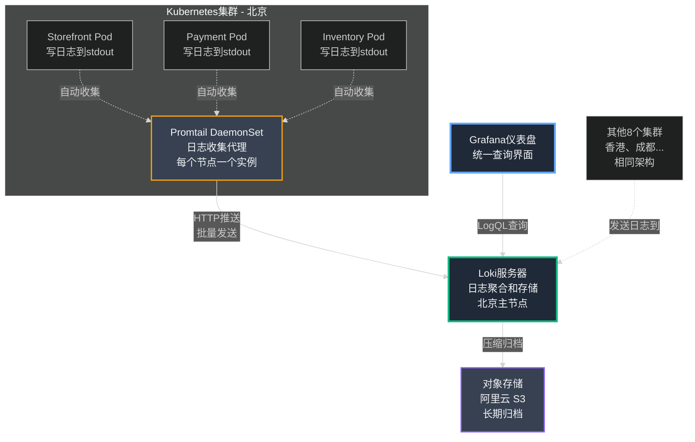

## 第20章:看不见的战争——当故障藏在9个集群中

### Part 1:凌晨2点的侦探游戏

电话响起时,我已经连续工作了14个小时。

屏幕上的名字是**小张**,我们的客户成功团队主管。他的声音里透着那种我太熟悉的紧张感——客户投诉的紧张感。

> "陈浩,我们有麻烦了。有个大客户说他们的订单消失了。他们能看到下单确认页面,但10分钟后订单就从系统里蒸发了。这已经不是第一次了。"

我的胃一沉。这种间歇性bug是最令人沮丧的——它们不会让整个系统崩溃,但会像慢性毒药一样悄悄侵蚀用户信任。

"给我订单ID,"我说,手指已经在键盘上飞舞,打开终端准备调查。

**订单ID:ORD-2847562**

我开始了那场我已经玩过无数次的游戏:**日志侦探游戏**。这是每个后端工程师都太熟悉的痛苦仪式。

#### **传统的日志地狱**

在我们的架构中,那个订单的处理过程是这样的:



问题是:**这些服务分散在9个全球边缘集群中**。而这个特定的订单?它的请求可能在以下任何地方被处理:

- Storefront服务:北京集群的sf-pod-7
- Payment服务:香港集群的payment-pod-3
- Inventory服务:成都集群的inventory-pod-12

要追踪这个订单的完整生命周期,我必须:

**步骤1:SSH登录到北京集群的主节点**
```bash
ssh root@beijing-k8s-master.xiaodiantong.com
```

**步骤2:找到处理这个订单的Pod**
```bash
kubectl get pods -n production | grep storefront
# 输出50个Pod...我需要哪一个?
```

**步骤3:搜索Pod日志**
```bash
kubectl logs storefront-pod-7 -n production | grep "ORD-2847562"
```

等待30秒...没有结果。试试另一个Pod:

```bash
kubectl logs storefront-pod-12 -n production | grep "ORD-2847562"
```

又是30秒...还是没有。

我开始出汗。这就像在干草堆里找针,而**干草堆有450个**(9个集群 × 50个Pod)。

20分钟后,我终于在`storefront-pod-19`的日志中找到了订单创建记录:

```
2023-11-15T02:14:32.841Z [INFO] Order created: ORD-2847562, user_id=12345
2023-11-15T02:14:32.956Z [INFO] Calling payment service...
```

但下一步呢?Payment服务处理了吗?我需要登出北京集群,SSH到香港集群,重新开始这个痛苦的过程...

**这是疯狂的**。我用了整整45分钟才追踪到故障的根源:Inventory服务在某个特定场景下会静默失败,返回200状态码但实际上没有扣减库存。

在找出问题后,我瘫坐在椅子上,感到既愤怒又筋疲力尽。凌晨3点了,我刚刚花了一个多小时做基本上是**手动grep数百个文件**的工作。

必须有更好的方法。

### Part 2:日志聚合——给混乱带来秩序

第二天早上,我把团队召集到一起。白板上,我画出了我们日志系统的现状——一团乱麻的箭头,每个都指向不同的集群、不同的Pod、不同的日志文件。

"我们需要一个**统一的日志视图**,"我宣布道。"我们需要在一个地方搜索所有日志,不需要SSH,不需要猜测哪个Pod处理了哪个请求。"

我们的首席DevOps工程师李芳点了点头。"我们需要一个日志聚合系统。业界有两个主流选择:**ELK Stack**和**Grafana Loki**。"

她在白板上列出了对比:

#### **技术方案对比:ELK vs. Loki**

**ELK Stack (Elasticsearch + Logstash + Kibana)**

可以把ELK想象成一个**全能的图书馆系统**。当一本新书(日志)到达时,管理员不仅会记录书名和作者,还会详细阅读每一页,为每个单词、每个句子建立索引。这样,当你搜索"资本主义"这个词时,系统能瞬间告诉你它出现在图书馆的哪本书、哪一页、哪一行。

**ELK的工作方式:**
```
日志内容: "User john@example.com placed order ORD-12345 for $150"

Elasticsearch索引:
  ├─ "User" → 索引
  ├─ "john@example.com" → 索引
  ├─ "placed" → 索引
  ├─ "order" → 索引
  ├─ "ORD-12345" → 索引
  ├─ "$150" → 索引
  └─ ... (每个词都建立倒排索引)
```

这种全文索引非常强大,但代价高昂:

- **存储成本**:10GB日志可能产生50GB的索引
- **内存需求**:每个Elasticsearch节点需要4-8GB RAM
- **运维复杂度**:需要管理Elasticsearch集群的健康、分片、副本

**Grafana Loki:只索引Label**

Loki采用了一个聪明的权衡。它受到了我们已经在用的**Prometheus监控系统**的启发。

Prometheus只索引**时间序列Label**(如`service=payment`,`region=beijing`),而不索引指标数据本身。Loki将同样的哲学应用于日志:

```
日志内容: "User john@example.com placed order ORD-12345 for $150"

Loki索引:
  Label: {app="storefront", level="info", region="beijing", pod="sf-19"}
  内容: 压缩存储,不建立全文索引
```

**Loki的比喻:**

想象一个更高效的图书馆。管理员不再为每个单词建立索引,而是只记录书的**元数据**:

- 书名(app标签)
- 类别(level标签)  
- 位置(region标签)
- 书架编号(pod标签)

当你要找书时,你先用这些标签快速定位到正确的书架区域,然后在那个小范围内翻阅内容。

这种方式的优势:

- **索引体积小**:10GB日志只产生100MB索引(省90%)
- **内存友好**:每个Loki节点只需500MB-1GB RAM
- **与现有工具集成**:与Prometheus和Grafana无缝配合



#### **成本计算:为什么我们选择Loki**

李芳在白板上写下了冷酷的数字:

```
━━━━━━━━━━━━━━━━━━━━━━━━━━━━━━━━━━━━━━━━━━━━━
小店通日志规模(9个全球集群)
━━━━━━━━━━━━━━━━━━━━━━━━━━━━━━━━━━━━━━━━━━━━━
每天日志量: 100GB
保留期: 7天
总存储需求: 700GB

━━━━━━━━━━━━━━━━━━━━━━━━━━━━━━━━━━━━━━━━━━━━━
方案A: ELK Stack
━━━━━━━━━━━━━━━━━━━━━━━━━━━━━━━━━━━━━━━━━━━━━
基础设施:
  - Elasticsearch集群: 9区域 × 3节点 = 27台服务器
  - 每台服务器: 8GB RAM, 2 vCPU = $150/月
  - 小计: 27 × $150 = $4,050/月

存储:
  - 700GB × 5倍索引膨胀 = 3,500GB
  - EBS SSD存储: 3,500GB × $0.10/GB = $350/月

运维成本:
  - 1个专职Elasticsearch工程师 = $8,000/月
  - (管理集群健康、分片平衡、故障恢复)

总计: $12,400/月 = $148,800/年

━━━━━━━━━━━━━━━━━━━━━━━━━━━━━━━━━━━━━━━━━━━━━
方案B: Grafana Loki
━━━━━━━━━━━━━━━━━━━━━━━━━━━━━━━━━━━━━━━━━━━━━
基础设施:
  - Loki服务器: 9区域 × 1节点 = 9台服务器
  - 每台服务器: 2GB RAM, 1 vCPU = $50/月
  - 小计: 9 × $50 = $450/月

存储:
  - 700GB (压缩存储,无索引膨胀)
  - S3对象存储: 700GB × $0.023/GB = $16/月

运维成本:
  - 0.2个工程师工时 = $1,600/月
  - (与现有Grafana集成,几乎零额外维护)

总计: $2,066/月 = $24,792/年

━━━━━━━━━━━━━━━━━━━━━━━━━━━━━━━━━━━━━━━━━━━━━
节省: $124,008/年 (83%成本降低)
━━━━━━━━━━━━━━━━━━━━━━━━━━━━━━━━━━━━━━━━━━━━━
```

我看着这些数字,决定不言而喻。"我们上Loki。"

### Part 3:构建统一日志系统

接下来的三天,我们的DevOps团队全力以赴部署Loki。整个架构是一个三部分系统:

#### **架构图:Loki生态系统**



**组件1:Promtail——日志收集者**

Promtail是一个轻量级代理,作为**DaemonSet**运行在每个Kubernetes节点上。DaemonSet是一种特殊的部署方式,确保每个节点恰好运行一个Promtail实例。

Promtail的工作就像一个勤劳的邮递员:

1. **自动发现**:它监视Kubernetes API,自动发现所有新启动的Pod
2. **读取日志**:它读取Pod的stdout/stderr输出(所有容器日志的标准位置)
3. **添加Label**:它自动附加Label(app名称、namespace、Pod名称、节点名称)
4. **批量发送**:它将日志批量推送到Loki服务器

**Promtail配置文件:**

```yaml
# promtail-configmap.yaml
apiVersion: v1
kind: ConfigMap
metadata:
  name: promtail-config
  namespace: monitoring
data:
  promtail.yaml: |
    server:
      http_listen_port: 9080
      grpc_listen_port: 0

    positions:
      filename: /tmp/positions.yaml  # 记录读取位置,避免重复

    clients:
      - url: http://loki:3100/loki/api/v1/push  # Loki接收端点

    scrape_configs:
      - job_name: kubernetes-pods
        kubernetes_sd_configs:
          - role: pod  # 自动发现所有Pod
        
        pipeline_stages:
          # 阶段1:解析JSON格式日志
          - json:
              expressions:
                level: level      # 提取日志级别
                msg: msg          # 提取消息内容
                order_id: order_id  # 提取订单ID
                user_id: user_id    # 提取用户ID
          
          # 阶段2:提取时间戳
          - timestamp:
              source: timestamp
              format: RFC3339
          
          # 阶段3:将字段转换为Label
          - labels:
              level:     # 日志级别作为Label
              order_id:  # 订单ID作为Label(便于搜索!)
              user_id:   # 用户ID作为Label
        
        relabel_configs:
          # 从Pod的Kubernetes元数据中提取Label
          - source_labels: [__meta_kubernetes_pod_label_app]
            target_label: app
          
          - source_labels: [__meta_kubernetes_namespace]
            target_label: namespace
          
          - source_labels: [__meta_kubernetes_pod_name]
            target_label: pod
          
          - source_labels: [__meta_kubernetes_pod_node_name]
            target_label: node
          
          # 只收集production和staging环境
          - source_labels: [__meta_kubernetes_namespace]
            regex: (production|staging)
            action: keep
```

**部署Promtail DaemonSet:**

```yaml
# promtail-daemonset.yaml
apiVersion: apps/v1
kind: DaemonSet
metadata:
  name: promtail
  namespace: monitoring
spec:
  selector:
    matchLabels:
      app: promtail
  template:
    metadata:
      labels:
        app: promtail
    spec:
      serviceAccountName: promtail
      containers:
      - name: promtail
        image: grafana/promtail:2.9.3
        args:
          - -config.file=/etc/promtail/promtail.yaml
        volumeMounts:
        - name: config
          mountPath: /etc/promtail
        - name: varlog
          mountPath: /var/log
          readOnly: true
        - name: varlibdockercontainers
          mountPath: /var/lib/docker/containers
          readOnly: true
        resources:
          requests:
            memory: "128Mi"
            cpu: "100m"
          limits:
            memory: "256Mi"
            cpu: "200m"
      volumes:
      - name: config
        configMap:
          name: promtail-config
      - name: varlog
        hostPath:
          path: /var/log
      - name: varlibdockercontainers
        hostPath:
          path: /var/lib/docker/containers
---
# 给Promtail创建必要的RBAC权限
apiVersion: v1
kind: ServiceAccount
metadata:
  name: promtail
  namespace: monitoring
---
apiVersion: rbac.authorization.k8s.io/v1
kind: ClusterRole
metadata:
  name: promtail
rules:
  - apiGroups: [""]
    resources:
      - nodes
      - nodes/proxy
      - services
      - endpoints
      - pods
    verbs: ["get", "watch", "list"]
---
apiVersion: rbac.authorization.k8s.io/v1
kind: ClusterRoleBinding
metadata:
  name: promtail
roleRef:
  apiGroup: rbac.authorization.k8s.io
  kind: ClusterRole
  name: promtail
subjects:
  - kind: ServiceAccount
    name: promtail
    namespace: monitoring
```

**组件2:Loki——日志聚合器**

Loki是核心服务器,接收来自所有Promtail实例的日志,建立Label索引,并将日志压缩存储到对象存储(S3)。

```yaml
# loki-deployment.yaml
apiVersion: apps/v1
kind: StatefulSet
metadata:
  name: loki
  namespace: monitoring
spec:
  serviceName: loki
  replicas: 3  # 高可用部署
  selector:
    matchLabels:
      app: loki
  template:
    metadata:
      labels:
        app: loki
    spec:
      containers:
      - name: loki
        image: grafana/loki:2.9.3
        args:
          - -config.file=/etc/loki/loki.yaml
        ports:
        - containerPort: 3100
          name: http
        volumeMounts:
        - name: config
          mountPath: /etc/loki
        - name: storage
          mountPath: /loki
        resources:
          requests:
            memory: "1Gi"
            cpu: "500m"
          limits:
            memory: "2Gi"
            cpu: "1000m"
      volumes:
      - name: config
        configMap:
          name: loki-config
  volumeClaimTemplates:
  - metadata:
      name: storage
    spec:
      accessModes: ["ReadWriteOnce"]
      resources:
        requests:
          storage: 100Gi
---
apiVersion: v1
kind: Service
metadata:
  name: loki
  namespace: monitoring
spec:
  type: ClusterIP
  ports:
  - port: 3100
    targetPort: 3100
    name: http
  selector:
    app: loki
```

**Loki配置文件:**

```yaml
# loki-config.yaml
apiVersion: v1
kind: ConfigMap
metadata:
  name: loki-config
  namespace: monitoring
data:
  loki.yaml: |
    auth_enabled: false  # 内部使用,不需要认证

    server:
      http_listen_port: 3100

    ingester:
      lifecycler:
        ring:
          kvstore:
            store: inmemory
          replication_factor: 1
      chunk_idle_period: 5m      # 5分钟不活动后刷新chunk
      chunk_retain_period: 30s
      max_chunk_age: 1h          # 1小时后强制刷新chunk

    schema_config:
      configs:
      - from: 2023-01-01
        store: boltdb-shipper      # 索引存储
        object_store: s3           # 日志内容存储
        schema: v11
        index:
          prefix: loki_index_
          period: 24h              # 每天一个索引文件

    storage_config:
      boltdb_shipper:
        active_index_directory: /loki/index
        cache_location: /loki/cache
        shared_store: s3
      aws:
        s3: s3://ap-south-1/xiaodiantong-loki-logs  # S3存储桶
        s3forcepathstyle: true

    limits_config:
      enforce_metric_name: false
      reject_old_samples: true
      reject_old_samples_max_age: 168h     # 拒绝7天前的旧日志
      ingestion_rate_mb: 10                # 每秒最多10MB
      ingestion_burst_size_mb: 20          # 突发最多20MB

    chunk_store_config:
      max_look_back_period: 168h  # 最多查询7天前的日志

    table_manager:
      retention_deletes_enabled: true
      retention_period: 168h      # 7天后自动删除
```

**组件3:Grafana——查询界面**

Grafana提供了统一的Web界面来查询和可视化日志。我们已经在用Grafana做指标监控,现在只需添加Loki作为数据源:

```yaml
# grafana-datasources.yaml
apiVersion: v1
kind: ConfigMap
metadata:
  name: grafana-datasources
  namespace: monitoring
data:
  loki.yaml: |
    apiVersion: 1
    datasources:
    - name: Loki
      type: loki
      access: proxy
      url: http://loki:3100
      editable: false
      jsonData:
        maxLines: 1000  # 每次查询最多返回1000行
```

### Part 4:LogQL——日志的查询语言

部署完成后,李芳组织了一次培训,教团队如何使用**LogQL**——Loki的查询语言。它的语法受到了PromQL(Prometheus查询语言)的启发。

"LogQL的核心理念很简单,"李芳解释道。"你首先用Label过滤日志流,然后在匹配的日志中搜索内容。"

她在Grafana的Explore页面演示了几个例子:

#### **LogQL实战查询**

**查询1:查找特定订单的所有日志**

```promql
{namespace="production"} |= "ORD-2847562"
```

解释:
- `{namespace="production"}`:过滤出production命名空间的所有日志
- `|=`:包含操作符
- `"ORD-2847562"`:搜索包含这个订单ID的日志行

结果:**瞬间显示该订单在所有服务、所有Pod中的完整日志流!**

**查询2:查找Payment服务的所有ERROR日志**

```promql
{app="payment", level="error"}
```

这个查询纯粹基于Label,速度极快。

**查询3:正则表达式搜索——查找所有超时错误**

```promql
{namespace="production"} |~ "timeout|timed out|deadline exceeded"
```

解释:
- `|~`:正则表达式匹配操作符
- `timeout|timed out|deadline exceeded`:匹配这三种表达中的任何一种

**查询4:JSON解析——查找响应时间大于5秒的请求**

```promql
{app="storefront"} 
  | json 
  | response_time > 5000
```

解释:
- `| json`:将日志行解析为JSON
- `| response_time > 5000`:过滤响应时间大于5000毫秒的记录

**查询5:聚合统计——每分钟的错误率**

```promql
sum(rate({level="error"} [1m])) by (app)
```

解释:
- `rate({level="error"} [1m])`:计算每分钟的错误日志数
- `sum(...) by (app)`:按应用分组求和
- 结果:一个时间序列图表,显示每个服务的错误率趋势

**查询6:追踪完整请求链——Trace ID查询**

当我们稍后在第21章引入分布式追踪时,我们会在日志中包含Trace ID。这使得我们可以追踪一个请求的完整生命周期:

```promql
{namespace="production"} | json | trace_id="4bf92f3577b34da6a3ce929d0e0e4736"
```

结果:显示这个特定Trace ID经过的所有服务的所有日志,按时间排序。

#### **LogQL操作符速查表**

```
━━━━━━━━━━━━━━━━━━━━━━━━━━━━━━━━━━━━━━━━━━━━━
Label过滤器
━━━━━━━━━━━━━━━━━━━━━━━━━━━━━━━━━━━━━━━━━━━━━
{app="payment"}                  精确匹配
{app=~"payment|storefront"}      正则匹配
{app!="payment"}                 不等于
{app!~"test.*"}                  正则不匹配

━━━━━━━━━━━━━━━━━━━━━━━━━━━━━━━━━━━━━━━━━━━━━
行过滤器
━━━━━━━━━━━━━━━━━━━━━━━━━━━━━━━━━━━━━━━━━━━━━
|= "error"                       包含"error"
!= "health_check"                不包含"health_check"
|~ "error|timeout"               正则匹配
!~ "debug|trace"                 正则不匹配

━━━━━━━━━━━━━━━━━━━━━━━━━━━━━━━━━━━━━━━━━━━━━
解析器
━━━━━━━━━━━━━━━━━━━━━━━━━━━━━━━━━━━━━━━━━━━━━
| json                            解析JSON
| logfmt                          解析logfmt格式
| regexp "<regex>"                自定义正则提取
| pattern "<pattern>"             自定义模式提取

━━━━━━━━━━━━━━━━━━━━━━━━━━━━━━━━━━━━━━━━━━━━━
聚合函数
━━━━━━━━━━━━━━━━━━━━━━━━━━━━━━━━━━━━━━━━━━━━━
rate({level="error"} [5m])       每秒错误数
count_over_time({app="payment"} [1h])  1小时内日志数
sum(...)  by (app)               按app分组求和
topk(10, ...)                    Top 10
```

### Part 5:Django结构化日志——让日志更易查询

Loki部署完成后,我们发现了一个问题:我们的Django日志格式不一致。有些日志是简单的文本,有些是Python字典的字符串表示,很难解析。

我花了一个下午重构了我们的日志配置,将所有日志统一为**JSON格式**。这样Promtail就能自动解析它们,提取关键字段作为Label。

**Django JSON日志配置:**

```python
# settings.py
import logging
import json
from datetime import datetime

class JSONFormatter(logging.Formatter):
    """
    自定义日志格式化器,输出JSON格式日志
    """
    def format(self, record):
        log_obj = {
            "timestamp": datetime.utcnow().isoformat() + 'Z',
            "level": record.levelname,
            "logger": record.name,
            "msg": record.getMessage(),
            "module": record.module,
            "function": record.funcName,
            "line": record.lineno,
        }
        
        # 添加请求上下文(如果存在)
        if hasattr(record, 'request'):
            log_obj['request'] = {
                'method': record.request.method,
                'path': record.request.path,
                'user_id': getattr(record.request.user, 'id', None),
            }
        
        # 添加订单ID(如果存在)
        if hasattr(record, 'order_id'):
            log_obj['order_id'] = record.order_id
        
        # 添加用户ID(如果存在)
        if hasattr(record, 'user_id'):
            log_obj['user_id'] = record.user_id
        
        # 添加性能指标(如果存在)
        if hasattr(record, 'response_time'):
            log_obj['response_time'] = record.response_time
        
        # 异常信息
        if record.exc_info:
            log_obj['exception'] = self.formatException(record.exc_info)
            log_obj['exception_type'] = record.exc_info[0].__name__
        
        return json.dumps(log_obj, ensure_ascii=False)

LOGGING = {
    'version': 1,
    'disable_existing_loggers': False,
    'formatters': {
        'json': {
            '()': 'dukaan.logging.JSONFormatter',
        },
    },
    'handlers': {
        'console': {
            'class': 'logging.StreamHandler',
            'formatter': 'json',
            'stream': 'ext://sys.stdout',  # 输出到stdout
        },
    },
    'root': {
        'handlers': ['console'],
        'level': 'INFO',
    },
    'loggers': {
        'dukaan': {
            'handlers': ['console'],
            'level': 'DEBUG',
            'propagate': False,
        },
        'django.request': {
            'handlers': ['console'],
            'level': 'INFO',
            'propagate': False,
        },
        'django.db.backends': {
            'handlers': ['console'],
            'level': 'WARNING',  # 只记录慢查询和错误
            'propagate': False,
        },
    },
}
```

**在代码中使用结构化日志:**

```python
# views.py
import logging
from django.http import JsonResponse
from django.utils import timezone
import time

logger = logging.getLogger('dukaan.orders')

def create_order(request):
    start_time = time.time()
    order_id = None
    
    try:
        # 业务逻辑
        order_id = generate_order_id()
        
        logger.info(
            "开始处理订单",
            extra={
                'order_id': order_id,
                'user_id': request.user.id,
                'items_count': len(request.POST.getlist('items')),
            }
        )
        
        # 库存检查
        inventory_check_start = time.time()
        check_inventory(order_id)
        inventory_check_time = (time.time() - inventory_check_start) * 1000
        
        logger.debug(
            "库存检查完成",
            extra={
                'order_id': order_id,
                'response_time': inventory_check_time,
            }
        )
        
        # 支付处理
        payment_start = time.time()
        payment_result = process_payment(order_id, request.POST['amount'])
        payment_time = (time.time() - payment_start) * 1000
        
        logger.info(
            "支付处理完成",
            extra={
                'order_id': order_id,
                'payment_gateway': payment_result.gateway,
                'transaction_id': payment_result.transaction_id,
                'response_time': payment_time,
            }
        )
        
        # 创建订单记录
        order = Order.objects.create(
            id=order_id,
            user=request.user,
            total=request.POST['amount'],
            status='confirmed'
        )
        
        total_time = (time.time() - start_time) * 1000
        
        logger.info(
            "订单创建成功",
            extra={
                'order_id': order_id,
                'user_id': request.user.id,
                'total_amount': float(request.POST['amount']),
                'response_time': total_time,
            }
        )
        
        return JsonResponse({
            'status': 'success',
            'order_id': order_id
        })
        
    except InventoryError as e:
        logger.warning(
            "库存不足",
            exc_info=True,
            extra={
                'order_id': order_id,
                'user_id': request.user.id,
                'missing_items': e.missing_items,
            }
        )
        return JsonResponse({
            'status': 'error',
            'message': '部分商品库存不足'
        }, status=400)
        
    except PaymentError as e:
        logger.error(
            "支付失败",
            exc_info=True,
            extra={
                'order_id': order_id,
                'user_id': request.user.id,
                'payment_gateway': e.gateway,
                'error_code': e.code,
            }
        )
        return JsonResponse({
            'status': 'error',
            'message': '支付处理失败,请稍后重试'
        }, status=500)
        
    except Exception as e:
        logger.error(
            "订单创建异常",
            exc_info=True,
            extra={
                'order_id': order_id,
                'user_id': request.user.id if request.user.is_authenticated else None,
            }
        )
        return JsonResponse({
            'status': 'error',
            'message': '系统错误,请联系客服'
        }, status=500)
```

这段代码生成的JSON日志看起来像这样:

```json
{
  "timestamp": "2023-11-15T06:34:21.456Z",
  "level": "INFO",
  "logger": "dukaan.orders",
  "msg": "订单创建成功",
  "module": "views",
  "function": "create_order",
  "line": 89,
  "order_id": "ORD-2847562",
  "user_id": 12345,
  "total_amount": 1500.00,
  "response_time": 847.3
}
```

Promtail自动提取`order_id`、`user_id`等字段作为Label,使得查询变得极其简单。

### Part 6:Grafana仪表盘——一眼看穿问题

有了结构化日志后,李芳搭建了几个关键的Grafana仪表盘:

#### **仪表盘1:实时日志流**

最简单但最有用的面板——显示实时日志流,像`tail -f`但更强大:

```json
{
  "title": "实时日志流",
  "type": "logs",
  "targets": [
    {
      "expr": "{namespace=\"production\", level=~\"warning|error\"}",
      "refId": "A"
    }
  ],
  "options": {
    "showTime": true,
    "showLabels": true,
    "wrapLogMessage": true
  }
}
```

这个面板显示所有生产环境的WARNING和ERROR日志,实时滚动。

#### **仪表盘2:错误率趋势图**

```json
{
  "title": "每分钟错误数(按服务分组)",
  "type": "graph",
  "targets": [
    {
      "expr": "sum(rate({namespace=\"production\", level=\"error\"} [1m])) by (app)",
      "legendFormat": "{{app}}",
      "refId": "A"
    }
  ],
  "yaxes": [
    {
      "label": "错误数/秒",
      "format": "short"
    }
  ]
}
```

这个图表显示每个服务的错误率趋势,帮助我们快速识别哪个服务出问题了。

#### **仪表盘3:Top 10错误消息**

```json
{
  "title": "Top 10最常见错误",
  "type": "table",
  "targets": [
    {
      "expr": "topk(10, sum by (msg) (count_over_time({namespace=\"production\", level=\"error\"} [1h])))",
      "format": "table",
      "instant": true,
      "refId": "A"
    }
  ]
}
```

这个表格显示过去1小时内出现次数最多的10种错误消息,帮助我们prioritize修复工作。

#### **仪表盘4:慢请求监控**

```json
{
  "title": "响应时间>5秒的请求",
  "type": "table",
  "targets": [
    {
      "expr": "{namespace=\"production\"} | json | response_time > 5000",
      "refId": "A"
    }
  ],
  "transformations": [
    {
      "id": "organize",
      "options": {
        "excludeByName": {},
        "indexByName": {},
        "renameByName": {
          "order_id": "订单ID",
          "response_time": "响应时间(ms)",
          "app": "服务"
        }
      }
    }
  ]
}
```

这个表格实时显示所有响应时间超过5秒的请求,包括订单ID、服务名称、响应时间等关键信息。

### Part 7:告警规则——主动发现问题

有了日志数据后,我们配置了几个关键的告警规则,与Alertmanager集成,在问题发生时立即通知团队:

```yaml
# loki-alerts.yaml
groups:
  - name: application_errors
    rules:
      # 规则1:错误率激增
      - alert: HighErrorRate
        expr: |
          sum(rate({namespace="production", level="error"} [5m])) by (app) > 10
        for: 5m
        labels:
          severity: warning
          team: backend
        annotations:
          summary: "应用错误率过高"
          description: "{{ $labels.app }}服务的错误率达到{{ $value }}次/秒,超过阈值(10次/秒)"
          dashboard: "https://grafana.xiaodiantong.com/d/logs-overview"
      
      # 规则2:支付失败激增
      - alert: PaymentFailureSpike
        expr: |
          sum(rate({app="payment"} |= "payment_failed" [5m])) > 5
        for: 2m
        labels:
          severity: critical
          team: payments
        annotations:
          summary: "支付失败激增"
          description: "支付失败率达到{{ $value }}次/秒,可能影响收入"
          runbook: "https://wiki.xiaodiantong.com/runbooks/payment-failures"
      
      # 规则3:数据库连接错误
      - alert: DatabaseConnectionErrors
        expr: |
          sum(count_over_time({app=~".+"} |~ "connection.*refused|too many connections|could not connect" [5m])) > 0
        for: 1m
        labels:
          severity: critical
          team: infrastructure
        annotations:
          summary: "数据库连接错误"
          description: "检测到数据库连接问题,可能导致服务不可用"
          action: "立即检查PostgreSQL主库状态"
      
      # 规则4:慢查询激增
      - alert: SlowQuerySpike
        expr: |
          sum(rate({app="storefront"} | json | response_time > 5000 [5m])) > 20
        for: 5m
        labels:
          severity: warning
          team: backend
        annotations:
          summary: "慢查询激增"
          description: "Storefront服务出现大量慢查询(>5秒),影响用户体验"
          dashboard: "https://grafana.xiaodiantong.com/d/slow-queries"
      
      # 规则5:特定商户的订单失败
      - alert: MerchantOrderFailures
        expr: |
          sum(rate({app="orders"} | json | status="failed" [10m])) by (merchant_id) > 5
        for: 10m
        labels:
          severity: warning
          team: customer-success
        annotations:
          summary: "商户订单失败率高"
          description: "商户{{ $labels.merchant_id }}的订单失败率异常,需要联系客户"
          action: "客户成功团队介入"
```

这些告警会发送到Slack、PagerDuty或邮件,确保我们能在用户大规模投诉之前发现问题。

### Part 8:真实场景重现——这次只用了2分钟

三周后,又一个深夜,我的手机再次响起。这次是李芳。

"陈浩,有个订单问题。商户说他们的库存扣减了但订单没有生成。订单ID是ORD-9482736。"

这次,我没有感到那种熟悉的恐惧。我打开笔记本电脑,登录Grafana,输入了一个简单的查询:

```promql
{namespace="production"} |= "ORD-9482736"
```

**2秒钟后**,完整的日志流出现在屏幕上:

```
2023-12-06T03:14:23.412Z [INFO] app=storefront pod=sf-23 
  msg="订单创建请求" order_id=ORD-9482736 user_id=87654

2023-12-06T03:14:23.521Z [INFO] app=storefront pod=sf-23 
  msg="调用支付服务" order_id=ORD-9482736

2023-12-06T03:14:24.103Z [INFO] app=payment pod=payment-12 
  msg="支付处理成功" order_id=ORD-9482736 transaction_id=TXN-44721

2023-12-06T03:14:24.287Z [INFO] app=inventory pod=inv-7 
  msg="开始扣减库存" order_id=ORD-9482736

2023-12-06T03:14:24.391Z [INFO] app=inventory pod=inv-7 
  msg="库存扣减成功" order_id=ORD-9482736

2023-12-06T03:14:24.482Z [ERROR] app=storefront pod=sf-23 
  msg="数据库写入失败" order_id=ORD-9482736 
  exception="psycopg2.errors.UniqueViolation: duplicate key value violates unique constraint 'orders_pkey'"
```

**问题一目了然:**订单ID生成逻辑产生了重复ID,导致数据库写入失败。但此时库存已经扣减,支付已经完成。这是一个严重的数据不一致问题。

我立即打开了错误率仪表盘,发现过去1小时有23个类似的错误:

```promql
{app="storefront", level="error"} |~ "UniqueViolation.*orders_pkey"
```

我知道了:我们的订单ID生成器在高并发下有竞态条件。

"李芳,我知道问题了。订单ID生成器有bug,在集群间产生了重复ID。我现在修复它,你先手动为这些受影响的用户创建订单。"

**从接到电话到定位根本原因:不到2分钟。**

第二天早上,我在团队站会上分享了这个案例。我打开了Grafana,展示了整个调查过程。

"这就是为什么我们投资建设日志聚合系统,"我说。"它不仅节省了我们的时间,更重要的是,它让我们能够在用户受到严重影响之前发现和修复问题。"

### Part 9:真实收益——数字不会撒谎

六个月后,我让李芳做了一个回顾性分析,对比引入Loki前后的运维效率。数据令人震撼:

```
━━━━━━━━━━━━━━━━━━━━━━━━━━━━━━━━━━━━━━━━━━━━━━━━━━━━━━
小店通日志系统对比
━━━━━━━━━━━━━━━━━━━━━━━━━━━━━━━━━━━━━━━━━━━━━━━━━━━━━━
指标                          引入Loki前     引入Loki后    改善
━━━━━━━━━━━━━━━━━━━━━━━━━━━━━━━━━━━━━━━━━━━━━━━━━━━━━━
故障定位平均时间(MTTD)        45分钟         2分钟        95.6% ↓
故障恢复平均时间(MTTR)        120分钟        15分钟       87.5% ↓
需要SSH登录的次数/周          50+次          5次          90% ↓
日志搜索响应时间              20-60秒        <1秒         >95% ↓

存储成本/月                   $950           $166         82.5% ↓
(EBS卷,9个集群)              (9×$105)       (S3)

基础设施成本/月               $0             $450         新增
                             (无聚合)       (9台Loki)    

运维工程师工时/周             15小时         3小时        80% ↓
(日志调查)

━━━━━━━━━━━━━━━━━━━━━━━━━━━━━━━━━━━━━━━━━━━━━━━━━━━━━━
总成本对比:
  引入前: $950/月 + (15小时×$80/小时×4周) = $5,750/月
  引入后: $616/月 + (3小时×$80/小时×4周) = $1,576/月
  节省: $4,174/月 = $50,088/年 (72.6%降低)
━━━━━━━━━━━━━━━━━━━━━━━━━━━━━━━━━━━━━━━━━━━━━━━━━━━━━━
```

但数字之外,更重要的是团队士气的提升。没有什么比在凌晨3点被叫醒,然后花1小时SSH登录不同服务器更令人沮丧的了。

现在,我们的on-call工程师有了强大的武器。他们可以在几分钟内定位问题,有时甚至在用户报告之前就发现并修复了问题。

---

<div style="border: 2px solid #10b981; border-radius: 8px; padding: 20px; margin: 30px 0; background: linear-gradient(to right, #06402008, #05973008);">

### 📌 编者注:日志聚合系统实战指南

*本指南提供了完整的Loki部署和使用经验,帮助你在生产环境中快速搭建统一日志系统。*

---

#### **一、快速决策:我应该用ELK还是Loki?**

| 场景 | 推荐方案 | 理由 |
|------|---------|------|
| **小型团队(<20人)** | Loki | 运维简单,成本低 |
| **预算有限(<$1000/月)** | Loki | 成本是ELK的1/6 |
| **已使用Prometheus+Grafana** | Loki | 无缝集成,学习曲线平缓 |
| **需要复杂全文搜索** | ELK | Elasticsearch搜索能力更强 |
| **合规审计需求** | ELK | 提供更完整的审计trail |
| **大型企业(>100人)** | ELK或Loki都可以 | 根据具体需求和预算 |

**小店通的选择:**Loki,因为我们已经用Grafana+Prometheus,团队规模小,预算紧张。

---

#### **二、Loki部署完整Checklist**

##### **阶段1:规划阶段(1天)**

- [ ] **评估日志量**
  ```bash
  # 在现有服务器上运行,统计每天的日志量
  du -sh /var/log/containers/*
  # 或在Kubernetes中:
  kubectl get pods --all-namespaces -o json | jq '.items[].status.containerStatuses[].restartCount' | awk '{sum+=$1} END {print sum}'
  ```

- [ ] **计算存储需求**
  - 日志量 × 保留天数 = 总存储
  - 示例:100GB/天 × 7天 = 700GB
  - S3成本:700GB × $0.023/GB ≈ $16/月

- [ ] **选择存储后端**
  - **S3**(阿里云):最成熟,支持最好
  - **MinIO**(自建):开源S3兼容存储,成本更低
  - **GCS**(Google):如果你用腾讯云
  - **本地磁盘**:仅用于测试/开发

##### **阶段2:部署Loki服务器(半天)**

```bash
# 创建monitoring命名空间
kubectl create namespace monitoring

# 部署Loki(使用Helm,最简单)
helm repo add grafana https://grafana.github.io/helm-charts
helm repo update

# 创建values.yaml配置文件
cat > loki-values.yaml <<EOF
loki:
  auth_enabled: false
  
  storage:
    type: s3
    bucketNames:
      chunks: xiaodiantong-loki-chunks
      ruler: xiaodiantong-loki-ruler
      admin: xiaodiantong-loki-admin
    s3:
      endpoint: s3.ap-south-1.amazonaws.com
      region: ap-south-1
      accessKeyId: YOUR_ACCESS_KEY
      secretAccessKey: YOUR_SECRET_KEY

  schemaConfig:
    configs:
    - from: 2023-01-01
      store: boltdb-shipper
      object_store: s3
      schema: v11
      index:
        prefix: loki_index_
        period: 24h

  limits_config:
    retention_period: 168h  # 7天保留期
    ingestion_rate_mb: 20
    ingestion_burst_size_mb: 40
    max_query_length: 721h  # 30天最大查询范围

replicas: 3  # 高可用部署

resources:
  limits:
    cpu: 1000m
    memory: 2Gi
  requests:
    cpu: 500m
    memory: 1Gi

persistence:
  enabled: true
  size: 100Gi

service:
  type: ClusterIP
  port: 3100
EOF

# 安装Loki
helm install loki grafana/loki-distributed -n monitoring -f loki-values.yaml

# 验证部署
kubectl get pods -n monitoring -l app=loki
kubectl logs -n monitoring -l app=loki --tail=50
```

##### **阶段3:部署Promtail(半天)**

```bash
# 创建promtail-values.yaml
cat > promtail-values.yaml <<EOF
config:
  lokiAddress: http://loki:3100/loki/api/v1/push
  
  snippets:
    pipelineStages:
    - docker: {}
    - json:
        expressions:
          level: level
          msg: msg
          order_id: order_id
          user_id: user_id
          response_time: response_time
    - labels:
        level:
        order_id:
        user_id:

resources:
  limits:
    cpu: 200m
    memory: 256Mi
  requests:
    cpu: 100m
    memory: 128Mi

tolerations:
- effect: NoSchedule
  key: node-role.kubernetes.io/master
  operator: Exists

serviceMonitor:
  enabled: true
EOF

# 安装Promtail
helm install promtail grafana/promtail -n monitoring -f promtail-values.yaml

# 验证Promtail正在收集日志
kubectl logs -n monitoring -l app=promtail --tail=20
```

##### **阶段4:集成到Grafana(15分钟)**

```bash
# 如果已有Grafana,只需添加数据源
kubectl exec -it -n monitoring grafana-xxx -- /bin/sh

# 在Grafana容器内创建数据源配置
cat > /etc/grafana/provisioning/datasources/loki.yaml <<EOF
apiVersion: 1

datasources:
- name: Loki
  type: loki
  access: proxy
  url: http://loki:3100
  isDefault: false
  jsonData:
    maxLines: 1000
EOF

# 重启Grafana使配置生效
kubectl rollout restart deployment/grafana -n monitoring
```

##### **阶段5:验证完整流程(15分钟)**

```bash
# 1. 在任意Pod中生成测试日志
kubectl run test-logger --image=busybox --restart=Never -- sh -c "for i in {1..10}; do echo '{\"level\":\"info\",\"msg\":\"Test log $i\"}'; sleep 1; done"

# 2. 在Grafana Explore中查询
# 打开 Grafana -> Explore -> 选择Loki数据源
# 查询: {namespace="default", pod="test-logger"}

# 3. 清理测试Pod
kubectl delete pod test-logger
```

---

#### **三、LogQL速查手册**

##### **基础查询模板**

```promql
# 模板1:按服务查询
{app="<service_name>"}

# 模板2:按日志级别查询
{level="<error|warning|info>"}

# 模板3:按时间范围查询
{app="payment"} [5m]  # 最近5分钟

# 模板4:组合查询
{namespace="production", app="storefront", level="error"}
```

##### **常见查询场景**

| 场景 | LogQL查询 |
|------|----------|
| **查特定订单** | `{namespace="production"} \|= "ORD-12345"` |
| **查所有ERROR** | `{level="error"}` |
| **查超时错误** | `{namespace="production"} \|~ "timeout\|timed out"` |
| **查慢请求** | `{app="storefront"} \| json \| response_time > 5000` |
| **查某用户的所有请求** | `{namespace="production"} \| json \| user_id="12345"` |
| **每分钟错误数** | `sum(rate({level="error"} [1m]))` |
| **Top 10错误** | `topk(10, sum by (msg) (count_over_time({level="error"} [1h])))` |

##### **高级技巧:Pattern提取**

```promql
# 从日志中提取IP地址
{app="nginx"} | pattern `<ip> - - [<_>] "<method> <path> <_>" <status> <_>`

# 从日志中提取响应时间
{app="storefront"} | pattern `response_time=<duration>ms` | duration > 5000

# 提取SQL查询
{app="storefront"} | pattern `Executing query: <query>` | query =~ ".*DELETE.*"
```

---

#### **四、性能优化最佳实践**

##### **1. Label基数控制**

**⚠️ 致命错误:将高基数字段作为Label**

```yaml
# ❌ 错误示例:订单ID有数百万个不同值
- labels:
    order_id:  # 这会创建数百万个Label组合,导致Loki崩溃!
```

**✅ 正确做法:用行过滤器搜索高基数字段**

```yaml
# ✅ 正确:订单ID只存在日志内容中
# 查询时: {app="orders"} |= "ORD-12345"
```

**Label基数黄金法则:**
- **低基数**(OK):app、level、namespace、region(几十个值)
- **中基数**(谨慎):pod_name、node(几百个值)
- **高基数**(禁止):user_id、order_id、IP地址(数百万个值)

##### **2. 查询优化**

```promql
# ❌ 慢查询:先解析JSON再过滤
{namespace="production"} | json | app="storefront"

# ✅ 快查询:先用Label过滤再解析
{namespace="production", app="storefront"} | json

# 解释:Label过滤是O(1),JSON解析是O(n)
```

##### **3. 合理设置保留期**

```yaml
# 根据业务需求设置不同级别的保留期
limits_config:
  # INFO日志:3天
  - selector: '{level="info"}'
    retention_period: 72h
  
  # WARNING日志:7天
  - selector: '{level="warning"}'
    retention_period: 168h
  
  # ERROR日志:30天
  - selector: '{level="error"}'
    retention_period: 720h
```

---

#### **五、常见问题排查**

| 问题 | 可能原因 | 解决方案 |
|------|---------|---------|
| **Promtail显示"connection refused"** | Loki服务未就绪 | `kubectl get svc loki -n monitoring`;检查端口3100 |
| **Grafana查不到日志** | 时间范围选择错误 | 确认日志时间戳格式正确,调整查询时间范围 |
| **日志乱码** | 字符编码问题 | 确保应用日志使用UTF-8编码 |
| **查询超时** | 查询范围太大 | 缩小时间范围,添加更多Label过滤 |
| **Label基数过高警告** | Label使用不当 | 检查哪些Label基数过高,移除或合并 |
| **S3存储权限错误** | IAM配置错误 | 确保Loki Pod有S3读写权限 |

**调试命令:**

```bash
# 检查Loki是否正常接收日志
kubectl logs -n monitoring loki-0 --tail=100 | grep "POST /loki/api/v1/push"

# 检查Promtail是否正常发送日志
kubectl logs -n monitoring promtail-xxx --tail=100 | grep "sent"

# 手动测试Loki API
kubectl run curl --image=curlimages/curl -it --rm -- sh
curl -X POST -H "Content-Type: application/json" http://loki.monitoring:3100/loki/api/v1/push \
  -d '{"streams":[{"stream":{"app":"test"},"values":[["'$(date +%s)'000000000","test message"]]}]}'
```

---

#### **六、成本优化技巧**

##### **1. 使用Lifecycle策略自动清理旧日志**

```bash
# 阿里云 S3 Lifecycle规则(在S3控制台配置)
# 或通过CLI:
aws s3api put-bucket-lifecycle-configuration \
  --bucket xiaodiantong-loki-chunks \
  --lifecycle-configuration '{
    "Rules": [{
      "Id": "Delete old logs",
      "Status": "Enabled",
      "Expiration": {
        "Days": 7
      }
    }]
  }'
```

##### **2. 使用压缩**

Loki默认使用Snappy压缩,压缩率约70%。对于文本日志,可以考虑使用更高压缩率的算法:

```yaml
# loki配置
chunk_encoding: gzip  # 压缩率更高,但CPU开销更大
```

##### **3. 采样策略**

对于非关键的DEBUG日志,可以在应用层实现采样:

```python
# Django中实现10%采样
import random

def log_debug_sampled(message, **kwargs):
    if random.random() < 0.1:  # 10%概率
        logger.debug(message, **kwargs)
```

---

#### **七、监控Loki自身**

部署Loki后,别忘了监控它自己!

```yaml
# Prometheus ServiceMonitor
apiVersion: monitoring.coreos.com/v1
kind: ServiceMonitor
metadata:
  name: loki
  namespace: monitoring
spec:
  selector:
    matchLabels:
      app: loki
  endpoints:
  - port: http-metrics
    path: /metrics
    interval: 30s
```

**关键指标告警:**

```yaml
# Promtheus告警规则
groups:
- name: loki
  rules:
  - alert: LokiRequestErrors
    expr: sum(rate(loki_request_duration_seconds_count{status_code=~"5.."}[5m])) > 0.05
    for: 5m
    annotations:
      summary: "Loki请求错误率过高"
  
  - alert: LokiIngesterUnhealthy
    expr: loki_ingester_flush_queue_length > 100
    for: 10m
    annotations:
      summary: "Loki Ingester队列积压"
```

---

**总结:**
- ✅ Loki适合中小规模团队(日志量<1TB/天)
- ✅ 成本仅为ELK的1/6
- ✅ 与Prometheus/Grafana无缝集成
- ⚠️ Label基数控制是关键
- ⚠️ 不适合需要复杂全文搜索的场景

</div>

---

## 第20章:关键要点

- **日志聚合是可观测性的基础**:没有统一的日志视图,调试微服务就像在黑暗中战斗。投资日志系统的回报是巨大的——95%的故障定位时间减少。

- **选择适合团队规模的方案**:ELK功能强大但运维复杂,Loki轻量简单但功能有限。对大多数中小团队,Loki是更好的选择。

- **结构化日志至关重要**:JSON格式的日志使得自动化分析成为可能。在应用代码中投资日志规范化,会在运维阶段获得10倍回报。

- **Label基数是性能关键**:永远不要将高基数字段(如user_id、order_id)作为Label。它们应该存在于日志内容中,通过行过滤器搜索。

- **日志不仅用于调试**:日志数据可以用于告警、趋势分析、业务洞察。将日志视为数据资产,而不仅是调试工具。

