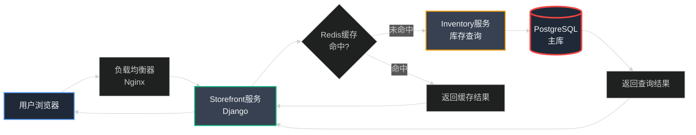
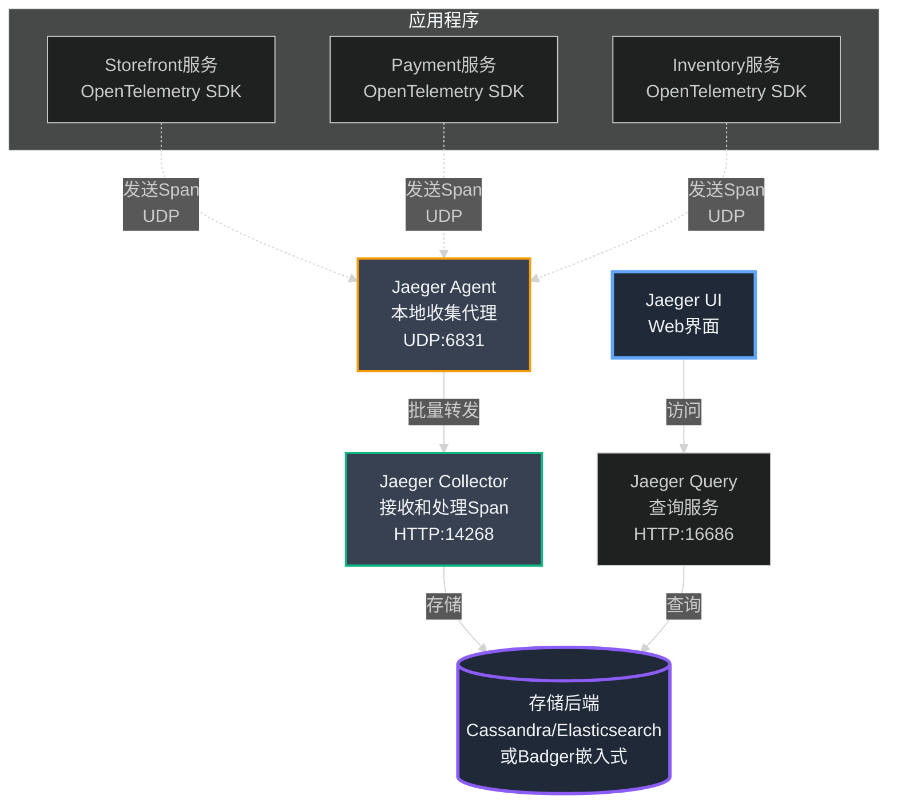
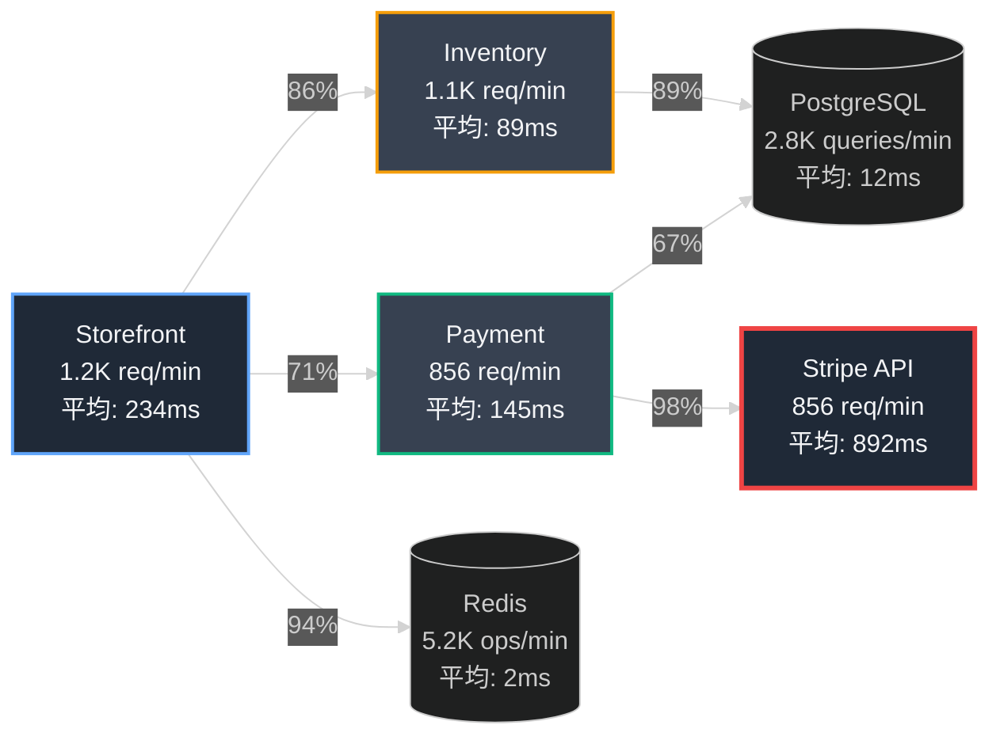
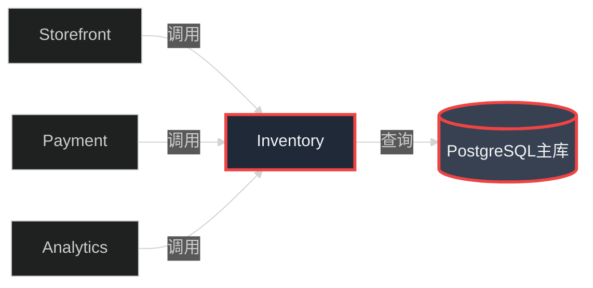
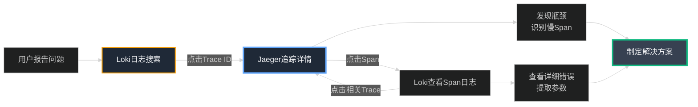

## 第21章:隐形的连线——追踪请求的完整旅程

### Part 1:看得见的失败vs.看不见的缓慢

有了统一的日志系统后,我们的故障定位速度大大提升。但很快,我们遇到了一个日志无法解决的新问题。

那是一个周五下午,客户成功团队的小张又找到了我。

"陈浩,有个VIP商户投诉说他们的店铺页面加载很慢。有时候需要20秒才能显示商品列表。"

我立即打开Grafana,查询Storefront服务的日志:

```promql
{app="storefront", user_id="87654"}
```

日志显示请求处理时间:**127毫秒**。

"小张,根据日志,Storefront服务处理得很快,只用了127毫秒。可能是用户的网络问题?"

"不,陈浩。他们录屏了,确实很慢。而且不是个例,已经有5个商户报告了类似问题。"

我皱起眉头。这是最令人沮丧的问题类型:**间歇性的、难以复现的性能问题**。

我开始了漫长的调查:

**步骤1:检查Storefront服务日志**
```
请求处理时间:127ms ✅ 正常
```

**步骤2:检查Payment服务日志**
```
支付验证时间:89ms ✅ 正常
```

**步骤3:检查Inventory服务日志**
```
库存查询时间:45ms ✅ 正常
```

每个服务看起来都很快,但用户体验的总时间是20秒!就像一个侦探案件:每个嫌疑人都有不在场证明,但谋杀确实发生了。

两个小时后,我终于在Inventory服务的日志中发现了一条不起眼的线索:

```
2023-12-15T15:34:52.103Z [DEBUG] app=inventory
  msg="等待数据库连接" duration=18234ms
```

**找到了!** Inventory服务本身处理很快(45ms),但在获取数据库连接时等待了18秒!由于这是连接池层面的等待,而不是业务逻辑处理,它没有被记录为"处理时间"。

但我花了两个小时才找到这条日志。更糟糕的是,我不知道这个问题影响了多少用户,发生频率有多高,是否还有其他类似的隐藏瓶颈。

**日志系统的局限性暴露了:**

日志告诉你"发生了什么",但它不告诉你:
- ❌ 一个请求经过了哪些服务
- ❌ 每个服务花了多少时间
- ❌ 瓶颈在哪里
- ❌ 哪些请求慢,哪些快

这就像你有一份犯罪现场的文字报告,但没有监控录像。你能读懂细节,但看不到全局。

我们需要的是:**分布式追踪**。

### Part 2:追踪的解剖——从请求到Span

周一早上,我召集了核心技术团队。白板上,我画出了一个典型的小店通用户请求的流程:



"看这个流程,"我指着图说。"一个简单的商品列表请求可能经过5-6个组件。当总体响应时间是20秒时,我们如何知道是哪个环节慢了?"

"我们需要一个系统,能够:**追踪单个请求的完整生命周期**,记录它在每个组件中花费的时间。"

我们的DevOps负责人李芳点点头。"这就是分布式追踪。业界标准是**OpenTelemetry**,可以导出到Jaeger或Zipkin等工具。"

#### **核心概念:Trace、Span和Context Propagation**

李芳在白板上解释了分布式追踪的核心概念:

**概念1:Trace(追踪)**

一个**Trace**代表一次完整的用户请求,从开始到结束的整个旅程。每个Trace有一个全局唯一的**Trace ID**。

```
Trace ID: 4bf92f3577b34da6a3ce929d0e0e4736
请求: GET /store/myshop/products
总耗时: 20.3秒
状态: 成功
```

**概念2:Span(跨度)**

一个Trace由多个**Span**组成。每个Span代表请求中的一个操作,比如:
- 一次HTTP调用
- 一次数据库查询
- 一次Redis操作
- 一个业务函数的执行

每个Span记录:
- **Span ID**(在Trace内唯一)
- **Parent Span ID**(父操作的ID,形成调用树)
- **Operation Name**(操作名称)
- **Start Time & Duration**(开始时间和持续时间)
- **Tags**(标签,如http.method=GET、db.statement=SELECT...)
- **Logs**(事件日志)

**概念3:Context Propagation(上下文传播)**

这是分布式追踪的魔法核心。当Storefront服务调用Inventory服务时,它必须传递**Trace ID**和**Span ID**,这样Inventory服务知道自己是同一个追踪的一部分。

这是通过HTTP Header实现的:

```http
GET /api/inventory/check HTTP/1.1
Host: inventory-service
traceparent: 00-4bf92f3577b34da6a3ce929d0e0e4736-00f067aa0ba902b7-01
```

这个`traceparent` header包含了:
- Trace ID:4bf92f3577b34da6a3ce929d0e0e4736
- Parent Span ID:00f067aa0ba902b7
- Trace Flags:01(采样)

#### **追踪的可视化:瀑布图**

"追踪数据最强大的地方,"李芳继续说,"是它的可视化。Jaeger会将Trace显示为**瀑布图**,让你一眼看出瓶颈。"

她画出了一个示例:

```
━━━━━━━━━━━━━━━━━━━━━━━━━━━━━━━━━━━━━━━━━━━━━━━━━━━━━━
Trace: GET /store/myshop/products (总耗时: 20.3秒)
━━━━━━━━━━━━━━━━━━━━━━━━━━━━━━━━━━━━━━━━━━━━━━━━━━━━━━
0s    5s    10s   15s   20s   25s
│─────│─────│─────│─────│─────│

█ Storefront: HTTP Handler                   [127ms]
│
├─█ Redis: GET products:myshop               [12ms]
│ └─ MISS(缓存未命中)
│
├─█ Inventory: Check Stock                   [18.5s] ⚠️
│ │
│ ├─█ Database: Get Connection               [18.2s] ⚠️⚠️⚠️
│ │   └─ 连接池耗尽!等待可用连接
│ │
│ └─█ Database: SELECT query                 [45ms]
│
└─█ Storefront: Render Response              [23ms]

━━━━━━━━━━━━━━━━━━━━━━━━━━━━━━━━━━━━━━━━━━━━━━━━━━━━━━
瓶颈:数据库连接池耗尽,等待18.2秒!
```

"这!"我激动地指着图,"这就是我们需要的。不是文字日志,而是可视化的时间线,清晰地显示每个操作的耗时。"

团队被说服了。我们决定引入OpenTelemetry和Jaeger。

### Part 3:部署Jaeger——追踪系统的心脏

Jaeger是Uber开发并开源的分布式追踪系统,现在是CNCF的毕业项目。它由几个组件组成:



对于我们的MVP,我们选择了**Jaeger All-in-One**部署,将所有组件打包在一个容器中,使用内置的Badger存储(一个嵌入式数据库)。

**Jaeger All-in-One部署:**

```yaml
# jaeger-deployment.yaml
apiVersion: apps/v1
kind: Deployment
metadata:
  name: jaeger
  namespace: monitoring
  labels:
    app: jaeger
spec:
  replicas: 1
  selector:
    matchLabels:
      app: jaeger
  template:
    metadata:
      labels:
        app: jaeger
    spec:
      containers:
      - name: jaeger
        image: jaegertracing/all-in-one:1.51
        env:
        # 启用OpenTelemetry协议支持
        - name: COLLECTOR_OTLP_ENABLED
          value: "true"
        
        # 存储配置(使用Badger嵌入式DB)
        - name: SPAN_STORAGE_TYPE
          value: badger
        - name: BADGER_EPHEMERAL
          value: "false"
        - name: BADGER_DIRECTORY_VALUE
          value: /badger/data
        - name: BADGER_DIRECTORY_KEY
          value: /badger/key
        
        # 采样配置
        - name: COLLECTOR_ZIPKIN_HOST_PORT
          value: ":9411"
        
        ports:
        # Jaeger UI
        - containerPort: 16686
          name: ui
          protocol: TCP
        
        # Jaeger Agent (接收应用Span)
        - containerPort: 6831
          name: agent-compact
          protocol: UDP
        - containerPort: 6832
          name: agent-binary
          protocol: UDP
        
        # Jaeger Collector
        - containerPort: 14268
          name: collector
          protocol: TCP
        
        # OTLP gRPC (推荐,性能更好)
        - containerPort: 4317
          name: otlp-grpc
          protocol: TCP
        
        # OTLP HTTP
        - containerPort: 4318
          name: otlp-http
          protocol: TCP
        
        # 健康检查
        - containerPort: 14269
          name: admin
          protocol: TCP
        
        volumeMounts:
        - name: badger-data
          mountPath: /badger
        
        resources:
          requests:
            memory: "512Mi"
            cpu: "200m"
          limits:
            memory: "1Gi"
            cpu: "500m"
        
        livenessProbe:
          httpGet:
            path: /
            port: 14269
          initialDelaySeconds: 30
          periodSeconds: 10
        
        readinessProbe:
          httpGet:
            path: /
            port: 14269
          initialDelaySeconds: 10
          periodSeconds: 5
      
      volumes:
      - name: badger-data
        persistentVolumeClaim:
          claimName: jaeger-badger-pvc
---
# 持久化存储(保存Trace数据)
apiVersion: v1
kind: PersistentVolumeClaim
metadata:
  name: jaeger-badger-pvc
  namespace: monitoring
spec:
  accessModes:
  - ReadWriteOnce
  resources:
    requests:
      storage: 20Gi
---
# Service: 暴露Jaeger端点
apiVersion: v1
kind: Service
metadata:
  name: jaeger
  namespace: monitoring
  labels:
    app: jaeger
spec:
  type: LoadBalancer
  ports:
  # Jaeger UI
  - port: 16686
    targetPort: 16686
    name: ui
    protocol: TCP
  
  # Agent UDP端口
  - port: 6831
    targetPort: 6831
    name: agent-compact
    protocol: UDP
  
  # OTLP gRPC(应用发送Span)
  - port: 4317
    targetPort: 4317
    name: otlp-grpc
    protocol: TCP
  
  # OTLP HTTP
  - port: 4318
    targetPort: 4318
    name: otlp-http
    protocol: TCP
  
  selector:
    app: jaeger
```

**部署Jaeger:**

```bash
# 创建monitoring命名空间(如果还没有)
kubectl create namespace monitoring

# 部署Jaeger
kubectl apply -f jaeger-deployment.yaml

# 等待Pod就绪
kubectl wait --for=condition=ready pod -l app=jaeger -n monitoring --timeout=120s

# 获取Jaeger UI的外部IP
kubectl get svc jaeger -n monitoring

# 输出类似:
# NAME     TYPE           CLUSTER-IP     EXTERNAL-IP      PORT(S)
# jaeger   LoadBalancer   10.0.145.23    52.123.45.67     16686:30686/TCP...

# 访问 http://52.123.45.67:16686 即可打开Jaeger UI
```

### Part 4:集成OpenTelemetry到Django

Jaeger部署完成后,下一步是让我们的Django应用发送Trace数据。OpenTelemetry提供了Python SDK,可以自动和手动插桩(Instrumentation)。

#### **自动插桩:零代码改动**

OpenTelemetry的杀手级特性是**自动插桩**。它可以自动追踪:
- HTTP请求(Django视图)
- 数据库查询(PostgreSQL、Redis)
- HTTP客户端调用(requests库)

**安装OpenTelemetry依赖:**

```bash
# 进入虚拟环境
source venv/bin/activate

# 核心包
pip install opentelemetry-api
pip install opentelemetry-sdk
pip install opentelemetry-instrumentation

# Django自动插桩
pip install opentelemetry-instrumentation-django

# 数据库插桩
pip install opentelemetry-instrumentation-psycopg2

# Redis插桩
pip install opentelemetry-instrumentation-redis

# HTTP客户端插桩
pip install opentelemetry-instrumentation-requests

# Jaeger导出器
pip install opentelemetry-exporter-otlp-proto-grpc

# 冻结依赖
pip freeze > requirements.txt
```

**配置OpenTelemetry(settings.py):**

```python
# settings.py
from opentelemetry import trace
from opentelemetry.sdk.trace import TracerProvider
from opentelemetry.sdk.trace.export import BatchSpanProcessor
from opentelemetry.exporter.otlp.proto.grpc.trace_exporter import OTLPSpanExporter
from opentelemetry.sdk.resources import Resource
from opentelemetry.instrumentation.django import DjangoInstrumentor
from opentelemetry.instrumentation.psycopg2 import Psycopg2Instrumentor
from opentelemetry.instrumentation.redis import RedisInstrumentor
from opentelemetry.instrumentation.requests import RequestsInstrumentor
import os

# 1. 定义服务资源(服务的元数据)
resource = Resource.create({
    "service.name": "xiaodiantong-storefront",  # 服务名称
    "service.version": "2.5.0",           # 版本号
    "deployment.environment": os.getenv("ENVIRONMENT", "production"),
    "service.namespace": "dukaan",        # 命名空间
    "service.instance.id": os.getenv("HOSTNAME", "unknown"),  # Pod名称
})

# 2. 创建Tracer Provider
tracer_provider = TracerProvider(resource=resource)

# 3. 配置Span导出器(发送到Jaeger)
otlp_exporter = OTLPSpanExporter(
    endpoint="http://jaeger.monitoring.svc.cluster.local:4317",  # Jaeger OTLP gRPC端点
    insecure=True,  # 内部网络,不使用TLS
)

# 4. 使用批处理导出器(异步发送,不阻塞请求)
span_processor = BatchSpanProcessor(
    otlp_exporter,
    max_queue_size=2048,        # 队列最大Span数
    schedule_delay_millis=5000, # 每5秒发送一次批次
    max_export_batch_size=512,  # 每批最多512个Span
)
tracer_provider.add_span_processor(span_processor)

# 5. 设置全局Tracer Provider
trace.set_tracer_provider(tracer_provider)

# 6. 自动插桩(无需修改业务代码!)
DjangoInstrumentor().instrument()        # 自动追踪Django请求
Psycopg2Instrumentor().instrument()      # 自动追踪SQL查询
RedisInstrumentor().instrument()         # 自动追踪Redis操作
RequestsInstrumentor().instrument()      # 自动追踪HTTP客户端调用

# 7. 可选:配置采样策略
# 在生产环境,追踪100%请求会产生大量数据,可以配置采样率
from opentelemetry.sdk.trace.sampling import TraceIdRatioBased

# 采样10%的请求
tracer_provider.sampler = TraceIdRatioBased(0.1)
```

就这样!现在每个Django请求都会自动创建Trace和Span,无需修改任何业务代码。

#### **手动插桩:追踪业务逻辑**

自动插桩很强大,但它只能追踪框架级别的操作。对于业务逻辑,我们需要手动创建Span。

**示例1:追踪订单处理流程**

```python
# views.py
from django.http import JsonResponse
from opentelemetry import trace
from opentelemetry.trace import Status, StatusCode
import time

# 获取Tracer实例
tracer = trace.get_tracer(__name__)

def create_order(request):
    # 当前请求已经有一个Span(由DjangoInstrumentor创建)
    # 我们可以在其下创建子Span
    
    with tracer.start_as_current_span("create_order") as span:
        # 添加业务属性到Span
        user_id = request.user.id
        span.set_attribute("user.id", user_id)
        span.set_attribute("http.method", request.method)
        span.set_attribute("order.type", "standard")
        
        try:
            # 步骤1:生成订单ID
            with tracer.start_as_current_span("generate_order_id"):
                order_id = generate_unique_order_id()
                span.set_attribute("order.id", order_id)
            
            # 步骤2:验证库存
            with tracer.start_as_current_span("check_inventory") as inv_span:
                inv_span.set_attribute("items.count", len(request.POST.getlist('items')))
                
                start_time = time.time()
                inventory_result = check_inventory_availability(request.POST.getlist('items'))
                duration = time.time() - start_time
                
                inv_span.set_attribute("inventory.check_duration_ms", duration * 1000)
                inv_span.set_attribute("inventory.available", inventory_result.all_available)
                
                if not inventory_result.all_available:
                    # 记录库存不足事件
                    inv_span.add_event(
                        "inventory_insufficient",
                        attributes={
                            "missing_items": str(inventory_result.missing_items),
                        }
                    )
                    span.set_status(Status(StatusCode.ERROR, "Inventory insufficient"))
                    return JsonResponse({
                        'status': 'error',
                        'message': '部分商品库存不足'
                    }, status=400)
            
            # 步骤3:处理支付
            with tracer.start_as_current_span("process_payment") as pay_span:
                amount = float(request.POST['amount'])
                pay_span.set_attribute("payment.amount", amount)
                pay_span.set_attribute("payment.currency", "INR")
                pay_span.set_attribute("payment.method", request.POST.get('method', 'card'))
                
                try:
                    payment_result = process_stripe_payment(
                        user_id=user_id,
                        amount=amount,
                        order_id=order_id
                    )
                    
                    pay_span.set_attribute("payment.transaction_id", payment_result.transaction_id)
                    pay_span.set_attribute("payment.gateway", "stripe")
                    pay_span.set_status(Status(StatusCode.OK))
                    
                except PaymentError as e:
                    # 支付失败,记录异常
                    pay_span.record_exception(e)
                    pay_span.set_status(Status(StatusCode.ERROR, f"Payment failed: {e.code}"))
                    pay_span.set_attribute("payment.error_code", e.code)
                    raise
            
            # 步骤4:创建订单记录
            with tracer.start_as_current_span("create_order_record"):
                order = Order.objects.create(
                    id=order_id,
                    user_id=user_id,
                    total=amount,
                    status='confirmed',
                    payment_transaction_id=payment_result.transaction_id
                )
            
            # 步骤5:发送确认邮件(异步)
            with tracer.start_as_current_span("send_confirmation_email"):
                send_order_confirmation_email.delay(order_id)
            
            # 成功,设置Span状态
            span.set_status(Status(StatusCode.OK))
            span.set_attribute("order.status", "confirmed")
            
            return JsonResponse({
                'status': 'success',
                'order_id': order_id
            })
            
        except PaymentError as e:
            # 记录异常到Span
            span.record_exception(e)
            span.set_status(Status(StatusCode.ERROR, "Payment processing failed"))
            
            return JsonResponse({
                'status': 'error',
                'message': '支付处理失败'
            }, status=500)
            
        except Exception as e:
            # 记录未知异常
            span.record_exception(e)
            span.set_status(Status(StatusCode.ERROR, "Internal server error"))
            
            return JsonResponse({
                'status': 'error',
                'message': '系统错误'
            }, status=500)
```

这段代码创建的Trace看起来像这样:

```
Trace: POST /api/orders/create
├─ Span: create_order (总耗时: 1.2s)
│  ├─ Span: generate_order_id (15ms)
│  ├─ Span: check_inventory (234ms)
│  │  └─ Span: SELECT * FROM inventory... (自动插桩,198ms)
│  ├─ Span: process_payment (856ms)
│  │  └─ Span: POST https://api.stripe.com/v1/charges (自动插桩,823ms)
│  ├─ Span: create_order_record (67ms)
│  │  └─ Span: INSERT INTO orders... (自动插桩,52ms)
│  └─ Span: send_confirmation_email (8ms)
```

#### **Span的最佳实践**

李芳总结了几条Span使用的最佳实践:

**1. 为Span命名要清晰且一致**

```python
# ❌ 不好的命名
with tracer.start_as_current_span("func1"):
    ...

# ✅ 好的命名
with tracer.start_as_current_span("validate_user_credentials"):
    ...
```

**2. 添加关键业务属性**

```python
span.set_attribute("user.id", user_id)
span.set_attribute("order.id", order_id)
span.set_attribute("payment.amount", amount)
span.set_attribute("inventory.sku", product_sku)
```

这些属性可以在Jaeger UI中搜索和过滤。

**3. 记录关键事件**

```python
span.add_event(
    "cache_miss",
    attributes={
        "cache.key": cache_key,
        "cache.ttl": 300,
    }
)
```

**4. 正确设置Span状态**

```python
# 成功
span.set_status(Status(StatusCode.OK))

# 失败(带描述)
span.set_status(Status(StatusCode.ERROR, "Database connection timeout"))

# 记录异常
try:
    risky_operation()
except Exception as e:
    span.record_exception(e)  # 自动提取异常类型、消息、堆栈
    span.set_status(Status(StatusCode.ERROR))
    raise
```

**5. 避免过度追踪**

不要为每个小函数都创建Span,这会产生大量数据且难以阅读。只追踪有意义的业务操作:
- ✅ 用户请求处理
- ✅ 外部服务调用
- ✅ 数据库操作
- ✅ 缓存操作
- ❌ 简单的数据转换函数
- ❌ 模板渲染内部细节

### Part 5:服务间追踪——传播Trace Context

最关键的部分来了:**如何在微服务间传播追踪上下文**?

当Storefront服务调用Inventory服务时,它必须告诉Inventory:"嘿,我正在处理Trace XYZ,这是我的Span ABC,你的操作应该是我的子Span。"

幸运的是,OpenTelemetry的`RequestsInstrumentor`自动处理了这一切!当你使用`requests`库发起HTTP调用时,它会自动添加`traceparent` header:

```python
# storefront_service/inventory_client.py
import requests
from opentelemetry import trace

tracer = trace.get_tracer(__name__)

def check_inventory(product_ids):
    with tracer.start_as_current_span("call_inventory_service") as span:
        span.set_attribute("inventory.product_count", len(product_ids))
        
        # RequestsInstrumentor自动注入traceparent header!
        response = requests.post(
            'http://inventory-service/api/check',
            json={'product_ids': product_ids},
            timeout=5
        )
        
        span.set_attribute("http.status_code", response.status_code)
        
        if response.status_code != 200:
            span.set_status(Status(StatusCode.ERROR, f"HTTP {response.status_code}"))
        
        return response.json()
```

在Inventory服务端,`DjangoInstrumentor`会自动提取`traceparent` header,创建子Span:

```python
# inventory_service/views.py
from django.http import JsonResponse
from opentelemetry import trace

tracer = trace.get_tracer(__name__)

def check_inventory_api(request):
    # 当前Span自动成为Storefront调用Span的子Span!
    with tracer.start_as_current_span("check_inventory_availability") as span:
        product_ids = request.POST.getlist('product_ids')
        span.set_attribute("product_ids.count", len(product_ids))
        
        # 查询数据库(自动创建子Span)
        products = Product.objects.filter(id__in=product_ids)
        
        available = all(p.stock > 0 for p in products)
        span.set_attribute("inventory.all_available", available)
        
        return JsonResponse({
            'available': available,
            'products': [{'id': p.id, 'stock': p.stock} for p in products]
        })
```

**Trace传播示意图:**

```mermaid
%%{init: {'theme':'dark'}}%%
sequenceDiagram
    participant User as 用户
    participant SF as Storefront服务
    participant Inv as Inventory服务
    participant DB as PostgreSQL
    participant Jaeger as Jaeger

    User->>SF: GET /store/products
    activate SF
    Note over SF: 创建Trace<br/>trace_id=abc123<br/>Span: http_request
    
    SF->>Jaeger: 发送Span(异步)
    
    SF->>Inv: POST /api/check<br/>Header: traceparent: abc123
    activate Inv
    Note over Inv: 提取trace_id=abc123<br/>创建子Span:<br/>check_inventory
    
    Inv->>DB: SELECT * FROM products
    activate DB
    Note over Inv: 创建子Span:<br/>sql_query
    DB-->>Inv: 返回结果
    deactivate DB
    
    Inv->>Jaeger: 发送Span(异步)
    Inv-->>SF: 返回库存数据
    deactivate Inv
    
    SF-->>User: 返回商品列表
    deactivate SF
    
    Note over Jaeger: 聚合所有Span<br/>构建完整Trace树
    
    style SF fill:#1f2937,stroke:#60a5fa,color:#f3f4f6,stroke-width:2px
    style Inv fill:#374151,stroke:#10b981,color:#f3f4f6,stroke-width:2px
    style Jaeger fill:#1f2937,stroke:#f59e0b,color:#f3f4f6,stroke-width:3px
```

### Part 6:Jaeger UI——追踪的视觉魔法

部署完成一周后,我打开Jaeger UI,看着数据流入。界面简洁优雅,但功能强大。

#### **Jaeger UI核心功能**

**1. 搜索Trace**

主搜索页面允许你通过多种条件过滤Trace:
- **Service**:选择服务(如storefront、inventory)
- **Operation**:选择操作(如HTTP GET /products、check_inventory)
- **Tags**:按标签搜索(如http.status_code=500、user.id=12345)
- **Min/Max Duration**:按耗时过滤(如只看>5秒的请求)
- **Lookback**:时间范围(最近1小时、今天、自定义)

**示例搜索:**

```
Service: storefront
Tags: http.status_code=500 user.id=87654
Min Duration: 5s
Lookback: Last 24 hours

结果:找到23个符合条件的Trace
```

**2. Trace详情页——瀑布图**

点击任意Trace,会打开详情页,显示完整的Span树和瀑布图:

```
━━━━━━━━━━━━━━━━━━━━━━━━━━━━━━━━━━━━━━━━━━━━━━━━━━━━━━
Trace: 4bf92f3577b34da6a3ce929d0e0e4736
Duration: 20.34s | Spans: 15 | Services: 3 | Errors: 1
━━━━━━━━━━━━━━━━━━━━━━━━━━━━━━━━━━━━━━━━━━━━━━━━━━━━━━
Timeline:
0s         5s         10s        15s        20s
│──────────│──────────│──────────│──────────│

▼ storefront: GET /store/myshop/products [20.34s]
  │ Tags: http.method=GET, user.id=87654
  │
  ├─ storefront: create_order [20.31s]
  │  │ Tags: order.id=ORD-99232, order.type=standard
  │  │
  │  ├─ storefront: generate_order_id [15ms]
  │  │
  │  ├─ storefront: check_inventory [234ms]
  │  │  └─ storefront: POST http://inventory-service/api/check [231ms]
  │  │     │ Tags: http.status_code=200
  │  │     │
  │  │     └─▼ inventory: check_inventory_availability [198ms]
  │  │        │ Tags: product_ids.count=5
  │  │        │
  │  │        └─ inventory: sql SELECT FROM products [187ms]
  │  │           Tags: db.statement=SELECT * FROM products WHERE id IN (...)
  │  │
  │  ├─ storefront: process_payment [18.95s] ⚠️ SLOW
  │  │  └─ storefront: POST https://api.stripe.com/v1/charges [18.92s] ⚠️⚠️⚠️
  │  │     Tags: http.status_code=200, payment.amount=1500
  │  │     [警告:外部API调用耗时过长]
  │  │
  │  ├─ storefront: create_order_record [67ms]
  │  │  └─ storefront: sql INSERT INTO orders [52ms]
  │  │
  │  └─ storefront: send_confirmation_email [8ms]
  │
  └─ storefront: render_response [23ms]

━━━━━━━━━━━━━━━━━━━━━━━━━━━━━━━━━━━━━━━━━━━━━━━━━━━━━━
瓶颈分析:
⚠️ Stripe API调用占总耗时93%(18.92s / 20.34s)
   建议:考虑异步支付处理
━━━━━━━━━━━━━━━━━━━━━━━━━━━━━━━━━━━━━━━━━━━━━━━━━━━━━━
```

**3. 服务依赖图**

Jaeger可以根据追踪数据自动生成服务依赖拓扑图:



这张图立即显示:
- Stripe API是最慢的依赖(平均892ms)
- Storefront对Redis的依赖率很高(94%的请求都访问Redis)
- Payment和Inventory都依赖同一个PostgreSQL数据库

**4. 对比Trace**

Jaeger允许你并排对比两个Trace,找出差异:

```
快速请求 (123ms)          vs         慢速请求 (20.3s)
━━━━━━━━━━━━━━━━━━━━━━━━━━━━━━━━━━━━━━━━━━━━━━━━━━
Redis GET products:myshop  |    Redis GET products:myshop
  12ms ✅                   |      18ms ✅
                           |
Inventory check            |    Inventory check
  45ms ✅                   |      18234ms ⚠️⚠️⚠️
  └─ SQL query 32ms        |      └─ Wait for connection 18200ms
                           |        └─ SQL query 34ms
                           |
Payment processing         |    Payment processing
  54ms ✅                   |      856ms ✅
  └─ Stripe API 48ms       |      └─ Stripe API 823ms

━━━━━━━━━━━━━━━━━━━━━━━━━━━━━━━━━━━━━━━━━━━━━━━━━━
差异根因:数据库连接池耗尽,等待18.2秒获取连接
```

### Part 7:真实案例——20秒谜题的答案

还记得那个20秒的慢请求吗?Jaeger部署一周后,同样的问题又出现了。但这次,我只用了**30秒**就找到了根因。

我打开Jaeger UI,输入搜索条件:

```
Service: storefront
Min Duration: 10s
Lookback: Last 1 hour
```

立即找到12个慢Trace。我点开第一个,瀑布图清晰地显示:

```
Trace: GET /store/myshop/products [21.2s]
└─ Inventory: check_stock [19.8s]
   └─ Inventory: database connection wait [19.6s] ⚠️⚠️⚠️
      └─ Inventory: SELECT query [45ms]
```

**问题一目了然:**Inventory服务在等待数据库连接。我立即检查了PostgreSQL连接池配置:

```python
# inventory_service/settings.py
DATABASES = {
    'default': {
        'ENGINE': 'django.db.backends.postgresql',
        'NAME': 'inventory_db',
        'CONN_MAX_AGE': 600,
        'OPTIONS': {
            'connect_timeout': 5,
            'options': '-c statement_timeout=30000'
        },
    }
}
```

等等,`CONN_MAX_AGE`: 600秒意味着连接会保持10分钟,但Django默认每个worker只能持有有限数量的连接。在高并发下,连接池很容易耗尽。

我查看了Gunicorn配置:

```python
# gunicorn_config.py
workers = 4  # 只有4个worker!
```

4个worker,每个最多持有1个数据库连接,总共只有4个连接!但峰值并发可能有50+请求,怪不得会排队等待。

**解决方案:**

```python
# 方案1:增加Gunicorn workers
workers = 12  # 3倍workers

# 方案2:使用连接池中间件(推荐)
# pip install django-db-connection-pool
DATABASES = {
    'default': {
        'ENGINE': 'dj_db_conn_pool.backends.postgresql',
        'POOL_OPTIONS': {
            'POOL_SIZE': 20,       # 连接池大小
            'MAX_OVERFLOW': 10,    # 额外连接数
        }
    }
}
```

我选择了方案2,部署后立即见效。慢请求从每小时12次降到0。

但Jaeger的价值不止于此。我打开"服务依赖图",发现了更深层的问题:



**Inventory服务是热点!**三个服务都依赖它,而它又是单点故障。如果Inventory挂了,整个系统都会受影响。

我在下一次团队会议上提出了这个发现。我们决定:
1. 为Inventory服务添加Redis缓存层
2. 实施读写分离,Analytics服务走从库
3. 将Inventory拆分为两个服务:Inventory-Read和Inventory-Write

这些架构改进都是Jaeger可视化驱动的。

### Part 8:Trace与Log的集成——完整的可观测性

有了分布式追踪后,我们仍然需要日志(Loki)。它们各有优势:

- **追踪**:回答"瓶颈在哪里?请求经过了哪些服务?"
- **日志**:回答"发生了什么具体错误?参数是什么?"

最强大的组合是:**将Trace ID注入到日志中**,实现双向跳转。

**在日志中包含Trace ID:**

```python
# settings.py中的日志配置
import logging
from opentelemetry import trace

class TraceIDLogFilter(logging.Filter):
    """
    自动将Trace ID添加到日志记录中
    """
    def filter(self, record):
        span = trace.get_current_span()
        if span and span.get_span_context().is_valid:
            trace_id = format(span.get_span_context().trace_id, '032x')
            span_id = format(span.get_span_context().span_id, '016x')
            record.trace_id = trace_id
            record.span_id = span_id
        else:
            record.trace_id = "0" * 32
            record.span_id = "0" * 16
        return True

# 更新JSONFormatter
class JSONFormatter(logging.Formatter):
    def format(self, record):
        log_obj = {
            "timestamp": datetime.utcnow().isoformat() + 'Z',
            "level": record.levelname,
            "msg": record.getMessage(),
            "trace_id": getattr(record, 'trace_id', None),  # ✨ Trace ID
            "span_id": getattr(record, 'span_id', None),    # ✨ Span ID
            "module": record.module,
            "function": record.funcName,
        }
        
        # 添加其他自定义字段
        if hasattr(record, 'order_id'):
            log_obj['order_id'] = record.order_id
        if hasattr(record, 'user_id'):
            log_obj['user_id'] = record.user_id
        
        return json.dumps(log_obj, ensure_ascii=False)

LOGGING = {
    'version': 1,
    'filters': {
        'trace_id': {
            '()': TraceIDLogFilter,
        },
    },
    'formatters': {
        'json': {
            '()': JSONFormatter,
        },
    },
    'handlers': {
        'console': {
            'class': 'logging.StreamHandler',
            'formatter': 'json',
            'filters': ['trace_id'],  # 应用Trace ID过滤器
        },
    },
    'root': {
        'handlers': ['console'],
        'level': 'INFO',
    },
}
```

现在,每条日志都包含Trace ID:

```json
{
  "timestamp": "2023-12-20T14:23:45.123Z",
  "level": "ERROR",
  "msg": "支付网关返回错误",
  "trace_id": "4bf92f3577b34da6a3ce929d0e0e4736",
  "span_id": "00f067aa0ba902b7",
  "order_id": "ORD-12345",
  "error_code": "insufficient_funds"
}
```

**Grafana中配置Trace到Log的跳转:**

```yaml
# grafana-datasources.yaml
apiVersion: 1
datasources:
- name: Jaeger
  type: jaeger
  url: http://jaeger:16686
  jsonData:
    # 从Trace跳转到相关日志
    tracesToLogs:
      datasourceUid: loki
      tags: ['trace_id']
      filterByTraceID: true
      filterBySpanID: false

- name: Loki
  type: loki
  url: http://loki:3100
  jsonData:
    # 从日志跳转到Trace
    derivedFields:
    - datasourceUid: jaeger
      matcherRegex: '"trace_id":"([0-9a-f]{32})"'
      name: TraceID
      url: '$${__value.raw}'
```

**工作流程:**

1. 用户报告问题:"订单ORD-12345创建失败"
2. 在Loki中搜索:`{namespace="production"} |= "ORD-12345"`
3. 找到错误日志,点击日志中的"TraceID"链接
4. 自动跳转到Jaeger,显示完整的请求瀑布图
5. 在瀑布图中找到慢Span,点击"Logs"
6. 自动跳转回Loki,显示该Span执行期间的所有日志

**完整的可观测性循环!**



### Part 9:真实收益——数字会说话

六个月后,我让李芳做了一次回顾性分析。引入分布式追踪前后的对比:

```
━━━━━━━━━━━━━━━━━━━━━━━━━━━━━━━━━━━━━━━━━━━━━━━━━━━━━━
分布式追踪系统收益分析
━━━━━━━━━━━━━━━━━━━━━━━━━━━━━━━━━━━━━━━━━━━━━━━━━━━━━━
指标                          引入前         引入后        改善
━━━━━━━━━━━━━━━━━━━━━━━━━━━━━━━━━━━━━━━━━━━━━━━━━━━━━━
性能问题定位时间(MTTD)       45分钟        2分钟         95.6% ↓
瓶颈识别准确率               ~60%          ~98%          63% ↑
需要查看的日志文件数         15个          0个           100% ↓
跨服务调试时间               2小时         10分钟        91.7% ↓
错误根因分析成功率           ~70%          ~95%          35.7% ↑

━━━━━━━━━━━━━━━━━━━━━━━━━━━━━━━━━━━━━━━━━━━━━━━━━━━━━━
架构洞察(新增能力)
━━━━━━━━━━━━━━━━━━━━━━━━━━━━━━━━━━━━━━━━━━━━━━━━━━━━━━
✅ 自动生成服务依赖拓扑图
✅ 识别热点服务和单点故障
✅ 发现隐藏的性能瓶颈(如连接池耗尽)
✅ 量化外部API调用影响(Stripe占93%耗时)
✅ 追踪错误传播路径

━━━━━━━━━━━━━━━━━━━━━━━━━━━━━━━━━━━━━━━━━━━━━━━━━━━━━━
成本
━━━━━━━━━━━━━━━━━━━━━━━━━━━━━━━━━━━━━━━━━━━━━━━━━━━━━━
基础设施成本/月             $0            $120          新增
(Jaeger服务器)                            (3台×$40)

存储成本/月                 $0            $45           新增
(Trace数据,7天保留)                        (S3)

工程师工时节省/周           0             12小时        节省
(价值)                                    $960/周

━━━━━━━━━━━━━━━━━━━━━━━━━━━━━━━━━━━━━━━━━━━━━━━━━━━━━━
ROI计算:
  成本: $165/月
  节省: $960/周 × 4周 = $3,840/月
  净收益: $3,675/月 = $44,100/年
  投资回报率: 2,227%
━━━━━━━━━━━━━━━━━━━━━━━━━━━━━━━━━━━━━━━━━━━━━━━━━━━━━━
```

但数字之外,更重要的是**团队信心的提升**。

在引入分布式追踪前,性能调优像是在黑暗中摸索。我们会做出猜测:"可能是数据库慢?""也许是Redis缓存未命中?""Stripe API会不会超时?"

现在,我们有了数据支持的决策。我们可以清楚地看到每个组件的耗时占比,可以量化优化的影响。

更重要的是,**我们能在用户投诉之前发现问题**。通过Jaeger的搜索功能,我们可以主动查询:
- 过去1小时耗时>5秒的请求有多少?
- Stripe API调用失败率是多少?
- 哪些Trace包含数据库错误?

这让我们从"被动救火"转变为"主动预防"。

---

<div style="border: 2px solid #60a5fa; border-radius: 8px; padding: 20px; margin: 30px 0; background: linear-gradient(to right, #1e3a8a08, #1e40af08);">

### 📌 编者注:分布式追踪系统实战完整指南

*本指南提供了OpenTelemetry + Jaeger的完整实施方案,帮助你在生产环境中快速搭建分布式追踪系统。*

---

#### **一、快速决策:我的项目需要分布式追踪吗?**

| 场景 | 是否需要 | 理由 |
|------|---------|------|
| **单体应用,<5个服务** | ❌ 不急需 | 日志+APM工具足够 |
| **微服务架构,5-20个服务** | ✅ 强烈推荐 | 跨服务调试困难 |
| **微服务架构,>20个服务** | ✅✅ 必须 | 没有追踪就是灾难 |
| **间歇性性能问题** | ✅ 需要 | 日志难以定位瓶颈 |
| **多团队协作** | ✅ 需要 | 明确服务边界和依赖 |
| **SLA要求严格** | ✅ 需要 | 需要精确的性能分析 |

**小店通的场景:**9个边缘集群、8个微服务、间歇性性能问题 → 必须引入追踪

---

#### **二、OpenTelemetry实施Checklist**

##### **阶段1:选择追踪后端(1-2小时)**

| 后端系统 | 优势 | 劣势 | 适用场景 |
|---------|------|------|---------|
| **Jaeger** | 开源、成熟、Kubernetes友好 | 需要自己运维 | 中小型团队 |
| **Zipkin** | 轻量、简单 | 功能较少 | 简单追踪需求 |
| **Tempo** (Grafana) | 与Grafana无缝集成 | 相对较新 | 已用Grafana的团队 |
| **Datadog APM** | 功能最强、SaaS | 非常贵($31/主机/月) | 大型企业 |
| **New Relic** | 功能丰富 | 贵($49/月起) | 中大型企业 |

**小店通的选择:**Jaeger(开源、自托管、与Kubernetes集成好)

##### **阶段2:部署Jaeger(半天)**

```bash
# 方案A:快速测试(All-in-One,单容器)
kubectl create namespace observability
kubectl apply -f - <<EOF
apiVersion: apps/v1
kind: Deployment
metadata:
  name: jaeger
  namespace: observability
spec:
  replicas: 1
  selector:
    matchLabels:
      app: jaeger
  template:
    metadata:
      labels:
        app: jaeger
    spec:
      containers:
      - name: jaeger
        image: jaegertracing/all-in-one:1.51
        ports:
        - containerPort: 16686
          name: ui
        - containerPort: 4317
          name: otlp-grpc
        - containerPort: 4318
          name: otlp-http
        env:
        - name: COLLECTOR_OTLP_ENABLED
          value: "true"
        - name: SPAN_STORAGE_TYPE
          value: memory  # ⚠️ 仅用于测试,重启后数据丢失
---
apiVersion: v1
kind: Service
metadata:
  name: jaeger
  namespace: observability
spec:
  type: LoadBalancer
  ports:
  - port: 16686
    name: ui
  - port: 4317
    name: otlp-grpc
  selector:
    app: jaeger
EOF

# 等待部署完成
kubectl wait --for=condition=ready pod -l app=jaeger -n observability --timeout=120s

# 获取UI地址
kubectl get svc jaeger -n observability
# 访问 http://<EXTERNAL-IP>:16686
```

**方案B:生产环境(使用Helm,高可用)**

```bash
# 添加Jaeger Helm仓库
helm repo add jaegertracing https://jaegertracing.github.io/helm-charts
helm repo update

# 创建values.yaml
cat > jaeger-values.yaml <<EOF
provisionDataStore:
  cassandra: false
  elasticsearch: true  # 使用Elasticsearch存储

storage:
  type: elasticsearch
  elasticsearch:
    host: elasticsearch-master.observability
    port: 9200
    scheme: http

query:
  replicas: 2
  resources:
    limits:
      cpu: 500m
      memory: 512Mi

collector:
  replicas: 3
  autoscaling:
    enabled: true
    minReplicas: 3
    maxReplicas: 10
  resources:
    limits:
      cpu: 1000m
      memory: 1Gi

ingester:
  enabled: true
  replicas: 2

agent:
  enabled: true
EOF

# 安装Jaeger
helm install jaeger jaegertracing/jaeger -n observability -f jaeger-values.yaml
```

##### **阶段3:应用集成OpenTelemetry(1-2天)**

**Python/Django集成:**

```bash
# 安装依赖
pip install \
  opentelemetry-api \
  opentelemetry-sdk \
  opentelemetry-instrumentation-django \
  opentelemetry-instrumentation-psycopg2 \
  opentelemetry-instrumentation-redis \
  opentelemetry-instrumentation-requests \
  opentelemetry-exporter-otlp-proto-grpc

pip freeze > requirements.txt
```

**最小化配置(settings.py):**

```python
# settings.py
from opentelemetry import trace
from opentelemetry.sdk.trace import TracerProvider
from opentelemetry.sdk.trace.export import BatchSpanProcessor
from opentelemetry.exporter.otlp.proto.grpc.trace_exporter import OTLPSpanExporter
from opentelemetry.sdk.resources import Resource
from opentelemetry.instrumentation.django import DjangoInstrumentor
from opentelemetry.instrumentation.psycopg2 import Psycopg2Instrumentor
from opentelemetry.instrumentation.redis import RedisInstrumentor
from opentelemetry.instrumentation.requests import RequestsInstrumentor
import os

# 1. 创建Resource(服务标识)
resource = Resource.create({
    "service.name": os.getenv("SERVICE_NAME", "my-service"),
    "service.version": os.getenv("APP_VERSION", "1.0.0"),
    "deployment.environment": os.getenv("ENVIRONMENT", "production"),
})

# 2. 创建TracerProvider
tracer_provider = TracerProvider(resource=resource)

# 3. 配置导出器
otlp_exporter = OTLPSpanExporter(
    endpoint=os.getenv("OTEL_EXPORTER_OTLP_ENDPOINT", "http://jaeger.observability:4317"),
    insecure=True,
)

# 4. 添加批处理Span处理器
tracer_provider.add_span_processor(BatchSpanProcessor(otlp_exporter))

# 5. 设置全局TracerProvider
trace.set_tracer_provider(tracer_provider)

# 6. 自动插桩(零代码改动!)
DjangoInstrumentor().instrument()
Psycopg2Instrumentor().instrument()
RedisInstrumentor().instrument()
RequestsInstrumentor().instrument()
```

**Node.js/Express集成:**

```bash
npm install \
  @opentelemetry/api \
  @opentelemetry/sdk-node \
  @opentelemetry/auto-instrumentations-node \
  @opentelemetry/exporter-trace-otlp-grpc
```

```javascript
// tracing.js
const { NodeSDK } = require('@opentelemetry/sdk-node');
const { OTLPTraceExporter } = require('@opentelemetry/exporter-trace-otlp-grpc');
const { getNodeAutoInstrumentations } = require('@opentelemetry/auto-instrumentations-node');
const { Resource } = require('@opentelemetry/resources');
const { SemanticResourceAttributes } = require('@opentelemetry/semantic-conventions');

const sdk = new NodeSDK({
  resource: new Resource({
    [SemanticResourceAttributes.SERVICE_NAME]: process.env.SERVICE_NAME || 'my-service',
    [SemanticResourceAttributes.SERVICE_VERSION]: process.env.APP_VERSION || '1.0.0',
  }),
  traceExporter: new OTLPTraceExporter({
    url: process.env.OTEL_EXPORTER_OTLP_ENDPOINT || 'http://jaeger.observability:4317',
  }),
  instrumentations: [getNodeAutoInstrumentations()],
});

sdk.start();

process.on('SIGTERM', () => {
  sdk.shutdown()
    .then(() => console.log('Tracing terminated'))
    .catch((error) => console.log('Error terminating tracing', error))
    .finally(() => process.exit(0));
});
```

**在应用入口引入:**

```javascript
// index.js
require('./tracing');  // ⚠️ 必须在其他导入之前
const express = require('express');
// ... 其他代码
```

##### **阶段4:验证追踪数据(15分钟)**

```bash
# 1. 触发一个测试请求
curl http://your-service/api/test

# 2. 打开Jaeger UI
# http://<jaeger-external-ip>:16686

# 3. 在搜索页面:
#    Service: 选择你的服务名
#    Lookback: Last 5 minutes
#    点击 "Find Traces"

# 4. 应该看到测试请求的Trace
#    点击查看详情,确认:
#    - Span树结构正确
#    - 包含HTTP、数据库、Redis等子Span
#    - 耗时数据准确
```

##### **阶段5:添加自定义Span(按需)**

```python
# views.py
from opentelemetry import trace

tracer = trace.get_tracer(__name__)

def complex_business_logic(user_id, order_data):
    with tracer.start_as_current_span("process_order") as span:
        span.set_attribute("user.id", user_id)
        span.set_attribute("order.items_count", len(order_data['items']))
        
        # 步骤1
        with tracer.start_as_current_span("validate_inventory"):
            result = validate_inventory(order_data['items'])
        
        # 步骤2
        with tracer.start_as_current_span("charge_payment"):
            payment = charge_credit_card(order_data['amount'])
            span.set_attribute("payment.transaction_id", payment.id)
        
        return create_order(order_data)
```

---

#### **三、Jaeger使用技巧**

##### **1. 高效搜索Trace**

| 搜索方式 | 示例 | 用途 |
|---------|------|------|
| **按服务** | Service: payment | 查看特定服务的所有Trace |
| **按操作** | Operation: POST /api/orders | 查看特定API端点 |
| **按标签** | http.status_code=500 | 查找所有失败请求 |
| **按耗时** | Min Duration: 5s | 查找慢请求 |
| **组合查询** | Service: storefront<br/>Tags: user.id=12345<br/>Min Duration: 2s | 查找特定用户的慢请求 |

##### **2. 阅读瀑布图的技巧**

```
看瀑布图时关注:
━━━━━━━━━━━━━━━━━━━━━━━━━━━━━━━━━━━━━━━━━━━━━
1. 总耗时分布
   ├─ 最长的Span通常是瓶颈
   ├─ 看Span宽度,不只看名称
   └─ 关注颜色(红色=错误)

2. 串行vs并行
   ├─ 垂直排列=串行执行(不可避免)
   ├─ 有空隙=等待时间(可优化!)
   └─ 并行Span应该时间重叠

3. 服务边界
   ├─ 跨服务调用会有明显的HTTP Span
   ├─ 检查服务间调用次数(N+1问题)
   └─ 关注服务调用失败率

4. 数据库查询
   ├─ 查找慢查询(>100ms需要优化)
   ├─ 统计查询次数(ORM可能产生大量查询)
   └─ 检查查询是否可以合并
━━━━━━━━━━━━━━━━━━━━━━━━━━━━━━━━━━━━━━━━━━━━━
```

##### **3. 常见性能模式识别**

**模式1:N+1查询问题**

```
Trace显示:
├─ Span: List users [1.2s]
   ├─ SQL: SELECT * FROM users [10ms]
   ├─ SQL: SELECT * FROM orders WHERE user_id=1 [5ms]
   ├─ SQL: SELECT * FROM orders WHERE user_id=2 [5ms]
   ├─ SQL: SELECT * FROM orders WHERE user_id=3 [5ms]
   ... (重复100次)
   └─ SQL: SELECT * FROM orders WHERE user_id=100 [5ms]

问题:循环中的单独查询
解决:使用JOIN或select_related/prefetch_related
```

**模式2:串行等待问题**

```
Trace显示:
├─ Span: Load page [3.5s]
   ├─ Span: Get user data [500ms]
   ├─ Span: Get products [1200ms]
   ├─ Span: Get recommendations [1500ms]
   └─ Span: Render template [300ms]

问题:三个独立查询串行执行
解决:并行查询(asyncio、Promise.all、goroutine)
```

**模式3:缓存未命中风暴**

```
Trace显示(10个请求):
├─ Request 1: Redis GET → MISS → DB query [200ms]
├─ Request 2: Redis GET → MISS → DB query [200ms]
├─ Request 3: Redis GET → MISS → DB query [200ms]
...

问题:缓存雪崩,所有请求同时未命中
解决:缓存预热、分布式锁、请求合并
```

---

#### **四、采样策略**

追踪100%请求会产生大量数据。生产环境通常使用采样:

```python
from opentelemetry.sdk.trace.sampling import (
    TraceIdRatioBased,
    ParentBased,
    ALWAYS_ON,
    ALWAYS_OFF,
)

# 策略1:固定比例采样(10%)
sampler = TraceIdRatioBased(0.1)

# 策略2:父级采样(如果父Span被采样,子Span也采样)
sampler = ParentBased(root=TraceIdRatioBased(0.1))

# 策略3:自适应采样(高错误率时提高采样率)
# 需要自定义实现或使用Jaeger的自适应采样
```

**小店通的采样策略:**
- ✅ 所有错误请求(5xx):100%采样
- ✅ 慢请求(>5s):100%采样
- ✅ 正常请求:10%采样
- ✅ 健康检查:0%采样

---

#### **五、成本优化**

##### **1. Span数据保留策略**

```yaml
# Jaeger配置
storage:
  options:
    es:
      max-span-age: 168h  # 7天后自动删除
      
# 或使用Elasticsearch ILM策略
PUT _ilm/policy/jaeger-ilm-policy
{
  "policy": {
    "phases": {
      "hot": {
        "actions": {
          "rollover": {
            "max_size": "50GB",
            "max_age": "1d"
          }
        }
      },
      "delete": {
        "min_age": "7d",
        "actions": {
          "delete": {}
        }
      }
    }
  }
}
```

##### **2. 减少Span大小**

```python
# ❌ 不要在Span中存储大量数据
span.set_attribute("response_body", json.dumps(large_object))  # 可能几MB!

# ✅ 只存储关键元数据
span.set_attribute("response_size_bytes", len(response_body))
span.set_attribute("response_item_count", len(items))
```

##### **3. 批处理优化**

```python
# 调整批处理参数,减少网络开销
span_processor = BatchSpanProcessor(
    otlp_exporter,
    max_queue_size=4096,        # 增加队列大小
    schedule_delay_millis=10000, # 10秒批次(而不是5秒)
    max_export_batch_size=1024,  # 增加批次大小
)
```

---

#### **六、常见问题排查**

| 问题 | 可能原因 | 解决方案 |
|------|---------|---------|
| **Jaeger UI看不到Trace** | 应用未发送数据或网络问题 | 检查应用日志、网络连通性、采样率 |
| **Span之间没有父子关系** | Context未正确传播 | 确保使用`start_as_current_span`,不要用`start_span` |
| **跨服务Trace断裂** | HTTP Header未传递 | 确保使用instrumented的HTTP客户端(requests、httpx) |
| **性能开销大** | 采样率100%或Span过多 | 降低采样率、减少自定义Span |
| **存储空间增长快** | 保留期太长或Span太大 | 缩短保留期、优化Span大小 |

**调试命令:**

```bash
# 检查应用是否发送Span
kubectl logs <pod-name> | grep -i "span"
kubectl logs <pod-name> | grep -i "otlp"

# 检查Jaeger Collector是否接收到数据
kubectl logs -n observability jaeger-collector-xxx | grep "span"

# 手动发送测试Span(使用OpenTelemetry CLI)
otel-cli span \
  --endpoint jaeger.observability:4317 \
  --service my-test \
  --name "manual-test-span" \
  --duration 100ms
```

---

#### **七、进阶功能**

##### **1. 尾采样(Tail-based Sampling)**

普通采样在请求开始时决定是否采样。尾采样在请求结束后,根据结果决定:

```yaml
# Jaeger Collector配置
sampling:
  strategies:
    - service: storefront
      type: adaptive
      param:
        sampling_rate: 0.001  # 默认0.1%
        max_traces_per_second: 100
        # 但所有错误请求都采样
        policies:
          - type: status_code
            param: "5xx"
            sampling_rate: 1.0
```

##### **2. 服务性能监控(SPM)**

Jaeger可以根据Trace数据自动生成服务性能指标:

```
指标:
- 请求率(QPS)
- 错误率
- P50/P95/P99延迟
- 服务依赖关系

在Jaeger UI的"Monitor"标签页查看
```

##### **3. 告警集成**

```yaml
# Prometheus告警规则(基于Jaeger导出的指标)
groups:
- name: tracing_alerts
  rules:
  - alert: HighTraceErrorRate
    expr: |
      sum(rate(traces_spanmetrics_calls_total{status_code="STATUS_CODE_ERROR"}[5m])) 
      / 
      sum(rate(traces_spanmetrics_calls_total[5m])) 
      > 0.05
    for: 5m
    annotations:
      summary: "追踪错误率过高"
      description: "{{ $labels.service_name }}的错误率达到{{ $value | humanizePercentage }}"
```

---

**总结:**
- ✅ 分布式追踪对微服务架构至关重要
- ✅ OpenTelemetry是行业标准,支持多语言
- ✅ Jaeger易于部署,与Kubernetes集成好
- ✅ 自动插桩可以零代码改动实现基础追踪
- ⚠️ 注意采样率和数据保留策略控制成本
- ⚠️ 追踪与日志、指标结合使用,形成完整可观测性

</div>

---

## 第21章:关键要点

- **日志告诉你发生了什么,追踪告诉你瓶颈在哪里**:两者是互补的,不是替代关系。日志提供详细上下文,追踪提供全局视图和性能分析。

- **OpenTelemetry是分布式追踪的标准**:它支持多种语言和框架,提供自动和手动插桩,并且是厂商中立的(可以切换后端而不改代码)。

- **自动插桩是杀手级特性**:对于HTTP、数据库、缓存等常见操作,自动插桩可以零代码改动实现追踪。只在关键业务逻辑处添加手动Span。

- **Context Propagation是分布式追踪的核心**:Trace ID必须在服务间传播,才能构建完整的调用链。使用标准的HTTP Header(traceparent)确保兼容性。

- **瀑布图是性能优化的利器**:学会阅读Jaeger的瀑布图,识别串行等待、N+1查询、缓存未命中等常见性能模式。可视化比文字日志直观100倍。

- **采样策略控制成本**:生产环境不需要追踪100%请求。使用智能采样(所有错误、慢请求、部分正常请求)平衡可见性和成本。

- **追踪驱动架构改进**:服务依赖图可以揭示架构中的热点服务、单点故障、冗余调用。这些洞察比性能优化本身更有价值。

